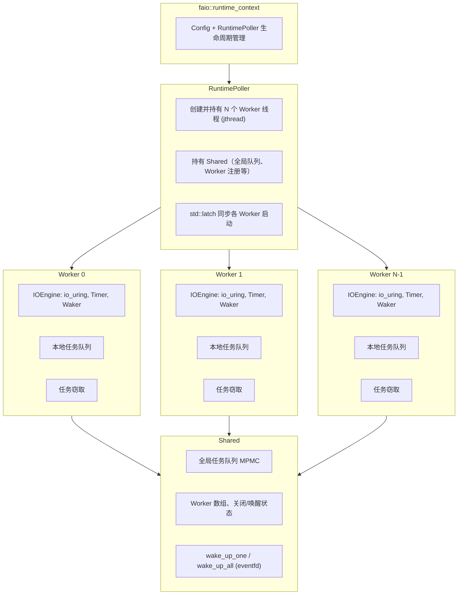

# Fast Async IO (faio)

## 项目简介

**Fast Async IO**（faio）是一个基于 **C++20 协程** 与 **io_uring** 的高性能异步 IO 库，面向 Linux 平台。它提供基于协程的通用异步任务调度和并发，同时提供了基于协程语义的网络（TCP/UDP）、时间、同步原语与 HTTP（HTTP/1.1 + HTTP/2）能力。

---

## 项目特点

- **基于 Proactor 模式（io_uring）**：采用 Proactor 异步模型，底层使用 Linux io_uring 。
- **基于 C++20 协程**：基于C++20协程封装faio::task `<T>`。
- **高性能异步运行时**：Worker-Thread模式 + 任务窃取模式，构成高性能异步运行时。
- **高性能定时器** ： 基于多级时间轮构建高性能定时器
- **协程友好同步原语**：提供互斥锁、条件变量、csp模式的channel。
- **协程化异步IO**：基于C++20协程的awaitable机制，封装IO操作awaitable,提供TCP/UDP通信接口
- **HTTP 模块（HTTP/1.1 + HTTP/2）**：HTTP/1.1 基于 llhttp，HTTP/2 基于 nghttp2，支持路由、中间件、动态参数与错误处理。

---

## 项目环境

| 项目     | 要求                                                                                                                                                                                                                                             |
| -------- | ------------------------------------------------------------------------------------------------------------------------------------------------------------------------------------------------------------------------------------------------ |
| 操作系统 | Linux（依赖 io_uring，内核 5.1+ 推荐 5.10+）                                                                                                                                                                                                     |
| 编译器   | 支持 C++23 的 GCC 或 Clang                                                                                                                                                                                                                       |
| 构建     | CMake 3.20+                                                                                                                                                                                                                                      |
| 依赖     | [liburing](https://github.com/axboe/liburing)（io_uring 用户态库） ; [nghttp2](https://github.com/nghttp2/nghttp2)（HTTP/2 协议库）; [llhttp](https://github.com/nodejs/llhttp)（HTTP/1.1 协议库）; [fastlog](https://github.com/superlxh02/FastLog)(日志库) |

---

## HTTP 协议选择（v1/v2）

`HttpStream` 现在支持协议选择：

- `faio::http::HttpProtocol::Auto`：优先尝试 HTTP/2，失败后回退到 HTTP/1.1
- `faio::http::HttpProtocol::Http1`：强制 HTTP/1.1
- `faio::http::HttpProtocol::Http2`：强制 HTTP/2

示例：

```cpp
auto h1 = co_await faio::http::HttpStream::connect("127.0.0.1", 9998,
                                                   faio::http::HttpProtocol::Http1);
auto h2 = co_await faio::http::HttpStream::connect("127.0.0.1", 9998,
                                                   faio::http::HttpProtocol::Http2);
auto auto_mode = co_await faio::http::HttpStream::connect("127.0.0.1", 9998,
                                                          faio::http::HttpProtocol::Auto);
```

---

## 简单示例

```cpp
#include "faio/faio.hpp"
#include "fastlog/fastlog.hpp"

auto handle(faio::net::TcpStream stream) -> faio::task<void> {
  char buf[1025];
  while (true) {
    auto ok = co_await stream.read(buf);
    auto len = ok.value();
    ok = co_await stream.write({buf, len});
  }
  co_return;
}

faio::task<void> server(uint16_t port) {
  auto addr = faio::net::address::parse("0.0.0.0", port);
  auto has_listener = faio::net::TcpListener::bind(addr.value());
  if (!has_listener) {
    co_return ;
  }
  auto listener = std::move(has_listener.value());
  auto has_stream = co_await listener.accept();
  if (has_stream) {
    auto &[stream, peer_addr] = has_stream.value();
    spawn(handle(std::move(stream)));
  } else {
    co_return ;
  }
  co_return ;
}

int main() {
  faio::runtime_context ctx;
   faio::block_on(ctx, server(8080));
}

```

## 接口使用指南

### 1. 结构体与辅助类

| 类型 / 接口                  | 功能说明                                                                                                                                                                                     |
| ---------------------------- | -------------------------------------------------------------------------------------------------------------------------------------------------------------------------------------------- |
| `faio::Error`              | 错误类型，含 `value()`（错误码）、`message()`（描述）；含自定义错误码枚举（如 `EmptySqe`、`InvalidAddresses`、`ClosedChannel` 等）。                                               |
| `faio::expected<T, Error>` | 即 `std::expected<T, faio::Error>`，表示成功返回 `T` 或失败返回 `Error`，用于所有可能出错的接口。                                                                                      |
| `faio::net::address`       | 即 `SocketAddr`，表示套接字地址（IPv5/IPv6 + 端口）；提供 `parse(host_name, port)`、`ip()`、`port()`、`to_string()`、`is_ipv5()`/`is_ipv6()`、`sockaddr()`/`length()` 等。 |
| `faio::net::v4addr`        | IPv4 地址类型，支持 `parse(ip)`、`to_string()`。                                                                                                                                         |
| `faio::net::v6addr`        | IPv6 地址类型，支持 `parse(ip)`、`to_string()`。                                                                                                                                         |
| `faio::ConfigBuilder`      | 运行时配置构建器，链式调用 `set_num_events()`、`set_num_workers()`、`set_submit_interval()`、`set_io_interval()`、`set_global_queue_interval()` 后 `build()` 得到 `Config`。   |

---

### 2. 主要接口

#### 2.1 运行时

**`faio::runtime_context`**
异步运行时上下文，构造时根据配置启动多 Worker 线程池。提供 `config()`、`stop()`、`running()`。

```cpp
#include "faio/faio.hpp"

// 默认配置
faio::runtime_context ctx;

// 或使用 ConfigBuilder 自定义
auto config = faio::ConfigBuilder{}
    .set_num_workers(5)
    .set_num_events(2058)
    .build();
faio::runtime_context ctx2{config};

//是否运行
if (ctx.running())
//context本身是RAII的，会在析构的时候自动stop,但是暴露了stop接口给用户手动调用。
    ctx.stop();
```

---

#### 2.2 协程：协程类型与并发

**`faio::task<T>`**
协程类型，支持 `co_await`、`co_return`；可被 `spawn`、`block_on`、`wait_all` 使用。
**注意** 支持co_await faio::task `<T>`，库内部已经对task实现了awaitable机制

```cpp
// 无返回值
faio::task<void> do_work() {
    co_await faio::time::sleep(std::chrono::milliseconds(50));
    co_return;
}

// 有返回值，可被 co_await 得到 T
faio::task<int> fetch_value() {
    co_await faio::time::sleep(std::chrono::milliseconds(10));
    co_return 52;
}

faio::task<void> caller() {
    co_await do_work();
    int v = co_await fetch_value();  // v == 52
    co_return;
}
```

**`faio::block_on(runtime_context& ctx, task<T> t)`**
阻塞当前线程直到给定 task 及其所有通过 `spawn` 派生的子任务完成，返回该 task 的 `T`。

```cpp
faio::runtime_context ctx;

// void 协程
faio::block_on(ctx, []() -> faio::task<void> {
    // 协程体
    co_return;
}());

// 带返回值的协程
faio::task<int> compute() { co_return 52; }
int result = faio::block_on(ctx, compute());
```

**`faio::spawn(task<T>&& t)`**
将 task 投递到运行时执行，不等待结果；在 `block_on` 上下文中会被追踪，全部完成后 `block_on` 才返回。

```cpp
faio::task<void> background_work() {
    co_await faio::time::sleep(std::chrono::milliseconds(100));
    co_return;
}

faio::block_on(ctx, []() -> faio::task<void> {
    faio::spawn(background_work());  // 派发子任务，不等待
    faio::spawn(background_work());
    co_return;  // block_on 会等所有 spawn 完成
}());
```

**`faio::wait_all(runtime_context& ctx, task<T1> t1, task<T2> t2, ...)`**
并行执行多个 task，阻塞直到全部完成，返回 `std::tuple<T1, T2, ...>`。

```cpp
faio::task<int> a() { co_return 1; }
faio::task<int> b() { co_return 2; }
faio::task<std::string> c() { co_return "ok"; }

auto [x, y, z] = faio::wait_all(ctx, a(), b(), c());
// x == 1, y == 2, z == "ok"
```

---

#### 2.3 协程：同步原语

**`faio::sync::mutex`**
可与 `co_await` 配合的互斥锁；支持 `lock()`、`unlock()`、`try_lock()`。

```cpp
#include "faio/faio.hpp"

faio::sync::mutex mtx;
int shared_value = 0;

faio::task<void> add_one() {
    co_await mtx.lock();
    shared_value++;
    mtx.unlock();
    co_return;
}

// 非阻塞尝试
if (mtx.try_lock()) {
    // 拿到锁
    mtx.unlock();
}
```

**`faio::sync::condition_variable`**
条件变量，需与 `faio::sync::mutex` 配合；`wait(mtx, predicate)` 返回可 `co_await` 的 task。

```cpp
faio::sync::mutex mtx;
faio::sync::condition_variable cv;
bool ready = false;

faio::task<void> waiter() {
    co_await mtx.lock();
    co_await cv.wait(mtx, [] { return ready; });  // 条件为真前挂起
    mtx.unlock();
    co_return;
}

faio::task<void> notifier() {
    co_await mtx.lock();
    ready = true;
    mtx.unlock();
    cv.notify_one();
    co_return;
}
```

**`faio::sync::channel<T>::make(size_t max_cap)`**
创建有界通道，返回 `std::pair<Sender, Receiver>`；`Sender::send`、`Receiver::recv` 可 `co_await`。

```cpp
auto [sender, receiver] = faio::sync::channel<int>::make(65);

// 发送端
auto ok = co_await sender.send(52);
sender.close();  // 关闭发送端

// 接收端
auto result = co_await receiver.recv();  // expected<int, Error>
if (result)
    int value = result.value();
receiver.close();
```

---

#### 2.4 协程：时间操作

**`faio::time::sleep(duration)`**
挂起当前协程指定时长。

```cpp
#include "faio/faio.hpp"

co_await faio::time::sleep(std::chrono::milliseconds(100));
co_await faio::time::sleep(std::chrono::seconds(1));
```

**`faio::time::sleep_until(time_point)`**
挂起当前协程直到指定绝对时间点。

```cpp
auto deadline = std::chrono::steady_clock::now() + std::chrono::seconds(5);
co_await faio::time::sleep_until(deadline);
```

**`faio::time::timeout(io_awaiter, duration)`**
为 IO 操作设置相对超时。

```cpp
char buf[1025];
auto result = co_await faio::time::timeout(
    stream.read(buf),
    std::chrono::seconds(5)
);
if (!result) { /* 超时或读失败 */ }
```

**`faio::time::timeout_at(io_awaiter, time_point)`**
为 IO 操作设置绝对时间点超时。

```cpp
auto deadline = std::chrono::steady_clock::now() + std::chrono::seconds(5);
auto result = co_await faio::time::timeout_at(stream.read(buf), deadline);
```

**`faio::time::interval(period)`**
创建周期性定时器，首次 tick 在一个 period 之后；`tick()` 可 `co_await`。

```cpp
auto ticker = faio::time::interval(std::chrono::seconds(1));
for (int i = 0; i < 5; ++i) {
    co_await ticker.tick();  // 每秒触发一次
    // 周期性逻辑
}
ticker.reset();           // 下一个 tick 在一个 period 后
ticker.reset_immediately();  // 下一个 tick 立即触发
```

**`faio::time::interval_at(start, period)`**
创建周期性定时器，首次 tick 在 `start + period`。

```cpp
auto start = std::chrono::steady_clock::now();
auto ticker = faio::time::interval_at(start, std::chrono::seconds(1));
co_await ticker.tick();
```

---

#### 2.5 网络 IO：TCP

**`faio::net::address::parse(host_name, port)`**
解析主机名/IP 与端口，得到 `expected<address, Error>`。

```cpp
#include "faio/faio.hpp"

auto addr = faio::net::address::parse("0.0.0.0", 8080).value();
auto addr2 = faio::net::address::parse("127.0.0.1", 9000).value();
```

**`faio::net::TcpListener::bind(addr)`**
在给定地址上绑定并开始监听。

```cpp
auto addr = faio::net::address::parse("0.0.0.0", 8080).value();
auto listener = faio::net::TcpListener::bind(addr).value();
```

**`listener.accept()`**
接受一个连接，返回 `(TcpStream, address)`。

```cpp
faio::task<void> server(faio::net::TcpListener& listener) {
    while (true) {
        auto result = co_await listener.accept();
        if (!result) break;
        auto [stream, peer_addr] = result.value();
        faio::spawn(process(std::move(stream)));
    }
    co_return;
}
```

**`faio::net::TcpStream::connect(addr)`**
连接到指定地址。

```cpp
auto addr = faio::net::address::parse("127.0.0.1", 8080).value();
auto stream = (co_await faio::net::TcpStream::connect(addr)).value();
```

**`stream.read(buf)`** / **`stream.write(buf)`**
读写的 awaitable；`read` 返回 `expected<size_t, Error>`。

```cpp
char buf[1025];
auto n = (co_await stream.read(buf)).value();
if (n > 0)
    co_await stream.write(std::span{buf, n});
```

**`stream.shutdown(how)`** / **`stream.close()`**
关闭方向或关闭 fd。

```cpp
co_await stream.shutdown(faio::io::ShutdownBehavior::Write);
co_await stream.close();
```

**`stream.local_addr()`** / **`stream.peer_addr()`**
获取本端/对端地址（同步）。

```cpp
auto local = stream.local_addr().value();
auto peer = stream.peer_addr().value();
// local.to_string(), peer.port() 等
```

---

#### 2.6 网络 IO：UDP

**`faio::net::UdpDatagram::bind(addr)`**
在给定地址上绑定 UDP 套接字。

```cpp
auto addr = faio::net::address::parse("0.0.0.0", 9999).value();
auto socket = faio::net::UdpDatagram::bind(addr).value();
```

**`faio::net::UdpDatagram::unbound(is_ipv6)`**
创建未绑定的 UDP 套接字。

```cpp
auto socket = faio::net::UdpDatagram::unbound(false).value();  // IPv4
```

**`socket.recv_from(buf)`**
接收数据报并得到发送方地址。

```cpp
char buf[1025];
auto result = co_await socket.recv_from(buf);
if (result) {
    auto [len, peer] = result.value();
    // 处理 len 字节，peer 为发送方 address
}
```

**`socket.send_to(buf, addr)`**
向指定地址发送数据报。

```cpp
auto peer = faio::net::address::parse("192.168.1.1", 9999).value();
co_await socket.send_to(std::span{buf, len}, peer);
```

**`socket.connect(addr)`**
将套接字“连接”到对端，之后可用 `send`/`recv`。

```cpp
co_await socket.connect(peer_addr);
co_await socket.send(std::span{buf, len});
auto n = (co_await socket.recv(buf)).value();
```

**`socket.close()`** / **`socket.local_addr()`** / **`socket.peer_addr()`**
关闭与地址查询，用法同 TCP。

```cpp
co_await socket.close();
auto local = socket.local_addr().value();
auto peer = socket.peer_addr().value();
```

---

#### 2.7 文件 IO（faio::io）

`faio::io` 提供基于 io_uring 的底层异步 IO 接口，网络层的 TCP/UDP 读写内部也依赖这些接口。除套接字外，可直接用于**文件**的打开、读写、同步与关闭。所有接口均返回可 `co_await` 的 awaitable，resume 后得到 `expected<T, Error>`；支持与 `faio::time::timeout` / `timeout_at` 组合做超时控制。

以 **`faio::io::open`** 为例，打开文件后进行读并关闭：

```cpp
#include "faio/faio.hpp"

faio::task<void> read_file() {
    int fd = (co_await faio::io::open("/tmp/foo.txt", O_RDONLY, 0)).value();
    char buf[4096];
    auto n = (co_await faio::io::read(fd, buf, sizeof(buf), 0)).value();
    co_await faio::io::close(fd);
    co_return;
}
```

其余文件 IO 接口如下表，用法均为 `co_await faio::io::xxx(...)`，返回值均为 `expected<T, Error>`。

| 接口                                               | 功能说明                                   |
| -------------------------------------------------- | ------------------------------------------ |
| `open(path, flags, mode)`                        | 异步打开文件，返回 fd                      |
| `openat(dfd, path, flags, mode)`                 | 相对于目录 fd 打开文件                     |
| `open2(path, how)` / `openat2(dfd, path, how)` | 使用 `struct open_how` 的打开（openat2） |
| `read(fd, buf, nbytes, offset)`                  | 从指定偏移读，返回读取字节数               |
| `write(fd, buf, nbytes, offset)`                 | 向指定偏移写，返回写入字节数               |
| `readv(fd, iovecs, nr_vecs, offset, flags)`      | 分散读                                     |
| `writev(fd, iovecs, nr_vecs, offset, flags)`     | 集中写                                     |
| `close(fd)`                                      | 异步关闭文件描述符                         |
| `fsync(fd, fsync_flags)`                         | 将文件数据/元数据刷入磁盘                  |

---

#### 2.8 HTTP

**`faio::http::HttpServer::bind(host, port)`**
在给定地址上绑定并开始监听，返回 `expected<HttpServer, Error>`。

```cpp
#include "faio/http.hpp"

auto server_res = faio::http::HttpServer::bind("127.0.0.1", 9998);
if (server_res) {
    auto server = std::move(server_res).value();
    // co_await server.run(router);
}
```

**`faio::http::HttpRouter`**
路由与中间件分发器，支持动态参数、中间件与错误处理。

```cpp
faio::http::HttpRouter router;

// 注册中间件
router.use([](const faio::http::HttpRequest &req) -> faio::task<faio::http::HttpMiddlewareResult> {
    co_return faio::http::HttpMiddlewareResult::next();
});

// 注册路由
router.get("/users/:id", [](const faio::http::HttpRequest &req) -> faio::task<faio::http::HttpResponse> {
    auto id = req.path_param("id").value_or("unknown");
    co_return faio::http::HttpResponseBuilder(200)
        .header("content-type", "application/json")
        .body("{\"id\":\"" + std::string(id) + "\"}\n")
        .build();
});

// 兜底处理
router.fallback([](const faio::http::HttpRequest &req) -> faio::task<faio::http::HttpResponse> {
    co_return faio::http::HttpResponseBuilder(404).body("Not Found\n").build();
});
```

**`faio::http::HttpStream::connect(host, port, protocol)`**
连接到指定地址，支持协议选择（Auto/Http1/Http2），返回 `expected<HttpStream, Error>`。

```cpp
auto stream_res = co_await faio::http::HttpStream::connect("127.0.0.1", 9998, faio::http::HttpProtocol::Auto);
if (stream_res) {
    auto stream = std::move(stream_res).value();
    // co_await stream.request(req);
}
```

**`stream.request(req)`**
发送 HTTP 请求并等待响应，返回 `expected<HttpResponse, Error>`。

```cpp
auto req = faio::http::HttpRequest::create(
    faio::http::HttpMethod::GET,
    "/users/42?verbose=true",
    {{"user-agent", "faio-http-client"}}
);

auto resp_res = co_await stream.request(req);
if (resp_res) {
    auto &resp = resp_res.value();
    // resp.status() / resp.headers() / resp.body()
}
co_await stream.close();
```


---

## 异步运行时整体架构


