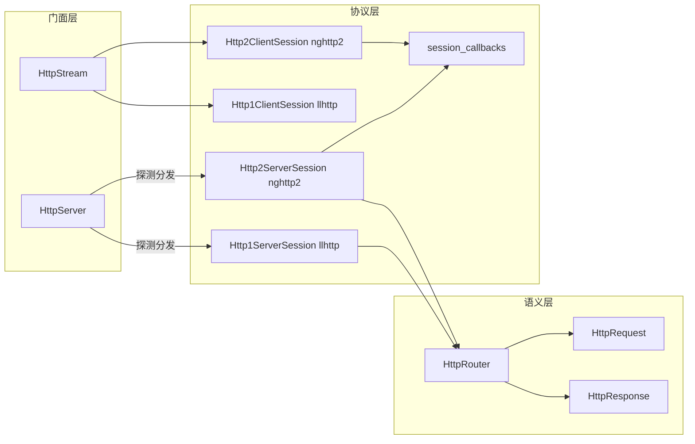
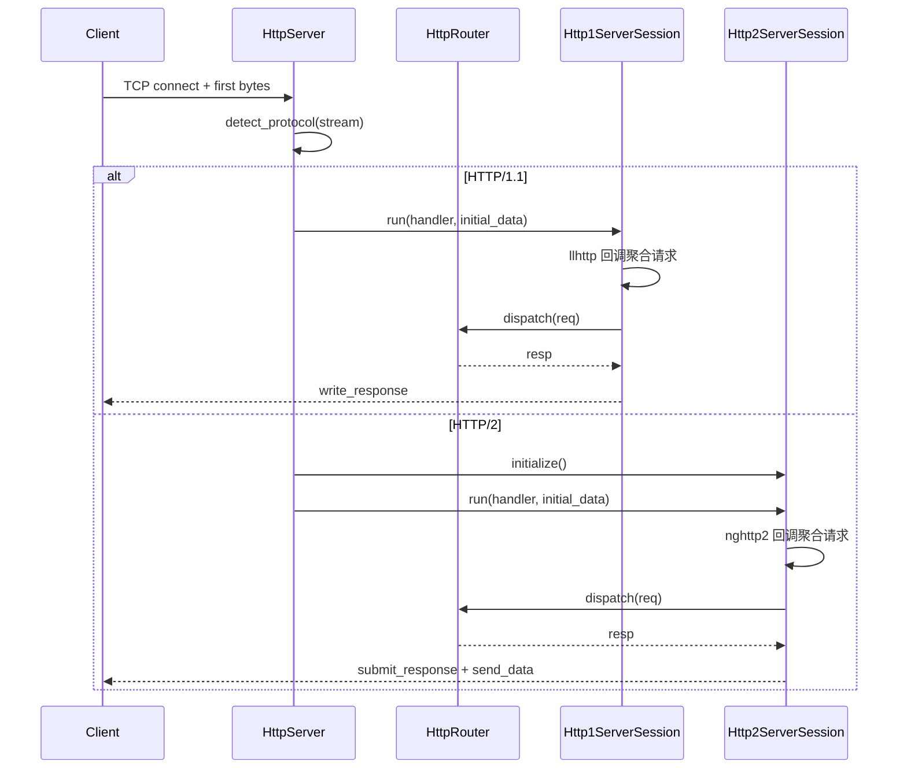
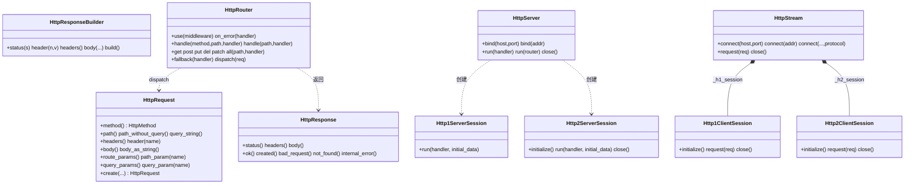

# HTTP 模块

---

## 1. 总体设计

### 1.1 三层划分

1. **语义层**：请求/响应对象与路由器，与 H1/H2 协议细节解耦。业务只与 `HttpRequest`、`HttpResponse`、`HttpRouter` 交互。
2. **协议层**：
   - **H1**：llhttp 解析/编码，请求与响应均为「字节流 → 解析事件 → 聚合为语义对象」。
   - **H2**：nghttp2 帧处理与回调状态机，回调只聚合状态，会话主循环消费状态并调用 handler。
3. **门面层**：
   - **服务端门面**：`HttpServer`（监听 + 首包协议探测 + 会话分发）。
   - **客户端门面**：`HttpStream`（统一 connect / request / close，支持 Auto 协议协商）。

这样做的收益：业务代码不依赖协议；协议实现封装在 session 内，改协议不动业务；server/client 入口统一，便于使用与维护。

### 1.2 架构图



### 1.3 服务端时序图（一次请求）



---

## 2. 类图（继承与依赖）



---

## 3. 类与接口表格（完整）

下表覆盖语义层、门面层、协议层及辅助类型，便于按文件与职责查阅。

### 3.1 语义层与类型（types.hpp）

| 类/类型/函数              | 所在文件  | 职责                | 主要接口                                                                                      |
| ------------------------- | --------- | ------------------- | --------------------------------------------------------------------------------------------- |
| **HttpMethod**            | types.hpp | HTTP 方法枚举       | GET/POST/PUT/DELETE/HEAD/OPTIONS/PATCH/CONNECT/TRACE                                          |
| **http_method_to_string** | types.hpp | 方法 → 字符串       | 返回对应 "GET" 等 string_view                                                                 |
| **string_to_http_method** | types.hpp | 字符串 → HttpMethod | 解析请求行中的方法                                                                            |
| **HttpHeaders**           | types.hpp | 头表类型            | `std::unordered_map<std::string, std::string, TransparentStringHash, TransparentStringEqual>` |
| **HttpRequest**           | types.hpp | 请求值对象          | 见下表                                                                                        |
| **HttpResponse**          | types.hpp | 响应值对象          | 见下表                                                                                        |
| **HttpResponseBuilder**   | types.hpp | 链式构建响应        | 见下表                                                                                        |
| **make_response()**       | types.hpp | 便捷构造 Builder    | 返回 `HttpResponseBuilder()`                                                                  |

**HttpRequest 公开接口：**

| 方法                                          | 说明                       |
| --------------------------------------------- | -------------------------- |
| 构造 /`create(method, path, headers?, body?)` | 构造请求，path 可含 query  |
| `method()`                                    | 请求方法                   |
| `path()`                                      | 完整 path（含 query 部分） |
| `path_without_query()`                        | 去掉 `?` 及之后部分        |
| `query_string()`                              | `?` 之后的原始 query 串    |
| `headers()` / `header(name)`                  | 头表或单头（optional）     |
| `body()` / `body_as_string()`                 | body 只读 span 或 string   |
| `route_params()` / `path_param(name)`         | 路由参数（Router 注入）    |
| `query_params()` / `query_param(name)`        | query 参数（懒解析）       |

**HttpResponse 公开接口：**

| 方法                                                                | 说明                 |
| ------------------------------------------------------------------- | -------------------- |
| 构造 `(status, headers?, body?)`                                    | 直接构造             |
| `status()` / `headers()` / `body()`                                 | 只读访问             |
| `ok(body?)` / `created(body?)`                                      | 200 / 201 工厂       |
| `bad_request(body?)` / `not_found(body?)` / `internal_error(body?)` | 400 / 404 / 500 工厂 |

**HttpResponseBuilder 公开接口：**

| 方法                                                 | 说明                |
| ---------------------------------------------------- | ------------------- |
| 构造 `(status?)`                                     | 默认 200            |
| `status(s)` / `header(name, value)` / `headers(map)` | 链式设置            |
| `body(vector\|string\|span)`                         | 三种重载            |
| `build()`                                            | 返回 `HttpResponse` |

### 3.2 路由与中间件（http_server.hpp）

| 类/类型                  | 所在文件        | 职责                       | 主要接口                                                |
| ------------------------ | --------------- | -------------------------- | ------------------------------------------------------- |
| **HttpHandler**          | http_server.hpp | 请求→响应                  | `task<HttpResponse>(const HttpRequest&)`                |
| **HttpErrorHandler**     | http_server.hpp | 错误处理                   | `task<HttpResponse>(const HttpRequest&, string_view)`   |
| **HttpMiddlewareResult** | http_server.hpp | 中间件返回值               | `next()` / `respond(resp)` / `handled()` / `response()` |
| **HttpMiddleware**       | http_server.hpp | 中间件函数                 | `task<HttpMiddlewareResult>(const HttpRequest&)`        |
| **HttpRouter**           | http_server.hpp | 路由分发、中间件、异常收敛 | 见下表                                                  |

**HttpRouter 公开接口：**

| 方法                                    | 说明                                |
| --------------------------------------- | ----------------------------------- |
| `use(middleware)`                       | 追加中间件，先注册先执行            |
| `on_error(handler)`                     | 设置异常/错误时调用的 handler       |
| `handle(method, path, handler)`         | 注册 (method, path) 精确路由        |
| `handle(path, handler)`                 | 注册任意 method 的 path             |
| `all(path, handler)`                    | 同 handle(path, handler)            |
| `get/post/put/del/patch(path, handler)` | 便捷注册单方法路由                  |
| `fallback(handler)`                     | 无匹配时的兜底 handler              |
| `dispatch(req)`                         | 协程：中间件→静态→动态→fallback→404 |

### 3.3 门面层

| 类               | 所在文件        | 职责                                 | 主要接口                                                                                     |
| ---------------- | --------------- | ------------------------------------ | -------------------------------------------------------------------------------------------- |
| **HttpServer**   | http_server.hpp | 服务端门面：监听、协议探测、会话分发 | `bind(host,port)` / `bind(addr)`；`run(handler)` / `run(router)`；`close()`                  |
| **HttpStream**   | http_stream.hpp | 客户端门面：统一请求 API             | `connect(host,port)` / `connect(addr)` / `connect(..., protocol)`；`request(req)`；`close()` |
| **HttpProtocol** | http_stream.hpp | 客户端协议选择                       | Auto / Http1 / Http2                                                                         |

### 3.4 协议层 H1（llhttp）

| 类                     | 所在文件                 | 职责          | 主要接口                                                      |
| ---------------------- | ------------------------ | ------------- | ------------------------------------------------------------- |
| **Http1ServerSession** | v1/server_session_v1.hpp | H1 服务端会话 | 构造 `(TcpStream)`；`run(handler, initial_data?)`             |
| **Http1ClientSession** | v1/client_session_v1.hpp | H1 客户端会话 | 构造 `(TcpStream)`；`initialize()`；`request(req)`；`close()` |

### 3.5 协议层 H2（nghttp2）

| 类/结构/函数                                         | 所在文件                 | 职责                  | 主要接口                                                                                                                               |
| ---------------------------------------------------- | ------------------------ | --------------------- | -------------------------------------------------------------------------------------------------------------------------------------- |
| **ClientSessionState**                               | v2/session_callbacks.hpp | 客户端回调状态聚合    | `responses`(stream_id→StreamResponse)；`StreamResponse`: headers/body/headers_complete/body_complete/status                            |
| **ServerSessionState**                               | v2/session_callbacks.hpp | 服务端回调状态聚合    | `requests`(stream_id→StreamRequest)；`pending_requests` 队列；(StreamRequest: method/path/headers/body/headers_complete/body_complete) |
| **get_client_callbacks** / **free_client_callbacks** | session_callbacks.hpp    | 客户端 nghttp2 回调表 | 分配/释放并绑定 client_on_*                                                                                                            |
| **get_server_callbacks** / **free_server_callbacks** | session_callbacks.hpp    | 服务端 nghttp2 回调表 | 分配/释放并绑定 server_on_*                                                                                                            |
| **Http2ServerSession**                               | v2/server_session_v2.hpp | H2 服务端会话         | 构造 `(TcpStream)`；`initialize()`；`run(handler, initial_data?)`；`close()`                                                           |
| **Http2ClientSession**                               | v2/client_session_v2.hpp | H2 客户端会话         | 构造 `(TcpStream)`；`initialize()`；`request(req)`；`close()`                                                                          |

### 3.6 辅助（nghttp2_util.hpp）

| 类/函数                   | 职责                                            | 主要接口                                  |
| ------------------------- | ----------------------------------------------- | ----------------------------------------- |
| **Headers2Nv**            | HttpHeaders → nghttp2_nv 数组（持有字符串副本） | 构造 `(HttpHeaders)`；`data()` / `size()` |
| **method_to_nghttp2**     | HttpMethod → string                             | 供 H2 伪头使用                            |
| **nghttp2_error_to_faio** | nghttp2 错误码 → faio::Error                    | 协议层错误统一收敛                        |
| **nv_to_headers**         | nghttp2_nv 数组 → HttpHeaders                   | 反解头表                                  |

---

## 4. 语义层详解：请求与响应（types.hpp）

### 4.1 设计约束

- **HttpRequest**：按值传递友好；路由参数由路由层回填，业务只读；query 参数**懒解析**，未访问时不解析。
- **HttpResponse**：status/headers/body 由对象独立持有，可安全跨协程传递；提供常见状态码工厂函数。

### 4.2 HttpRequest：懒解析 query

思路：query 字符串在首次访问 `query_params()` 或 `query_param(name)` 时才解析，结果缓存在 `_query_params`；`parse_query_params_if_needed` 为 const 成员，通过 mutable 缓存更新，保证语义不变。

关键代码（访问与懒解析）：

```cpp
// types.hpp
[[nodiscard]] auto query_params() const
    -> const std::map<std::string, std::string> & {
  parse_query_params_if_needed();
  return _query_params;
}

[[nodiscard]] auto query_param(std::string_view name) const
    -> std::optional<std::string_view> {
  parse_query_params_if_needed();
  auto it = _query_params.find(std::string(name));
  if (it == _query_params.end()) {
    return std::nullopt;
  }
  return std::string_view(it->second);
}

private:
  auto parse_query_params_if_needed() const -> void {
    if (_query_parsed) {
      return;
    }
    _query_parsed = true;
    auto query = query_string();
    size_t start = 0;
    while (start <= query.size()) {
      auto end = query.find('&', start);
      if (end == std::string_view::npos) end = query.size();
      auto item = query.substr(start, end - start);
      if (!item.empty()) {
        auto eq = item.find('=');
        if (eq == std::string_view::npos) {
          _query_params.emplace(url_decode(item), "");
        } else {
          auto key = url_decode(item.substr(0, eq));
          auto val = url_decode(item.substr(eq + 1));
          _query_params[std::move(key)] = std::move(val);
        }
      }
      if (end == query.size()) break;
      start = end + 1;
    }
  }

  mutable std::map<std::string, std::string> _query_params;
  mutable bool _query_parsed = false;
```

path 与 query 的拆分通过 `path_without_query()` / `query_string()` 在 path 上查找 `?` 完成；路由匹配时使用 `strip_query(req.path())`，不把 query 算进路径。

结论：语义对象与协议无关，query 解析按需、路由参数由 Router 通过 friend 注入 `set_route_params`，业务只读。

### 4.3 HttpResponse 与 HttpResponseBuilder

响应由 Builder 链式拼装，避免暴露 HttpResponse 内部可写字段；常见状态码用静态工厂简化书写。

关键代码（Builder 链式 + 工厂）：

```cpp
// types.hpp
class HttpResponseBuilder {
public:
  explicit HttpResponseBuilder(int status = 200) : _response(status) {}

  auto status(int status) -> HttpResponseBuilder & {
    _response._status = status;
    return *this;
  }

  auto header(std::string name, std::string value) -> HttpResponseBuilder & {
    _response._headers[std::move(name)] = std::move(value);
    return *this;
  }

  auto body(std::string body) -> HttpResponseBuilder & {
    _response._body.clear();
    _response._body.insert(_response._body.end(), body.begin(), body.end());
    return *this;
  }

  [[nodiscard]] auto build() -> HttpResponse { return _response; }
private:
  HttpResponse _response;
};

// 工厂示例
static auto not_found(std::string body = {}) -> HttpResponse {
  HttpResponse resp(404);
  resp._body = std::vector<uint8_t>(body.begin(), body.end());
  return resp;
}
```

结论：Builder 负责构建，HttpResponse 负责持有与只读访问；协议层只依赖 status/headers/body，与 H1/H2 编码细节隔离。

---

## 5. 路由与中间件详解（http_server.hpp）

### 5.1 分发优先级与主流程

思路：路由按**固定优先级**执行，保证行为可预测；静态路由用 map 存储，动态路由用「分段模式」线性匹配；中间件可短路后续路由。

**优先级顺序：**

1. 中间件链：任一返回 `handled() == true` 则立即返回其 `response()`。
2. 静态路由 (method + path)。
3. 静态路由 (any method + path)。
4. 动态路由（`:id` / `*path`）。
5. 用户 `fallback`。
6. 默认 404。

关键代码（dispatch 主流程）：

```cpp
// http_server.hpp
auto dispatch(const HttpRequest &req) const -> task<HttpResponse> {
  // 快路径：无中间件、无动态路由、无错误处理器时，直接静态分发。
  if (_middlewares.empty() && _dynamic_routes.empty() && !_error_handler) {
    auto clean_path = strip_query(req.path());
    auto &method_routes = _routes[method_index(req.method())];
    auto route_it = method_routes.find(clean_path);
    if (route_it != method_routes.end()) {
      co_return co_await route_it->second(req);
    }
    auto any_it = _any_method_routes.find(clean_path);
    if (any_it != _any_method_routes.end()) {
      co_return co_await any_it->second(req);
    }
    if (_fallback_handler) {
      co_return co_await _fallback_handler(req);
    }
    co_return HttpResponseBuilder(404)
        .header("content-type", "text/plain")
        .body("Not Found\n")
        .build();
  }

  for (const auto &middleware : _middlewares) {
    auto middleware_result = co_await invoke_middleware_safe(middleware, req);
    if (middleware_result.handled()) {
      co_return middleware_result.response();
    }
  }

  auto clean_path = strip_query(req.path());
  auto &method_routes = _routes[method_index(req.method())];
  auto route_it = method_routes.find(clean_path);
  if (route_it != method_routes.end()) {
    co_return co_await invoke_handler_safe(route_it->second, req);
  }

  auto any_it = _any_method_routes.find(clean_path);
  if (any_it != _any_method_routes.end()) {
    co_return co_await invoke_handler_safe(any_it->second, req);
  }

  auto matched = co_await dispatch_dynamic(req);
  if (matched.matched) {
    co_return std::move(matched.response);
  }

  if (_fallback_handler) {
    co_return co_await invoke_handler_safe(_fallback_handler, req);
  }

  co_return HttpResponseBuilder(404)
      .header("content-type", "text/plain")
      .body("Not Found\n")
      .build();
}
```

静态路由存储：`_routes` 为 `std::array<std::unordered_map<std::string, HttpHandler, TransparentStringHash, TransparentStringEqual>, kHttpMethodCount>`，即按 HTTP 方法分组的 path→handler 表；`_any_method_routes` 为不区分方法的 path→handler。使用 `TransparentStringHash` / `TransparentStringEqual` 后可用 `string_view` 做 `find(clean_path)` 查找，避免临时构造 `std::string`。

### 5.2 静态与动态路由注册

思路：对 path 做 `strip_query` 规范化；非动态 path（不含 `:` 与 `*`）进 `_routes` 或 `_any_method_routes`；动态 path 编译为 `DynamicRoute`（分段 + 通配符信息），运行时线性扫描。

关键代码（register_route + 动态路由结构）：

```cpp
// http_server.hpp
struct DynamicRoute {
  std::optional<HttpMethod> method;
  std::vector<std::string> segments;
  bool has_wildcard = false;
  std::string wildcard_name;
  HttpHandler handler;
};

auto register_route(std::optional<HttpMethod> method, std::string path,
                    HttpHandler handler) -> void {
  auto clean_path = std::string(strip_query(path));
  if (!is_dynamic_path(clean_path)) {
    if (method.has_value()) {
      _routes[method_index(*method)][clean_path] = std::move(handler);
    } else {
      _any_method_routes[clean_path] = std::move(handler);
    }
    return;
  }

  DynamicRoute route;
  route.method = method;
  route.handler = std::move(handler);
  auto segments = split_path(clean_path);
  for (size_t i = 0; i < segments.size(); ++i) {
    auto segment = segments[i];
    if (!segment.empty() && segment[0] == '*') {
      route.has_wildcard = true;
      route.wildcard_name =
          segment.size() > 1 ? std::string(segment.substr(1)) : "wildcard";
      break;
    }
    route.segments.emplace_back(segment);
  }
  _dynamic_routes.push_back(std::move(route));
}
```

### 5.3 动态路由匹配与参数注入

思路：请求 path 按相同规则 split；无通配符时段数必须一致，有通配符时请求段数 ≥ 模式段数；`:name` 段提取为 path 参数，`*name` 吞掉剩余路径；命中后**拷贝请求**并 `set_route_params`，避免污染原请求。

关键代码（match_dynamic_route + dispatch_dynamic）：

```cpp
// http_server.hpp
static auto match_dynamic_route(
    const DynamicRoute &route, const HttpRequest &req,
    std::map<std::string, std::string> &params) -> bool {
  if (route.method.has_value() && *route.method != req.method()) {
    return false;
  }
  auto req_segments = split_path(req.path());
  if (!route.has_wildcard && req_segments.size() != route.segments.size()) {
    return false;
  }
  if (route.has_wildcard && req_segments.size() < route.segments.size()) {
    return false;
  }

  for (size_t i = 0; i < route.segments.size(); ++i) {
    auto pattern = std::string_view(route.segments[i]);
    auto actual = req_segments[i];
    if (!pattern.empty() && pattern[0] == ':') {
      params.emplace(std::string(pattern.substr(1)), std::string(actual));
      continue;
    }
    if (pattern != actual) return false;
  }
  if (route.has_wildcard) {
    params.emplace(route.wildcard_name,
                   join_path_segments(req_segments, route.segments.size()));
  }
  return true;
}

auto dispatch_dynamic(const HttpRequest &req) const
    -> task<DynamicDispatchResult> {
  for (const auto &route : _dynamic_routes) {
    std::map<std::string, std::string> params;
    if (!match_dynamic_route(route, req, params)) continue;
    auto matched_req = req;
    matched_req.set_route_params(std::move(params));
    co_return DynamicDispatchResult{
        true, co_await invoke_handler_safe(route.handler, matched_req)};
  }
  co_return DynamicDispatchResult{false, HttpResponseBuilder(404).build()};
}
```

### 5.4 中间件与异常收敛

思路：中间件返回 `HttpMiddlewareResult`，可表示「继续」或「直接响应」；handler 与中间件均通过 `invoke_*_safe` 调用，异常被捕获后交给 `_error_handler` 或默认 500，避免冲击协议层状态机。

关键代码（HttpMiddlewareResult + invoke_middleware_safe）：

```cpp
// http_server.hpp
class HttpMiddlewareResult {
public:
  static auto next() -> HttpMiddlewareResult { return HttpMiddlewareResult(); }

  static auto respond(HttpResponse response) -> HttpMiddlewareResult {
    HttpMiddlewareResult result;
    result._handled = true;
    result._response = std::move(response);
    return result;
  }

  [[nodiscard]] auto handled() const noexcept -> bool { return _handled; }
  [[nodiscard]] auto response() const noexcept -> const HttpResponse & {
    return _response;
  }
private:
  bool _handled = false;
  HttpResponse _response;
};

auto invoke_middleware_safe(const HttpMiddleware &middleware,
                            const HttpRequest &req) const
    -> task<HttpMiddlewareResult> {
  std::string err_message;
  try {
    co_return co_await middleware(req);
  } catch (const std::exception &e) {
    err_message = e.what();
  } catch (...) {
    err_message = "unknown exception";
  }
  if (_error_handler) {
    co_return HttpMiddlewareResult::respond(
        co_await _error_handler(req, err_message));
  }
  co_return HttpMiddlewareResult::respond(
      HttpResponseBuilder(500)
          .header("content-type", "text/plain")
          .body("Internal Server Error\n")
          .build());
}
```

结论：Router 是 HTTP 模块业务核心；静态/动态路由与中间件、异常处理均在此层可解释。

---

## 6. 门面层详解

### 6.1 HttpServer：监听与协议探测

思路：HttpServer 只做监听接入与连接生命周期调度，不做协议解析；每连接起独立协程处理；通过首包判断是否为 HTTP/2 preface，探测阶段读到的数据必须透传给对应 session。

关键代码（bind + run + 每连接 spawn）：

```cpp
// http_server.hpp
static auto bind(const std::string &host, uint16_t port)
    -> expected<HttpServer> {
  auto addr_res = net::detail::SocketAddr::parse(host, port);
  if (!addr_res) return std::unexpected(addr_res.error());
  return bind(addr_res.value());
}

static auto bind(const net::detail::SocketAddr &addr) -> expected<HttpServer> {
  auto listener_res = net::detail::TcpListener::bind(addr);
  if (!listener_res) return std::unexpected(listener_res.error());
  return HttpServer(std::move(listener_res.value()));
}

auto run(const HttpHandler &handler) -> task<void> {
  while (true) {
    auto accept_res = co_await _listener.accept();
    if (!accept_res) break;

    auto [tcp_stream, peer_addr] = std::move(accept_res.value());
    runtime::detail::runtime_context::spawn(
        handle_connection(std::move(tcp_stream), handler));
  }
}

auto run(const HttpRouter &router) -> task<void> {
  co_await run([&router](const HttpRequest &req) {
    return router.dispatch(req);
  });
}
```

### 6.2 协议探测与 initial_data 透传

思路：读取至多 preface 长度数据，若已不满足 H2 preface 前缀则判为 Http1；若收满 H2 preface 则判为 Http2；返回协议类型与已读数据，供对应 session 消费，避免首包丢失。

关键代码（detect_protocol + handle_connection 分发）：

```cpp
// http_server.hpp
static constexpr std::string_view kPreface = "PRI * HTTP/2.0\r\n\r\nSM\r\n\r\n";

static auto is_h2_preface_prefix(std::span<const uint8_t> data) -> bool {
  auto n = std::min(data.size(), kPreface.size());
  return std::equal(data.begin(), data.begin() + static_cast<std::ptrdiff_t>(n),
                    kPreface.begin());
}

static auto is_h2_preface_complete(std::span<const uint8_t> data) -> bool {
  if (data.size() < kPreface.size()) return false;
  return std::equal(kPreface.begin(), kPreface.end(), data.begin());
}

static auto detect_protocol(net::detail::TcpStream &stream)
    -> task<expected<std::pair<WireProtocol, std::vector<uint8_t>>>> {
  static constexpr size_t kReadChunk = 128;
  std::vector<uint8_t> initial_data;
  initial_data.reserve(kReadChunk);
  while (initial_data.size() < kPreface.size()) {
    std::array<char, kReadChunk> buf{};
    auto read_res = co_await stream.read(std::span(buf.data(), buf.size()));
    if (!read_res) co_return std::unexpected(read_res.error());
    auto len = read_res.value();
    if (len == 0) break;
    auto begin = reinterpret_cast<const uint8_t *>(buf.data());
    initial_data.insert(initial_data.end(), begin, begin + len);
    if (!is_h2_preface_prefix(initial_data)) {
      co_return std::pair{WireProtocol::Http1, std::move(initial_data)};
    }
    if (is_h2_preface_complete(initial_data)) {
      co_return std::pair{WireProtocol::Http2, std::move(initial_data)};
    }
  }
  // 只有 len==0 提前 break 才会到这里，此时 initial_data.size() < 24，必为 H1.1
  co_return std::pair{WireProtocol::Http1, std::move(initial_data)};
}

static auto handle_connection(net::detail::TcpStream stream,
                              const HttpHandler &handler) -> task<void> {
  auto detect_res = co_await detect_protocol(stream);
  if (!detect_res) { co_await stream.close(); co_return; }
  auto [protocol, initial_data] = std::move(detect_res.value());
  if (initial_data.empty()) { co_await stream.close(); co_return; }

  if (protocol == WireProtocol::Http2) {
    auto session = std::make_shared<Http2ServerSession>(std::move(stream));
    auto init_res = co_await session->initialize();
    if (!init_res) { session->close(); co_return; }
    co_await session->run(handler, std::span<const uint8_t>(
                               initial_data.data(), initial_data.size()));
    co_return;
  }
  auto session = std::make_shared<Http1ServerSession>(std::move(stream));
  co_await session->run(handler,
                        std::span<const uint8_t>(initial_data.data(),
                                                 initial_data.size()));
}
```

结论：同端口 H1/H2 的关键是探测准确与 initial_data 不丢失；HttpServer 是门面与分发器，协议实现在本体 session 中。

### 6.3 HttpStream：统一客户端 API 与 Auto

思路：对外只暴露 connect / request / close；Auto 策略先尝试 H2，失败再回退 H1；内部按 `_protocol` 与 `_h1_session` / `_h2_session` 路由到对应 session。

关键代码（connect Auto + request 路由）：

```cpp
// http_stream.hpp
static auto connect(const net::detail::SocketAddr &addr, HttpProtocol protocol)
    -> task<expected<HttpStream>> {
  auto connect_h1 = [&addr]() -> task<expected<HttpStream>> {
    auto stream_res = co_await net::detail::TcpStream::connect(addr);
    if (!stream_res) co_return std::unexpected(stream_res.error());
    auto session_ptr = std::make_unique<Http1ClientSession>(
        std::move(stream_res.value()));
    auto init_res = co_await session_ptr->initialize();
    if (!init_res) co_return std::unexpected(init_res.error());
    co_return HttpStream(std::move(session_ptr));
  };

  auto connect_h2 = [&addr]() -> task<expected<HttpStream>> {
    auto stream_res = co_await net::detail::TcpStream::connect(addr);
    if (!stream_res) co_return std::unexpected(stream_res.error());
    auto session_ptr = std::make_unique<Http2ClientSession>(
        std::move(stream_res.value()));
    auto init_res = co_await session_ptr->initialize();
    if (!init_res) co_return std::unexpected(init_res.error());
    co_return HttpStream(std::move(session_ptr));
  };

  if (protocol == HttpProtocol::Http1) co_return co_await connect_h1();
  if (protocol == HttpProtocol::Http2) co_return co_await connect_h2();
  auto h2_res = co_await connect_h2();
  if (h2_res) co_return h2_res;
  co_return co_await connect_h1();
}

auto request(const HttpRequest &req) -> task<expected<HttpResponse>> {
  if (_protocol == HttpProtocol::Http2 && _h2_session) {
    co_return co_await _h2_session->request(req);
  }
  if (_protocol == HttpProtocol::Http1 && _h1_session) {
    co_return co_await _h1_session->request(req);
  }
  co_return std::unexpected(make_error(static_cast<int>(Error::Http2Internal)));
}
```

结论：协议选择与双 session 持有均封装在 HttpStream 内部，调用方只需 connect/request/close。

---

## 7. 协议层 H1：llhttp 封装

### 7.1 Http1ServerSession：回调聚合与 run 循环

思路：llhttp 解析请求，回调只做「事件 → 聚合到 _current_* → on_message_complete 时压入 _pending_requests」；run 循环：若有 initial_data 先 process_received_data 再 consume_pending_requests，否则循环 read → process_received_data → consume_pending_requests；keep_alive 由 llhttp_should_keep_alive 决定。

关键代码（回调绑定 + process + consume + write_response）：

```cpp
// v1/server_session_v1.hpp
Http1ServerSession(faio::net::detail::TcpStream stream)
    : _stream(std::move(stream)) {
  llhttp_settings_init(&_settings);
  _settings.on_message_begin = &Http1ServerSession::on_message_begin;
  _settings.on_url = &Http1ServerSession::on_url;
  _settings.on_header_field = &Http1ServerSession::on_header_field;
  _settings.on_header_value = &Http1ServerSession::on_header_value;
  _settings.on_headers_complete = &Http1ServerSession::on_headers_complete;
  _settings.on_body = &Http1ServerSession::on_body;
  _settings.on_message_complete = &Http1ServerSession::on_message_complete;
  llhttp_init(&_parser, HTTP_REQUEST, &_settings);
  _parser.data = this;
}

auto process_received_data(std::span<const uint8_t> data) -> expected<void> {
  auto err = llhttp_execute(
      &_parser, reinterpret_cast<const char *>(data.data()), data.size());
  if (err != HPE_OK) return std::unexpected(make_error(EPROTO));
  return expected<void>();
}

auto consume_pending_requests(const Handler &handler) -> task<expected<void>> {
  while (!_pending_requests.empty()) {
    auto pending = std::move(_pending_requests.front());
    _pending_requests.pop();
    auto response = co_await handler(pending.request);
    auto write_res = co_await write_response(response, pending.keep_alive);
    if (!write_res) co_return std::unexpected(write_res.error());
    _keep_alive = pending.keep_alive;
  }
  co_return expected<void>();
}

// on_message_complete 中组装 HttpRequest 并压队
static auto on_message_complete(llhttp_t *parser) -> int {
  auto *self = static_cast<Http1ServerSession *>(parser->data);
  HttpRequest request(self->_current_method, std::move(self->_current_url),
                      std::move(self->_current_headers),
                      std::move(self->_current_body));
  self->_pending_requests.push(
      PendingRequest{std::move(request), llhttp_should_keep_alive(parser) == 1});
  return HPE_OK;
}
```

write_response 负责拼 status line + headers（缺则补 content-length / connection）+ body。body 为空时用 `write_all` 写头块；有 body 时用 `write_v(header_span, body_span)` 循环合并写头块与 body，按返回值 `written` 更新 `header_pos`/`header_to_write`、`body_pos`/`body_to_write`，直至写完。

结论：llhttp 负责「字节流 → 解析事件」，session 负责「事件 → 业务对象」与「业务响应 → 字节流写回」。

### 7.2 Http1ClientSession：序列化请求与解析响应

思路：请求用 `serialize_request(req)` 组装 HTTP/1.1 报文（含 method、path、headers、content-length、connection: keep-alive）；写完后循环 read + llhttp_execute，直到 `_pending_responses` 非空；取出一条响应后 llhttp_reset 以复用连接。

关键代码（request 主流程 + serialize_request 要点）：

```cpp
// v1/client_session_v1.hpp
auto request(const HttpRequest &req) -> task<expected<HttpResponse>> {
  auto wire_req = serialize_request(req);
  auto header_write = co_await _stream.write_all(
      std::span<const char>(wire_req.data(), wire_req.size()));
  if (!header_write) co_return std::unexpected(header_write.error());

  while (_pending_responses.empty()) {
    std::vector<char> buf(8192);
    auto read_res = co_await _stream.read(std::span(buf.data(), buf.size()));
    if (!read_res) co_return std::unexpected(read_res.error());
    auto len = read_res.value();
    if (len == 0) {
      auto finish_err = llhttp_finish(&_parser);
      if (finish_err != HPE_OK) co_return std::unexpected(make_error(EPROTO));
      break;
    }
    auto err = llhttp_execute(&_parser, buf.data(), len);
    if (err != HPE_OK) co_return std::unexpected(make_error(EPROTO));
  }
  if (_pending_responses.empty()) {
    co_return std::unexpected(make_error(static_cast<int>(Error::UnexpectedEOF)));
  }
  auto resp = std::move(_pending_responses.front());
  _pending_responses.pop();
  llhttp_reset(&_parser);
  _parser.data = this;
  co_return resp;
}

// serialize_request：拼 "METHOD path HTTP/1.1\r\n" + headers + \r\n + body
// 未显式设置时补 host: localhost、connection: keep-alive、content-length
static auto serialize_request(const HttpRequest &req) -> std::string {
  out.append(format_method(req.method()));
  out.push_back(' ');
  out.append(path.empty() ? "/" : std::string(path));
  out.append(" HTTP/1.1\r\n");
  // ... 遍历 req.headers()，缺则补 host/connection/content-length
  out.append("\r\n");
  if (!req.body().empty()) out.append(...);
  return out;
}
```

结论：H1 客户端与服务端对称，均为「序列化/解析 + 回调聚合 + 会话循环消费」。

---

## 8. 协议层 H2：nghttp2 与回调状态聚合

### 8.1 回调状态设计（session_callbacks.hpp）

思路：nghttp2 回调在解析过程中同步触发，**回调只做状态聚合**，不做业务；会话主循环读取 `pending_requests` / `responses` 并调用 handler 或组装 HttpResponse。

关键代码（ServerSessionState + 服务端 on_frame_recv 推入待处理请求）：

```cpp
// v2/session_callbacks.hpp
struct ServerSessionState {
  struct StreamRequest {
    HttpMethod method = HttpMethod::GET;
    std::string path;
    HttpHeaders headers;
    std::vector<uint8_t> body;
    bool headers_complete = false;
    bool body_complete = false;
  };
  std::map<int32_t, StreamRequest> requests;
  std::queue<std::pair<int32_t, HttpRequest>> pending_requests;
  int32_t current_stream_id = 0;
};

// HEADERS 帧带 END_STREAM 时直接推入；DATA 帧 END_STREAM 时若 headers 已完整再推入
inline int server_on_frame_recv(nghttp2_session* session,
                                 const nghttp2_frame* frame, void* user_data) {
  auto* state = static_cast<ServerSessionState*>(user_data);
  if (frame->hd.type == NGHTTP2_HEADERS) {
    int32_t stream_id = frame->hd.stream_id;
    if (state->requests.find(stream_id) != state->requests.end()) {
      auto& req = state->requests[stream_id];
      req.headers_complete = true;
      if ((frame->hd.flags & NGHTTP2_FLAG_END_HEADERS) &&
          (frame->hd.flags & NGHTTP2_FLAG_END_STREAM)) {
        req.body_complete = true;
        HttpRequest http_req(req.method, req.path, req.headers, req.body);
        state->pending_requests.push({stream_id, http_req});
      }
    }
  } else if (frame->hd.type == NGHTTP2_DATA) {
    // ... END_STREAM 时设 body_complete，若 headers_complete 则 push
  }
  return 0;
}
```

客户端：`ClientSessionState::StreamResponse` 存 status/headers/body/headers_complete/body_complete；`client_on_header` 填 status 与 headers，`client_on_data_chunk_recv` 追加 body，`client_on_stream_close` 设 body_complete。

### 8.2 Http2ServerSession：initialize / run / submit_response / send_data

思路：initialize 创建 nghttp2 session、绑定 get_server_callbacks、提交 SETTINGS 并 send_data 刷出；run 中若有 initial_data 先 process_received_data 再消费 pending_requests（handler + submit_response），然后循环 read_data → process_received_data → 消费 pending_requests → send_data；submit_response 将 HttpResponse 转为 nghttp2_nv + 可选 data provider，有 body 时用 ResponseBodySource 与 read_callback 分块提供。

关键代码（initialize + submit_response 有 body + send_data）：

```cpp
// v2/server_session_v2.hpp
auto initialize() -> task<expected<void>> {
  nghttp2_session_callbacks* cbs = get_server_callbacks();
  auto res = nghttp2_session_server_new(&_session, cbs, _state.get());
  free_server_callbacks(cbs);
  if (res != 0) co_return std::unexpected(nghttp2_error_to_faio(res));
  res = nghttp2_submit_settings(_session, NGHTTP2_FLAG_NONE, nullptr, 0);
  if (res != 0) co_return std::unexpected(nghttp2_error_to_faio(res));
  auto send_res = co_await send_data();
  if (!send_res) co_return std::unexpected(send_res.error());
  co_return expected<void>();
}

// submit_response 有 body 时
if (!resp.body().empty()) {
  auto* source_state = new ResponseBodySource{
      std::vector<uint8_t>(resp.body().begin(), resp.body().end()), 0};
  nghttp2_data_provider provider{};
  provider.source.ptr = source_state;
  provider.read_callback = [](...) -> ssize_t {
    auto* state = static_cast<ResponseBodySource*>(source->ptr);
    auto remaining = state->body.size() - state->offset;
    if (remaining == 0) { *data_flags |= NGHTTP2_DATA_FLAG_EOF; return 0; }
    auto to_send = std::min(remaining, length);
    std::memcpy(buf, state->body.data() + state->offset, to_send);
    state->offset += to_send;
    if (state->offset == state->body.size()) *data_flags |= NGHTTP2_DATA_FLAG_EOF;
    return static_cast<ssize_t>(to_send);
  };
  auto res = nghttp2_submit_response(_session, stream_id, nvs.data(),
                                     nvs.size(), &provider);
  _body_sources.push_back(source_state);
}

auto send_data() -> task<expected<void>> {
  while (true) {
    const uint8_t* data = nullptr;
    auto len = nghttp2_session_mem_send2(_session, &data);
    if (len < 0) co_return std::unexpected(nghttp2_error_to_faio(len));
    if (len == 0) break;
    std::vector<uint8_t> copy(data, data + static_cast<size_t>(len));
    auto res = co_await _stream.write_all(
        std::span(reinterpret_cast<const char*>(copy.data()), copy.size()));
    if (!res) co_return std::unexpected(res.error());
  }
  co_return expected<void>();
}
```

说明：send_data 中先拷贝再 co_await，避免 nghttp2 返回的指针在挂起期间失效。

### 8.3 Http2ClientSession：request 与响应聚合

思路：组装 nghttp2_nv（:method/:path/:scheme/:authority + 普通头）、可选 body 用 RequestBodySource + read_callback；nghttp2_submit_request 得到 stream_id；send_data 刷出后循环 read → nghttp2_session_mem_recv2（触发回调聚合）→ send_data（刷 WINDOW_UPDATE 等）→ 检查 _state->responses[stream_id].body_complete，若完成则构造 HttpResponse 返回。

关键代码（request 中提交与等待）：

```cpp
// v2/client_session_v2.hpp
auto stream_id = nghttp2_submit_request(
    _session, nullptr, nvs.data(), nvs.size(),
    body_source.data.empty() ? nullptr : &data_provider, nullptr);
if (stream_id < 0) co_return std::unexpected(nghttp2_error_to_faio(stream_id));

auto send_res = co_await send_data();
if (!send_res) co_return std::unexpected(send_res.error());

for (int i = 0; i < 2048; i++) {
  auto read_res = co_await _stream.read(...);
  // ...
  auto proc_res = nghttp2_session_mem_recv2(_session, buf.data(), len);
  auto s = co_await send_data();
  auto it = _state->responses.find(stream_id);
  if (it != _state->responses.end() && it->second.body_complete) {
    HttpResponse http_resp(it->second.status, it->second.headers,
                             it->second.body);
    co_return http_resp;
  }
}
co_return std::unexpected(make_error(ETIMEDOUT));
```

### 8.4 nghttp2_util：错误码与头表转换

思路：nghttp2 错误码通过 `nghttp2_error_to_faio` 映射到 faio::Error，协议层统一用 expected 返回；Headers2Nv 在构造时复制 name/value 并持有，保证 nghttp2_nv 指针在提交期间有效。

关键代码（nghttp2_error_to_faio + Headers2Nv 要点）：

```cpp
// v2/nghttp2_util.hpp
inline auto nghttp2_error_to_faio(int nghttp2_err) -> Error {
  if (nghttp2_err >= 0) return make_error(0);
  switch (nghttp2_err) {
  case NGHTTP2_ERR_INVALID_ARGUMENT:
  case NGHTTP2_ERR_BUFFER_ERROR:
  case NGHTTP2_ERR_UNSUPPORTED_VERSION:
    return make_error(static_cast<int>(Error::Http2Protocol));
  case NGHTTP2_ERR_BAD_CLIENT_MAGIC:
    return make_error(static_cast<int>(Error::Http2ExpectedPreface));
  case NGHTTP2_ERR_STREAM_CLOSED:
    return make_error(static_cast<int>(Error::Http2StreamClosed));
  // ... 其他 case
  default:
    return make_error(static_cast<int>(Error::Http2Internal));
  }
}

// Headers2Nv 内部对每个 (name, value) 做 copy，nv.name/nv.value 指向副本
class Headers2Nv {
  // _name_copies / _value_copies 持有字符串，_nvs 存指针与长度
};
```

结论：nghttp2 封装的核心是「回调只聚合状态 + 会话循环消费状态」；发送前拷贝 nghttp2 产出、错误码统一收敛，保证协程安全与可维护性。

---

## 9. 与 faio 其他模块的关系

| 依赖模块    | 使用方式                                                                                          |
| ----------- | ------------------------------------------------------------------------------------------------- |
| **net**     | TcpListener::bind、accept；TcpStream::connect、read、write_all、write_v、close；SocketAddr::parse |
| **runtime** | runtime_context::spawn 为每连接起协程                                                             |
| **task**    | 所有异步入口均为 task\<T\>，co_await 在 faio 运行时上挂起/恢复                                    |
| **error**   | expected、make_error、Error 枚举（含 Http2* 等）                                                  |

HTTP 模块不直接依赖 io_uring，只依赖 net 的 TcpStream/TcpListener，因此与《异步 IO》的 IORegistrantAwaiter 无直接耦合，读写通过 net 层封装的 read/write_all 完成。
