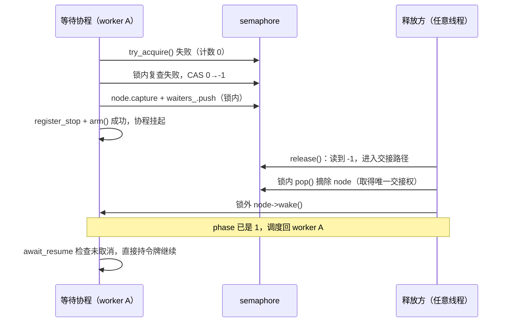
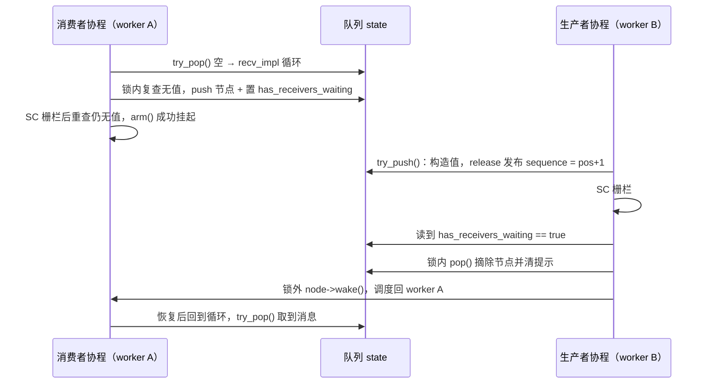
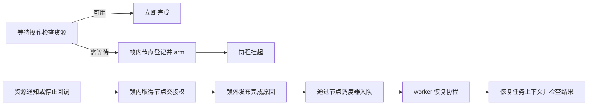

# 协程同步

同步原语通过帧内等待节点挂起协程，把通知或取消转换为调度入队。内部互斥锁只保护短时间的状态检查和节点交接，异步等待期完全由协程挂起表达，不占用任何 worker 线程。本文先解析所有原语共用的等待节点协议，再逐一解析信号量、互斥锁、条件变量、闩、屏障和有界 MPSC 通道的实现。

## 1. 类与职责

公开类型位于 `faio::sync`，通过 [sync.hpp](../include/faio/detail/sync.hpp) 汇集。共同等待设施位于 `faio::detail`。

| 类型 | 源码 | 职责 |
| --- | --- | --- |
| `wait_node` | [coroutine_wait.hpp](../include/faio/detail/coroutine/coroutine_wait.hpp) | 保存恢复句柄、调度器、交接状态和停止回调 |
| `wait_queue` | [coroutine_wait.hpp](../include/faio/detail/coroutine/coroutine_wait.hpp) | 不拥有节点的侵入式 FIFO，提供登记、摘除和批量接管 |
| `semaphore` / `permit` | [semaphore.hpp](../include/faio/detail/sync/semaphore.hpp) | 管理令牌数量，支持异步获取和 RAII 归还 |
| `mutex` / `guard` | [mutex.hpp](../include/faio/detail/sync/mutex.hpp) | 以一枚令牌实现互斥，支持跨协程挂起的锁持有期 |
| `condition_variable` | [condition_variable.hpp](../include/faio/detail/sync/condition_variable.hpp) | 在释放用户锁后等待条件通知，恢复时重新取得用户锁 |
| `latch` | [latch.hpp](../include/faio/detail/sync/latch.hpp) | 一次性倒计时，归零后批量恢复等待者 |
| `barrier` | [barrier.hpp](../include/faio/detail/sync/barrier.hpp) | 固定参与者的可重复屏障，取消等待会破坏屏障 |
| `mpsc<T>` / `sender` / `receiver` | [mpsc.hpp](../include/faio/detail/sync/mpsc.hpp) | 有界多生产者单消费者队列，提供背压、端点关闭和取消 |

所有原语遵循同一个分层设计：**快路径无锁**（原子CAS直接完成），**慢路径短临界区**（互斥锁内只做节点交接），**等待期零线程占用**（协程挂起，恢复由通知方调度入队）。

## 2. 共同的等待节点协议

### 2.1 节点由协程帧持有

`wait_node` 嵌入 awaiter，awaiter 保存在等待任务的协程帧中。节点的完整成员布局：

```cpp
struct wait_node {
  // 等待完成后需要恢复的协程句柄，不拥有该协程帧。
  std::coroutine_handle<> handle{};
  // 登记时所属运行时的调度句柄，跨线程通知也投递回这个运行时。
  scheduler_ref scheduler{};
  // 侵入式单链表的后继指针，仅用于等待队列链接。
  wait_node* next{};
  // 标记节点是否仍由队列管理；通知与取消通过同一队列锁争夺摘除权。
  bool queued{};  // 只在拥有 wait_queue 的 mutex 保护下访问
  // 登记/挂起交接状态：0 登记中，1 允许异步恢复，2 正常通知，3 取消。
  std::atomic<unsigned char> phase{0};
  // 按需就地存储停止回调；销毁时注销回调并同步仍在执行的回调。
  std::optional<std::stop_callback<cancel_callback>> callback;
  // ...
};
```

几个关键设计：

- **不拥有协程帧**：`handle` 只是恢复目标，节点不负责销毁它；节点自身的生命周期由所在 awaiter（即协程帧）覆盖。
- **登记线程的调度器**：`capture()` 记录的是登记时刻的调度域，而非未来通知线程的调度域，保证跨线程通知也能把恢复投递回正确的运行时。
- **`queued` 是非原子布尔**：它只在队列锁内读写，是通知与取消双方争夺"唯一摘除权"的判据。
- **移动构造不迁移地址相关状态**：`wait_node(wait_node&&)` 构造一个全新的空节点，已经 `capture`/入队的节点绝不允许迁移——队列中保存的是旧地址。

登记的第一步是 `capture()`，在入队之前调用：

```cpp
void capture(std::coroutine_handle<> h) noexcept {
  handle = h;                          // 记录需要恢复的协程
  scheduler = current_scheduler();     // 记录注册线程的调度器
}
```

等待队列仅借用节点地址。登记之后节点地址保持稳定，等待结束并恢复协程后才清理 awaiter；原语对象和它的队列锁也必须覆盖这段等待期。节点登记后既不能移动，也不能仅凭 `queued == false` 提前销毁：`queued` 置假只表示摘除权已被通知或取消某一条路径取得，取得交接权的一方可能尚未发布完成原因，必须等交接完成、等待操作恢复后才随 awaiter 清理（[coroutine_wait.hpp:18-20](../include/faio/detail/coroutine/coroutine_wait.hpp)）。

`wait_queue` 自身不带锁，调用方在所属原语的互斥区内操作它。它是不拥有节点的侵入式 FIFO 单链表，只保存 `head`/`tail` 两个指针：

```cpp
void push(wait_node* node) noexcept {
  node->next = nullptr;
  node->queued = true;        // 宣布节点归队列管理，取消回调据此判断是否还能摘除
  if (tail)
    tail->next = node;
  else
    head = node;
  tail = node;
}

wait_node* pop() noexcept {
  auto* node = head;
  if (node) {
    head = node->next;
    if (!head)
      tail = nullptr;
    node->next = nullptr;
    node->queued = false;     // 取消回调从此不能再次摘除
  }
  return node;                // 交给调用者在锁外执行 wake/cancel
}
```

尾插和队首摘除为 O(1)；`take_all()` 把整条链一次性摘出（同时把每个节点的 `queued` 置为 `false`），供 `notify_all`、latch 归零、屏障破坏等批量交接场景使用；取消时按地址移除节点的 `remove()` 为 O(n)，只在争用慢路径承担线性扫描。

摘除节点或整条链后，通知方取得唯一交接权，并在**锁外**恢复等待者——恢复代码可能立即争用同一把锁，锁内调度会造成死锁或优先级反转。`pop()` 的返回值设计和 `take_all()` 在锁内统一清除 `queued` 标志，都是为了把"取得交接权"与"执行恢复"严格拆到锁内/锁外两侧。

### 2.2 登记与通知的竞态

`phase` 具有四种状态：

| 值 | 含义 | 后续动作 |
| --- | --- | --- |
| 0 | 登记中，句柄和队列关系正在建立 | `arm()` 尝试取得异步恢复资格 |
| 1 | 已交给异步恢复路径 | 通知或取消需要调度入队 |
| 2 | 正常通知已到达 | 恢复后继续操作 |
| 3 | 取消已到达 | 恢复后由原语报告取消 |

登记完节点和停止回调后，`await_suspend()` 返回 `node.arm()`。`arm()` 与两条完成路径 `wake()`/`cancel()` 共同构成三态仲裁：

```cpp
// 完成登记到挂起的交接：成功表示可以挂起，失败表示通知/取消已提前到达。
bool arm() noexcept {
  unsigned char expected = 0;
  // 发布可恢复状态；失败时 await_suspend 返回 false，由当前执行流继续。
  return phase.compare_exchange_strong(expected, 1, std::memory_order_acq_rel);
}

// 发布正常通知；调用者须已取得节点的唯一摘除权。
void wake() {
  auto previous = phase.exchange(2, std::memory_order_acq_rel);
  // 仅已挂起者需要重新入队；登记中收到通知由 arm 失败直接继续。
  if (previous == 1)
    scheduler.schedule(handle);
}

// 发布取消；与 wake 一样要求已取得唯一摘除权，不强制销毁协程。
void cancel() {
  auto previous = phase.exchange(3, std::memory_order_acq_rel);
  if (previous == 1)
    scheduler.schedule(handle);
}
```

三个函数都是单次原子 RMW，仲裁规则非常对称：

- `arm()` 只允许从 0 推进到 1，且只执行一次（`await_suspend` 只调用一次）。
- `wake()`/`cancel()` 无条件把 phase 写成完成态，再读取**旧值**决定是否调度：只有旧值为 1（协程已真正挂起）才把句柄投递回登记时的调度域。

通知在 `arm()` 之前到达时，状态先变为 2 或 3，`arm()` 的 CAS 失败，`await_suspend()` 返回 `false`，当前执行流直接继续——不经过调度队列。`arm()` 先成功时，通知观察到旧状态 1，由通知方负责入队。两条路径都只安排恰好一次恢复，这一协议消除了"节点已入队但协程尚未挂起时通知到达"的经典丢失唤醒窗口。

恢复后等待方通过 `cancelled()`（`phase == 3`）区分完成原因，由原语的 `await_resume()` 决定是否抛出 `operation_cancelled`。

入队成功后，协程可能立即在其他 worker 恢复并销毁节点，因此通知方在 `wake()` 之后不再访问已交接节点。批量恢复辅助函数严格遵守这一约束：

```cpp
inline void wake_all(wait_node* nodes) {
  while (nodes) {
    auto* next = nodes->next;  // 唤醒前保存后继，唤醒后帧可能马上被销毁
    nodes->wake();
    nodes = next;
  }
}
```

`cancel_all()` 结构相同，只是把 `wake()` 换成 `cancel()`，屏障破坏等场景使用。

### 2.3 取消与正常通知的交接

停止回调的注册由 `register_stop()` 完成，各原语在释放队列锁之后、`arm()` 之前调用它：

```cpp
inline void wait_node::register_stop(std::mutex& mutex,
                                     wait_queue& queue,
                                     std::atomic<bool>* has_waiters) {
  // 复制当前任务令牌，不受同一线程下一次切换 TLS 的影响。
  auto token = current_stop_token;
  // 不可取消任务跳过回调构造，保留简单等待路径。
  if (!token.stop_possible())
    return;
  // stop_callback 侵入式注册在 stop_state 中；节点本身位于协程帧，
  // 无需为取消路径再分配对象。若 token 已停止，构造时同步执行回调。
  callback.emplace(token, cancel_callback{this, &mutex, &queue, has_waiters});
}
```

三个细节值得注意：**其一**，令牌是登记时刻的 TLS 快照，同一线程随后运行其他任务切换 TLS 也不影响本次等待；**其二**，`stop_callback` 侵入式注册在停止源的 `stop_state` 链表上，配合帧内节点，整个取消路径零堆分配；**其三**，回调直接保存在节点的 `std::optional` 里，节点销毁时 `stop_callback` 析构自动注销，并同步等待尚在执行的回调结束，杜绝回调访问已销毁节点。

回调本体的职责是"与正常通知争夺摘除权，赢家负责安排恢复"：

```cpp
void operator()() const noexcept {
  {
    // 与正常 pop/take_all 串行化，让一个节点只由一个路径摘除。
    std::lock_guard lock(*mutex);
    // 若通知已接管节点，停止请求不覆盖该通知的完成原因。
    if (!node->queued)
      return;
    queue->remove(node);
    // MPSC 等使用方同步修正提示标志，保留其与通知代数的顺序协议。
    if (has_waiters)
      has_waiters->store(queue->head != nullptr, std::memory_order_seq_cst);
  }
  // 释放队列锁后安排取消恢复，避免恢复代码立即争用同一把锁。
  node->cancel();
}
```

节点仍在队列时，取消路径将它摘除，释放锁后把 phase 置为 3 并按登记协议安排恢复；节点已由通知路径摘除时，`queued` 为 `false`，停止回调直接返回，由正常通知完成交接。两条路径在同一队列锁内串行化，一个节点只由一条路径接管，`cancel()` 里的 `previous == 1` 检查再保证恢复只安排一次。

回调必须在释放队列锁之后构造：`std::stop_callback` 面对已停止的令牌时会在构造点**同步执行**回调，而回调第一动作就是获取队列锁，持锁构造会造成同一把锁的重复获取。

取消由等待操作的 `await_resume()` 抛出 `operation_cancelled`，而不是直接销毁任务帧——任务有机会在异常处理中清理自身状态。停止回调主要覆盖已登记的等待；立即取得资源的快路径按其正常完成规则返回。

## 3. semaphore：令牌计数与 FIFO 交接

### 3.1 原子计数的含义

`semaphore` 保存原子 `permits_`、等待队列及其互斥锁：

| `permits_` | 含义 |
| --- | --- |
| 正值 | 可以立即领取的令牌数量 |
| 0 | 没有可用令牌，等待队列为空 |
| -1 | 队列交接模式；获取和释放需要协调等待者 |

构造只接受非负初始值。`try_acquire()` 在计数为正时以 acquire CAS 减一，领取成功后即可继续，无竞争时只做一次原子操作。

### 3.2 await_suspend 的登记过程

`acquire_awaiter::await_ready()` 先尝试获取。失败后，挂起路径在队列锁内重新检查资源，再把计数从 0 切换为 -1：

```cpp
{
  std::lock_guard lock(sem.mutex_);
  for (;;) {
    if (sem.try_acquire()) return false; // 锁内复查：release 可能刚刚发布
    std::ptrdiff_t empty = 0;
    if (sem.permits_.compare_exchange_strong(
            empty, -1, std::memory_order_acq_rel,
            std::memory_order_relaxed) || empty == -1)
      break;
  }
  node.capture(h);
  sem.waiters_.push(&node);
}
if (observe_stop) // acquire_uncancellable 跳过登记，见 3.5
  node.register_stop(sem.mutex_, sem.waiters_);
return node.arm();
```

锁内复查处理首次失败与登记之间发生的释放；0 → -1 的 CAS 与 `release()` 的无锁快路径竞争，构成唯一的线性化点，防止释放者跳过正在建立的等待关系。节点入队后，在锁外登记停止回调并执行 `arm()`。

### 3.3 release 的归还路径

计数非负时，`release()` 以 release CAS 加一，不接触队列锁。处于 -1 交接模式时，在队列锁内摘除最早等待者，并在锁外唤醒，将这一枚令牌**直接交接**给该等待操作：

```cpp
void release(std::ptrdiff_t count = 1) {
  if (count < 0)
    throw std::invalid_argument("semaphore release 不能为负");
  for (std::ptrdiff_t i = 0; i < count; ++i) {
    auto available = permits_.load(std::memory_order_relaxed);
    // 非负值保证等待链表为空；CAS 与登记方的 0→-1 竞争建立唯一线性化点。
    bool published = false;
    while (available >= 0) {
      if (available == std::numeric_limits<std::ptrdiff_t>::max())
        throw std::overflow_error("semaphore 令牌计数溢出");
      if (permits_.compare_exchange_weak(
              available, available + 1, std::memory_order_release,
              std::memory_order_relaxed)) {
        published = true;
        break;
      }
    }
    if (published)
      continue;                        // 无锁快路径完成这一枚令牌
    detail::wait_node* node;
    {
      std::lock_guard lock(mutex_);
      node = waiters_.pop();
      if (!node) {
        // 所有等待者可能已取消。此时恢复非负计数并发布这一枚新令牌。
        // 另一个 release 可能已恢复计数，因此不能无条件把计数写成 1：
        // CAS 循环发布 old == -1 ? 1 : old + 1（含溢出检查，源码略）。
      } else if (!waiters_.head) {
        // 本次令牌直接给摘除者；最后一位离队后允许未来 release 走快路径。
        permits_.store(0, std::memory_order_release);
      }
    }
    if (node)
      node->wake();                    // 锁外交接，恢复可能立即争用同一把锁
  }
}
```

还有等待者时保持 -1，最后一个等待者被摘除时将计数设为 0，允许后续 release 回到无锁快路径。交接期间新获取者无法从 -1 计数领取资源，因此 FIFO 中的等待者严格通过直接交接按登记顺序获取令牌。正常通知已取得节点后，随后到来的停止请求不撤销该次领取。负数释放参数和令牌计数溢出分别抛出 `std::invalid_argument` 与 `std::overflow_error`。

令牌交接的完整时序：



注意这枚令牌从未回到计数器：释放方把它"过手"给最早等待者，既保证 FIFO 公平，又避免唤醒后再竞争一次。

### 3.4 permit 的 RAII 归还

`acquire()` 成功后由调用方负责释放。`acquire_permit()` 则返回移动独占的 `permit`，把归还绑定到对象生命周期：

```cpp
class permit {
 public:
  explicit permit(semaphore& owner) noexcept : owner_(&owner) {}
  ~permit() {
    if (owner_)
      owner_->release();
  }
  permit(const permit&) = delete;
  permit& operator=(const permit&) = delete;
  permit(permit&& other) noexcept : owner_(std::exchange(other.owner_, nullptr)) {}

 private:
  semaphore* owner_;  // 借用归还目标；移动后源 permit 不再归还。
};
```

`permit` 借用信号量而不拥有它，移动构造通过 `std::exchange` 把归还责任转移给新对象，源对象析构时不再释放——一枚令牌恰好归还一次。配套的 awaiter 直接复用同一获取协议：

```cpp
struct permit_awaiter {
  semaphore& sem;         // 成功后绑定 RAII permit 的归还目标。
  acquire_awaiter inner;  // 复用同一登记、唤醒与取消协议。

  bool await_ready() noexcept { return inner.await_ready(); }
  bool await_suspend(std::coroutine_handle<> h) { return inner.await_suspend(h); }
  permit await_resume() {
    inner.await_resume();  // 取消时在此抛出，不构造 permit
    return permit{sem};
  }
};
```

三个挂起函数全部转发给 `inner`，只有 `await_resume()` 在确认未取消后构造 `permit`。这样等待期间没有多余的 RAII 状态，取消路径也不会误归还一枚从未领取的令牌。permit 在调用者帧内构造，无竞争时不产生额外的 task 协程帧。

### 3.5 不可取消获取

`acquire_uncancellable()` 返回跳过停止回调登记的 awaiter。它服务于清理路径：条件变量恢复时必须重新取得用户锁以维持"wait 返回时持锁"的不变量，同一个已停止的令牌不能中断这一清理步骤，否则 guard 会在未持锁的情况下错误地执行 unlock。

## 4. mutex：一枚令牌的互斥

互斥锁由初始计数为 1 的信号量实现：

```cpp
class mutex {
public:
  mutex() : permit_(1) {}
  bool try_lock() noexcept { return permit_.try_acquire(); }
  auto lock() noexcept { return permit_.acquire(); }
  auto lock_uncancellable() noexcept { return permit_.acquire_uncancellable(); }
  void unlock() { permit_.release(); }
  // ...
private:
  semaphore permit_;
};
```

因此互斥获取复用信号量的原子快路径、FIFO 交接和取消协议，没有独立实现。`scoped_lock()` 的 RAII 部分与信号量的 `permit` 同构：

```cpp
class guard {
 public:
  explicit guard(mutex& m) noexcept : mutex_(&m) {}
  ~guard() {
    if (mutex_)
      mutex_->unlock();
  }
  guard(const guard&) = delete;
  guard& operator=(const guard&) = delete;
  guard(guard&& other) noexcept : mutex_(std::exchange(other.mutex_, nullptr)) {}

 private:
  mutex* mutex_;
};

struct guard_awaiter {
  mutex& owner;
  semaphore::acquire_awaiter inner;

  bool await_ready() noexcept { return inner.await_ready(); }
  bool await_suspend(std::coroutine_handle<> h) { return inner.await_suspend(h); }
  guard await_resume() {
    inner.await_resume();   // 取消时在此抛出，不构造 guard
    return guard{owner};
  }
};
```

与 `permit_awaiter` 一样，挂起三件套全部转发给内部的 `acquire_awaiter`，`await_resume()` 在确认未取消后才构造 `guard`——取消路径不会得到一个会在析构时错误 `unlock()` 的 guard。guard 的移动构造转移归还责任，源对象析构不再 `unlock()`，一把锁恰好释放一次。

guard 借用 mutex，不依赖获取锁时的线程编号：持锁协程可以挂起并在其他 worker 恢复，锁的持有期完全由 guard 的生命周期覆盖。`scoped_lock()` 返回的 awaiter 保存在调用者帧中，不为这一包装单独创建 task 帧。

## 5. condition_variable：登记、解锁与重查条件

条件变量保存自己的队列锁与等待队列，业务状态由调用方的异步 mutex 保护。调用 `wait(m, predicate)` 前，调用方持有 `m`，并在同一把业务锁下修改、检查条件。

挂起路径把登记与释放业务锁置于**同一个内部临界区**：

```cpp
bool await_suspend(std::coroutine_handle<> h) {
  {
    std::lock_guard lock(cv.mutex_);
    node.capture(h);
    cv.waiters_.push(&node);
    user_mutex.unlock(); // 入队与解锁原子地完成
  }
  node.register_stop(cv.mutex_, cv.waiters_);
  return node.arm();
}
```

通知者需要先在业务锁保护下修改条件，再通知等待者。由于等待方在释放业务锁之前已经进入通知队列，通知方不可能在"条件检查"与"登记等待"之间完成一次无人接收的通知——这是条件变量正确性的核心不变量。

高层等待逻辑：

```cpp
template <class Predicate>
task<void> wait(mutex &m, Predicate predicate) {
  while (!predicate()) {
    const bool cancelled = co_await wait_awaiter{*this, m, {}};
    co_await m.lock_uncancellable(); // 清理路径不可被同一令牌再次取消
    if (cancelled)
      throw operation_cancelled{};
  }
}
```

恢复后首先重新取得业务锁（经由不可取消路径，维持"wait 返回时持锁"的不变量），再检查本次等待的取消原因；正常恢复则继续循环检查 predicate。重新加锁采用 mutex 的获取协议，异常可以从该步骤传播。通知表达的是条件**可能**发生变化，实际是否满足由 predicate 判定。

`notify_one()` 摘除一个节点，`notify_all()` 接管整条等待链，随后都在条件变量内部锁外安排恢复：

```cpp
void notify_one() {
  detail::wait_node* node;
  {
    std::lock_guard lock(mutex_);
    node = waiters_.pop();
  }
  if (node)
    node->wake();
}

void notify_all() {
  detail::wait_node* nodes;
  {
    std::lock_guard lock(mutex_);
    nodes = waiters_.take_all();
  }
  detail::wake_all(nodes);
}
```

通知者只需持有条件变量的内部锁完成摘除，唤醒动作全部在锁外。注意通知方**不需要**持有业务锁 `m`：正确性由"等待方在释放 `m` 前已入队"这一不变量保证——通知方只要在业务锁保护下修改过条件，随后的 `notify` 就不会落空，要么被已登记的等待者接收，要么先于尚未检查条件的等待者到达、由其下一次 predicate 检查直接观察到。被唤醒者重新持锁后由 predicate 做最终判定，虚假唤醒被循环自然吸收。

## 6. latch：一次性倒计时

`latch` 用互斥锁保护 `remaining_` 和等待队列。`count_down(n)` 检查参数范围后递减，归零时摘出全部等待者，锁外批量唤醒：

```cpp
void count_down(std::ptrdiff_t n = 1) {
  detail::wait_node *nodes{};
  {
    std::lock_guard lock(mutex_);
    if (n < 0 || n > remaining_)
      throw std::invalid_argument("latch count_down 越界");
    remaining_ -= n;
    if (remaining_ == 0)
      nodes = waiters_.take_all();
  }
  detail::wake_all(nodes);
}
```

`wait()` 的立即路径在锁内检查是否归零；挂起路径在同一锁内再次检查，防止首次检查与登记之间计数已经归零。归零后的等待永远立即完成，计数不重置。

等待取消仅从队列撤回当前等待者，不改变倒计时；`count_down()` 是独立的完成登记动作。构造允许计数为 0（等待立即完成），负初始值和越界递减被拒绝。

## 7. barrier：按轮次汇合与破坏状态

屏障保存固定参与者数 `participants_`、当前轮次剩余数 `remaining_`、等待队列和 `broken_` 标志。与其他原语不同，屏障没有 `await_ready` 快路径——`await_ready()` 恒为 `false`，每次 `arrive_and_wait()` 都进入挂起协议，在锁内递减当前剩余数并区分两种角色：

```cpp
bool await_suspend(std::coroutine_handle<> h) {
  detail::wait_node* nodes{};
  bool registered = false;
  {
    std::lock_guard lock(self.mutex_);
    if (self.broken_)
      throw operation_cancelled{};         // 屏障已破坏，不再接受到达
    if (--self.remaining_ == 0) {
      self.remaining_ = self.participants_; // 重置下一轮
      nodes = self.waiters_.take_all();     // 接管当前等待链
    } else {
      node.capture(h);
      self.waiters_.push(&node);
      registered = true;
    }
  }
  // 另一 worker 即使已经完成本代通知，arm 也会看到状态变化并返回 false。
  if (registered) {
    auto token = ::faio::detail::current_stop_token;
    if (token.stop_possible())
      callback.emplace(token, cancel_callback{&self, &node});
    return node.arm();
  }
  detail::wake_all(nodes);
  return false;                             // 最后到达者直接继续
}
```

最后一个到达者（`remaining_` 归零者）重置下一轮计数、取得当前等待链，在锁外唤醒其他参与者，自己通过 `await_suspend()` 返回 `false` 直接继续；其他到达者登记节点，再安装屏障专用停止回调并 `arm()`。被破坏检测放在锁内且用**抛异常**而非返回 `false`：锁内抛出时 `lock_guard` 正常解锁，等待操作直接以取消原因失败。

屏障的取消需要处理整组参与者——这正是它不用通用 `register_stop`、而安装专用回调的原因：

```cpp
struct cancel_callback {
  barrier* self;
  detail::wait_node* node;

  void operator()() const noexcept {
    detail::wait_node* others{};
    {
      std::lock_guard lock(self->mutex_);
      if (!node->queued)
        return;                    // 完成者已接管节点，正常通知会负责恢复。
      self->waiters_.remove(node);
      self->broken_ = true;
      others = self->waiters_.take_all();
    }
    node->cancel();
    detail::cancel_all(others);
  }
};
```

某个仍在等待队列中的节点取消时，回调在同一锁内完成三件事：摘除自己、把屏障标记为 broken、接管其他全部等待节点；随后在锁外取消当前节点和整条链。后续到达在锁内检测到 broken，抛出 `operation_cancelled`。若本轮完成者已经摘除该节点（`queued == false`），停止请求不覆盖正常完成，屏障也不被破坏——取消只能破坏"尚未完成"的轮次。

屏障要求正的固定参与者数量（构造时校验），每轮需要相应数量的到达。broken 是持续状态，该实例不执行恢复轮次的操作。

## 8. mpsc：有界数据队列与协程背压

### 8.1 队列状态与槽位

`mpsc<T>::make(capacity)` 创建共享状态、可复制的 sender 和移动独占的 receiver。容量必须大于零；`T` 要求无异常移动构造和析构——生产者一旦领取槽位就必须完成发布，否则消费者会永久等待。

| 状态 | 作用 |
| --- | --- |
| 固定 `cells` 数组 | 创建时确定容量，每个 cell 保存原子 sequence 和 `optional<T>` |
| `tail` | 多个生产者通过 CAS 竞争下一个写入位置（独立缓存行） |
| `head` | 单消费者推进读取位置（独立缓存行） |
| `receiver_busy` | 阻止多个未结束的接收操作同时使用单消费者状态 |
| `receiver_open` / `senders` | 表示接收侧和发送侧是否开放 |
| `waiting_senders` / `waiting_receivers` | 满或空时的协程等待队列 |
| `has_senders_waiting` / `has_receivers_waiting` | 通知路径的等待者提示标志 |

### 8.2 sequence 的发布与复用

数据快路径采用 Vyukov 有界队列算法。容量至少为 2 时，位置 `pos` 的槽位通过 sequence 表示所属轮次：

| sequence | 对位置 `pos` 的含义 |
| --- | --- |
| `pos` | 生产者可以领取并写入 |
| `pos + 1` | 消息已经发布，消费者可以读取 |
| 消费后写为 `pos + capacity` | 同一物理槽位可用于下一轮生产 |

```cpp
// 生产者：CAS 只竞争写入位置；槽位 sequence 的 release/acquire
// 保证消费者看到完整的 T 构造。
const auto seq = slot.sequence.load(std::memory_order_acquire);
const auto diff = static_cast<std::intptr_t>(seq - pos);
if (diff == 0) {
  if (tail.compare_exchange_weak(pos, pos + 1, std::memory_order_relaxed)) {
    slot.value.emplace(std::move(input));
    slot.sequence.store(pos + 1, std::memory_order_release);
    notify_receiver();
    return true;
  }
} else if (diff < 0) {
  return false; // 队列已满
} else {
  pos = tail.load(std::memory_order_relaxed); // tail 已被其他生产者推进
}
```

生产者 acquire 读取 sequence，CAS 领取 tail，在槽内构造值，release 发布 `pos + 1`。对称的消费侧快路径：

```cpp
// 只能由唯一 receiver 调用；不需与其他消费者竞争 head。
std::optional<T> try_pop() noexcept {
  // ... 容量 1 的单槽路径（省略）
  const auto pos = head.load(std::memory_order_relaxed);
  auto& slot = at(pos);
  if (slot.sequence.load(std::memory_order_acquire) != pos + 1)
    return std::nullopt;                        // 队列为空
  head.store(pos + 1, std::memory_order_relaxed);
  std::optional<T> result{std::move(*slot.value)};
  slot.value.reset();
  slot.sequence.store(pos + capacity(), std::memory_order_release); // 发布复用轮次
  notify_sender();
  return result;
}
```

消费者 acquire 确认发布，移动值并清空 optional，release 发布复用轮次 `pos + capacity`。`head` 的推进是普通的 relaxed store——单消费者假设让它不需要任何 CAS，这是 MPSC 相对 MPMC 的关键简化；`tail`/`head` 分别以 `alignas(64)` 隔离缓存行，避免生产者和消费者互相失效对方的缓存。非阻塞收发因此不取互斥锁、不分配内存。

容量为 1 时 sequence 算法无法工作（同一槽位相邻轮次的 sequence 无法区分），改用独立的单槽互斥路径，以 `single_full` 发布占用状态，保持精确的一条消息容量。

### 8.3 直接完成与慢路径任务

`send()` 返回 `send_operation`，保存消息和发送侧租约；`recv()` 返回 `recv_operation`，保存共享状态并取得接收独占标志。

两种 operation 都先在 `await_ready()` 尝试实际收发：资源可用时直接完成，awaiter 本体位于调用者协程帧。只有队列满或空时，才在 `await_suspend()` 中构造 `send_impl()` / `recv_impl()` 慢路径 task，通过对称转移进入"尝试 → 等待 → 再尝试"的循环：

```cpp
static task<expected<void>> send_impl(sender_lease lease, T value) {
  auto &shared = *lease.shared;
  for (;;) {
    if (!shared.receiver_open.load(std::memory_order_acquire))
      co_return std::unexpected(make_error(Error::ClosedChannel));
    if (shared.try_push(value))
      co_return expected<void>{};
    co_await send_waiter{shared, {}};
  }
}
```

生产者满时登记 `send_waiter`，消费者释放槽位后通知发送者；消费者空时登记 `recv_waiter`，生产者发布消息后通知接收者。通知**不预留**消息或槽位，恢复后由循环重新尝试实际操作——这使通知方无需在锁内搬移数据，也自然处理了多生产者竞争。

`recv_operation` 在构造时取得 `receiver_busy`，在析构时清除。限制覆盖整个操作对象生命周期，包括尚未开始等待的操作对象；`try_recv()` 用局部守卫覆盖一次非阻塞读取。重复接收操作被 `std::logic_error` 拒绝。

### 8.4 等待提示与双向复查

等待队列由互斥锁保护，数据槽由原子 sequence 发布，两套机制之间必须处理资源变化与等待登记的交错。登记方在等待锁内执行：

1. 检查关闭状态和资源状态，有资源时直接继续；
2. 链接等待节点，设置等待者提示标志；
3. 执行顺序一致性栅栏，再次检查槽位；
4. 已出现资源时撤回节点，否则在锁外登记取消并交接挂起。

以 `send_waiter` 为例的完整登记实现：

```cpp
bool await_suspend(std::coroutine_handle<> h) {
  {
    std::lock_guard lock(shared.wait_mutex);
    if (!shared.receiver_open.load(std::memory_order_acquire) || shared.has_space())
      return false;                          // 已关闭或已有槽位：直接继续
    node.capture(h);
    shared.waiting_senders.push(&node);
    shared.has_senders_waiting.store(true, std::memory_order_seq_cst);
    // 和消费侧的发布栅栏配对：登记后重查，避免释放与入队交错时睡过头。
    std::atomic_thread_fence(std::memory_order_seq_cst);
    if (shared.has_space()) {
      shared.waiting_senders.remove(&node);  // 槽位恰好出现：撤回等待
      shared.has_senders_waiting.store(shared.waiting_senders.head != nullptr,
                                       std::memory_order_seq_cst);
      return false;
    }
  }
  node.register_stop(shared.wait_mutex, shared.waiting_senders,
                     &shared.has_senders_waiting);
  return node.arm();
}
```

`recv_waiter` 完全对称，只是资源判据换成 `has_value()`、队列换成 `waiting_receivers`，并额外在登记前检查 `senders == 0`（发送侧已全部关闭时不必等待）。撤回路径上的第二次提示标志写入不可省略：摘除本节点后队列可能已空，必须把提示同步回真实状态，否则通知方会白进一次锁。

资源发布方先 release 发布槽位，再执行顺序一致性栅栏、读取等待提示，有等待者时在锁内摘除节点并于锁外唤醒：

```cpp
void notify_receiver() {
  std::atomic_thread_fence(std::memory_order_seq_cst);
  if (!has_receivers_waiting.load(std::memory_order_seq_cst))
    return; // 无等待者时不争用通知锁
  // ... 锁内摘除节点并更新提示，锁外 wake
}
```

两侧的"发布 → 栅栏 → 读提示"与"登记提示 → 栅栏 → 重查"形成配对：顺序一致性栅栏禁止双方同时观察到旧值，因此不会出现资源已经可用而等待者错过通知的情况。以栅栏代替每条消息争用共享 epoch 的读改写操作，是无等待者时通知零锁开销的关键。

生产者发布与消费者等待的一次典型交错：



若发布恰好发生在"置提示"与"重查"之间，双向复查由消费者的重查兜底撤回节点；若发生在重查之后，生产者的读提示必然观察到 `true`。两种交错都不会丢失唤醒。

取消回调摘除节点时，在同一等待锁内同步更新等待提示，保留提示与通知的代数顺序。端点关闭也在该锁内接管等待链并清空提示。

### 8.5 发送租约与端点关闭

所有 sender 副本以及未完成的 send operation 共享同一个发送侧控制块 `sender_lifetime`。sender 持有的是别名 `shared_ptr`：指针指向队列 state，所有权属于发送侧控制块。最后一个发送侧引用释放时，控制块析构调用 `drop_sender()`，将发送侧标记为关闭并唤醒全部接收等待者。

因此 `sender.close()` 释放的是该端点引用；已创建的发送操作继续持有发送侧租约，覆盖延后启动或挂起中的发送过程。接收端直接持有队列 state，使发送侧关闭后可以读完已经缓冲的消息。每条消息只增减 `shared_ptr` 引用计数，不修改队列状态中的第二条计数缓存行，避免多生产者在热路径上反复争用。

receiver 关闭时发布 `receiver_open = false`，唤醒发送和接收两侧的等待者。共享状态由端点和未结束操作共同持有，直到最后一个引用释放才销毁。

| 情况 | 结果 |
| --- | --- |
| `try_send()` 遇到满队列 | 正常结果 `false` |
| `try_recv()` 遇到空队列，发送侧开放 | 正常结果为空 `optional` |
| 发送侧已关闭，缓冲仍有数据 | receiver 继续取出缓冲消息 |
| 发送侧已关闭，缓冲读空 | 接收返回 `Error::ClosedChannel` |
| 接收侧已关闭 | 后续收发返回 `Error::ClosedChannel`，等待者被唤醒后检查关闭 |
| 已登记的收发等待被取消 | 抛出 `operation_cancelled` |

关闭通过 `expected` 的错误值表达，协作取消通过异常表达；调用方在各自路径处理对应的结束原因。

## 9. 与任务上下文和运行时的连接

等待节点在登记时捕获调度引用，通知线程可以来自任意运行时或普通线程，恢复仍投递到节点所属调度域。入队选择本地还是全局路径，取决于通知线程是否具有匹配的执行绑定，详见[异步运行时](异步运行时.md)。

用户任务的 `await_transform()` 在恢复时安装本任务的 tracker 和停止令牌，因此等待后的继续执行、异常处理及派生任务提交都采用同一任务上下文。令牌的停止状态由任务的 `cancellation_state`（[task_context.hpp:26-38](../include/faio/detail/coroutine/task_context.hpp)）持有：每个任务保存自己的 `stop_source`，并用 `link` 回调把父任务的停止请求转发进来：

```cpp
struct cancellation_state {
  std::shared_ptr<cancellation_state> parent;
  std::stop_source source;
  std::optional<std::stop_callback<forward>> link;  // 父停止 → source.request_stop()
};
```

并发组合取消父任务时，停止请求沿这条转发链到达各等待操作经 `register_stop` 登记的停止回调，详见[协程并发](协程并发.md)。



图中入队路径对应 `arm()` 已成功的等待；完成先于 `arm()` 时，等待操作直接继续，不再次调度。
