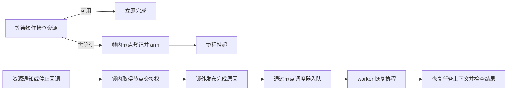

# 协程同步

同步原语通过帧内等待节点挂起协程，把通知或取消转换为调度入队。内部互斥锁只保护短时间的状态检查和节点交接，异步等待期完全由协程挂起表达，不占用任何 worker 线程。本文先解析所有原语共用的等待节点协议，再逐一解析信号量、互斥锁、条件变量、闩、屏障和有界 MPSC 通道的实现。

## 1. 类与职责

公开类型位于 `faio::sync`，通过 [sync.hpp](../include/faio/detail/sync.hpp) 汇集。共同等待设施位于 `faio::detail`。

| 类型 | 源码 | 职责 |
| --- | --- | --- |
| `wait_node` | [coroutine_wait.hpp](../include/faio/detail/coroutine/coroutine_wait.hpp) | 保存恢复句柄、调度器、交接状态和停止回调 |
| `wait_queue` | [coroutine_wait.hpp](../include/faio/detail/coroutine/coroutine_wait.hpp) | 不拥有节点的侵入式 FIFO，提供登记、摘除和批量接管 |
| `semaphore` / `permit` | [semaphore.hpp](../include/faio/detail/sync/semaphore.hpp) | 管理令牌数量，支持异步获取和 RAII 归还 |
| `mutex` / `guard` | [mutex.hpp](../include/faio/detail/sync/mutex.hpp) | 以一枚令牌实现互斥，支持跨协程挂起的锁持有期 |
| `condition_variable` | [condition_variable.hpp](../include/faio/detail/sync/condition_variable.hpp) | 在释放用户锁后等待条件通知，恢复时重新取得用户锁 |
| `latch` | [latch.hpp](../include/faio/detail/sync/latch.hpp) | 一次性倒计时，归零后批量恢复等待者 |
| `barrier` | [barrier.hpp](../include/faio/detail/sync/barrier.hpp) | 固定参与者的可重复屏障，取消等待会破坏屏障 |
| `mpsc<T>` / `sender` / `receiver` | [mpsc.hpp](../include/faio/detail/sync/mpsc.hpp) | 有界多生产者单消费者队列，提供背压、端点关闭和取消 |

所有原语遵循同一个分层设计：**快路径无锁**（原子CAS直接完成），**慢路径短临界区**（互斥锁内只做节点交接），**等待期零线程占用**（协程挂起，恢复由通知方调度入队）。

## 2. 共同的等待节点协议

### 2.1 节点由协程帧持有

`wait_node` 嵌入 awaiter，awaiter 保存在等待任务的协程帧中。节点包含协程句柄、登记时的 `scheduler_ref`、链表后继、`queued` 标志、原子 `phase` 和可选停止回调。

等待队列仅借用节点地址。登记之后节点地址保持稳定，等待结束并恢复协程后才清理 awaiter；原语对象和它的队列锁也必须覆盖这段等待期。

`wait_queue` 自身不带锁，调用方在所属原语的互斥区内操作它。尾插和队首摘除为 O(1)，取消时按地址移除节点为 O(n)。摘除节点或整条链后，通知方取得唯一交接权，并在**锁外**恢复等待者——恢复代码可能立即争用同一把锁，锁内调度会造成死锁或优先级反转。

### 2.2 登记与通知的竞态

`phase` 具有四种状态：

| 值 | 含义 | 后续动作 |
| --- | --- | --- |
| 0 | 登记中，句柄和队列关系正在建立 | `arm()` 尝试取得异步恢复资格 |
| 1 | 已交给异步恢复路径 | 通知或取消需要调度入队 |
| 2 | 正常通知已到达 | 恢复后继续操作 |
| 3 | 取消已到达 | 恢复后由原语报告取消 |

登记完节点和停止回调后，`await_suspend()` 返回 `node.arm()`：

```cpp
bool arm() noexcept {
  unsigned char expected = 0;
  return phase.compare_exchange_strong(expected, 1,
                                       std::memory_order_acq_rel);
}

void wake() {
  auto previous = phase.exchange(2, std::memory_order_acq_rel);
  if (previous == 1)
    scheduler.schedule(handle);
}
```

通知在 `arm()` 之前到达时，状态先变为 2，`arm()` 失败，`await_suspend()` 返回 `false`，当前执行流直接继续——不经过调度队列。`arm()` 先成功时，通知观察到旧状态 1，将句柄投递回登记时的调度域。两条路径都只安排恰好一次恢复，这一协议消除了"节点已入队但协程尚未挂起时通知到达"的经典丢失唤醒窗口。

入队成功后，协程可能立即在其他 worker 恢复并销毁节点，因此通知方在 `wake()` 之后不再访问已交接节点。`wake_all()` 在唤醒每个节点之前保存后继地址，再处理下一个节点。

### 2.3 取消与正常通知的交接

停止回调在同一队列锁内检查 `queued`：节点仍在队列时，取消路径将它摘除，释放锁后把 phase 置为 3 并按登记协议安排恢复；节点已由通知路径摘除时，停止回调直接返回，由正常通知完成交接。两条路径在锁内串行化，一个节点只由一条路径接管。

```cpp
void operator()() const noexcept {
  {
    std::lock_guard lock(*mutex);
    if (!node->queued)
      return; // 正常通知已取得该节点
    queue->remove(node);
    if (has_waiters)
      has_waiters->store(queue->head != nullptr, std::memory_order_seq_cst);
  }
  node->cancel(); // 锁外安排取消恢复
}
```

停止回调在释放队列锁之后构造，因为 `std::stop_callback` 面对已停止的令牌时可能同步执行回调，持锁构造会造成同一把锁的重复获取。回调保存当前任务令牌的快照；节点销毁时注销回调并同步尚在执行的回调。

取消由等待操作的 `await_resume()` 抛出 `operation_cancelled`，而不是直接销毁任务帧——任务有机会在异常处理中清理自身状态。停止回调主要覆盖已登记的等待；立即取得资源的快路径按其正常完成规则返回。

## 3. semaphore：令牌计数与 FIFO 交接

### 3.1 原子计数的含义

`semaphore` 保存原子 `permits_`、等待队列及其互斥锁：

| `permits_` | 含义 |
| --- | --- |
| 正值 | 可以立即领取的令牌数量 |
| 0 | 没有可用令牌，等待队列为空 |
| -1 | 队列交接模式；获取和释放需要协调等待者 |

构造只接受非负初始值。`try_acquire()` 在计数为正时以 acquire CAS 减一，领取成功后即可继续，无竞争时只做一次原子操作。

### 3.2 await_suspend 的登记过程

`acquire_awaiter::await_ready()` 先尝试获取。失败后，挂起路径在队列锁内重新检查资源，再把计数从 0 切换为 -1：

```cpp
{
  std::lock_guard lock(sem.mutex_);
  for (;;) {
    if (sem.try_acquire()) return false; // 锁内复查：release 可能刚刚发布
    std::ptrdiff_t empty = 0;
    if (sem.permits_.compare_exchange_strong(
            empty, -1, std::memory_order_acq_rel,
            std::memory_order_relaxed) || empty == -1)
      break;
  }
  node.capture(h);
  sem.waiters_.push(&node);
}
node.register_stop(sem.mutex_, sem.waiters_);
return node.arm();
```

锁内复查处理首次失败与登记之间发生的释放；0 → -1 的 CAS 与 `release()` 的无锁快路径竞争，构成唯一的线性化点，防止释放者跳过正在建立的等待关系。节点入队后，在锁外登记停止回调并执行 `arm()`。

### 3.3 release 的归还路径

计数非负时，`release()` 以 release CAS 加一，不接触队列锁。处于 -1 交接模式时，在队列锁内摘除最早等待者，并在锁外唤醒，将这一枚令牌**直接交接**给该等待操作：

```cpp
detail::wait_node *node;
{
  std::lock_guard lock(mutex_);
  node = waiters_.pop();
  if (!node) {
    // 等待者都已取消：恢复非负计数并发布这一枚新令牌
    // （不能无条件写成 1，另一 release 可能已恢复计数）
    // ... CAS: old == -1 ? 1 : old + 1
  } else if (!waiters_.head) {
    permits_.store(0, std::memory_order_release); // 最后一个等待者离队
  }
}
if (node)
  node->wake();
```

还有等待者时保持 -1，最后一个等待者被摘除时将计数设为 0，允许后续 release 回到无锁快路径。交接期间新获取者无法从 -1 计数领取资源，因此 FIFO 中的等待者严格通过直接交接按登记顺序获取令牌。正常通知已取得节点后，随后到来的停止请求不撤销该次领取。

`acquire()` 成功后由调用方负责释放。`acquire_permit()` 返回移动独占的 `permit`，析构自动释放；返回 guard 的 awaiter 直接复用同一获取协议，guard 在调用者帧内构造，无竞争时不产生额外的 task 协程帧。负数释放参数和令牌计数溢出分别抛出 `std::invalid_argument` 与 `std::overflow_error`。

### 3.4 不可取消获取

`acquire_uncancellable()` 返回跳过停止回调登记的 awaiter。它服务于清理路径：条件变量恢复时必须重新取得用户锁以维持"wait 返回时持锁"的不变量，同一个已停止的令牌不能中断这一清理步骤，否则 guard 会在未持锁的情况下错误地执行 unlock。

## 4. mutex：一枚令牌的互斥

互斥锁由初始计数为 1 的信号量实现：

```cpp
class mutex {
public:
  mutex() : permit_(1) {}
  bool try_lock() noexcept { return permit_.try_acquire(); }
  auto lock() noexcept { return permit_.acquire(); }
  auto lock_uncancellable() noexcept { return permit_.acquire_uncancellable(); }
  void unlock() { permit_.release(); }
  // ...
private:
  semaphore permit_;
};
```

因此互斥获取复用信号量的原子快路径、FIFO 交接和取消协议，没有独立实现。`scoped_lock()` 的 awaiter 在获取成功后返回 `guard`，其移动构造转移归还责任，析构时调用 `unlock()`。

guard 借用 mutex，不依赖获取锁时的线程编号：持锁协程可以挂起并在其他 worker 恢复，锁的持有期完全由 guard 的生命周期覆盖。`scoped_lock()` 返回的 awaiter 保存在调用者帧中，不为这一包装单独创建 task 帧。

## 5. condition_variable：登记、解锁与重查条件

条件变量保存自己的队列锁与等待队列，业务状态由调用方的异步 mutex 保护。调用 `wait(m, predicate)` 前，调用方持有 `m`，并在同一把业务锁下修改、检查条件。

挂起路径把登记与释放业务锁置于**同一个内部临界区**：

```cpp
bool await_suspend(std::coroutine_handle<> h) {
  {
    std::lock_guard lock(cv.mutex_);
    node.capture(h);
    cv.waiters_.push(&node);
    user_mutex.unlock(); // 入队与解锁原子地完成
  }
  node.register_stop(cv.mutex_, cv.waiters_);
  return node.arm();
}
```

通知者需要先在业务锁保护下修改条件，再通知等待者。由于等待方在释放业务锁之前已经进入通知队列，通知方不可能在"条件检查"与"登记等待"之间完成一次无人接收的通知——这是条件变量正确性的核心不变量。

高层等待逻辑：

```cpp
template <class Predicate>
task<void> wait(mutex &m, Predicate predicate) {
  while (!predicate()) {
    const bool cancelled = co_await wait_awaiter{*this, m, {}};
    co_await m.lock_uncancellable(); // 清理路径不可被同一令牌再次取消
    if (cancelled)
      throw operation_cancelled{};
  }
}
```

恢复后首先重新取得业务锁（经由不可取消路径，维持"wait 返回时持锁"的不变量），再检查本次等待的取消原因；正常恢复则继续循环检查 predicate。重新加锁采用 mutex 的获取协议，异常可以从该步骤传播。通知表达的是条件**可能**发生变化，实际是否满足由 predicate 判定。

`notify_one()` 摘除一个节点，`notify_all()` 接管整条等待链，随后都在条件变量内部锁外安排恢复。

## 6. latch：一次性倒计时

`latch` 用互斥锁保护 `remaining_` 和等待队列。`count_down(n)` 检查参数范围后递减，归零时摘出全部等待者，锁外批量唤醒：

```cpp
void count_down(std::ptrdiff_t n = 1) {
  detail::wait_node *nodes{};
  {
    std::lock_guard lock(mutex_);
    if (n < 0 || n > remaining_)
      throw std::invalid_argument("latch count_down 越界");
    remaining_ -= n;
    if (remaining_ == 0)
      nodes = waiters_.take_all();
  }
  detail::wake_all(nodes);
}
```

`wait()` 的立即路径在锁内检查是否归零；挂起路径在同一锁内再次检查，防止首次检查与登记之间计数已经归零。归零后的等待永远立即完成，计数不重置。

等待取消仅从队列撤回当前等待者，不改变倒计时；`count_down()` 是独立的完成登记动作。构造允许计数为 0（等待立即完成），负初始值和越界递减被拒绝。

## 7. barrier：按轮次汇合与破坏状态

屏障保存固定参与者数 `participants_`、当前轮次剩余数 `remaining_`、等待队列和 `broken_` 标志。每次 `arrive_and_wait()` 都进入挂起协议，在锁内递减当前剩余数。最后一个到达者：

```cpp
if (--self.remaining_ == 0) {
  self.remaining_ = self.participants_; // 重置下一轮
  nodes = self.waiters_.take_all();     // 接管当前等待链
}
```

它重置下一轮计数，取得当前等待链，在锁外唤醒其他参与者，自己通过 `await_suspend()` 返回 `false` 直接继续。其他到达者登记节点，再安装屏障专用停止回调并 `arm()`。

屏障的取消需要处理整组参与者：某个仍在等待队列中的节点取消时，回调将它摘除、把屏障标记为 broken、并接管其他全部等待节点，锁外取消当前节点和整条链。后续到达检测到 broken，抛出 `operation_cancelled`。若正常完成已经摘除该节点，则由本轮通知路径继续，不破坏屏障。

屏障要求正的固定参与者数量，每轮需要相应数量的到达。broken 是持续状态，该实例不执行恢复轮次的操作。

## 8. mpsc：有界数据队列与协程背压

### 8.1 队列状态与槽位

`mpsc<T>::make(capacity)` 创建共享状态、可复制的 sender 和移动独占的 receiver。容量必须大于零；`T` 要求无异常移动构造和析构——生产者一旦领取槽位就必须完成发布，否则消费者会永久等待。

| 状态 | 作用 |
| --- | --- |
| 固定 `cells` 数组 | 创建时确定容量，每个 cell 保存原子 sequence 和 `optional<T>` |
| `tail` | 多个生产者通过 CAS 竞争下一个写入位置（独立缓存行） |
| `head` | 单消费者推进读取位置（独立缓存行） |
| `receiver_busy` | 阻止多个未结束的接收操作同时使用单消费者状态 |
| `receiver_open` / `senders` | 表示接收侧和发送侧是否开放 |
| `waiting_senders` / `waiting_receivers` | 满或空时的协程等待队列 |
| `has_senders_waiting` / `has_receivers_waiting` | 通知路径的等待者提示标志 |

### 8.2 sequence 的发布与复用

数据快路径采用 Vyukov 有界队列算法。容量至少为 2 时，位置 `pos` 的槽位通过 sequence 表示所属轮次：

| sequence | 对位置 `pos` 的含义 |
| --- | --- |
| `pos` | 生产者可以领取并写入 |
| `pos + 1` | 消息已经发布，消费者可以读取 |
| 消费后写为 `pos + capacity` | 同一物理槽位可用于下一轮生产 |

```cpp
// 生产者：CAS 只竞争写入位置；槽位 sequence 的 release/acquire
// 保证消费者看到完整的 T 构造。
const auto seq = slot.sequence.load(std::memory_order_acquire);
const auto diff = static_cast<std::intptr_t>(seq - pos);
if (diff == 0) {
  if (tail.compare_exchange_weak(pos, pos + 1, std::memory_order_relaxed)) {
    slot.value.emplace(std::move(input));
    slot.sequence.store(pos + 1, std::memory_order_release);
    notify_receiver();
    return true;
  }
} else if (diff < 0) {
  return false; // 队列已满
} else {
  pos = tail.load(std::memory_order_relaxed); // tail 已被其他生产者推进
}
```

生产者 acquire 读取 sequence，CAS 领取 tail，在槽内构造值，release 发布 `pos + 1`。唯一消费者 acquire 确认发布，移动值并清空 optional，release 发布复用轮次 `pos + capacity`。非阻塞收发因此不取互斥锁、不分配内存。

容量为 1 时 sequence 算法无法工作（同一槽位相邻轮次的 sequence 无法区分），改用独立的单槽互斥路径，以 `single_full` 发布占用状态，保持精确的一条消息容量。

### 8.3 直接完成与慢路径任务

`send()` 返回 `send_operation`，保存消息和发送侧租约；`recv()` 返回 `recv_operation`，保存共享状态并取得接收独占标志。

两种 operation 都先在 `await_ready()` 尝试实际收发：资源可用时直接完成，awaiter 本体位于调用者协程帧。只有队列满或空时，才在 `await_suspend()` 中构造 `send_impl()` / `recv_impl()` 慢路径 task，通过对称转移进入"尝试 → 等待 → 再尝试"的循环：

```cpp
static task<expected<void>> send_impl(sender_lease lease, T value) {
  auto &shared = *lease.shared;
  for (;;) {
    if (!shared.receiver_open.load(std::memory_order_acquire))
      co_return std::unexpected(make_error(Error::ClosedChannel));
    if (shared.try_push(value))
      co_return expected<void>{};
    co_await send_waiter{shared, {}};
  }
}
```

生产者满时登记 `send_waiter`，消费者释放槽位后通知发送者；消费者空时登记 `recv_waiter`，生产者发布消息后通知接收者。通知**不预留**消息或槽位，恢复后由循环重新尝试实际操作——这使通知方无需在锁内搬移数据，也自然处理了多生产者竞争。

`recv_operation` 在构造时取得 `receiver_busy`，在析构时清除。限制覆盖整个操作对象生命周期，包括尚未开始等待的操作对象；`try_recv()` 用局部守卫覆盖一次非阻塞读取。重复接收操作被 `std::logic_error` 拒绝。

### 8.4 等待提示与双向复查

等待队列由互斥锁保护，数据槽由原子 sequence 发布，两套机制之间必须处理资源变化与等待登记的交错。登记方在等待锁内执行：

1. 检查关闭状态和资源状态，有资源时直接继续；
2. 链接等待节点，设置等待者提示标志；
3. 执行顺序一致性栅栏，再次检查槽位；
4. 已出现资源时撤回节点，否则在锁外登记取消并交接挂起。

资源发布方先 release 发布槽位，再执行顺序一致性栅栏、读取等待提示，有等待者时在锁内摘除节点并于锁外唤醒：

```cpp
void notify_receiver() {
  std::atomic_thread_fence(std::memory_order_seq_cst);
  if (!has_receivers_waiting.load(std::memory_order_seq_cst))
    return; // 无等待者时不争用通知锁
  // ... 锁内摘除节点并更新提示，锁外 wake
}
```

两侧的"发布 → 栅栏 → 读提示"与"登记提示 → 栅栏 → 重查"形成配对：顺序一致性栅栏禁止双方同时观察到旧值，因此不会出现资源已经可用而等待者错过通知的情况。以栅栏代替每条消息争用共享 epoch 的读改写操作，是无等待者时通知零锁开销的关键。

取消回调摘除节点时，在同一等待锁内同步更新等待提示，保留提示与通知的代数顺序。端点关闭也在该锁内接管等待链并清空提示。

### 8.5 发送租约与端点关闭

所有 sender 副本以及未完成的 send operation 共享同一个发送侧控制块 `sender_lifetime`。sender 持有的是别名 `shared_ptr`：指针指向队列 state，所有权属于发送侧控制块。最后一个发送侧引用释放时，控制块析构调用 `drop_sender()`，将发送侧标记为关闭并唤醒全部接收等待者。

因此 `sender.close()` 释放的是该端点引用；已创建的发送操作继续持有发送侧租约，覆盖延后启动或挂起中的发送过程。接收端直接持有队列 state，使发送侧关闭后可以读完已经缓冲的消息。每条消息只增减 `shared_ptr` 引用计数，不修改队列状态中的第二条计数缓存行，避免多生产者在热路径上反复争用。

receiver 关闭时发布 `receiver_open = false`，唤醒发送和接收两侧的等待者。共享状态由端点和未结束操作共同持有，直到最后一个引用释放才销毁。

| 情况 | 结果 |
| --- | --- |
| `try_send()` 遇到满队列 | 正常结果 `false` |
| `try_recv()` 遇到空队列，发送侧开放 | 正常结果为空 `optional` |
| 发送侧已关闭，缓冲仍有数据 | receiver 继续取出缓冲消息 |
| 发送侧已关闭，缓冲读空 | 接收返回 `Error::ClosedChannel` |
| 接收侧已关闭 | 后续收发返回 `Error::ClosedChannel`，等待者被唤醒后检查关闭 |
| 已登记的收发等待被取消 | 抛出 `operation_cancelled` |

关闭通过 `expected` 的错误值表达，协作取消通过异常表达；调用方在各自路径处理对应的结束原因。

## 9. 与任务上下文和运行时的连接

等待节点在登记时捕获调度引用，通知线程可以来自任意运行时或普通线程，恢复仍投递到节点所属调度域。入队选择本地还是全局路径，取决于通知线程是否具有匹配的执行绑定，详见[异步运行时](异步运行时.md)。

用户任务的 `await_transform()` 在恢复时安装本任务的 tracker 和停止令牌，因此等待后的继续执行、异常处理及派生任务提交都采用同一任务上下文。并发组合的停止源沿这些令牌连接到支持取消的等待操作，详见[协程并发](协程并发.md)。



图中入队路径对应 `arm()` 已成功的等待；完成先于 `arm()` 时，等待操作直接继续，不再次调度。
