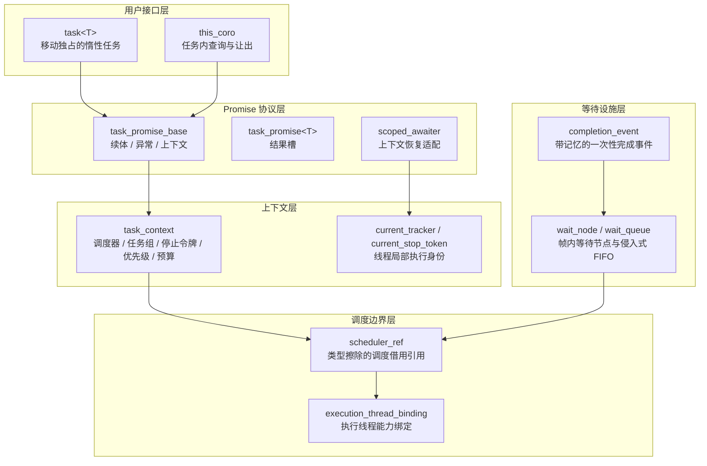

# 协程封装

协程层承担四项职责：保存任务结果、管理协程帧生命周期、随帧传递执行上下文、为一切异步等待提供统一的挂起与恢复设施。本文按源码文件解析 `include/faio/detail/coroutine/` 的完整封装层：任务帧协议、任务上下文、任务内查询与让出、等待节点设施、协程帧分配器，以及协程层与运行时之间的调度边界。根任务提交与并发组合见[协程并发](协程并发.md)，同步原语对等待节点协议的使用见[协程同步](协程同步.md)，调度器与就绪队列的线程实现见[异步运行时](异步运行时.md)。

## 1. 架构总览

协程层在架构上分为五个正交的子层，各层之间仅通过明确的协议接口耦合：



设计上遵循三条基本原则：

1. **惰性求值与对称转移**：任务创建后不执行任何用户代码；嵌套 `co_await` 通过对称转移直接接续子协程，不产生中间调度入队，深层调用链不会退化为递归 `resume()`。
2. **上下文随帧保存，恢复时重建**：任务执行属性保存在地址稳定的协程帧中，而非依赖线程局部状态；协程跨线程迁移后由帧内副本重建执行身份。
3. **调度能力类型擦除**：协程层只定义 `coroutine_scheduler` 概念与 `scheduler_ref` 借用引用，不依赖具体 worker、就绪队列或 I/O 后端类型，从而保持对运行时实现的零耦合。

## 2. 文件与职责

协程层的公开入口只有 `task`、`join_handle`、组合器、`scope` 和 `this_coro`；其余类型承担内部实现职责。

| 类型或设施 | 源码 | 职责 |
| --- | --- | --- |
| `task<T>` | [task.hpp](../include/faio/detail/coroutine/task.hpp) | 移动独占的惰性任务，持有尚未交出的协程帧 |
| `task_promise_base` | [task.hpp](../include/faio/detail/coroutine/task.hpp) | 保存父续体、异常和任务上下文，实现共用协程协议 |
| `task_promise<T>` / `task_promise<void>` | [task.hpp](../include/faio/detail/coroutine/task.hpp) | 保存返回值或表示无返回值的正常完成 |
| `task<T>::awaiter` | [task.hpp](../include/faio/detail/coroutine/task.hpp) | 接管子帧、启动子任务、领取结果并销毁子帧 |
| `as_awaiter` / `scoped_awaiter<A>` | [task.hpp](../include/faio/detail/coroutine/task.hpp) | 等待表达式的编译期分派与任务上下文恢复适配 |
| `task_priority` / `task_context` | [task_context.hpp](../include/faio/detail/coroutine/task_context.hpp) | 优先级元数据，以及随协程帧保存的任务组、调度器、停止令牌和协作预算 |
| `current_stop_token` / `current_tracker` | [task_context.hpp](../include/faio/detail/coroutine/task_context.hpp)、[task_tracker.hpp](../include/faio/detail/coroutine/task_tracker.hpp) | 线程局部的当前任务身份，恢复时由任务上下文重建 |
| this_coro 标记与 awaiter | [this_coro.hpp](../include/faio/detail/coroutine/this_coro.hpp) | 任务内属性查询标记、立即完成 awaiter 和协作让出 awaiter |
| `wait_node` / `wait_queue` | [coroutine_wait.hpp](../include/faio/detail/coroutine/coroutine_wait.hpp) | 帧内等待节点与不拥有节点的侵入式 FIFO |
| `completion_event` | [coroutine_wait.hpp](../include/faio/detail/coroutine/coroutine_wait.hpp) | 带记忆的一次性协程完成事件 |
| `coroutine_scheduler` / `ready_sink` / `scheduler_ref` | [scheduler.hpp](../include/faio/detail/coroutine/scheduler.hpp) | 调度协议概念与类型擦除的调度借用引用 |
| `execution_thread_binding` / `execution_thread_guard` | [execution_thread.hpp](../include/faio/detail/coroutine/execution_thread.hpp) | 执行线程能力绑定与线程局部安装守卫 |
| `task_frame_allocation` / `coroutine_frame_cache` | [frame_allocator.hpp](../include/faio/detail/coroutine/frame_allocator.hpp) | 协程帧原始存储分配协议与驱动作用域缓存 |
| 根任务与并发组合设施 | [root_task.hpp](../include/faio/detail/coroutine/root_task.hpp)、[join_handle.hpp](../include/faio/detail/coroutine/join_handle.hpp)、[combinators.hpp](../include/faio/detail/coroutine/combinators.hpp)、[scope.hpp](../include/faio/detail/coroutine/scope.hpp)、[task_tracker.hpp](../include/faio/detail/coroutine/task_tracker.hpp)、[task_lifetime_ref.hpp](../include/faio/detail/coroutine/task_lifetime_ref.hpp) | 根协程提交、结果句柄、结构化并发与任务计数，见[协程并发](协程并发.md) |

[coroutine.hpp](../include/faio/detail/coroutine.hpp) 汇集公开接口的头文件；内部上下文、等待设施与根任务由各实现头文件自行引入。协程模块只通过调度协议与运行时连接，不依赖具体 worker、就绪队列或 io_uring 类型。

## 3. task 的生命周期与帧所有权

### 3.1 惰性创建

调用返回 `task<T>` 的协程函数时，编译器构造协程帧和 promise，再通过 `get_return_object()` 生成任务对象。`initial_suspend()` 返回 `std::suspend_always`，因此函数体在创建任务时保持挂起：

```cpp
// task_promise_base：惰性语义由首次挂起点保证
std::suspend_always initial_suspend() const noexcept { return {}; }
```

```cpp
// task<T> 中的所有权转移入口
awaiter operator co_await() && noexcept {
  return awaiter{std::exchange(handle_, {})};
}
awaiter operator co_await() & = delete;
```

任务不可复制、只能移动。等待临时任务可以直接写 `co_await child()`；等待具名任务必须写 `co_await std::move(child)`，显式表达一次性所有权的让渡。转换完成后，原任务对象的句柄为空，子帧由 awaiter 独占持有。

### 3.2 帧生命周期的三个阶段

1. **创建后**：由 `task<T>` 持有；未启动任务被销毁时，任务析构函数直接释放帧。
2. **等待后**：由父协程帧中的 awaiter 持有；子任务运行或挂起期间，父帧和 awaiter 保持存活。
3. **完成后**：父 awaiter 领取结果或异常，随后销毁子帧。

I/O 用户数据和同步等待节点可能借用帧内地址，因此已启动且仍挂起的任务不允许由外部直接销毁：其结束必须经由正常完成或协作取消路径。帧销毁本身不承担停止操作、摘除等待节点的职责——这一约束由文档化的所有权契约保证，而非运行时检查。

## 4. promise、结果与对称转移

### 4.1 结果存储

共用 promise 保存三类状态：

```cpp
struct task_promise_base {
  std::coroutine_handle<> continuation{}; // 任务结束后接续执行的父协程
  std::exception_ptr exception{};         // 延迟到父任务领取结果时重抛
  task_context context{};                 // 随帧保存的执行属性
  // ...
};
```

`task_promise<T>` 在此基础上增加 `std::optional<T>` 结果槽，`co_return` 时原位构造返回值，领取时先检查异常再移动结果：

```cpp
template <class U>
  requires std::constructible_from<T, U &&>
void return_value(U &&result) {
  value.emplace(std::forward<U>(result));
}

T take_result() {
  rethrow_if_failed();           // 失败优先于结果读取
  return std::move(value.value());
}
```

`task_promise<void>` 没有结果槽，`take_result()` 仅执行异常检查。`task<T&>` 被静态断言拒绝；需要返回借用关系时，可以显式选择 `std::reference_wrapper` 等值类型。

`unhandled_exception()` 将异常保存在 promise 中，随后仍经过最终挂起。异常的传播点是父 awaiter 的 `await_resume()`，因此父协程可以在 `co_await` 表达式周围用常规 `try/catch` 捕获子任务异常——异常语义与同步函数调用保持一致。

### 4.2 启动子任务

`task<T>::awaiter::await_suspend(parent)` 完成以下工作：

1. 将 `parent` 保存为子任务的 `continuation`；
2. 父 promise 具有 `context` 成员时，按值复制父任务上下文；子任务经 `with_priority()` 显式设置的优先级在复制后重新应用；
3. 父 promise 没有 `context` 成员时（根包装 promise），从当前线程的 `current_tracker` 与 `current_stop_token` 继承任务组和停止令牌——这是根包装进入用户任务的边界；
4. 子任务尚无调度器时，从执行线程绑定取得当前调度域的 `scheduler_ref`；
5. 安装子任务的停止令牌到 TLS，返回子协程句柄。

```cpp
template <class Parent>
std::coroutine_handle<>
await_suspend(std::coroutine_handle<Parent> parent) noexcept {
  callee.promise().continuation = parent;
  if constexpr (requires { parent.promise().context; }) {
    const auto requested_priority = callee.promise().context.priority;
    const bool explicit_priority = callee.promise().context.priority_explicit;
    callee.promise().context = parent.promise().context;
    if (explicit_priority) {
      callee.promise().context.priority = requested_priority;
      callee.promise().context.priority_explicit = true;
    }
  } else {
    callee.promise().context.scope = ::faio::detail::current_tracker;
    callee.promise().context.stop_token = ::faio::detail::current_stop_token;
  }
  if (!callee.promise().context.scheduler)
    callee.promise().context.scheduler = ::faio::detail::current_scheduler();
  ::faio::detail::current_stop_token = callee.promise().context.stop_token;
  return callee; // 对称转移：直接返回子句柄
}
```

最后一步返回子句柄，构成父协程到子协程的**对称转移**（symmetric transfer）：编译器生成的代码直接 `resume` 返回的句柄，嵌套 `co_await task` 不为每一层调用向就绪队列提交独立任务，调用深度也不转化为栈上的递归恢复。

### 4.3 子任务结束与帧清理

最终挂起 awaiter 的核心实现：

```cpp
struct final_awaiter {
  bool await_ready() const noexcept { return false; }
  template <class Promise>
  std::coroutine_handle<>
  await_suspend(std::coroutine_handle<Promise> child) const noexcept {
    auto parent = child.promise().continuation;
    return parent ? parent : std::noop_coroutine();
  }
  void await_resume() const noexcept {}
};
```

子任务结束时保留帧与结果，通过对称转移将执行权直接交回父续体；没有续体时（理论上不该发生于用户任务）转移到空操作协程，不执行多余用户代码。父 awaiter 的结果领取使用局部守卫：

```cpp
T await_resume() {
  if (!callee)
    throw std::logic_error("co_await 空 task");
  struct frame_guard {
    handle_type handle;
    ~frame_guard() { handle.destroy(); }
  } guard{std::exchange(callee, {})};

  if constexpr (std::is_void_v<T>)
    guard.handle.promise().take_result();
  else
    return guard.handle.promise().take_result();
}
```

销毁责任先从 awaiter 移交守卫，再读取结果。正常返回、异常重抛以及结果移动本身抛异常，三种路径都经过同一条帧清理路径；awaiter 随后的析构不会重复释放子帧。

## 5. 任务上下文与恢复适配

### 5.1 随帧保存的属性

`task_context` 的成员表示任务自身的执行属性：

| 成员 | 含义 |
| --- | --- |
| `scope` | 借用当前任务组的 `task_tracker`；派生根任务沿此归属计数 |
| `scheduler` | 所属调度域的借用引用；决定让出与等待唤醒的入队目标 |
| `stop_token` | 当前任务观察的协作停止令牌 |
| `priority` / `priority_explicit` | 优先级元数据，以及是否由任务显式指定 |
| `budget` | 最近一次条件让出检查的剩余预算镜像，仅用于诊断；本轮实际恢复的共享预算初始值为 64 |

`with_priority()` 在尚未交出的任务帧中记录显式优先级；嵌套任务继承上下文时保留该设置。优先级当前仅作为任务属性供查询，具体的入队与执行顺序由[异步运行时](异步运行时.md)的调度决定。

### 5.2 为什么恢复时必须重建上下文

线程局部的 `current_tracker` 和 `current_stop_token` 表示该线程此刻正在执行哪个任务。协程挂起期间，worker 会运行其他任务并改写这些 TLS；协程再次恢复时，也可能位于另一个 worker。任务自身的 `context` 保存在地址稳定的协程帧中，恢复时由它重建线程局部状态：

```cpp
// task_context.hpp
inline void restore_task_context(const task_context &context) noexcept {
  current_tracker = context.scope;
  current_stop_token = context.stop_token;
  // 协作预算由 scheduler resume 的作用域管理，此处绝不覆盖。
}
```

### 5.3 await_transform 与 scoped_awaiter

共用 promise 的泛型 `await_transform()` 将等待表达式转换为底层 awaiter，再用 `scoped_awaiter` 包装。转换入口 `as_awaiter()` 按优先级依次尝试：成员 `operator co_await`、ADL 找到的非成员转换、以及表达式本身即 awaiter 三种形态，全程编译期分派、不分配内存：

```cpp
template <class A> auto await_transform(A &&value) {
  using awaiter_t = decltype(as_awaiter(std::forward<A>(value)));
  using stored_t =
      std::conditional_t<std::is_lvalue_reference_v<awaiter_t>, awaiter_t,
                         std::remove_cvref_t<awaiter_t>>;
  return scoped_awaiter<stored_t>{as_awaiter(std::forward<A>(value)),
                                  &context};
}
```

左值 awaiter 保留引用，右值 awaiter 按值保存，避免借用临时对象。`scoped_awaiter` 借用所属 promise 的上下文指针——父帧在本次等待结束前始终存活且地址稳定；它不复制 `stop_token`，避免每次 `co_await` 增减停止状态的原子引用计数。恢复适配的核心：

```cpp
decltype(auto) await_resume() {
  restore_task_context(*context); // 先重建本任务 TLS
  return inner.await_resume();    // 再领取底层结果或抛出底层异常
}
```

`await_ready()` 和 `await_suspend()` 原样转发，完整保留底层 awaiter 的 `bool`、`void` 或协程句柄返回语义，不改变底层选择的挂起方式或对称转移目标。恢复时先安装任务组与停止令牌，再领取底层结果；即使底层 `await_resume()` 抛出异常，父任务的异常处理代码也已经处于正确的任务上下文中——在 `catch` 块中派生的新任务仍能继承正确的归属。

## 6. this_coro：任务内的查询与让出

### 6.1 标记函数与 await_transform 分派

[this_coro.hpp](../include/faio/detail/coroutine/this_coro.hpp) 定义一组无成员的标记类型和对应的 `inline constexpr` 函数。调用标记函数只创建一个空标记，不执行任何查询或调度；真正的行为发生在 `co_await` 该标记时，由 promise 的 `await_transform()` 重载解释为具体 awaiter：

| 标记 | await_transform 产物 | 行为 |
| --- | --- | --- |
| `stop_token_t` | `query_awaiter<std::stop_token>` | 立即取得 promise 保存的停止令牌 |
| `scheduler_t` | `query_awaiter<scheduler_ref>` | 立即取得任务的调度借用引用 |
| `worker_id_t` | `worker_id_awaiter` | 恢复时动态读取当前执行线程编号 |
| `priority_t` | `query_awaiter<task_priority>` | 立即读取任务优先级元数据 |
| `yield_t` | `yield_awaiter` | 将当前协程重新入队（FIFO 尾部） |
| `yield_if_needed_t` | `yield_if_needed_awaiter` | 协作预算耗尽时将当前协程重新入队 |

属性查询读取的是 promise 内随帧保存的上下文，而不是此刻线程上可能已经变化的 TLS。这条路径不启动调度，也不延长运行时生命周期。

### 6.2 属性查询 awaiter

`query_awaiter<T>` 在 `await_transform()` 中取得属性快照，`await_ready()` 恒为 `true`，`await_resume()` 直接返回快照，整个查询没有挂起和调度成本。

`worker_id_awaiter` 不保存任何成员，`await_resume()` 才读取线程局部的 worker 编号。任务挂起后可能迁移到其他 worker 恢复，挂起前保存的编号不能代表恢复后的执行位置，因此编号必须动态读取；未被运行时管理的线程返回 `no_worker_id` 哨兵。

### 6.3 协作让出 awaiter

`yield_awaiter` 按值保存恢复所需的全部上下文——调度借用引用、任务组指针和停止令牌指针，避免提交时再解引用 promise：

```cpp
struct yield_awaiter {
  scheduler_ref scheduler;        // 按值保存两指针调度借用
  task_tracker *scope;            // 恢复时的外层任务组借用
  const std::stop_token *stop_token; // 借用 promise 内令牌

  bool await_ready() const noexcept { return false; }
  void await_suspend(std::coroutine_handle<> h) const {
    scheduler.schedule_cooperative_yield(h); // 库内自让出入口，发布自身后立即归还执行权
  }
  void await_resume() const noexcept {
    current_tracker = scope;
    current_stop_token = *stop_token;
  }
};
```

`await_ready()` 恒为 `false`，让出总是经过一次 FIFO 重新入队。两个库内让出 awaiter 可以使用 `scheduler_ref` 的私有自让出入口，声明发布自身后立即归还执行权。本地原先没有其他 fast/FIFO 任务且发布后全局队列为空时，当前 worker 继续领取续体；有可并行工作时通知同伴。公开 `schedule_yield()` 保留手工投递任意帧的通知责任。远程、跨域与溢出路径保留通知；所有 FIFO 续体仍可被已有搜索者窃取。静态操作表按 `enqueue_cooperative_yield`、`enqueue_yield`、`enqueue` 选择具体调度器支持的入口，借用引用始终只有两个指针。

`yield_if_needed_awaiter` 借用 promise 内的 `task_context`，调度和停止属性仍由任务帧保持：

```cpp
bool await_ready() noexcept {
  if (current_cooperative_budget != 0)
    --current_cooperative_budget;
  context->budget = current_cooperative_budget; // 仅诊断镜像
  return current_cooperative_budget != 0;
}
```

条件检查递减本次实际调度恢复的共享 TLS 预算：预算非零时立即完成，归零时经库内 `schedule_cooperative_yield()` 重新入队。同一调用链中的父子 task 共用额度，对称转移不补充预算；current_thread 与默认自定义作用域在每次真正的 `resume()` 入口补充 64；multi_thread 的 FIFO、global 与 steal 选择建立新的 64 额度，连续私有 fast 恢复链沿用此前剩余值。driver、等待与无 ready 边界结束连续链，下一次 fast 恢复同样补充 64；已耗尽的链先给 FIFO 执行机会，FIFO 被远端偷空时仅 fast 仍获得新额度推进。作用域退出时还原外层 TLS，因此父子对称转移与嵌套驱动不会偷补外层预算。`task_context::budget` 仅保存最近检查镜像，恢复帧属性不会写回 TLS；预算已为零时不再递减，避免无符号回绕。自定义调度器可在每次 `resume()` 周围使用 `faio::detail::cooperative_poll_scope` 获得相同的刷新与嵌套还原语义。

预算按 `yield_if_needed()` 的调用次数消耗而不是时间片，它是 CPU 密集循环主动让出执行机会的协作公平机制。重新入队的队列选择与恢复时机见[异步运行时](异步运行时.md)的协程调度章节。

## 7. 等待节点：统一的挂起设施

I/O 完成、定时器到期、同步原语通知和并发组合完成，最终都归结为同一个问题：**挂起一个协程，在条件满足时把它投回所属调度域**。[coroutine_wait.hpp](../include/faio/detail/coroutine/coroutine_wait.hpp) 把这条路径收敛为两个基础设施——帧内等待节点 `wait_node` 和侵入式队列 `wait_queue`，并在其上实现一次性完成事件 `completion_event`。

### 7.1 wait_node 的成员与所有权

```cpp
struct wait_node {
  std::coroutine_handle<> handle{};      // 待恢复的协程，不拥有帧
  scheduler_ref scheduler{};             // 登记时所属调度域
  wait_node* next{};                     // 侵入式链表后继
  bool queued{};                         // 是否仍由队列管理（受队列锁保护）
  std::atomic<unsigned char> phase{0};   // 登记/挂起交接状态
  struct cancel_callback { /* node、mutex、queue、has_waiters */ };
  std::optional<std::stop_callback<cancel_callback>> callback;
};
```

节点嵌入 awaiter，awaiter 保存在等待任务的协程帧中，因此节点地址在登记后保持稳定。等待队列只借用节点地址；通知或取消完成交接、协程恢复之后，才允许清理 awaiter。移动构造创建的是新的空节点，不迁移地址相关状态——已登记的节点不能靠移动改变身份。

`capture()` 记录待恢复的协程句柄和**登记线程**的调度器：通知可以来自任意线程，恢复仍投回节点所属的调度域。`register_stop()` 为本次等待注册当前任务的停止令牌，且必须在释放队列锁之后调用：`std::stop_callback` 面对已停止的令牌会同步执行回调，持锁构造会造成同一把互斥锁的重复获取。令牌不可取消时跳过回调构造，保留无开销的等待路径。

### 7.2 wait_queue 的侵入式 FIFO

`wait_queue` 是不拥有节点的单链表，自身不带锁，所有操作由所属原语的互斥区保护：

| 操作 | 复杂度 | 语义 |
| --- | --- | --- |
| `push()` | O(1) | 尾插并标记 `queued` |
| `pop()` | O(1) | 摘除队首，将唯一通知权移交调用方 |
| `take_all()` | O(n) | 摘除整条链供批量通知 |
| `remove()` | O(n) | 按地址撤回节点，仅取消慢路径使用 |

摘除节点的同时清除其 `queued` 标志，取消回调据此判断节点是否还能被撤回——通知与取消通过同一把队列锁争夺摘除权，一个节点只由其中一条路径接管。所有交接都在锁内完成、所有恢复都在锁外安排，避免锁内调度导致的优先级反转与死锁。

### 7.3 登记与通知的交接协议

原子 `phase` 协调"登记尚未完成"与"通知已经到达"的竞态：

| 值 | 含义 |
| --- | --- |
| 0 | 登记中，句柄和队列关系正在建立 |
| 1 | 已交给异步恢复路径，通知或取消需要调度入队 |
| 2 | 正常通知已到达 |
| 3 | 取消已到达 |

```cpp
bool arm() noexcept {
  unsigned char expected = 0;
  return phase.compare_exchange_strong(expected, 1,
                                       std::memory_order_acq_rel);
}

void wake() {
  auto previous = phase.exchange(2, std::memory_order_acq_rel);
  if (previous == 1)
    scheduler.schedule(handle);
}
```

`arm()` 尝试把 phase 从 0 推进到 1，其返回值直接作为 `await_suspend()` 的返回：成功则协程真正挂起；失败说明通知或取消先于挂起到达，当前执行流直接继续，不经过调度队列。`wake()` 与 `cancel()` 分别把 phase 交换为 2 和 3，只有观察到旧值 1 时才把句柄投回调度器。两条路径都只安排一次恢复，不存在重复恢复窗口。

`wake_all()` 和 `cancel_all()` 消费已摘除的节点链：唤醒一个节点之前先保存其后继地址，因为入队成功后协程可能立即在其他 worker 恢复并销毁节点。登记、通知与取消的完整竞态分析见[协程同步](协程同步.md)的等待节点协议章节。

### 7.4 completion_event：带记忆的一次性完成事件

`completion_event` 在 `wait_node` 之上实现带记忆的一次性事件，供结果句柄和并发组合使用。内部原子指针的三种含义：

| 指针状态 | 含义 |
| --- | --- |
| `nullptr` | 未完成且没有等待者 |
| 等待节点链表 | 未完成，已有协程登记 |
| `&completed_` | 永久完成标记 |

等待者以 CAS 将帧内节点头插到链表，再执行 `arm()` 完成交接。`notify()` 通过一次 `exchange` 同时发布完成、摘除整条链并关闭后续登记：

```cpp
auto *nodes = waiters_.exchange(&completed_, std::memory_order_acq_rel);
if (nodes == &completed_)
  return; // 重复通知保持幂等
```

随后反转链表，按登记顺序批量唤醒。节点只入队一次、完成标记是永久状态，因此不存在 ABA 或回收重试问题。完成事件不注册取消回调——借用其状态的任务组负责等待孩子退出。它在结果发布中的角色见[协程并发](协程并发.md)。

## 8. 协程帧的原始存储

`task_promise<T>` 通过 CRTP 基类 `task_frame_allocation<Promise>` 接入自定义帧分配协议：

```cpp
template <class Promise> struct task_frame_allocation {
  static void *operator new(std::size_t bytes) {
    return allocate_coroutine_frame(bytes, alignof(Promise));
  }
  static void operator delete(void *frame, std::size_t) noexcept {
    release_coroutine_frame(frame);
  }
  static void operator delete(void *frame) noexcept {
    release_coroutine_frame(frame);
  }
};
```

CRTP 使分配点能够查询完整 promise 的实际 `alignof`，帧地址按该对齐在原始块内对齐定位。sized 与 unsized delete 共用同一释放路径，不依赖调用方传入的 size 或平台 aligned-delete 的选择。

### 8.1 分配记录与缓存布局

每个分配块在帧地址之前保存独立的 `frame_allocation_header`，记录原始 global allocation 地址、精确字节数与尺寸级，不记录创建线程或缓存地址；header 与帧之间保留 16 字节 redzone。由于 header 是自包含的，销毁可以发生在与创建不同的线程：空闲块进入**销毁线程**当前的缓存，或直接 global delete 原始地址。

worker 的运行栈与 current_thread 的驱动栈分别通过 `coroutine_frame_cache_scope` 建立缓存作用域；线程局部指针只借用当前作用域的缓存，不拥有缓存、不登记非平凡 TLS 析构。作用域退出时先还原外层指针，再由缓存本体析构释放全部空闲块。驱动栈之外的创建或销毁走 global fallback，因此晚于驱动退出的静态/TLS task 析构不会访问已结束的缓存。

### 8.2 缓存参数与 ASAN 集成

缓存覆盖 128 至 16384 字节的 8 个尺寸级，每级最多保留 4 块；原始字节保留上限为 130560 字节/线程，由静态断言约束在 256KiB 以内。大帧和过对齐帧（bin 标记为 `0xff`）不进入缓存。

ASAN 构建在空闲块进入缓存时 poison 整个 payload，分配与复用仅 unpoison 实际帧字节；尺寸级尾部、过对齐填充以及 redzone 始终保持 poison，header 独立保持可读。缓存保留原始 storage 因此不会掩盖帧销毁后的 payload UAF、紧邻下溢或越过实际帧边界的溢出。

只有现有 task/awaiter 独占所有者或编译器异常清理路径执行完整 destroy 之后，storage 才允许回收；挂起中的 I/O、等待节点、payload 和协程参数继续保留原有拥有关系，不进入空闲链表。

### 8.3 工具链约束

当前帧分配协议使用标准 promise `operator new/delete`，异常构造的清理由编译器生成。验证工具链为 macOS Clang 23 和 Linux Clang 22.1.2。GCC 15.2.0-16ubuntu1 的协程构造异常路径实测会漏调用帧 delete，需要包含 [GCC 协程异常清理修复](https://github.com/gcc-mirror/gcc/commit/5422486d4bc728688dd2c874cb014fadf745b2da) 的工具链。promise 默认构造不抛异常并不能规避用户参数的帧内复制或移动异常；库不依赖编译器内部帧偏移去修补其生成代码，异常展开和泄漏检查继续使用真实公开 task 验证。

## 9. 调度边界：scheduler_ref 与执行线程绑定

协程层不实现队列和线程，只定义与运行时交互的协议。[scheduler.hpp](../include/faio/detail/coroutine/scheduler.hpp) 和 [execution_thread.hpp](../include/faio/detail/coroutine/execution_thread.hpp) 是这条边界的两侧：前者是任务持有的调度入口，后者是执行线程向外提供的能力。

### 9.1 类型擦除的调度借用引用

`coroutine_scheduler` 概念要求具体调度器提供 `enqueue(handle) -> void`，其语义约束是：成功接受句柄后安排恰好一次恢复，不在 `enqueue` 内直接 `resume()`；抛异常表示没有接管句柄，提交方据此安全回滚。`ready_sink` 概念约束所属线程的就绪接收端，I/O 和定时器报告完成时无需知道具体队列布局。

`scheduler_ref` 是两个指针的类型擦除引用：一个借用具体调度器实例，一个借用按该类型生成的静态操作表。操作表提供三个入口，其中 `enqueue_io` 与 `enqueue_yield` 是可选扩展，未实现的具体调度器自动回退到普通 `enqueue`：

```cpp
struct operations {
  void (*enqueue)(void *, std::coroutine_handle<>);
  void (*enqueue_io)(void *, std::coroutine_handle<>);    // 可选批量完成入口
  void (*enqueue_yield)(void *, std::coroutine_handle<>); // 可选公平让出入口
};

void schedule(std::coroutine_handle<> handle) const {
  if (!*this)
    throw std::logic_error("没有可用的调度器");
  ops_->enqueue(state_, handle);
}
```

该引用不分配内存、不持有所有权，也不管理根任务计数；具体调度器必须存活到使用它的协程与等待节点全部结束。相等比较同时比较实例与操作表，用于判断本地快路径是否属于同一个调度域。

### 9.2 执行线程绑定

worker 进入事件循环前，在同一次构造中绑定以下能力并安装线程局部指针：

- 当前调度域的 `scheduler_ref`；
- 运行时根任务计数的 `task_lifetime_ref`；
- 本地就绪状态地址及其类型标识；
- 当前 worker 编号，无编号时使用 `no_worker_id` 哨兵；
- 可选的阻塞线程池入口。

`local_state_for<T>()` 同时校验调度域身份和类型标识，只有匹配本调度域、本地队列类型的线程才能取回本地状态，避免对任意后端盲目转换。类型标识使用每类型唯一的静态变量地址，不依赖 RTTI：

```cpp
template <class local_state_type>
local_state_type *local_state_for(scheduler_ref target) const noexcept {
  if (scheduler_ != target || local_type_ != &type_tag<local_state_type>)
    return nullptr;
  return static_cast<local_state_type *>(local_state_);
}
```

`execution_thread_guard` 构造时安装线程局部绑定、析构时恢复原值，成对使用保证嵌套安装后不留悬空指针。协程层通过四个查询函数读取能力：

| 查询 | 语义 |
| --- | --- |
| `current_scheduler()` | 当前线程的调度入口；普通线程返回空引用 |
| `current_task_lifetime()` | 根任务生命周期服务，供 worker 内派生任务继承 |
| `current_worker_id()` | 动态读取线程编号，任务迁移后需重新查询 |
| `on_runtime_worker()` | 判断是否为已绑定的执行线程，阻塞入口据此拒绝调用 |

任务上下文的 `scheduler` 表示调度域归属，worker 编号表示当前执行位置：任务经队列和窃取恢复后调度域保持不变，编号随实际执行线程变化。绑定的安装时机、入队路径选择和事件循环行为见[异步运行时](异步运行时.md)。
