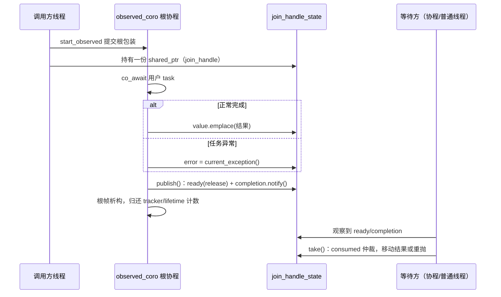
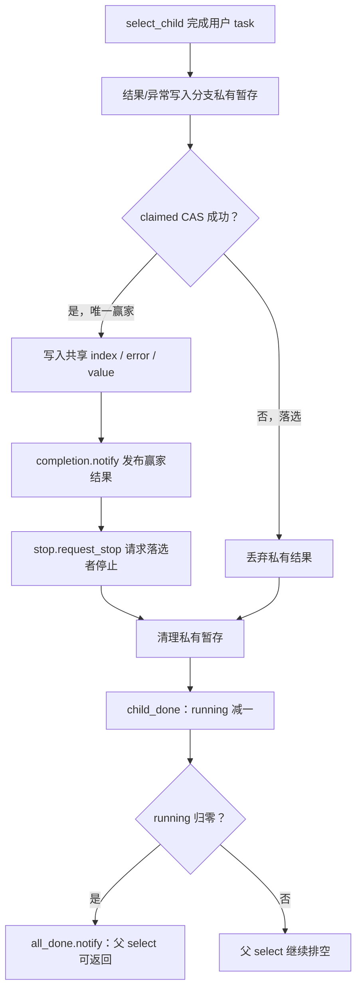

# 协程并发

并发接口把用户的惰性 `task` 包装为可独立调度的根协程，并通过结果槽、完成事件或任务计数建立明确的完成边界。本文解析任务的启动路径、结果的发布协议，以及父任务何时能够安全释放被子任务借用的状态。单个任务的帧协议与上下文恢复见[协程封装](协程封装.md)。

## 1. 架构总览

并发层解决三个结构性问题，每个问题对应一类设施：

| 问题 | 设施 | 机制 |
| --- | --- | --- |
| 惰性任务如何进入调度域 | `detached_task` 根包装 + `start_detached` | 最终挂起不保留帧的根协程协议，提交即转移所有权 |
| 结果如何跨线程发布与消费 | `join_handle_state` + `completion_event` + `ready` 原子标志 | 共享状态同时服务协程等待者与普通线程等待者 |
| 借用状态的生命周期如何界定 | `task_tracker` / `remaining` 计数 + 启动哨兵 | 计数归零才允许父帧销毁被借用的存储 |

并发组合（`join`/`select`/`scope`）不分配共享堆状态：组合状态直接保存在父组合任务的协程帧中，子根包装只借用其地址；父任务在返回前必须完成**排空**（drain）——等待全部已提交分支退出对组合状态的访问。这一设计省去了共享状态的堆分配与引用计数，其代价是组合操作具有严格的生命周期约束，而排空协议正是这一约束的实现。

## 2. 类与职责

| 类型或入口 | 源码 | 职责 |
| --- | --- | --- |
| `spawn` / `spawn_detached` | [faio.hpp](../include/faio/faio.hpp) | 立即提交任务，分别提供结果句柄或后台执行入口 |
| `join_handle<T>` | [join_handle.hpp](../include/faio/detail/coroutine/join_handle.hpp) | 移动独占的结果消费权，支持协程等待、普通线程等待和停止请求 |
| `join_handle_state<T>` | [join_handle.hpp](../include/faio/detail/coroutine/join_handle.hpp) | 在根包装与句柄之间共享结果、异常和停止源 |
| `completion_event` | [coroutine_wait.hpp](../include/faio/detail/coroutine/coroutine_wait.hpp) | 带记忆的一次性协程完成事件 |
| `task_tracker` | [task_tracker.hpp](../include/faio/detail/coroutine/task_tracker.hpp) | 计数一组根任务，普通线程通过原子等待排空 |
| `detached_task` | [root_task.hpp](../include/faio/detail/coroutine/root_task.hpp) | 根协程包装；提交后在结束时自动销毁根帧 |
| `task_lifetime_ref` | [task_lifetime_ref.hpp](../include/faio/detail/coroutine/task_lifetime_ref.hpp) | 类型擦除的根任务生命周期服务借用引用 |
| `result_slot<T>` / `block_coro` | [context.hpp](../include/faio/detail/runtime/context.hpp) | 保存阻塞入口的结果，并捕获用户任务异常 |
| `join_slot<T>` / `join_child` | [combinators.hpp](../include/faio/detail/coroutine/combinators.hpp) | 保存每个并发分支的值或异常，完成时归还组合计数 |
| `select_state` / `select_child` | [combinators.hpp](../include/faio/detail/coroutine/combinators.hpp) | 仲裁胜出分支、发布结果、请求停止并排空候选 |
| `scope_state` / `scope_child` | [scope.hpp](../include/faio/detail/coroutine/scope.hpp) | 管理结构化任务组的计数、停止和首个异常 |
| `scope_context` / `scope` | [scope.hpp](../include/faio/detail/coroutine/scope.hpp) | 向 body 提供提交入口，并等待本组孩子退出 |

## 3. 启动与等待的关系

接口分为立即提交和惰性组合两类：

| 入口 | 启动时机 | 完成边界 |
| --- | --- | --- |
| `spawn(task)` | 调用时提交根包装 | 句柄的 `co_await` / `get()` 观察用户任务结果 |
| `spawn_detached(task)` | 调用时提交根包装 | 任务组或运行时的根任务计数覆盖其生命周期 |
| `join(task...)` / `join_all(vector)` | 返回的组合任务开始执行时提交分支 | 全部已提交分支退出结果写入路径 |
| `select(task...)` | 返回的组合任务开始执行时提交候选 | 胜出结果发布，且全部已提交候选退出 |
| `scope(body)` | 返回的作用域任务开始执行时调用 body | body 结束，且本组孩子退出 |
| `block_on(task)` / `wait_all(ctx, tasks...)` | 普通线程调用时提交 | 对应 `task_tracker` 归零 |

[faio.hpp](../include/faio/faio.hpp) 中的公开入口按调用线程分流：

```cpp
template <class T>
join_handle<T> spawn(task<T> child) {
  if (auto scheduler = detail::current_scheduler())
    return join_handle<T>{detail::start_observed(
        scheduler, std::move(child), detail::current_tracker, detail::current_stop_token)};
  return runtime::detail::default_service().with_context(
      [&](runtime::detail::runtime_context& ctx) -> join_handle<T> {
        return join_handle<T>{detail::start_observed(
            ctx.scheduler(), std::move(child), nullptr, {}, ctx.task_lifetime())};
      });
}

template <class T>
void spawn_detached(task<T> child) {
  if (auto scheduler = detail::current_scheduler()) {
    detail::start_unobserved(scheduler, std::move(child), detail::current_tracker);
    return;
  }
  runtime::detail::default_service().with_context([&](runtime::detail::runtime_context& ctx) {
    detail::start_unobserved(ctx.scheduler(), std::move(child), nullptr, ctx.task_lifetime());
  });
}
```

worker 内调用时，`current_scheduler()` 非空，任务继承当前线程的任务组（`current_tracker`）与停止令牌（`current_stop_token`），归属调用者所在的组合或 `block_on` 组；普通线程调用时经默认运行时服务提交，无外层任务组（`nullptr`）、无父停止令牌，根任务计数由运行时的生命周期服务承担。显式 `runtime_context` 重载（`spawn_observed`/`submit`）将任务提交到指定运行时，并采用独立的根任务归属。

`spawn_detached` 的无观察者包装只等待并丢弃返回值：

```cpp
template <class T>
detached_task spawn_coro(task<T> child, task_tracker* tracker) {
  // 启动用户 task 前安装任务组，内部 spawn 继承这个归属。
  current_tracker = tracker;
  // 消费并等待用户 task；结果在此丢弃，但异常不能静默丢弃。
  co_await std::move(child);
}
```

用户异常逃出该根包装时，根 promise 的 `unhandled_exception()` 调用 `std::terminate()`——后台任务的失败不允许被静默吞没。需要接收失败原因的任务，应使用具有异常观察路径的入口。

## 4. 根协程提交与任务计数

### 4.1 两种帧的结束协议

独立提交的用户任务被包装在 `detached_task` 根协程中。根包装等待用户 `task`，并根据入口选择丢弃结果、写入结果槽或发布组合状态。两类帧采用不同的结束协议：

| 帧 | 最终挂起 | 清理责任 |
| --- | --- | --- |
| 用户 `task<T>` | 保留帧并对称转移到父续体 | 父 awaiter 取结果后销毁 |
| `detached_task` 根包装 | `std::suspend_never` | 根协程结束时自动销毁 |

根 promise 的完整实现：

```cpp
struct promise_type {
  // 根帧销毁时归还外层 tracker 和运行时计数，提交失败清理也走此入口。
  ~promise_type() {
    if (scope)
      scope->done();              // 先归还外层任务组的一票
    if (lifetime)
      lifetime.finish_task();     // 再归还运行时活动根任务计数
  }

  task_tracker* scope{};          // 可选外层任务计数器，只借用。
  task_lifetime_ref lifetime{};   // 独立的根任务生命周期服务。

  detached_task get_return_object() noexcept {
    return detached_task{std::coroutine_handle<promise_type>::from_promise(*this)};
  }

  // 首次挂起时：根包装保持惰性，等 start_detached 登记后才投递。
  std::suspend_always initial_suspend() const noexcept { return {}; }
  // 最终挂起时：不保留根帧，结束后自动销毁并归还任务计数。
  std::suspend_never final_suspend() const noexcept { return {}; }
  void return_void() const noexcept {}
  // 异常离开根协程体时：没有父任务接收异常，明确终止进程。
  void unhandled_exception() const noexcept { std::terminate(); }
};
```

与用户 `task_promise` 的三个关键差异：

- **`final_suspend()` 返回 `suspend_never`**：根协程没有父续体可以转移，函数体结束即由编译器销毁帧，promise 析构随之归还全部计数。用户 task 的"保留帧等父 awaiter 领取"模式在这里没有接收者。
- **`unhandled_exception()` 直接 `std::terminate()`**：同理，根协程之上没有人捕获异常。各组合器的根包装（`observed_coro`、`join_child`、`scope_child`）都在协程体内自行 `try/catch`，只有 `spawn_detached` 路径的逃逸异常会真正走到这里。
- **计数归还在析构而非协程体**：promise 析构由帧销毁触发，无论根协程正常结束、提交失败被手动销毁，都经过同一条归还路径。

`detached_task` 对象是提交前的帧持有者，移动独占；`take()` 转出句柄，`set_completion()` 在投递前绑定清理目标：

```cpp
// 投递前绑定根帧析构时的计数归还目标，必须与调用者的登记配对。
void set_completion(task_lifetime_ref lifetime, task_tracker* scope = nullptr) noexcept {
  handle_.promise().lifetime = lifetime;
  handle_.promise().scope = scope;
}
```

### 4.2 start_detached 的提交流程

```cpp
inline void start_detached(detached_task root, scheduler_ref scheduler,
                           task_tracker *scope,
                           task_lifetime_ref lifetime) {
  root.set_completion({}, scope);      // 先绑定任务组清理目标
  if (!scheduler)
    throw std::logic_error("没有可用的运行时");
  lifetime.register_task();            // 登记运行时活动根任务
  root.set_completion(lifetime, scope);
  auto handle = root.take();           // 转出根帧所有权
  try {
    scheduler.schedule(handle);        // 调度器选择本地/全局入队
  } catch (...) {
    handle.destroy();                  // promise 析构归还已登记的计数
    throw;
  }
}
```

流程的关键在于**计数登记与归还的配对**：外层任务组的一票由调用方登记、根 promise 析构归还；运行时计数由 `start_detached` 登记、同样由根 promise 析构归还。入队失败时没有执行者接管帧，当前线程负责销毁，promise 析构自动完成两条归还路径，不存在泄漏窗口。注意这里两次调用 `set_completion()`：第一次只绑定 `scope`，保证空调度器异常路径也能归还外层计数；`register_task()` 成功后才绑定 `lifetime`，避免归还未登记的计数。

`task_tracker` 表示一次调用（如 `block_on`）的任务组，`task_lifetime_ref` 表示整个运行时的根任务生命周期服务。嵌套 `co_await` 的子帧由父 awaiter 管理，不参与根任务登记；只有独立提交的根包装才进入计数。调度引用负责执行安排，生命周期引用负责排空判断——两者分离使自定义调度器可以在没有运行时生命周期服务的情况下工作。

### 4.3 task_tracker 的原子计数

```cpp
struct task_tracker {
  std::atomic<std::size_t> pending{0};
  void add() noexcept { pending.fetch_add(1, std::memory_order_relaxed); }
  void done() noexcept {
    if (pending.fetch_sub(1, std::memory_order_acq_rel) == 1)
      pending.notify_all();
  }
  void wait() const noexcept {
    for (auto n = pending.load(std::memory_order_acquire); n != 0;
         n = pending.load(std::memory_order_acquire))
      pending.wait(n, std::memory_order_acquire);
  }
};
```

登记采用 relaxed 增加（无需发布用户结果），完成采用 acq_rel 递减以汇合各任务的完成写入，最后一个完成者 `notify_all()`；普通线程 acquire 检查计数并执行 `atomic::wait()`，不靠持续自旋占用 CPU。

## 5. join_handle 的共享状态与结果消费

### 5.1 状态的所有权

`start_observed()` 构造 `join_handle_state<T>`，将一份 `shared_ptr` 交给根包装 `observed_coro()`，另一份交给返回的句柄。句柄移动转移消费权；根包装持有的那份引用保证句柄先释放时任务仍能完成。

状态的核心成员：

```cpp
template <class T> struct join_handle_state {
  std::optional<handle_value<T>> value;   // void 以 monostate 占位
  std::exception_ptr error;
  completion_event completion;            // 协程等待者的完成事件
  std::atomic<bool> ready{false};         // 普通线程的完成标志
  std::atomic<bool> consumed{false};      // 一次性消费仲裁
  std::atomic<bool> abandoned{false};     // 消费权是否已被丢弃
  std::stop_source stop_source;           // 子任务独立停止源
  std::optional<std::stop_callback<forward_stop>> parent_callback;
};
```

每个子任务持有独立的停止源；父停止令牌可取消时，在状态内登记 `forward_stop` 回调，将父请求转发到子停止源。回调仅发出协作停止请求，不销毁任务帧。

### 5.2 start_observed 与 observed_coro 的全流程

`start_observed()` 是 `spawn` 的核心提交路径，负责建立共享状态、连接父停止令牌并提交根包装：

```cpp
template <class T>
std::shared_ptr<join_handle_state<T>> start_observed(
    scheduler_ref scheduler, task<T> child, task_tracker* tracker,
    std::stop_token parent_stop,
    task_lifetime_ref lifetime = current_task_lifetime()) {
  if (!scheduler)
    throw std::logic_error("没有可用的运行时");
  // 创建跨根协程与句柄共享的结果对象；这是 spawn 的共享状态分配。
  auto state = std::make_shared<join_handle_state<T>>();
  // 父任务不可取消时跳过回调登记。
  if (parent_stop.stop_possible())
    // 父请求转发到子停止源；父已停止时构造回调会同步转发。
    state->parent_callback.emplace(parent_stop, forward_stop{&state->stop_source});
  // 先构造根帧并转移 child 所有权，尚未修改任务计数。
  auto root = observed_coro(std::move(child), state, tracker);
  // 提交前登记外层任务组，根 promise 析构负责归还。
  if (tracker)
    tracker->add();
  // 登记运行时根任务并入队，提交失败由根帧清理计数。
  start_detached(std::move(root), scheduler, tracker, lifetime);
  return state;
}
```

顺序经过刻意安排：**先**分配共享状态与构造根帧（此时任何失败都未动计数），**再**登记任务组，**最后**提交。`stop_callback` 的构造在父令牌已停止时会同步执行回调，因此在根帧创建前完成登记，子任务启动后立即可观察到该请求。`shared_ptr` 一份随 `observed_coro` 的形参进入根帧，一份交给返回的句柄——句柄先析构时状态仍存活，任务照常完成。

根包装 `observed_coro()` 的实现：

```cpp
template <class T>
detached_task observed_coro(task<T> child,
                            std::shared_ptr<join_handle_state<T>> state,
                            task_tracker* tracker) {
  // 建立当前根任务的任务组，供用户 task 及其派生任务继承。
  ::faio::detail::current_tracker = tracker;
  // 安装子任务独立停止令牌，随后 co_await 的 task 会继承它。
  ::faio::detail::current_stop_token = state->stop_source.get_token();
  try {
    if constexpr (std::is_void_v<T>) {
      co_await std::move(child);
      state->value.emplace();
    } else {
      // 等待有结果 task，结果在完成发布前写入共享状态。
      state->value.emplace(co_await std::move(child));
    }
  } catch (...) {
    // 用户异常和结果存储异常都交给句柄观察，不让根协程直接 terminate。
    state->error = std::current_exception();
  }
  // 发布已写好的结果或异常；根协程随后析构并归还任务计数。
  state->publish();
}
```

TLS 的两行安装是根包装与用户 task 之间的继承边界：用户 task 的 awaiter 发现父 promise 没有 `context` 成员时，从 `current_tracker`/`current_stop_token` 继承归属（见[协程封装](协程封装.md) 4.3 节）。`catch (...)` 同时覆盖用户任务异常和 `value.emplace` 的移动/构造异常——两条路径都以 `error` 形式发布，根协程自身永远不会带着未处理异常结束。

`publish()` 是结果对外的唯一发布点：

```cpp
void publish() {
  // release 发布 value/error，普通线程 acquire 读取 ready 后可以取结果。
  ready.store(true, std::memory_order_release);
  ready.notify_all();       // 解除普通线程的 atomic::wait 阻塞
  completion.notify();      // 恢复协程等待者
  // 若结果已无人领取且任务失败，终止进程，避免静默吞异常。
  if (abandoned.load(std::memory_order_acquire) && error)
    std::terminate();
}
```

`ready` 的 release/acquire 配对使普通线程在观察到完成后能安全读取非原子的结果槽；完成事件向协程等待者发布同一结果。句柄的完成表示用户结果已经可领取，根包装自身的析构则由运行时根任务计数另行跟踪。

结果从写入到消费的完整时序：



### 5.3 普通线程与协程的等待路径

普通线程的 `wait()` 循环 acquire 读取 `ready`，未完成时调用 `ready.wait(false)`；`get()` 等待后调用 `take()`。在 worker 上调用 `wait()` 会抛出 `std::logic_error`——阻塞调度线程会饿死当前任务所依赖的其他任务，协程必须改用 `co_await handle` 等待完成事件。

协程等待路径由 `join_handle::awaiter` 承担：

```cpp
struct awaiter {
  // 持有状态生命周期及唯一消费权，原 JoinHandle 转为为空。
  std::shared_ptr<detail::join_handle_state<T>> state;
  // 嵌入事件等待者，其节点直接保存在当前 awaiter/父协程帧内。
  ::faio::detail::completion_event::awaiter completion;

  // 先接管状态，再从该状态创建 completion awaiter；成员顺序不能颠倒。
  explicit awaiter(std::shared_ptr<detail::join_handle_state<T>> s)
      : state(std::move(s)), completion(state->completion.wait()) {}

  ~awaiter() {
    if (state)
      state->abandon();   // 未完成消费时遵守句柄放弃规则。
  }

  bool await_ready() const noexcept { return completion.await_ready(); }
  bool await_suspend(std::coroutine_handle<> h) { return completion.await_suspend(h); }
  T await_resume() { return state->take(); }
};
```

三个成员各司其职：`state` 接管消费权并延长共享状态生命周期；`completion` 是嵌入的完成事件等待者，等待节点直接位于 awaiter（也即父协程帧）内，不分配堆内存。成员声明顺序保证 `state` 先构造，`completion` 从有效的状态引用创建。`await_ready`/`await_suspend` 完整转发给完成事件——已完成则立即恢复，未完成则以 CAS 登记节点（协议见第 6 节）；`await_resume` 在恢复后领取结果。若等待的协程被销毁而结果未领取，awaiter 析构走与句柄析构相同的 `abandon()` 规则。

左值和右值 `join_handle` 都可以等待，两个 `operator co_await` 重载都用 `std::exchange(state_, {})` 把状态转移给 awaiter，原句柄随后为空——消费权随等待行为让渡，不存在"等完还能再 get 一次"的窗口。一次性消费由原子仲裁保证：

```cpp
T take() {
  // 抢占一次性消费权，重复领取时报告逻辑错误。
  if (consumed.exchange(true, std::memory_order_acq_rel))
    throw std::logic_error("JoinHandle 结果只能消费一次");
  // 在已标记 consumed 后重抛，异常被捕获也算已经观察。
  if (error)
    std::rethrow_exception(error);
  if constexpr (!std::is_void_v<T>)
    return std::move(value.value());
}
```

重抛异常同样视为完成消费。`done()` 只查询完成状态，`request_stop()` 只发出停止请求；句柄析构既不等待也不请求停止，仅通过 `abandon()` 放弃消费权。未消费句柄被丢弃后，任务失败会触发终止规则：完成先发生时由 `abandon()` 路径检查异常，放弃先发生时由 `publish()` 路径检查异常——两条路径互补，保证未观察异常恰好在一个点触发 `std::terminate()`。

## 6. completion_event 的登记与发布

完成事件服务于结果句柄和并发组合的协程等待。内部原子指针有三种含义：

| 指针状态 | 含义 |
| --- | --- |
| `nullptr` | 未完成且没有等待者 |
| 等待节点链表 | 未完成，已有协程登记 |
| `&completed_` | 永久完成标记 |

等待者先 acquire 检查完成标记。未完成时，在 `await_suspend()` 中捕获句柄与调度器，以 CAS 将帧内节点头插到链表，再调用 `node.arm()` 完成登记交接。通知入口：

```cpp
auto* nodes = waiters_.exchange(&completed_, std::memory_order_acq_rel);
if (nodes == &completed_) return; // 重复通知保持幂等
```

一次交换同时发布结果、摘除等待链并关闭后续登记。通知方反转摘出的链表，按登记顺序投递恢复；后续等待直接完成。登记与通知并发时，`wait_node` 的 `phase` 区分"登记中"和"允许异步恢复"：通知先到则 `arm()` 失败、`await_suspend()` 返回 `false`；登记先完成则通知通过保存的调度器重新入队。节点协议详见[协程同步](协程同步.md)。

完成事件不登记停止回调：并发组合在收到停止请求后，仍须等待借用其状态的孩子退出，才能释放父帧。

## 7. block_on 与任务组计数

### 7.1 阻塞入口的源码流程

`result_slot<T>` 是普通线程栈上的结果槽，只有值与异常两个成员，不带任何完成信号：

```cpp
template <class T>
struct result_slot {
  std::optional<T> value;
  std::exception_ptr exception;

  T get() {
    if (exception)
      std::rethrow_exception(exception);
    return std::move(value.value());
  }
};
// void 特化省略 value，get() 仅做异常检查。
```

根包装 `block_coro()` 负责安装任务组、执行用户任务并把结局写入槽位：

```cpp
template <class T>
detached_task block_coro(task<T> child, result_slot<T>* slot,
                         task_tracker* tracker, std::stop_token stop = {}) {
  current_tracker = tracker;
  ::faio::detail::current_stop_token = stop;
  try {
    if constexpr (std::is_void_v<T>)
      co_await std::move(child);
    else
      slot->value.emplace(co_await std::move(child));
  } catch (...) {
    slot->exception = std::current_exception();
  }
  current_tracker = nullptr;
}
```

`slot` 和 `tracker` 都由调用线程栈拥有，根协程只借用其地址——这正是 `block_on` 必须排空后才能返回的原因。结束前行尾把 `current_tracker` 清零，避免根协程退出后 TLS 仍指向已失效的栈对象。

`runtime_context::block_on()` 的完整实现：

```cpp
template <class T>
T block_on(task<T> child) {
  if (!running())
    throw std::logic_error("runtime_context 已停止");
  if (::faio::detail::on_runtime_worker())
    throw std::logic_error("不能在 worker 线程调用 block_on；请 co_await task");
  result_slot<T> slot;
  task_tracker tracker;
  tracker.add();
  auto root = block_coro(std::move(child), &slot, &tracker, stop_.get_token());
  start_detached(std::move(root), scheduler(), &tracker, task_lifetime());
  if (current_)
    current_->drive_until(tracker);   // current_thread 模式由调用线程亲自驱动
  tracker.wait();
  return slot.get();
}
```

流程分解：预登记一票（`tracker.add()`）作为提交哨兵；构造根包装并把运行时的停止令牌传给它；提交后，multi_thread 模式由 worker 池执行、`tracker.wait()` 原子等待计数归零，current_thread 模式则由 `drive_until()` 在调用线程上亲自驱动事件循环直到本组完成。计数归零意味着根帧已析构、槽位写入已汇合（acq_rel），普通线程随后读取 slot 是安全的。

`result_slot` 本身不带完成信号——它的可见性和生命周期完全由 tracker 的排空提供。这避免了冗余的完成标志：计数归零这一事件本身就是结果可读取的充分条件。

### 7.2 派生任务怎样参与同一组

用户 `task` 的 context 保存 tracker，等待恢复时重新安装 `current_tracker`。使用当前执行上下文提交的 `spawn`、`spawn_detached` 及组合分支，在提交前增加该 tracker，并让根 promise 在析构时归还。

因此主任务的函数体结束并不等于 `block_on` 立即返回：已登记到同组的独立根任务仍占有计数。嵌套 `co_await task` 由父帧等待链覆盖，不单独增加根任务计数。显式提交到指定运行时的入口使用其自身的提交归属。

`block_on` 和 `join_handle::wait()` 都拒绝在 worker 上阻塞，避免占用执行其依赖任务所需的线程。

### 7.3 wait_all 的分组方式

`wait_all(ctx, tasks...)` 为每个输入建立一个 `result_slot`，通过 `block_coro` 提交。提交阶段持有额外的 tracker 哨兵，全部提交尝试结束后归还哨兵，再等待计数归零，按输入位置收集 tuple。中途提交失败时，也先等待已提交的任务退出，再传播提交异常，保护栈上的结果槽。该入口要求输入任务具有非 `void` 结果；异构含 `void` 的协程组合由 `join` 的占位结果表达。

## 8. join 与 join_all：全部完成后收集

`join` 将异构结果槽保存在父组合帧的 tuple 中，`join_all` 为同类任务一次确定 vector 槽位数量。子根包装只借用对应槽位、计数和完成事件的地址。

### 8.1 分支根包装与启动哨兵

每个分支的根包装 `join_child()` 等待一个孩子并把结局写入自己的槽位：

```cpp
template <class T>
detached_task join_child(task<T> child, join_slot<T>* slot,
                         std::atomic<std::size_t>* remaining,
                         completion_event* completion,
                         task_tracker* scope, std::stop_token token) {
  // 安装外层任务组，分支继续 spawn 时沿用正确的计数归属。
  ::faio::detail::current_tracker = scope;
  // 安装调用方传入的停止令牌；join 不建立兄弟失败自动停止源。
  ::faio::detail::current_stop_token = token;
  try {
    if constexpr (std::is_void_v<T>) {
      co_await std::move(child);
      slot->value.emplace();
    } else {
      slot->value.emplace(co_await std::move(child));
    }
  } catch (...) {
    // 记录孩子异常或结果存储异常，不让根任务的未处理异常终止进程。
    slot->error = std::current_exception();
  }
  // acq_rel 把每个槽位的写入发布给最后一个完成者。
  if (remaining->fetch_sub(1, std::memory_order_acq_rel) == 1)
    completion->notify();
}
```

每个槽位只由对应孩子写入，因此写槽无需加锁；`fetch_sub` 的 acq_rel 序把全部分支的槽位写入汇合给最后一个完成者，再由事件 release 给父协程。归还计数是协程体的最后一个动作——`notify()` 之后父帧随时可能销毁槽位，分支从此不再访问任何借用状态。

提交侧 `launch_join_child()` 的计数登记顺序：

```cpp
template <class T>
void launch_join_child(task<T> child, join_slot<T>& slot,
                       std::atomic<std::size_t>& remaining,
                       completion_event& event) {
  auto* scope = ::faio::detail::current_tracker;
  // 先构造包装帧，借用槽位地址；分配失败时尚未增加任何计数。
  auto root = join_child(std::move(child), &slot, &remaining, &event, scope,
                         ::faio::detail::current_stop_token);
  // 投递前登记孩子，孩子在其他 worker 立即完成也不会漏计。
  remaining.fetch_add(1, std::memory_order_relaxed);
  if (scope)
    scope->add();
  try {
    start_detached(std::move(root), ::faio::detail::current_scheduler(), scope);
  } catch (...) {
    // 协程体未执行，手动归还属于 join 的分支计数。
    finish_join_child(remaining, event);
    throw;
  }
}
```

**先构造帧、再登记计数、最后投递**的顺序保证：帧构造失败时没有计数需要回滚；计数登记在投递之前，分支即使在其他 worker 上瞬间完成也不会把计数减到未登记的水平。`start_detached` 失败时根帧从未执行，`finish_join_child()` 手动归还分支计数后再向上抛——组合器随后排空已启动的分支再传播启动错误。

`join` 主体中计数从 1 开始，这一票是**启动哨兵**：

```cpp
std::tuple<detail::join_slot<Ts>...> slots;
std::atomic<std::size_t> remaining{1};   // 初始 1 是启动哨兵。
::faio::detail::completion_event completion;
std::exception_ptr launch_error;
try {
  detail::start_join(slots, remaining, completion,
                     std::index_sequence_for<Ts...>{}, std::move(children)...);
} catch (...) {
  launch_error = std::current_exception();
}
// 提交阶段结束，归还启动哨兵；没有孩子时也能正确归零。
detail::finish_join_child(remaining, completion);
co_await completion.wait();
if (launch_error)
  std::rethrow_exception(launch_error);
co_return detail::collect_join(slots, std::index_sequence_for<Ts...>{});
```

哨兵使快速完成的分支不能在其他分支尚未提交时提前发布整组完成——否则计数可能在提交中途归零，父帧被提前释放。提交阶段结束时父组合器归还哨兵；若中途提交失败，已启动的分支仍由剩余计数保护，父协程等待完成事件后才传播启动异常。哨兵与分支共用同一条 `fetch_sub == 1` 归零路径，启动失败、空输入与正常完成三种情况都收敛到同一通知点。

### 8.2 结果收集与异常顺序

父任务无论正常提交还是中途失败，都先等待完成事件。完成后，提交异常优先传播；否则 `collect_join()` 用编译期下标展开按输入位置取结果：

```cpp
template <class... Ts, std::size_t... Is>
auto collect_join(std::tuple<join_slot<Ts>...>& slots, std::index_sequence<Is...>) {
  return std::tuple<joined_value<Ts>...>{std::get<Is>(slots).take()...};
}
```

`join_slot::take()` 先重抛本分支异常再移动结果，因此按输入位置展开时遇到第一个失败槽位即抛出。结果顺序由参数或 vector 位置决定，与完成先后无关；`void` 分支保留 `std::monostate` 占位，保持 tuple 下标与输入一一对应。

分支沿用调用方的停止令牌，单个分支失败不会自动请求其他分支停止（需要取消语义时使用 `select` 或 `scope`）。空 `join` 返回空 tuple，空 `join_all` 返回空 vector。

## 9. select：仲裁、停止与排空

### 9.1 状态划分

`select_state` 保存在父组合帧中，各成员职责严格分离：

| 成员 | 职责 |
| --- | --- |
| `claimed` | 仲裁唯一胜出权；不表示结果已经写好 |
| `completion` | 胜出值或异常已经发布 |
| `running` | 已提交候选计数加一个启动哨兵；归零时发布 `all_done` |
| `all_done` | 全部分支结束状态访问，父帧可以释放被借用的存储 |
| `stop` | 候选共用的停止源，赢家或外层停止回调向它发请求 |

### 9.2 分支如何获胜

每个候选的根包装 `select_child()` 分三个阶段：执行孩子、私有暂存、CAS 仲裁：

```cpp
template <std::size_t I, class T, class State>
detached_task select_child(task<T> child, State* state, task_tracker* scope) {
  ::faio::detail::current_tracker = scope;
  // 候选任务继承本次选择的停止令牌，获胜后其他孩子可响应取消。
  ::faio::detail::current_stop_token = state->stop.get_token();
  using variant_type = typename State::variant_type;
  // 分支私有结果暂存区，仲裁前不写共享的赢家结果。
  std::optional<variant_type> value;
  std::exception_ptr error;
  try {
    if constexpr (std::is_void_v<T>) {
      co_await std::move(child);
      value.emplace(std::in_place_index<I>);
    } else {
      // 按输入下标保存；即使结果类型重复也不会歧义。
      value.emplace(std::in_place_index<I>, co_await std::move(child));
    }
  } catch (...) {
    error = std::current_exception();   // 失败同样代表完成，可以竞争胜出权。
  }
  // ... CAS 仲裁（见下） ...
  // 先销毁分支私有值/异常，用户析构也属于需要排空的分支清理。
  value.reset();
  error = {};
  // 最后归还完成计数；notify 后父帧可销毁，从此不再访问 state。
  state->child_done();
}
```

私有暂存是仲裁正确性的前提：共享的赢家槽只有一个，多个并发完成的分支若直接写共享状态会互相覆盖。各分支先把结果按编译期下标 `I` 构造进**自己帧内**的 `variant`，再以一次 CAS 决定谁把它搬进共享槽：

```cpp
bool expected = false;
// CAS 仅在尚无人胜出时成功；claimed 先置位，父协程仍须等 completion。
if (state->claimed.compare_exchange_strong(expected, true,
                                           std::memory_order_acq_rel)) {
  state->index = I;                    // 原始参数下标
  state->error = std::move(error);     // 失败分支同样可以获胜
  if (!state->error) {
    try {
      state->value.emplace(std::move(*value));
    } catch (...) {                    // 结果移动失败仍须发布
      state->error = std::current_exception();
    }
  }
  state->completion.notify();          // 发布完整结果
  state->stop.request_stop();          // 请求落选分支协作停止
}
```

源码在发布事件前完成共享结果写入；胜出权已确定后，即使值移动抛异常也必须通知等待者，避免 `claimed` 已置位却永不发布。落选分支丢弃私有结果，在清理后归还候选计数。

仲裁与排空的整体流程：



`claimed`、`completion`、`running` 三个状态严格分离：CAS 赢只代表获得写入权，结果就绪以 `completion` 为准，可以安全返回以 `all_done` 为准。父任务依次等待后两者，而不是读 `claimed` 标志。

提交侧 `launch_select_child()` 与 join 的分支提交同构：先构造帧、再 `running.fetch_add(1)` 登记、最后投递；投递失败时调用 `child_done()` 手动归还预登记计数，防止排空永久等待。

候选提交起点由每个线程、每种模板实例的游标轮转（`static thread_local std::size_t next_start`），长期运行时不会产生固定的第 0 分支偏置；提交顺序轮转不改变语义，因为返回的 `index` 始终对应原始参数位置，`variant` 也按该下标存值，包括结果类型相同的不同候选。

### 9.3 父任务的返回条件

`select` 主体的骨架：

```cpp
detail::select_state<Ts...> state_storage;   // 状态直接在父帧，无共享堆分配。
auto* state = &state_storage;
auto parent_stop = co_await this_coro::stop_token();
std::optional<std::stop_callback<detail::forward_select_stop>> parent_callback;
if (parent_stop.stop_possible())
  parent_callback.emplace(parent_stop, detail::forward_select_stop{&state->stop});
std::exception_ptr launch_error;
try {
  detail::start_select(state, std::index_sequence_for<Ts...>{}, std::move(children)...);
} catch (...) {
  launch_error = std::current_exception();
}
state->child_done();                         // 归还启动哨兵。
if (launch_error) {
  co_await state->all_done.wait();           // 启动失败也要排空再传播。
  std::rethrow_exception(launch_error);
}
co_await state->completion.wait();           // 等赢家发布完整结果。
co_await state->all_done.wait();             // 再等全部候选退出。
if (state->error)
  std::rethrow_exception(state->error);
co_return select_result<Ts...>{state->index, std::move(*state->value)};
```

正常路径依次等待 `completion` 和 `all_done`，随后返回 `select_result{index, value}` 或重抛胜出异常。父停止请求经 `forward_select_stop` 回调转发到本次选择的停止源；回调保存在父 select 帧中，覆盖启动、等待赢家和排空三个阶段。

停止是协作请求：候选只有实际结束后才归还计数。因此胜出结果已经产生时，父任务可能仍在等待其他候选退出。这一完成边界保证候选不会在 `select` 返回后继续借用父组合帧中的状态——这是 `select` 区别于"拿到第一个结果就返回"的朴素实现的关键设计。

## 10. scope：结构化任务组

`scope(body)` 将 callable 按值保存到作用域协程帧，调用 `body(scope_context&)` 并保存其结果。`scope_state` 保存本组停止源、孩子计数、完成事件和首个异常；它同时借用调度器、外层 tracker 和运行时生命周期服务。

### 10.1 body 哨兵与孩子登记

本组 `remaining` 初始为 1，代表 body。body 本身经 `start_observed` 作为独立的可观察根任务提交，安装本组停止令牌——这样孩子失败触发的停止请求可以取消正在等待中的 body，而不是仅影响后续提交的孩子。`scope` 主体的关键路径：

```cpp
auto body_task = std::invoke(body, context);
join_handle<T> body_handle{detail::start_observed(
    scheduler, std::move(body_task), state.tracker, state.stop.get_token(), state.lifetime)};
// ... co_await body_handle 并把结果暂存到 result ...
// body 执行、返回值构造或提交孩子失败时：
//   catch (...) { state.fail(std::current_exception()); }
state.done();                          // body 已退出，归还哨兵。
co_await state.completion.wait();      // 挂起等待 remaining 归零。
if (state.first_error)
  std::rethrow_exception(state.first_error);
```

注意 body 与孩子**共用本组停止源**：`start_observed` 的父令牌参数传的是 `state.stop.get_token()` 而非外层父任务的令牌，因此孩子调用 `fail()` 后，正在 `co_await` 中等待的 body 也能收到停止请求。

`scope_context::spawn()` 是孩子的唯一登记入口：

```cpp
template <class T>
void spawn(task<T> child) {
  // 先创建惰性根包装；创建失败时尚未增加计数。
  auto root = detail::scope_child(std::move(child), state_);
  // 投递之前登记孩子，防止孩子执行过快导致计数遗漏。
  state_->remaining.fetch_add(1, std::memory_order_relaxed);
  // 同时登记外层任务组，根 promise 的析构负责归还外层计数。
  if (state_->tracker)
    state_->tracker->add();
  try {
    start_detached(std::move(root), state_->scheduler, state_->tracker, state_->lifetime);
  } catch (...) {
    // 根帧未执行协程体，手动归还本 scope 的孩子计数。
    state_->done();
    throw;
  }
}
```

提交失败时计数分两边归还：外层 tracker 的一票由根帧析构负责（`start_detached` 的失败路径销毁帧），本组的一票由 `state_->done()` 手动归还。错误抛给 body，body 的异常路径再经 `fail()` 记录并等待其余孩子退出。

孩子包装 `scope_child()` 按异常类别分流：

```cpp
template <class T>
detached_task scope_child(task<T> child, scope_state* state) {
  ::faio::detail::current_tracker = state->tracker;
  ::faio::detail::current_stop_token = state->stop.get_token();
  try {
    co_await std::move(child);   // 结果在此丢弃，scope.spawn 不返回单个孩子结果。
  }
  // 区分兄弟失败导致的正常停止与未预期的独立取消。
  catch (const operation_cancelled&) {
    if (!state->stop.stop_requested())
      state->fail(std::current_exception());
  }
  catch (...) {
    state->fail(std::current_exception());
  }
  // 无论成功或已捕获的失败，都归还孩子计数；此后不再访问 state。
  state->done();
}
```

只有 `scope_context::spawn()` 提交的孩子参与本组计数；在 body 中调用普通 `faio::spawn()`，遵循该入口自身的任务组和结果句柄规则。

### 10.2 失败与停止传播

`scope_state::fail()` 与 `done()` 的实现：

```cpp
void fail(std::exception_ptr error) {
  {
    // 串行化异常记录，防止并发写入同一个 exception_ptr。
    std::lock_guard lock(error_mutex);
    // 保留首次失败原因，后续取消或异常不会覆盖它。
    if (!first_error)
      first_error = std::move(error);
  }
  // 向孩子发协作停止请求；不直接销毁孩子的协程帧。
  stop.request_stop();
}

void done() {
  // 递减并汇合各完成者的写入；旧值为 1 表示这次递减后整组归零。
  if (remaining.fetch_sub(1, std::memory_order_acq_rel) == 1)
    completion.notify();
}
```

`fail()` 在短互斥区内保存首次异常，释放锁后再请求停止——停止回调可能获取其他原语的锁，不能让它在 `error_mutex` 临界区内执行。父停止令牌也通过回调连接到本组停止源。

| 结束原因 | 作用域处理 |
| --- | --- |
| body 正常结束 | 保存结果，等待孩子退出 |
| body 抛异常 | 记录首个异常，请求孩子停止，等待排空 |
| 孩子抛普通异常 | 记录首个异常，请求其他孩子停止 |
| 孩子抛 `operation_cancelled`，本组已请求停止 | 视为本次停止的退出路径，不新增异常 |
| 孩子抛 `operation_cancelled`，本组未请求停止 | 记录为本组失败并请求停止 |

排空后传播的是首先被 `fail()` 记录的异常，后续失败不会覆盖它。

### 10.3 借用对象的生命周期

孩子借用 `scope_state`，作用域协程等待完成事件，确保孩子不再访问该状态后才退出。`scope_context` 是操作视图，不拥有状态，其使用期限限于仍存活的作用域。

应用数据同样需要覆盖孩子执行期的所有者，例如由包围 `co_await scope(...)` 的父协程帧保存共享数据。body 的局部变量随 body 结束销毁；作用域等待孩子不会延长这些局部变量的生命周期。

## 11. 各机制的完成范围

| 机制 | 完成范围 |
| --- | --- |
| `join_handle` | 一个用户任务的值或异常已发布 |
| `join` / `join_all` | 全部分支结果已写入，分支不再借用结果槽 |
| `select` | 胜出结果已发布，全部候选结束状态访问 |
| `scope` | body 结束，通过 context 提交的孩子结束状态访问 |
| `task_tracker` | 对应组内根包装完成析构 |
| 运行时根任务计数 | 该运行时全部登记根包装完成析构 |

运行时计数与这些局部完成机制共同保护调度器、线程和 I/O 资源的生命周期，详见[异步运行时](异步运行时.md)。
