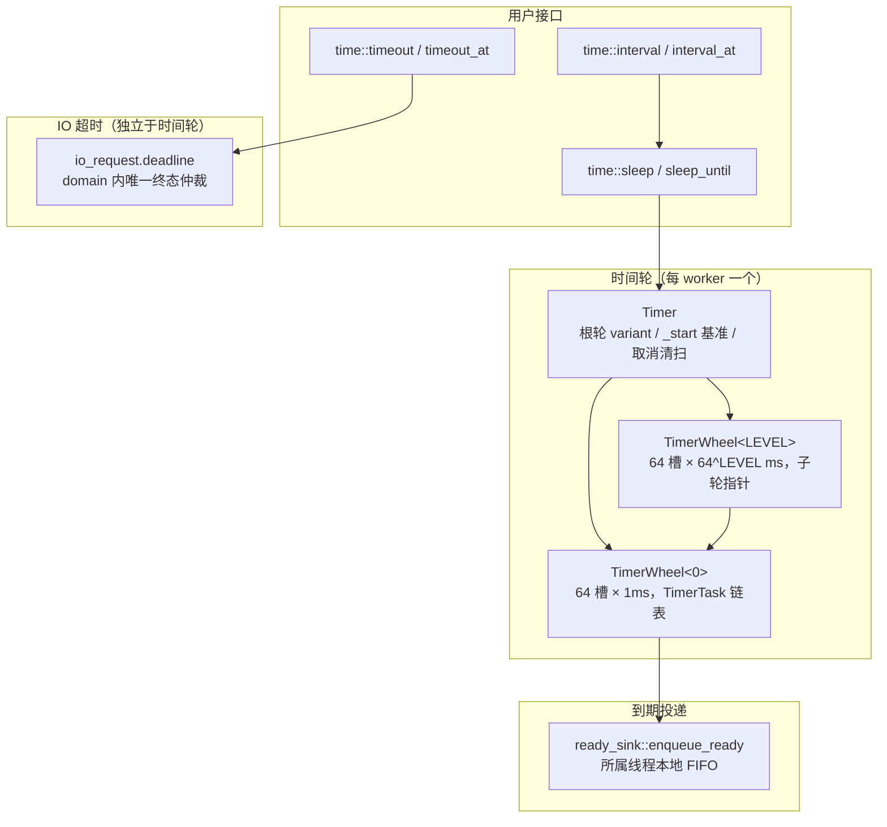
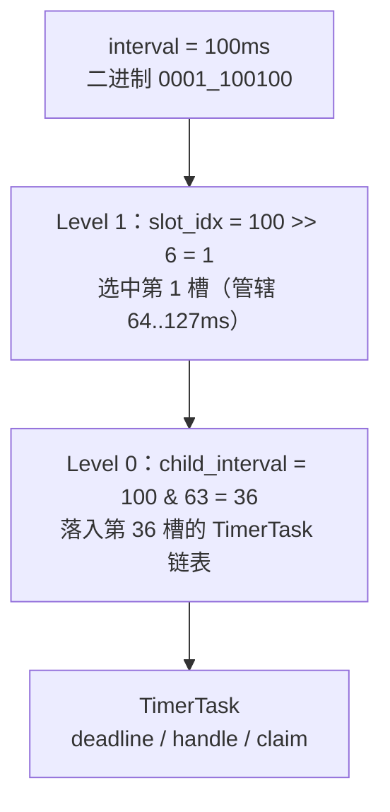

# 定时器

定时器模块由两部分组成：运行时内部的**多级时间轮**（`runtime/timer/`），以及面向用户的**时间操作接口**（`time/`：sleep、interval、timeout）。时间轮只服务于协程 sleep 这一类食物；I/O 操作的 deadline 保存在请求自身中，由中立 I/O domain 按代际 token 仲裁取消，与时间轮完全分离。本文先解析时间轮的数据结构与算法，再解析用户接口的挂起与取消协议。

## 1. 架构总览



设计要点：

- **每线程一个时间轮**：`Timer` 实例由所属 worker 的事件循环独占驱动（通过 `thread_local current_timer` 访问），插入、删除、轮询都发生在所属线程，无跨线程锁。外部线程（停止回调）只通过原子计数 `request_prune()` 请求清扫，不直接修改时间轮。
- **分层惰性扩容**：插入任务时根轮层级按该任务的跨度动态升级（level_up），任务清空后逐级降级（level_down），空轮回落为 `std::monostate`，不保留内存。
- **取消与到期的唯一恢复仲裁**：sleep 任务携带共享原子 `claim`，到期的 execute 与停止回调通过 CAS 竞争唯一恢复权，协程最多恢复一次。

## 2. 常量与层级结构

所有时间相关常量位于 [config.hpp](../include/faio/detail/runtime/common/config.hpp)：

```cpp
static inline constexpr std::size_t MAX_LEVEL{6uz};   // 时间轮最大层级
static inline constexpr std::size_t SLOT_SIZE{64uz};  // 每层槽数
static inline constexpr std::size_t SLOT_SHIFT{6uz};  // log2(64) = 6
static inline constexpr std::size_t SLOT_MASK{SLOT_SIZE - 1uz};
```

层级与跨度关系（[wheel.hpp](../include/faio/detail/runtime/timer/wheel.hpp) 中由 `util::static_pow(SLOT_SIZE, LEVEL)` 计算）：

| 层级 | 每槽含义 | 总跨度 SPAN_MS | 槽内容 |
| --- | --- | --- | --- |
| Level 0 | 1ms | 64ms | TimerTask 链表（叶子层） |
| Level 1 | 64ms（一个 Level-0 轮） | 4096ms ≈ 4s | `TimerWheel<0>` 子轮 |
| Level 2 | 4096ms | 262144ms ≈ 4.4min | `TimerWheel<1>` 子轮 |
| … | 64^LEVEL ms | 64^(LEVEL+1) ms | 递归 |

**interval** 在所有层都表示"相对 Timer 当前逻辑起点 `_start` 的毫秒数"。Timer 每次 `poll` 用 `elapsed_ms()` 推进时间并 `advance_start(elapsed)`，所以起点随之前移，interval 是相对上一次推进后的起点。`_start` 始终对应根轮第 0 个槽位的起点，不能任意改为当前时间。

层级落槽的本质是把 interval 按 6 位一段切分，高位选槽、低位递归。以 interval = 100ms 为例：



每个非叶子槽位就是一个"64^LEVEL ms 的时间桶"，桶内偏移交给子轮继续切分，直到叶子层以 1ms 粒度落槽。插入和到期扫描的复杂度都是 O(层级)，与任务总数无关。

## 3. TimerTask（定时项）

[timer/task.hpp](../include/faio/detail/runtime/timer/task.hpp) 中的 `TimerTask` 只承载 sleep 一种形态：持有协程句柄、到期时间，以及可选的取消仲裁状态。同槽多个任务通过 `_next` 以头插法串成链表。

```cpp
class TimerTask {
public:
  TimerTask(std::chrono::steady_clock::time_point deadline,
            std::coroutine_handle<> handle,
            std::shared_ptr<std::atomic<unsigned char>> claim = {})
      : _handle(handle), _deadline(deadline), _claim(std::move(claim)) {}

  template <ready_sink sink_type> void execute(sink_type &sink) {
    if (_handle != nullptr) {
      // 与停止回调竞争唯一恢复权；取消后帧可能已释放，绝不再访问句柄
      unsigned char expected = 1;
      if (!_claim || _claim->compare_exchange_strong(
                         expected, 3, std::memory_order_acq_rel))
        sink.enqueue_ready(_handle);
    }
  }

  std::coroutine_handle<> _handle{nullptr};
  std::chrono::steady_clock::time_point _deadline;
  std::unique_ptr<TimerTask> _next{nullptr};
  std::shared_ptr<std::atomic<unsigned char>> _claim;
};
```

`claim` 的状态编码：`0` 登记中、`1` 已挂起、`2` 取消获胜、`3` 到期获胜。到期执行只在 CAS 从 1 推进到 3 成功时才把句柄交给 sink；停止回调获胜（置为 2）时，execute 只销毁定时项，不再访问可能已释放的协程帧。`cancelled()` 供时间轮清扫路径识别已被取消的项。

到期任务经 `ready_sink::enqueue_ready()` 投递到所属线程的本地 FIFO——时间轮不依赖具体队列布局，这是它与调度器之间的唯一接口。

## 4. TimerWheel\<0\>（叶子层时间轮）

**职责**：64 个槽，槽 i 表示"从当前起点起第 i 毫秒"；每槽一条 TimerTask 链表。负责按 1ms 粒度落槽、扫描到期任务并执行、以及 rotate。

### 4.1 数据成员

```cpp
template <> class TimerWheel<0uz> {
  static constexpr std::size_t SPAN_MS = SLOT_SIZE; // 64ms

  std::array<std::unique_ptr<TimerTask>, SLOT_SIZE> _task_slots{};
  std::uint64_t _slot_map{0}; // 位图：第 i 位为 1 表示 _task_slots[i] 非空
};
```

`_slot_map` 用于快速跳过空槽：`handle_expired_tasks` 用 `_slot_map & (1ull << i)` 判断，`next_deadline_time` 用 `std::countr_zero(_slot_map)` 找最近非空槽。

### 4.2 落槽、移除与到期扫描

```cpp
void add_task(std::unique_ptr<TimerTask> &&task, std::size_t interval) {
  auto slot_idx = interval & SLOT_MASK; // 0..63，等价于对 64 取模
  task->_next = std::move(_task_slots[slot_idx]);
  _task_slots[slot_idx] = std::move(task);
  _slot_map |= (1ull << slot_idx);
}
```

`remove_task` 按 interval 定位槽位，遍历链表摘除目标节点；槽变空时清除对应位图位。

```cpp
template <ready_sink sink_type>
void handle_expired_tasks(sink_type &sink, std::size_t &count,
                          std::size_t remaining_ms) {
  auto slots_to_scan = std::min(remaining_ms, SLOT_SIZE);
  for (std::size_t i = 0; i < slots_to_scan; ++i) {
    if ((_slot_map & (1ull << i)) == 0) continue;
    auto task_ptr = std::move(_task_slots[i]);
    _slot_map &= ~(1ull << i);
    while (task_ptr != nullptr) {
      auto next = std::move(task_ptr->_next);
      task_ptr->execute(sink);
      ++count;
      task_ptr = std::move(next);
    }
  }
}
```

`remaining_ms` 是本层要"消耗"的时间长度。扫描槽 0 到 `remaining_ms - 1`（最多 64 槽）：每个非空槽整条链表移出，逐个 `execute()`。执行前先保存后继——`enqueue_ready` 后协程可能立即恢复并销毁关联状态。

### 4.3 取消清扫

```cpp
std::size_t prune_cancelled() {
  std::size_t removed = 0;
  for (std::size_t i = 0; i < SLOT_SIZE; ++i) {
    auto *link = &_task_slots[i];
    while (*link) {
      if ((*link)->cancelled()) {
        *link = std::move((*link)->_next);
        ++removed;
      } else {
        link = &(*link)->_next;
      }
    }
    if (!_task_slots[i])
      _slot_map &= ~(1ull << i);
  }
  return removed;
}
```

清扫只在所属 worker 的 `poll` 中、且存在取消请求时执行；非取消路径没有扫描成本。被取消的项就地摘除销毁，不再等待其自然到期。

### 4.4 rotate

```cpp
void rotate(std::size_t start) {
  if (start == 0 || start >= SLOT_SIZE) return;
  _slot_map >>= start;
  for (std::size_t i = 0; i < SLOT_SIZE - start; ++i)
    _task_slots[i] = std::move(_task_slots[i + start]);
  for (std::size_t i = SLOT_SIZE - start; i < SLOT_SIZE; ++i)
    _task_slots[i].reset();
}
```

表示"起点往前挪了 start 毫秒"：前 start 个槽已被扫描丢弃，后面槽整体前移，尾部清空。与 Timer 的 `advance_start(ms)` 配合，在每次 poll 处理完到期任务后调用。

## 5. TimerWheel\<LEVEL\>（LEVEL ≥ 1，上层时间轮）

**职责**：非叶子层。64 个槽，每槽持有一个 `TimerWheel<LEVEL-1>` 子轮；用 interval 的**高位**选槽、**低位**进子轮，实现 O(层级) 的插入与到期扫描。

### 5.1 常量与槽位计算

```cpp
template <std::size_t LEVEL> class TimerWheel {
  using child_wheel = TimerWheel<LEVEL - 1>;

  static constexpr std::size_t CHILD_SPAN_MS = util::static_pow(SLOT_SIZE, LEVEL);   // 64^LEVEL
  static constexpr std::size_t SPAN_MS       = util::static_pow(SLOT_SIZE, LEVEL + 1uz);
  static constexpr std::size_t CHILD_SHIFT   = SLOT_SHIFT * LEVEL;  // 6*LEVEL
  static constexpr std::size_t CHILD_MASK    = CHILD_SPAN_MS - 1uz;

  std::array<std::unique_ptr<child_wheel>, SLOT_SIZE> _wheels_slots{};
  std::uint64_t _slot_map{0};
};
```

- `slot_idx = interval >> CHILD_SHIFT`：等价于 interval / CHILD_SPAN_MS，表示落在"第几个 64^LEVEL ms 的桶"；
- `child_interval = interval & CHILD_MASK`：桶内偏移，交给子轮。

例如 LEVEL=1、interval=100：CHILD_SHIFT=6、CHILD_MASK=63，slot_idx=1、child_interval=36，即"第 1 个 64ms 块内的第 36ms"，子轮（Level 0）放到槽 36。

### 5.2 add_task：落槽并懒创建子轮

```cpp
void add_task(std::unique_ptr<TimerTask> &&task, std::size_t interval) {
  auto slot_idx = interval >> CHILD_SHIFT;
  if (slot_idx >= SLOT_SIZE) {
    // 超出本层跨度：记录 error 日志并钳制到最后一个槽（防御性路径，
    // 正常流程中 ensure_capacity 已保证根轮跨度足够）
    slot_idx = SLOT_SIZE - 1;
  }
  if (_wheels_slots[slot_idx] == nullptr) {
    _wheels_slots[slot_idx] = std::make_unique<child_wheel>();
    _slot_map |= (1ull << slot_idx);
  }
  auto child_interval = interval & CHILD_MASK;
  _wheels_slots[slot_idx]->add_task(std::move(task), child_interval);
}
```

子轮按需创建，空子轮在处理后释放——内存占用与实际任务数成正比。钳制分支理论上不可达：`Timer::ensure_capacity` 在落槽前已把根轮升到能容纳该 interval 的层级，这里的防御只为掩盖调用方绕过 Timer 直接操作轮时的错误。

### 5.3 handle_expired_tasks：整槽 + 部分槽

```cpp
auto full_slots = remaining_ms >> CHILD_SHIFT;      // 完整经过几个子轮跨度
auto partial_remaining = remaining_ms & CHILD_MASK; // 最后不足一整段的部分

for (std::size_t i = 0; i < full_slots && i < SLOT_SIZE; ++i) {
  if ((_slot_map & (1ull << i)) == 0) continue;
  _wheels_slots[i]->handle_expired_tasks(sink, count, child_wheel::SPAN_MS);
  _wheels_slots[i].reset();          // 整轮处理完即释放
  _slot_map &= ~(1ull << i);
}
if (partial_remaining > 0 && full_slots < SLOT_SIZE) {
  if ((_slot_map & (1ull << full_slots)) != 0) {
    _wheels_slots[full_slots]->handle_expired_tasks(sink, count, partial_remaining);
    if (_wheels_slots[full_slots]->empty()) { /* 释放并清位图 */ }
  }
}
```

`full_slots` 内的子轮**整轮**处理（传入 `child_wheel::SPAN_MS`）；第 `full_slots` 个槽只处理 `partial_remaining` 的部分到期，子轮未空则保留。例如 LEVEL=1、remaining_ms=200：full_slots=3、partial_remaining=8，前 3 个槽各处理 64ms，第 4 个槽只处理 8ms。

### 5.4 rotate、level_up、level_down

**rotate(start)** 按子轮个数推进，结构与叶子层一致，只是槽位内容从任务链表换成子轮指针：

```cpp
void rotate(std::size_t start) {
  if (start == 0 || start >= SLOT_SIZE) return;
  _slot_map >>= start;                                   // 位图右移
  for (std::size_t i = 0; i < SLOT_SIZE - start; ++i)
    _wheels_slots[i] = std::move(_wheels_slots[i + start]); // 槽数组前移
  for (std::size_t i = SLOT_SIZE - start; i < SLOT_SIZE; ++i)
    _wheels_slots[i].reset();                            // 清空尾部
}
```

前 start 个槽已被上层扫描完毕直接丢弃，后面槽整体前移，表示时间推进了 start 个子轮跨度。被前移的子轮内部坐标不需要任何调整——它们的 interval 语义本来就只与自己父槽的相对位置有关。

**level_up / level_down** 是层级惰性扩缩的一对逆操作：

```cpp
// 当前轮作为父层第 0 槽的子轮，仅 LEVEL < MAX_LEVEL 可用。
auto level_up(std::unique_ptr<TimerWheel>&& me) -> std::unique_ptr<TimerWheel<LEVEL + 1>>
  requires(LEVEL < MAX_LEVEL) {
  return std::make_unique<TimerWheel<LEVEL + 1>>(std::move(me));
}

// 取出第 0 槽子轮并返回。
auto level_down() -> child_wheel_ptr {
  if (_wheels_slots[0] == nullptr)
    return nullptr;
  auto child = std::move(_wheels_slots[0]);
  _slot_map &= ~1ull;
  return child;
}

// 只有第 0 个槽位可能非空，其余槽位必须全空。
auto can_level_down() const noexcept -> bool {
  return (_slot_map & ~1ull) == 0;
}
```

升级不动已有任务的任何槽位：旧轮整体挂进新轮第 0 槽（升级构造函数直接置 `_slot_map = 1`），因为"第 0 个子轮跨度"在原坐标系中正好覆盖旧轮的全部区间。降级要求 `can_level_down()`——只有第 0 槽可能非空时，整轮的存活任务全部位于该子轮的坐标系内，取出子轮后 interval 语义无缝衔接。这也是 `advance_start` 只能按完整子轮跨度旋转高层轮的原因：只有完整跨度的推进才能保持"非 0 槽已空"这一降级前提。

## 6. Timer（定时器管理器）

**职责**：每个 worker 持有一个 `Timer`（经 `thread_local current_timer` 访问）。内部用 `std::variant` 存根时间轮（`monostate` 或 `TimerWheel<0>` 至 `TimerWheel<MAX_LEVEL>` 的 `unique_ptr`），维护基准时间 `_start`、任务数 `_num_entries` 和取消请求计数 `_cancel_requests`。

### 6.1 add_task 与基准重建

```cpp
void add_task_impl(std::unique_ptr<TimerTask> &&task) {
  // 空轮没有旧任务约束，重新建立基准，避免长时间空闲扩大层级
  if (_num_entries == 0) {
    _start = std::chrono::steady_clock::now();
    _root_wheel = std::monostate{};
  }
  // 活跃轮必须按旧根起点计算绝对槽位；已过期任务 interval 取 0
  auto interval_ms = to_ms(task->_deadline - _start);
  ensure_capacity(interval_ms);
  std::visit([&](auto &wheel_ptr) { /* wheel_ptr->add_task(...) */ }, _root_wheel);
  ++_num_entries;
}
```

`ensure_capacity` 在根轮跨度不足时递归 level_up：原根轮成为新根轮第 0 槽的子轮，直到能容纳 interval。`add_task` 返回裸指针供后续 `remove_task` 使用，所有权在时间轮内。

### 6.2 poll：清扫、到期处理与推进

```cpp
template <ready_sink sink_type> auto poll(sink_type &sink) -> std::size_t {
  // 仅存在取消请求时清扫；空轮询不对取消计数执行原子 RMW
  if (_cancel_requests.load(std::memory_order_acquire) != 0 &&
      _cancel_requests.exchange(0, std::memory_order_acq_rel) != 0) {
    std::size_t removed = /* 根轮 prune_cancelled() */;
    _num_entries -= std::min(_num_entries, removed);
    if (removed) try_level_down();
  }
  if (_num_entries == 0) return 0;
  auto elapsed = elapsed_ms();
  if (elapsed == 0) return 0;

  std::size_t count = 0;
  std::visit([&](auto &wheel_ptr) {
    /* wheel_ptr->handle_expired_tasks(sink, count, elapsed) */
  }, _root_wheel);

  advance_start(elapsed); // 无论是否处理了任务，都推进起点
  if (count > 0) {
    _num_entries -= std::min(_num_entries, count);
    try_level_down();
  }
  return count;
}
```

`advance_start(elapsed)` 对根轮做 rotate 并前移 `_start`。高层轮只能旋转完整子轮跨度：部分子轮已扫描的前缀保持为空，但其内部剩余任务的索引仍以原子轮起点为基准，不能减掉部分跨度：

```cpp
if constexpr (std::is_same_v<WheelType, TimerWheel<0uz>>) {
  wheel_ptr->rotate(ms);
  _start += std::chrono::milliseconds(ms);
} else {
  auto slots_to_rotate = ms >> WheelType::CHILD_SHIFT; // 向下取整到完整子轮
  if (slots_to_rotate > 0) {
    wheel_ptr->rotate(slots_to_rotate);
    _start += std::chrono::milliseconds(slots_to_rotate << WheelType::CHILD_SHIFT);
  }
}
```

### 6.3 next_deadline_ms 与 remove_task

**next_deadline_ms()** 把轮内坐标换算回"距现在的毫秒数"，供事件循环与 I/O deadline 合并计算底层等待时限（见[异步运行时](异步运行时.md)）：

```cpp
auto next_deadline_ms() const noexcept -> std::size_t {
  if (_num_entries == 0)
    return std::numeric_limits<std::size_t>::max();
  std::size_t expected = std::numeric_limits<std::size_t>::max();
  std::visit([&](const auto& wheel_ptr) {
    // ... 跳过 monostate 与空指针
    auto deadline_from_start = wheel_ptr->next_deadline_time(); // 相对起点
    auto elapsed = elapsed_ms();
    if (deadline_from_start > elapsed)
      expected = deadline_from_start - elapsed;
    else
      expected = 0;                    // 已经到期：立即再 poll 一次
  }, _root_wheel);
  return expected;
}
```

轮内 `next_deadline_time()` 返回的是相对 `_start` 的偏移，这里减去已经流逝的 `elapsed`；若偏移已被时间追上则钳到 0，事件循环因此不会睡过一个本应立刻处理的任务。

**remove_task(task)** 处理显式摘除：任务已过期（`deadline <= now`）时直接返回，由下一次 poll 统一处理；否则按 `deadline - _start` 计算 interval 并 visit 根轮递归摘除，递减 `_num_entries` 后尝试降级。注意 interval 必须相对根轮起点而不是当前时刻——减去 elapsed 会把任务定位到错误的槽位。

**try_level_down()** 是空轮回收的入口：

```cpp
void try_level_down() {
  auto idx = _root_wheel.index();
  // monostate (idx==0) 或 TimerWheel<0> (idx==1) 不需要降级
  if (idx <= 1) {
    if (idx == 1) {
      auto& wheel_ptr = std::get<1>(_root_wheel);
      if (wheel_ptr && wheel_ptr->empty()) {
        wheel_ptr.reset();
        _root_wheel = std::monostate{};   // 空叶子轮回落，不保留内存
      }
    }
    return;
  }
  level_down_dispatch();                  // LEVEL >= 1：编译期分发降级
}
```

`level_down_dispatch()` 对 `LEVEL >= 1` 的各档做编译期分发：轮为空则直接回落 `monostate`；否则满足 `can_level_down()` 时取出第 0 槽子轮替换根轮，并**递归**调用 `try_level_down()`——一次任务清空可能让多级嵌套轮同时满足降级条件，递归保证一次降到底。升降级在 variant 索引与编译期 `LEVEL` 之间建立映射（索引 0 是 `monostate`，索引 `LEVEL + 1` 对应 `TimerWheel<LEVEL>`），避免为每个层级手写重复代码。

### 6.4 跨线程取消请求

停止回调可能来自任意线程，不能直接修改时间轮。`request_prune()` 只做一次原子递增：

```cpp
void request_prune() noexcept {
  _cancel_requests.fetch_add(1, std::memory_order_release);
}
```

所属 worker 在下一次 `poll` 中领取请求并执行清扫。取消请求只记录"存在请求"这一事实，不携带具体任务身份——清扫路径按 `claim` 状态识别取消项。

## 7. Sleep：可取消的协程睡眠

[time/sleep.hpp](../include/faio/detail/time/sleep.hpp) 的 `Sleep` 是可 `co_await` 的 awaiter。用户经 `faio::time::sleep(duration)` 或 `sleep_until(time_point)` 获得包装了 deadline 的 Sleep。

### 7.1 挂起协议与取消仲裁

```cpp
auto await_suspend(std::coroutine_handle<> handle) -> bool {
  auto token = ::faio::detail::current_stop_token;
  if (!token.stop_possible()) {
    runtime::detail::timer::current_timer->add_task(_deadline, handle);
    return true; // 不可取消的快路径：无 claim 分配
  }
  if (token.stop_requested()) {
    _cancelled_immediate = true;
    return false;
  }
  _claim = std::make_shared<std::atomic<unsigned char>>(0);
  auto *timer = runtime::detail::timer::current_timer;
  _callback.emplace(token, cancel_callback{_claim, timer, handle,
                                           ::faio::detail::current_scheduler()});
  timer->add_task(_deadline, handle, _claim);
  unsigned char expected = 0;
  if (_claim->compare_exchange_strong(expected, 1, std::memory_order_acq_rel))
    return true;
  timer->request_prune(); // 登记期间已收到 stop，请尽快清扫新增的项
  return false;
}
```

不可取消的任务走无分配快路径。可取消路径中，`claim` 状态机协调三方竞态：

| claim | 含义 | 获胜方行为 |
| --- | --- | --- |
| 0 → 1 | 登记完成，协程挂起 | — |
| → 2 | 停止回调获胜 | 已挂起时请求清扫并经保存的调度器恢复协程 |
| → 3 | 到期 execute 获胜 | 将句柄交给 ready_sink |

停止回调的本体是这场仲裁的另一方，它可能运行在任意线程：

```cpp
void operator()() const noexcept {
  unsigned char state = claim->load(std::memory_order_acquire);
  while (state <= 1) {
    if (claim->compare_exchange_weak(state, 2, std::memory_order_acq_rel)) {
      if (state == 1) {
        timer->request_prune();      // 请所属 worker 尽快清扫该定时项
        scheduler.schedule(handle);  // 恢复投递回登记时的调度域
      }
      return;
    }
  }
}
```

循环 CAS 覆盖两种旧值：旧值为 0（`await_suspend` 还在登记途中）时只改状态不调度，由登记方的 CAS 失败兜底直接继续；旧值为 1（协程已挂起）时回调负责恢复。若 CAS 观察到 3（到期已获胜）则直接放弃——定时项的 `execute` 已经取得唯一恢复权。回调里保存的 `scheduler` 是登记时刻的快照，跨线程取消也能把恢复投递回正确运行时；`request_prune()` 只触发清扫请求，时间轮本身的修改仍由所属 worker 在 `poll` 中完成。

停止请求在登记完成前到达时，`await_suspend` 返回 `false`，当前执行流直接继续——与 `wait_node` 的 arm 协议同构。`await_resume()` 检查取消状态并抛出 `operation_cancelled`：

```cpp
auto await_resume() const -> void {
  if (_cancelled_immediate ||
      (_claim && _claim->load(std::memory_order_acquire) == 2))
    throw operation_cancelled{};
}
```

落选的 `select` 分支因此不会继续执行 sleep 之后的用户代码。

## 8. Interval：周期 tick

[time/interval.hpp](../include/faio/detail/time/interval.hpp) 的 `Interval` 按固定周期产生 tick。每次 `co_await tick()` 挂起到下一个 tick 时间点；`MissedTickBehavior` 控制错过多次 tick 时的行为。

```cpp
auto tick() noexcept -> Sleep {
  auto expired_time = _deadline;
  _deadline = next_timeout();
  return Sleep{expired_time};
}
```

`tick()` 返回以当前 `_deadline` 为到期时间的 Sleep，再按策略预计算下一次 tick。三种策略：

```cpp
switch (_behavior) {
case MissedTickBehavior::Burst:
  return _deadline + _period;          // 追补：可能很快再次到期
case MissedTickBehavior::Delay:
  return now + _period;                // 从当前时间重新计一个周期
case MissedTickBehavior::Skip: {
  if (_deadline >= now) return _deadline + _period;
  auto skip = (now - _deadline).count() / _period.count() + 1;
  return _deadline + std::chrono::nanoseconds{skip * _period.count()}; // 对齐下一自然周期点
}
}
```

- **Burst**：下次 deadline 总是 `_deadline + period`，错过的 tick 连续补发直到追上节奏；
- **Delay**：不追历史，从 `now + period` 重新开始；
- **Skip**：计算错过的完整周期数，跳到 `_deadline + skip * period`，保持与原周期网格对齐。

reset 系列：`reset()` 下一个 tick 在 `now + period`；`reset_immediately()` 下一次 tick 立即到期；`reset_after(after)` / `reset_at(deadline)` 按相对或绝对时间设置下一个 tick。

## 9. Timeout：I/O 操作的超时

I/O 超时**不经过时间轮**。deadline 保存在等待者的完整或紧凑请求参数中（经 `set_timeout` / `set_timeout_at` 设置），异步提交时移入稳定请求。所属 I/O domain 在唯一终态仲裁中与完成、取消、关闭统一处理；到期产生 `ETIMEDOUT`，并遵守借用内存的排空规则（见[异步IO](异步IO.md)）。

[time/timeout.hpp](../include/faio/detail/time/timeout.hpp) 的 `Timeout<T>` 本体非常薄——它只是按值移动拥有操作类型 `T` 的一个公开继承壳：

```cpp
template <class T>
  requires io::detail::io_registrant_operation<T> && std::same_as<T, std::remove_cvref_t<T>>
class Timeout : public T {
 public:
  explicit Timeout(T&& operation) noexcept(std::is_nothrow_move_constructible_v<T>)
      : T(std::move(operation)) {}
};
```

公开继承让包装直接复用 `T` 的全部等待行为（awaiter 接口、提交与终态仲裁），超时配置已在构造前写入请求参数，包装本身不引入任何新的状态。`T` 必须是不含 cv/ref 的 `io_registrant_operation`；该约束通过精确的公共基类别名识别完整和紧凑两种请求策略。头文件直接包含唯一的桥定义，可以独立包含。

`faio::time::timeout(operation, duration)` 与 `timeout_at(operation, deadline)` 完美转发到等待者的配置方法。右值返回拥有型操作值，左值返回原操作的引用，不复制不可复制的等待者，也不返回指向临时对象的右值引用；const 操作不满足可配置约束。相对 deadline 从调用配置接口时计算，移动或推迟到 `co_await` 不会重新计时。

```cpp
auto operation = faio::time::timeout(socket.recv(buffer), 100ms);
// operation 拥有请求；配置时不提交 IO，等待时才取得稳定槽并提交。
auto result = co_await operation;

auto named = socket.recv(buffer);
auto &same = faio::time::timeout_at(named, deadline);
// same 与 named 是同一对象，必须在等待排空以前保持其生命周期。
auto next = co_await same;
```

文件高层 task 等不具备 `set_timeout` 的操作，可使用结构化取消或 `select` 组合 sleep 实现等价超时。
