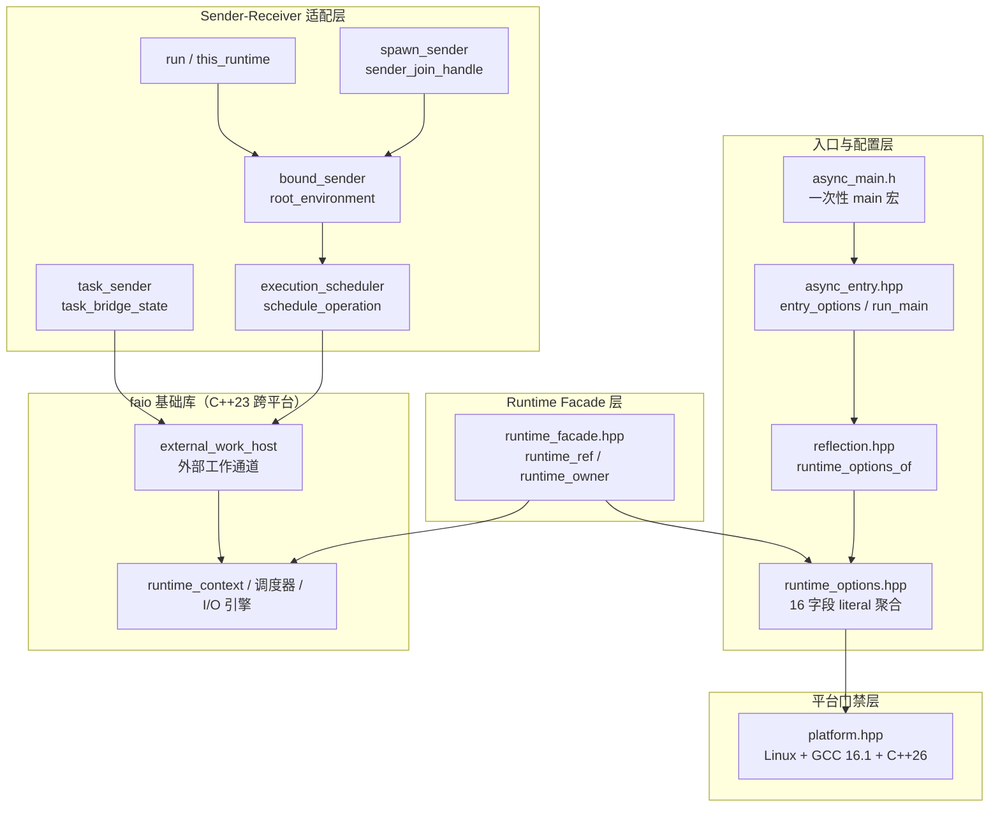
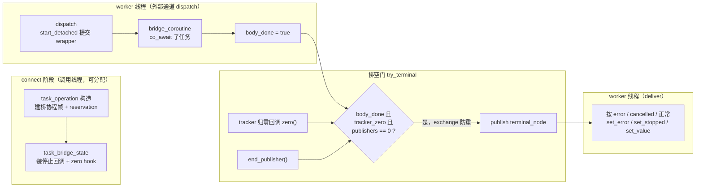

# 实验性特性

faio 的实验性特性位于 `include/faio/experimental/` 与 `include/faio/detail/experimental/`，围绕两个前沿方向探索 faio 的演进形态：

- **编译期配置与异步入口**：基于 C++26 静态反射（P2996）与注解（P3394），把运行时配置写成函数上的 `[[=faio::experimental::runtime_options{...}]]` 注解，并用 `[[=faio::experimental::main(app)]]` 把 `faio::task<int>` 协程直接声明为程序入口，由库生成真正的 `main`。
- **Sender/Receiver 互操作**：基于固定版本的 stdexec（P2300 参考实现），把 faio 运行时包装为标准 `stdexec::scheduler`，把 `faio::task<T>` 包装为 sender，使 faio 协程与 stdexec 算法（`starts_on`、`schedule`、`exec::task` 等）可以无缝组合。

实验性特性有独立的平台门禁：仅支持 Linux + GCC 16.1.x + libstdc++ 16 + C++26。faio 基础库不受影响，仍保持 C++23 跨平台（Linux / macOS / Windows）。两层代码互不耦合——不启用实验性开关时，实验性头文件不参与任何编译。

## 1. 架构总览

实验性特性分四层组织，自底向上依次是平台门禁、配置与反射、运行时门面、Sender/Receiver 适配：



四个设计要点贯穿始终：

1. **复用而非重建**。Sender 适配层不创建独立线程池或事件循环；`execution_scheduler::schedule()` 把执行节点投递进运行时既有的**外部工作通道**（external work lane，机制见[异步运行时](异步运行时.md)），I/O、定时器、阻塞池与 faio 原生协程共用同一个宿主。
2. **协程帧与后端解耦**。`task_bridge_body` 只依赖 faio 的结果类型 `T`，不依赖任何 receiver 类型，因此包装协程的帧类型稳定，receiver 侧可以是 stdexec 实现内部的 lambda 类型。
3. **完成交付走排空门（drain gate）**。task→sender 桥只有在"子任务计数归零 + 桥体完成 + 发布者归零"三者齐备后才向 receiver 投递结果，与外部工作通道的四相位生命周期对齐。
4. **配置错误编译期暴露**。运行时选项经 `consteval`/`constexpr` 校验，非法取值（如 `current_thread` 模式配多个 worker）在编译期直接报错，而不是运行期静默回退。

公开入口是 5 个纯转发头文件，真正的实现全部在 `detail/experimental/`：

| 公开头文件 | 转发目标 | 提供的名字 |
| --- | --- | --- |
| `faio/experimental/runtime_options.h` | `detail/experimental/runtime_options.hpp` | `runtime_options`、`entry_exit_policy`、`io_backend_option` |
| `faio/experimental/reflection.h` | `detail/experimental/reflection.hpp` | `runtime_options_of<Entity>()` |
| `faio/experimental/async_main.h` | `detail/experimental/async_entry_macro.hpp` | `main` 注解、一次性 `main` 宏 |
| `faio/experimental/runtime.h` | `detail/experimental/runtime_facade.hpp` | `runtime_ref`、`current_thread_runtime`、`multi_thread_runtime`、`this_runtime()` |
| `faio/experimental/execution.h` | `detail/experimental/execution/` 全部 | `execution_scheduler`、`run` / `bind` / `spawn_sender` / `as_sender`、`sender_join_handle` |

`detail/experimental/` 内部各头文件的职责：

| 文件 | 职责 |
| --- | --- |
| `platform.hpp` | 平台/编译器/标准库/C++ 标准的硬性版本门禁，定义两个能力宏的默认值 |
| `runtime_options.hpp` | 16 字段 `runtime_options` literal 聚合、结构性 `io_backend_option`、`validate_options` 与 `to_runtime_config` |
| `reflection.hpp` | `runtime_options_of<Entity>()`：编译期读取并校验实体上的 `runtime_options` 注解 |
| `async_entry.hpp` | `main` marker 注解对象、`entry_options<Entity>` 反射校验、`run_main<Entity>` 入口运行器 |
| `async_entry_macro.hpp` | 把 `main` 临时定义为一次性函数宏，展开生成入口前置声明与普通 `main` 包装 |
| `runtime_facade.hpp` | `runtime_ref` 借用视图与两个 runtime owner（current/multi_thread），`this_runtime()` 声明 |
| `execution/backend.hpp` | 引入 `<stdexec/execution.hpp>`，定义满足 `callback_type` 要求的最小 `root_stop_token` 包装 |
| `execution/scheduler.hpp` | `execution_scheduler<Mode>`（stdexec scheduler）、`schedule_operation`、root 解析逻辑 |
| `execution/environment.hpp` | `root_environment`（向下游暴露 scheduler/stop token/external root 的 env）与 `request_root_stop` |
| `execution/bind_sender.hpp` | `bound_sender`/`bound_operation`：connect 阶段取得独立 root、顶层 reservation 与停止连接；`runtime_bound_*` 按运行期 mode 类型擦除分发 |
| `execution/run.hpp` | `runtime_ref::run`（同步驱动直到 done 且 root drained）、`result_receiver`、`this_runtime()` 实现 |
| `execution/task_sender.hpp` | `as_sender` 的 task→sender 桥：`task_bridge_state`、`bridge_coroutine`、`task_operation` |
| `execution/sender_join_handle.hpp` | `submitted_graph` 生命周期状态机与右值单次消费的 `sender_join_handle` |
| `execution/spawn_sender.hpp` | `runtime_ref::spawn_sender`：提交后返回 join handle，持图到 drained |
| `execution/default_runtime.hpp` | `with_default_runtime`：在默认运行时的受控访问内回调 |

## 2. 平台门禁与构建

### 2.1 硬性版本门禁

`platform.hpp:6-17` 用预处理错误把实验性特性锁死在唯一的已验证工具链组合上，任何不满足的环境在编译第一行实验性头文件时即得到明确诊断：

```cpp
#if !defined(__linux__)
#error "faio experimental: Linux is required"
#endif
#if defined(__clang__) || !defined(__GNUC__) || __GNUC__ != 16 || __GNUC_MINOR__ != 1
#error "faio experimental: GCC 16.1.x is required"
#endif
#if !defined(_GLIBCXX_RELEASE) || _GLIBCXX_RELEASE != 16
#error "faio experimental: matching libstdc++ 16 is required"
#endif
#if __cplusplus <= 202302L
#error "faio experimental: C++26 is required"
#endif
```

门禁如此严格的原因：静态反射（`<meta>`、`^^`、`[: :]` 拼接）与注解目前只有 GCC 16.1 的 `-freflection` 实现覆盖 P2996/P3394 的所需子集，而 stdexec 的 sender 合同又依赖 C++26 标准库设施。两个能力宏 `FAIO_EXPERIMENTAL_HAS_REFLECTION` / `FAIO_EXPERIMENTAL_HAS_EXECUTION` 在此默认置 0（platform.hpp:19-24），由 CMake 目标按需置 1——头文件据此区分"仅运行时门面"与"完整反射/execution 能力"两种消费方式。

### 2.2 CMake 开关与目标

`cmake/FaioExperimental.cmake:17-20` 提供四个开关：

| 开关 | 默认 | 作用 |
| --- | --- | --- |
| `FAIO_ENABLE_EXPERIMENTAL` | OFF（实验镜像经环境变量默认 ON） | 总开关，关闭时整个模块不参与配置 |
| `FAIO_EXPERIMENTAL_REFLECTION` | ON | 生成 `faio::experimental_reflection` 目标 |
| `FAIO_EXPERIMENTAL_EXECUTION` | ON | 生成 `faio::experimental_execution` 目标 |
| `FAIO_EXPERIMENTAL_ENTRY_MODE` | `NORMAL` | 示例/测试的入口组织方式，`ASYNC` 要求反射开启 |

开启后生成三个 INTERFACE 目标，职责逐层递进（FaioExperimental.cmake:41-69）：

- `faio::experimental_runtime`：传递 `cxx_std_26` 并链接 `faio::faio`；
- `faio::experimental_reflection`：追加 `-freflection` 编译选项与 `FAIO_EXPERIMENTAL_HAS_REFLECTION=1`；
- `faio::experimental_execution`：追加 `FAIO_EXPERIMENTAL_HAS_EXECUTION=1` 并链接 stdexec 头文件目标。

stdexec 锁定在固定版本（commit `6d7ad689f4d4831c5136e4abe1c601f9a3b64e43`，记录于 `scripts/experimental_dependencies.lock.json`），由 `scripts/bootstrap_experimental_deps.py` 显式获取——与主库一致，CMake 配置期不联网下载。`CMakePresets.json` 提供 `linux-gcc16.1-experimental-{epoll,dual,asan,tsan}` 四个预设，编译器固定为 `/opt/gcc-16.1/usr/bin/g++`。

## 3. runtime_options：可注解的编译期配置

### 3.1 结构性约束与 io_backend_option

GCC 的反射注解要求注解值是**结构型（structural）**的：所有成员公有且类型本身结构型。`std::optional` 含私有状态，不能直接出现在注解值里，因此 `runtime_options.hpp:21-46` 用一个公有成员的 literal 类型 `io_backend_option` 复刻 optional 语义：

```cpp
struct io_backend_option {
  bool present{};
  faio::runtime::io_backend stored{faio::runtime::io_backend::IO_EPOLL};
  constexpr io_backend_option() noexcept = default;
  constexpr io_backend_option(std::nullopt_t) noexcept {}
  constexpr io_backend_option(faio::runtime::io_backend value) noexcept : present(true), stored(value) {}
  constexpr io_backend_option(std::optional<faio::runtime::io_backend> value) noexcept
      : present(value.has_value()), stored(value.value_or(faio::runtime::io_backend::IO_EPOLL)) {}
  constexpr explicit operator bool() const noexcept { return present; }
  // ... value()/value_or()/reset()/operator==，以及与 std::optional 的双向转换
};
```

它同时提供与 `std::optional<io_backend>` 的双向 constexpr 转换，因此对内可以无缝交给主库的配置结构，对外保持结构型。这是"编译期反射可消费"与"运行期配置可用"两个世界的适配器。

### 3.2 配置聚合与两级校验

`runtime_options`（runtime_options.hpp:48-65）是 16 字段的 literal 聚合，字段与主库 `faio::runtime::config` 一一对应（模式、worker 数、I/O 间隔、全局队列间隔、空闲自旋、事件批大小、阻塞池与文件/解析服务的线程与队列上限、I/O 后端、入口退出策略）。校验分两级：

- `validate_options`（runtime_options.hpp:103-133）是 `constexpr` 纯函数，逐项检查枚举取值、非零约束、`std::chrono` 表示范围，以及"选择了 io_uring 但构建未启用"这类能力与请求不匹配的情形，返回 `options_error` 枚举；
- `to_runtime_config`（runtime_options.hpp:135-158）先跑校验（失败抛 `std::invalid_argument` 并带逐字段错误消息），再转换成主库 `runtime_config`，最后经主库的 `validate_config` 复核。

因为 `validate_options` 是 constexpr，它既能在注解消费路径上于**编译期**执行（consteval 语境中抛出即编译错误），也能在 owner 构造路径上于运行期执行，同一套规则服务两种入口。

### 3.3 反射读取

`reflection.hpp:19-26` 的 `runtime_options_of<Entity>()` 展示反射消费注解的最小骨架：

```cpp
template <std::meta::info Entity>
consteval runtime_options runtime_options_of() {
  const auto annotations = std::meta::annotations_of_with_type(Entity, ^^runtime_options);
  if (annotations.size() > 1)
    throw "faio experimental: duplicate runtime_options";
  return detail::checked_annotation(annotations.empty() ? runtime_options{}
      : std::meta::extract<runtime_options>(annotations.front()));
}
```

`annotations_of_with_type(Entity, ^^runtime_options)` 取回实体上全部 `runtime_options` 类型注解的反射句柄；`std::meta::extract<runtime_options>` 把注解值编译期物化为对象；重复注解直接以 consteval 抛出变成编译错误；无注解则给默认值。`checked_annotation` 在此复用上一节的 `validate_options`，使非法配置在编译期即终止构建。

## 4. async_main：注解声明的异步入口

### 4.1 一次性 main 宏

入口写法的全部秘密在 `async_entry_macro.hpp:12-21`：

```cpp
#pragma push_macro("main")
#define main(entry_name)                                                       \
  _Pragma("pop_macro(\"main\")") main]]                                         \
  faio::task<int> entry_name(int, char**);                                       \
  int main(int faio_argc, char** faio_argv) {                                    \
    return faio::experimental::detail::run_main<                                \
        faio::experimental::detail::entry_function_of(::entry_name)>(           \
        faio_argc, faio_argv);                                                  \
  }                                                                            \
  [[maybe_unused
```

用户写下的代码：

```cpp
[[=faio::experimental::main(async_main)]]
[[=faio::experimental::runtime_options{.mode = faio::runtime::mode::multi_thread, .workers = 4}]]
faio::task<int> async_main(int, char**) {
  // ... 协程入口体
}
```

注解参数列表中的 `main(` 触发上面的函数宏。展开序列是精心排布的：先 `_Pragma(pop_macro)` 让宏**自我销毁**（一次性，后续代码里的 `main` 恢复为普通标识符，而底层的 constexpr 注解对象 `faio::experimental::main` 不受影响）；`main]]` 闭合当前注解；随后生成三样东西——入口协程的前置声明、调用 `run_main` 的普通 `main` 包装，以及一个故意不闭合的 `[[maybe_unused`，由用户随后的函数定义头部吸收。宏文件顶部还有一道防线：`#ifdef main` 时报错，保证入口翻译单元以"main 未被污染"的状态进入。

`entry_function_of`（async_entry.hpp:24-26）按 `faio::task<int>(&)(int, char**)` 精确引用类型接收参数——重载集里只有签名精确的入口能被选中——再经 `std::meta::reflect_function` 得到该函数的反射句柄，作为 `run_main` 的模板实参。整个过程不扫描全局命名空间，名字解析完全发生在宏展开点。

### 4.2 编译期校验

`entry_options<Entity>()`（async_entry.hpp:43-59）在 consteval 语境中完成四重校验：恰好一个 `main` marker 注解、必须存在 `runtime_options` 注解、实体必须是**全局命名空间**中的函数、签名必须精确等于 `faio::task<int>(int, char**)`（用 `decltype(&[:Entity:])` 取拼接后的函数指针类型做 `is_same_v` 判定）。任何一条不满足都是编译错误，错误消息直接指出违反的规则。

### 4.3 run_main：入口运行器

`run_main<Entity>`（async_entry.hpp:78-122）把入口协程跑在默认运行时上，流程分四段：

```cpp
template <std::meta::info Entity>
int run_main(int faio_argc, char** faio_argv) noexcept {
  constexpr auto options = entry_options<Entity>();
  // 1) 配置默认运行时
  const auto config = to_runtime_config(options);
  service = &faio::runtime::detail::default_service();
  service->configure(config);
  // 2) 受控访问内建立 entry_scope 并提交入口协程
  result = service->with_context([&](faio::runtime::detail::runtime_context& context) {
    entry_scope scope{.exit_policy = options.exit_policy};
    std::stop_callback parent_stop{context.stop_token(), entry_forward_stop{&scope.stop}};
    auto root = make_entry_coro<Entity>(&scope, faio_argc, faio_argv);
    scope.tracker.add();
    context.run_entry(root, scope.tracker);
    if (scope.error) std::rethrow_exception(scope.error);
    return scope.result.value();
  });
  // 3) 受控访问结束后关闭运行时（cancel_all）
  // 4) 异常打印 stderr，返回 EXIT_FAILURE
}
```

关键点有三个。其一，`entry_scope`（async_entry.hpp:28-36）是整棵入口任务树的根：一个 `stop_source`、一个 `task_tracker`、结果槽与异常槽，外加退出策略与取消策略（`normal_if_stop_requested`——入口返回时默认走"请求停止并排空"而非把取消当未观察错误）。其二，`make_entry_coro`（async_entry.hpp:61-76）手工安装五项任务上下文 TLS（tracker、stop token、取消策略、外部作用域、取消属主），再用 `co_await [:Entity:](argc, argv)` **拼接调用**被反射的入口函数——反射句柄在这里变回可调用的函数；入口返回后按 `exit_policy` 决定是否对子树 `request_stop()`（`cancel_and_drain`）还是仅等待排空（`drain`）。其三，`context.run_entry(root, scope.tracker)` 经默认运行时的外部根入口提交，派生任务与入口本身共享同一个 tracker，`run_entry` 返回时整棵树已经排空，结果与异常通过 scope 带出。

## 5. Runtime Facade：owner 与借用视图

### 5.1 runtime_ref 与 runtime_owner

`runtime_facade.hpp:16-30` 的 `runtime_ref` 是对既有 `runtime_context` 的**借用视图**：不拥有、可复制、可传参，提供 `run` / `bind` / `spawn_sender` / `as_sender` / `get_*_scheduler` / `io_capabilities` 全部能力。拥有权在 `runtime_owner<Mode>`（runtime_facade.hpp:33-64）：

```cpp
template <faio::runtime::mode Mode>
class runtime_owner {
 public:
  explicit runtime_owner(runtime_options options) : context_(checked_config(options)) {}
  runtime_owner(const runtime_owner&) = delete;
  // ... 拷贝/移动全部删除
  ~runtime_owner() noexcept {
    try { context_.shutdown(faio::io::shutdown_policy::cancel_all); }
    catch (...) {
      std::fputs("faio experimental: owner destroyed with active reservation or from worker\n", stderr);
      std::terminate();
    }
  }
  auto ref() noexcept -> runtime_ref { return runtime_ref{context_}; }
  // ... run/bind/spawn_sender/as_sender 转发、request_stop、shutdown
 private:
  static auto checked_config(runtime_options options) -> faio::runtime::config {
    if (options.mode != Mode)
      throw std::invalid_argument("faio experimental: runtime owner mode mismatch");
    return to_runtime_config(options);
  }
  faio::runtime::detail::runtime_context context_;
};
```

三个设计决策值得注意：

1. **模式双重锁定**。`current_thread_runtime` / `multi_thread_runtime`（runtime_facade.hpp:67-76）把 mode 编码进类型，构造时 `checked_config` 再校验 options.mode 与模板实参一致——类型系统与配置值不可能出现"单线程 owner 跑多线程配置"的错位。
2. **析构即关闭，且关闭必须成功**。owner 析构执行 `shutdown(cancel_all)`；若此时仍有活跃 reservation（如某个 sender 图尚未排空）或析构发生在 worker 线程上，shutdown 抛异常，owner 打印诊断后 `std::terminate`——把生命周期误用变成立即可见的故障，而不是悬挂的线程。
3. **独立 runtime_context 内嵌为成员**，不走默认运行时。scheduler 借用该 context 的调度与 I/O 能力，因此一个进程里可以并存多个互不干扰的实验性 runtime。

### 5.2 this_runtime()

`this_runtime()`（run.hpp:83-88）从当前执行线程的 TLS 反查外部工作宿主，进而拿到它所属的 `runtime_context`：

```cpp
inline auto this_runtime() -> runtime_ref {
  auto* host = faio::detail::current_execution_thread ? faio::detail::current_execution_thread->external_host() : nullptr;
  if (!host || !host->context())
    throw std::logic_error("faio experimental: this_runtime requires an active faio execution thread");
  return runtime_ref{*host->context()};
}
```

它只回答一个问题："这段代码正跑在哪个 faio 执行线程上"。在 worker 之外调用（如普通 main 线程）立即抛异常。async_main 入口与 sender 图内部的协程靠它获得 `runtime_ref`，进而 `spawn_sender` 或 `as_sender`。

## 6. Sender/Receiver 适配

### 6.1 execution_scheduler：把运行时包装成 scheduler

`execution_scheduler<Mode>`（scheduler.hpp:116-141）是满足 `stdexec::scheduler` 概念的最小包装：内部只有 `runtime_context*` 与一个可选的绑定 root。它回答 stdexec 的全部概念查询：

```cpp
template <faio::runtime::mode Mode>
class execution_scheduler {
 public:
  using scheduler_concept = stdexec::scheduler_tag;
  auto schedule() const noexcept -> schedule_sender<Mode>;
  template <class Completion>
    requires std::same_as<Completion, stdexec::set_value_t> || std::same_as<Completion, stdexec::set_stopped_t>
  auto query(stdexec::get_completion_scheduler_t<Completion>) const noexcept -> execution_scheduler { return *this; }
  auto query(stdexec::get_domain_t) const noexcept -> stdexec::default_domain { return {}; }
  auto query(stdexec::get_forward_progress_guarantee_t) const noexcept -> stdexec::forward_progress_guarantee {
    return Mode == faio::runtime::mode::current_thread ? stdexec::forward_progress_guarantee::weakly_parallel
                                                    : stdexec::forward_progress_guarantee::parallel;
  }
  bool operator==(const execution_scheduler& other) const noexcept { return context_ == other.context_; }
};
```

`get_completion_scheduler` 让 `stdexec::schedule` 之后的续体仍回到同一 scheduler；前进保证按模式如实上报——current_thread 模式只有 `weakly_parallel`（单线程驱动，并发但不并行），multi_thread 模式是 `parallel`。文件末尾两个 `static_assert(stdexec::scheduler<...>)`（scheduler.hpp:192-193）把概念符合性变成编译期断言。

### 6.2 schedule_operation：投递到外部工作通道

`schedule()` 产生的 `schedule_sender` connect 出 `schedule_operation`（scheduler.hpp:48-111）。构造期完成三件准备工作：解析 root、获取 reservation、填充节点：

```cpp
schedule_operation(external_host& host, root_handle bound, Receiver receiver)
    : receiver_(std::move(receiver)), token_(stdexec::get_stop_token(stdexec::get_env(receiver_))),
      root_(resolve_root(host, bound, stdexec::get_env(receiver_))),
      owns_root_(!(bound && bound->valid()) && !bound_root_visible(host, stdexec::get_env(receiver_))),
      reservation_(host.reserve(root_, owns_root_)) {
  node_.execute = &dispatch;
  node_.owner = this;
  node_.scope = {&host, root_.get()};
}
void start() noexcept {
  if (std::exchange(started_, true)) std::terminate();
  auto reservation = std::move(reservation_);
  root_->host().publish(node_);
  // The independent reservation spans queue publication. Completion may
  // destroy this operation before publish returns; only locals are used.
  reservation.start();
}
```

`resolve_root`（scheduler.hpp:30-46）实现三级 root 解析：显式绑定的 root 优先（且必须与当前宿主一致，跨运行时绑定直接抛 `logic_error`）；其次 receiver 环境里经 `get_external_root` 查询可见的 root；再次当前线程 TLS 里的 `current_root`；都没有才向宿主 `acquire_root()` 申请独立 root。`owns_root_` 记录"这个 operation 是否是 root 的属主"，决定完成时谁负责 `root->terminal()`。

`start()` 符合 stdexec 的 noexcept 合同：所有分配与登记都在 connect 阶段完成，start 只做两件事——把节点 `publish` 进外部工作通道的 FIFO，然后放开 reservation。注释点明了一个微妙的竞态：publish 之后完成回调可能在**另一个 worker 上同步销毁本 operation**，因此 publish 返回后只允许使用局部变量。`dispatch`（scheduler.hpp:90-103）在 worker 上执行时检查 receiver 停止令牌与 root 停止令牌，命中则走 `set_stopped`，否则 `set_value`——取消语义沿 P2300 合同传播。

### 6.3 bind：独立 root 与环境注入

`runtime_ref::bind` 产出 `runtime_bound_sender`（bind_sender.hpp:130-153）。因为 `runtime_ref` 的模式是运行期才知道的，类型擦除被压缩在 connect 阶段：`runtime_bound_operation` 按 `context.config()._mode` 二选一构造 `implementation<Mode>`（bind_sender.hpp:117-122），而 `get_completion_signatures` 用 static_assert 保证两种模式下 sender 的完成签名一致（bind_sender.hpp:142），使类型擦除对外不可见。

connect 出的 `bound_operation`（bind_sender.hpp:48-58）在构造期一次性完成全部资源筹备：向宿主 `acquire_root()` 取得**独立 root**、建顶层 reservation、把下游 receiver 的停止令牌经 `request_root_stop` 接到 root 的停止源上，最后用 `stdexec::starts_on(scheduler_, sender)` 组合出内部 operation。下游 receiver 拿到的是 `root_environment`（environment.hpp:6-22），它把 scheduler、root 的停止令牌、external root 句柄注入查询环境——因此 `starts_on` 链上的 `schedule()` 能解析到同一个 root（6.2 节的第二级解析），整棵 sender 树共享一个排空边界。

完成回调的设计保证"回调尾部零访问"（bind_sender.hpp:16-25）：

```cpp
template <class... Values> void set_value(Values&&... values) && noexcept {
  auto root = owner->root_;
  // Completion can arrive from another scheduler. Keep the graph active
  // through result publication even without a dispatch ticket on this host.
  faio::detail::external_publisher_guard publisher{root};
  owner->terminal_ = true;
  auto receiver = std::move(owner->receiver_);
  root->terminal();
  stdexec::set_value(std::move(receiver), std::forward<Values>(values)...);
}
```

先取 `external_publisher_guard` 保持图活跃（完成可能来自另一个 scheduler，本宿主上未必还有 dispatch 票据），把 receiver **移动**出来、标记 terminal、`root->terminal()`，最后才调用 `set_value`。receiver 被允许在回调内销毁 operation——回调尾部对 operation 存储零访问，这正是 P2300 对 operation-state 生命周期的要求。

### 6.4 as_sender：task 到 sender 的桥

`runtime_ref::as_sender(faio::task<T>)` 把 faio 协程包装成 sender，桥体分三层：`task_sender`（薄壳，持有 context、root 与惰性 task）→ `task_operation`（connect 产物）→ `task_bridge_state`（共享状态）。

**桥协程**（task_sender.hpp:116-136）是一个 `detached_task` 包装协程，帧类型只依赖 `T`：

```cpp
template <class T>
auto bridge_coroutine(std::shared_ptr<task_bridge_body<T>> state, faio::task<T> child)
    -> faio::detail::detached_task {
  faio::detail::current_tracker = &state->tracker;
  faio::detail::current_stop_token = state->stop.get_token();
  faio::detail::current_cancellation_policy = faio::detail::cancellation_error_policy::normal_if_stop_requested;
  faio::detail::current_external_scope = {&state->root->host(), state->root.get()};
  // The bridge tracker retains its own cancellation wiring until every child
  // finishes. Do not inherit cancellation ownership from a connecting thread.
  faio::detail::current_cancellation_owner.reset();
  try {
    if constexpr (std::is_void_v<T>) co_await std::move(child);
    else state->value.emplace(co_await std::move(child));
  } catch (const faio::operation_cancelled&) {
    if (state->stop.stop_requested()) state->cancelled = true;
    else state->error = std::current_exception();
  } catch (...) { state->error = std::current_exception(); }
  state->body_done.store(true, std::memory_order_release);
}
```

桥协程自建取消布线（自己的 stop_source 与 tracker），刻意**不继承** connect 线程的取消属主；取消策略取 `normal_if_stop_requested`，使"自身请求停止导致的 `operation_cancelled`"被归入 `cancelled` 而非 `error`——这对应 P2300 里 `set_stopped` 与 `set_error` 的分野。

**排空门**。桥的完整生命周期如下图所示：connect 建帧、worker 上 dispatch 提交、三重条件齐备后交付：



`task_bridge_state::try_terminal`（task_sender.hpp:88-95）规定向 receiver 交付结果的三重前提：

```cpp
void try_terminal() noexcept {
  if (!body_done.load(std::memory_order_acquire) || !tracker_zero.load(std::memory_order_acquire)
      || publishers.load(std::memory_order_acquire) != 0)
    return;
  if (terminal_queued.exchange(true, std::memory_order_acq_rel)) return;
  terminal_keepalive = this->shared_from_this();
  root->host().publish(terminal_node);
}
```

桥体完成（`body_done`）、子任务计数归零（`tracker_zero`，由 `install_zero_completion_hook` 在 tracker 归零时回调）、发布者归零（`publishers`，经 begin/end_publisher 钩子统计）三者齐备，才把 terminal 节点 publish 进外部通道。`terminal_queued` 的 exchange 保证只投递一次；`terminal_keepalive` 用 `shared_from_this` 把状态保活到回调执行。`deliver`（task_sender.hpp:96-113）在 worker 上执行：移动出 receiver、注销两个停止回调、按 error/cancelled/正常三分支调用 `set_error`/`set_stopped`/`set_value`，最后 `root->child_end()` 归还子票据。

**task_operation::start**（task_sender.hpp:158-163）同样零分配 noexcept：connect 阶段已建好桥协程帧与 reservation，start 只 publish 启动节点。真正的提交发生在 worker 上的 `dispatch`（task_sender.hpp:177-194）：取出 wrapper 协程，挂到桥 tracker 下，经 `start_detached` 交给 faio 原生调度器执行——从这一刻起，它就是一棵普通的 faio 任务树，享受原生的任务窃取、I/O 与取消传播。提交失败也有完整回退：记录错误、置 `body_done`、走 `try_terminal` 正常交付 `set_error`。

### 6.5 spawn_sender 与 sender_join_handle

`spawn_sender`（spawn_sender.hpp:18-37）是"发射后等待"形态：bind → connect 到内部 `result_receiver` → 把 operation 收进 `submitted_graph` → start，返回一个可 `co_await` 的句柄：

```cpp
template <class Sender> auto runtime_ref::spawn_sender(Sender&& sender) const {
  auto bound = bind(std::forward<Sender>(sender));
  using tuple = detail::result_tuple<decltype(bound)>;
  auto state = std::make_shared<detail::submitted_graph<tuple>>(context().external_host());
  state->operation = std::make_unique<detail::submitted_operation<decltype(bound), tuple>>(std::move(bound), *state);
  state->root = state->operation->root();
  if (faio::detail::current_external_host() == state->host) {
    state->parent_tracker = faio::detail::current_tracker;
    state->parent_stop = faio::detail::current_stop_token;
    state->parent_cancellation_owner = faio::detail::current_cancellation_owner;
    state->cancellation_policy = faio::detail::current_cancellation_policy;
    state->parent_link.emplace(state->parent_stop, detail::request_root_stop{state->root.get()});
  }
  state->root->on_drained(state->cleanup_node);
  state->execution_keepalive = state;
  if (state->parent_tracker) state->parent_tracker->add();
  // All allocations and stop registrations are complete before noexcept start.
  state->operation->start();
  return sender_join_handle<tuple>{std::move(state)};
}
```

在 runtime worker 内调用时，子图继承父协程的 tracker、停止令牌与取消属主，并建立 `parent_link`——父协程被取消会经 `request_root_stop` 传导到子图 root；父 tracker 先 `add()`，保证 spawn 之后父任务树的完成边界把子图计算在内。`root->on_drained(cleanup_node)` 登记清理回调：图内全部 dispatch/publisher/bridge 票据退役后才执行 `cleanup`（sender_join_handle.hpp:44-61），在那里释放 operation 存储、置 `finished`、唤醒等待者、归还父 tracker 票据——清理晚于一切执行，这就是"操作存储稳定"的实现方式。

`sender_join_handle`（sender_join_handle.hpp:67-127）是右值单次消费的等待句柄。`claimed` 原子位拒绝二次 `co_await`；awaiter 内部用一个 0→1→2→3 的握手状态机防止多等待者竞态（sender_join_handle.hpp:97-110）：

```cpp
bool await_suspend(std::coroutine_handle<> handle) {
  auto* host = faio::detail::current_external_host();
  if (host != state->host)
    throw std::logic_error("faio experimental: sender_join_handle must be awaited on its runtime");
  node.handle = handle;
  node.scope = faio::detail::current_external_scope;
  unsigned expected = 0;
  if (!state->handshake.compare_exchange_strong(expected, 1, std::memory_order_acq_rel)) {
    if (expected == 3) return false;         // 已完成，直接恢复
    throw std::logic_error("faio experimental: multiple sender_join_handle waiters");
  }
  state->waiter = &node;
  return state->handshake.exchange(2, std::memory_order_acq_rel) != 3;
}
```

0（无等待者）→1（登记中）→2（已挂起）→3（已完成）。cleanup 把状态推到 3 时若看到 2，就 publish 等待者的恢复节点；awaiter 挂起途中发现已完成（exchange 返回 3）则放弃挂起直接恢复——两个方向的竞态都被状态机吸收。句柄析构而未消费时 `abandon()`：图已完成且带未被认领的错误（且不属于"匹配的取消"）时 `std::terminate`，与 faio 协程 `join_handle` 的未观察错误哲学一致。

### 6.6 run：同步驱动

`runtime_ref::run`（run.hpp:69-82）提供阻塞式收口：

```cpp
template <class Sender> auto runtime_ref::run(Sender&& sender) const {
  if (faio::detail::on_runtime_worker())
    throw std::logic_error("faio experimental: run cannot block a runtime worker");
  auto bound = bind(std::forward<Sender>(sender));
  using tuple = detail::result_tuple<decltype(bound)>;
  detail::execution_result<tuple> result{context().external_host()};
  auto operation = stdexec::connect(std::move(bound), detail::result_receiver<tuple>{&result});
  // Keep metadata outside operation: a receiver is allowed to destroy an
  // operation, while the root's independent dispatch/publisher guards drain.
  auto root = operation.root();
  stdexec::start(operation);
  context().drive_until([&] { return result.done.load(std::memory_order_acquire) && root->drained(); });
  return result.take();
}
```

在 worker 上调用会直接抛异常（阻塞 worker 等于死锁自己）。`drive_until` 的完成谓词是双条件：`done`（结果已交付）且 `root->drained()`（整棵图排空）——只等 done 可能在 receiver 已交付但图内尚有尾部票据时返回，留下生命周期隐患。`result.take()` 把 `std::optional<tuple>` 交给调用者：`set_stopped` 对应空 optional，错误经 `result_receiver`（run.hpp:45-66）统一翻译为异常——`std::error_code` 包成 `std::system_error`，其余错误类型包成 `execution_error<E>`，`exception_ptr` 原样重抛。

## 7. 使用示例

### 7.1 注解入口 + sender 图

```cpp
#include <faio/experimental/execution.h>
#include <faio/experimental/async_main.h>
#include <faio/faio.hpp>
#include <exec/task.hpp>
#include <chrono>

faio::task<int> native_job() {
    co_await faio::time::sleep(std::chrono::milliseconds{1});
    co_return 42;
}

exec::task<int> workflow(faio::experimental::runtime_ref runtime) {
    // exec::task 不传播 faio 查询，显式携带 runtime
    co_await stdexec::schedule(runtime.get_multi_thread_scheduler());
    co_return co_await runtime.as_sender(native_job());
}

[[=faio::experimental::main(async_main)]]
[[=faio::experimental::runtime_options{
    .mode = faio::runtime::mode::multi_thread,
    .workers = 4,
    .io_backend = faio::runtime::io_backend::IO_EPOLL}]]
faio::task<int> async_main(int, char**) {
  auto runtime = faio::experimental::this_runtime();
  auto result = runtime.spawn_sender(workflow(runtime));
  const auto values = co_await std::move(result);
  co_return values && std::get<0>(*values) == 42 ? 0 : 1;
}
```

普通 `main` 不再出现：注解声明入口与配置，`run_main` 生成的包装函数完成运行时配置、入口提交与关闭。`workflow` 是 stdexec 世界的 `exec::task`，它先 `schedule` 到 faio 的 scheduler，再 `co_await` 一个由 faio 原生协程包装来的 sender——两个执行模型在同一棵任务树上交替。

### 7.2 普通 main + 手动 owner

```cpp
#include <faio/experimental/execution.h>
#include <faio/faio.hpp>
#include <exec/task.hpp>

exec::task<int> external_job(faio::experimental::multi_thread_runtime& runtime) {
    co_await stdexec::schedule(runtime.get_scheduler());
    co_return co_await runtime.as_sender(native_job());
}

int main() {
    faio::experimental::multi_thread_runtime runtime{
        faio::experimental::runtime_options{
            .mode = faio::runtime::mode::multi_thread,
            .workers = 4,
            .io_backend = faio::runtime::io_backend::IO_EPOLL}};
    const auto result = runtime.run(external_job(runtime));
    return result && std::get<0>(*result) == 42 ? 0 : 1;
}
```

不使用反射入口时，owner 在栈上拥有运行时，析构自动 `shutdown(cancel_all)`；`runtime.run` 阻塞驱动直到图排空。完整示例见 [examples/experimental/](../examples/experimental/)（`async_main.cpp`、`execution_multi_thread.cpp`、`execution_tcp_server.cpp` 等）。

## 8. 小结

实验性特性验证了 faio 架构的两个可扩展方向：其一，运行时的**外部工作通道**天然适合作为外来执行模型的接驳口岸——stdexec 的 schedule 投递、task 桥的启动与交付、spawn 图的清理，全部以"节点 + 票据 + 四相位生命周期"的形式接入，不需要为 sender 语义单独造调度设施；其二，C++26 反射把"配置"从运行期函数调用前移为编译期注解值，入口组织、配置校验、文档化声明三合为一。两层实验共用同一个不变量：无论执行模型来自哪里，完成边界、取消传播与生命周期协议都复用 faio 原生机制。
