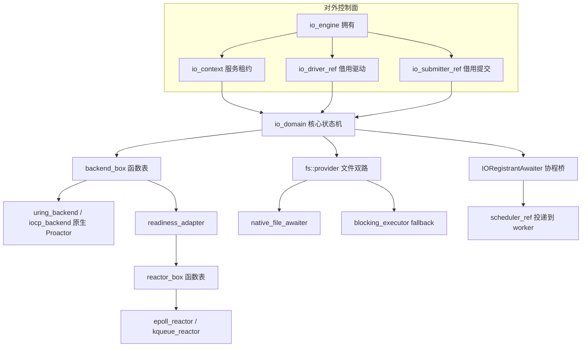
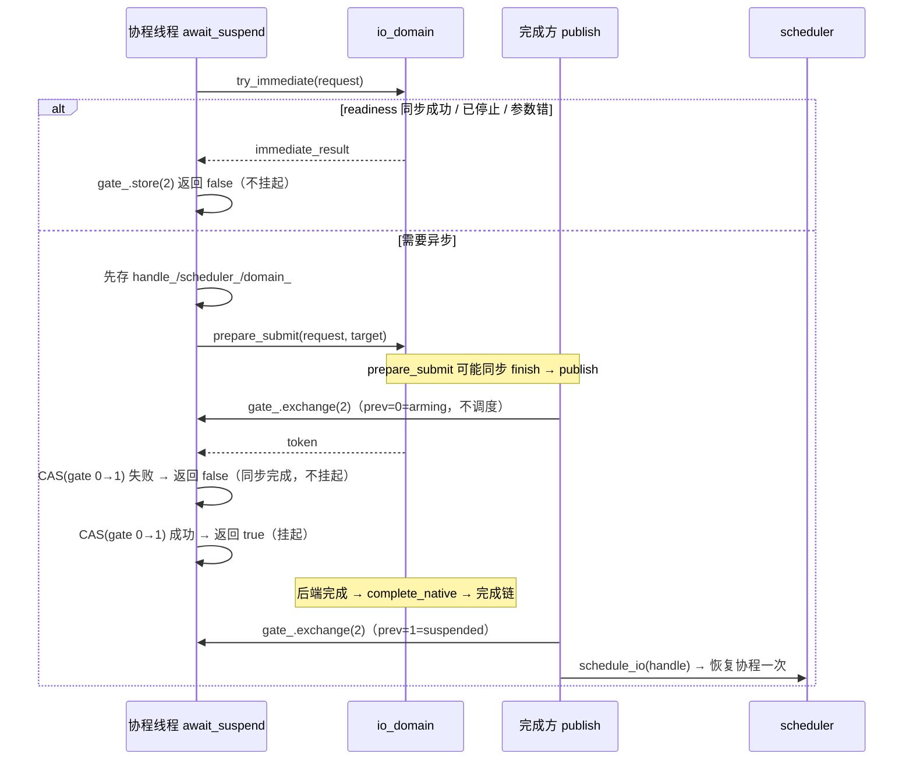

# 异步 IO

faio 使用 C++23 和 C++20 协程，提供纯头文件的 I/O 引擎、异步文件服务和可组合字节流。本文按**依赖层次自底向上**组织：先讲后端无关的中立类型与所有权词汇，再讲统一抽象（两张函数表），然后是核心状态机 `io_domain` 与协程桥，最后沿两条主线（原生 Proactor / 非原生 Reactor）逐个类解析后端封装，并收束于文件与目录服务。

| 平台 | 网络及可非阻塞描述符 | 普通文件及路径操作 | 当前构建选择 |
| --- | --- | --- | --- |
| Linux io_uring | 原生 SQE/CQE Proactor；readiness 用 POLL_ADD | 文件、属性、路径变更使用原生 opcode；无 opcode 操作使用有界 fallback | 新内核默认，显式 `IO_URING` |
| Linux epoll | 非阻塞 syscall 与就绪代际缓存 | 独立有界文件线程池 | 显式 `IO_EPOLL`、旧内核及无 uring 构建 |
| macOS | kqueue，非阻塞 syscall，就绪代际缓存 | 独立有界文件线程池 | kqueue |
| Windows | IOCP 原生收发、AcceptEx、ConnectEx；ready 为非消费 WSAPoll | OVERLAPPED 文件数据 IO；路径、元数据、目录操作使用独立有界服务 | IOCP，MSVC / clang-cl / MinGW-w64 |

Linux 默认构建 uring 与 epoll 双后端，依赖 liburing；`FAIO_ENABLE_IO_URING=OFF` 可构建无需 liburing 的 epoll 版本。后端选择由 [backend_selection.hpp](../include/faio/detail/io/backend_selection.hpp) 的 `resolve_io_backend` 完成：运行 Linux 5.10 及更新内核默认 uring，更旧内核默认 epoll。显式选择不静默回退——未编译 uring 或内核过旧时直接抛出 `std::invalid_argument`，uring 初始化失败会提示选择 `IO_EPOLL`：

```cpp
// backend_selection.hpp（省略 uname 读取与版本解析）
const bool supported = version.major > 5 || (version.major == 5 && version.minor >= 10);
if (requested == runtime::io_backend::IO_URING && !supported)
  throw std::invalid_argument("io_uring 需要 Linux >= 5.10；请使用 set_io_backend(IO_EPOLL)");
return requested.value_or(supported ? runtime::io_backend::IO_URING
                                    : runtime::io_backend::IO_EPOLL);
```

## 0. 分层全景



架构的关键是**单向依赖**：底层完成目标是函数表，I/O domain 不认识运行时 worker、公共网络类型或协程句柄。协程桥把完成转换为 `scheduler_ref` 投递；运行时负责队列、定时器、驱动预算和停机顺序。多线程运行时的 I/O 完成复用所属 worker 的私有快速槽，批次前项进入可窃取 FIFO；每连续 3 次快速恢复给已有 FIFO 任务一次执行机会。执行链的 64 次协作检查额度耗尽时，所属线程在下一次本地选择前将仍等待的快速任务通过原发布协议放到 FIFO 尾部，满队列时交给全局队列；成功发布后才清私有槽，入队失败保持原归属。

后端分层对照表：

| 类型 / 文件 | 职责 | 所有权 |
| --- | --- | --- |
| `io::io_engine` / [engine.hpp](../include/faio/detail/io/engine.hpp) | 拥有 domain；提供 context、driver、submitter、能力；销毁前停机排空 | 拥有 `shared_ptr<io_domain>` |
| `io::io_context` / [context.hpp](../include/faio/detail/io/context.hpp) | 可复制的 domain 和服务租约；显式保存归属，不依赖恢复线程的 TLS | 拥有 `shared_ptr<io_domain>` |
| `io_driver_ref` / [driver_ref.hpp](../include/faio/detail/io/driver_ref.hpp) | 借用驱动入口：`drive`、`wait_and_drive`、`wake`、`quiescent` | 持有 `io_domain*` |
| `io_submitter_ref` / [submitter_ref.hpp](../include/faio/detail/io/submitter_ref.hpp) | 借用提交及取消入口 | 持有 `io_domain*` |
| `io_request`、`operation_state` / [operation.hpp](../include/faio/detail/io/operation.hpp) | 中立参数、稳定槽、终态、字节进度与完成目标 | 见 1.3 |
| `resource_state` / [resource_state.hpp](../include/faio/detail/io/core/resource_state.hpp) | fd 所有权、不可变 domain 归属、读写执行权、就绪代际及关闭状态 | 见 1.4 |
| `backend_box` / [backend_protocol.hpp](../include/faio/detail/io/backend_protocol.hpp) | proactor 提交型统一函数表 | 拥有具体后端 `unique_ptr` |
| `reactor_box` / [reactor_ref.hpp](../include/faio/detail/io/reactor/reactor_ref.hpp) | 就绪型统一函数表 | 拥有具体 reactor `unique_ptr` |
| `readiness_adapter` / [readiness_adapter.hpp](../include/faio/detail/io/reactor/readiness_adapter.hpp) | 把 reactor_box 提升为 backend_box | 拥有 `reactor_box` |
| `io_domain` / [core/domain.hpp](../include/faio/detail/io/core/domain.hpp) | 唯一终态状态机 | 见第 3 章 |
| `IORegistrantAwaiter` / [io_registrant.hpp](../include/faio/detail/io/base/io_registrant.hpp) | 保存请求和调度器，实现提交与完成的挂起握手 | 见第 4 章 |
| `execution::blocking_executor` | 固定数量线程、有界 FIFO 等待队列、关闭排空 | 拥有线程池 |
| `execution::execute` | 文件服务请求桥，拥有函数与结果，展开 `expected<T>` | 拥有函数 |

---

## 1. 基础中立类型与所有权词汇

本章覆盖"脱离 proactor / reactor / 异步封装"之外、被所有后端与状态机共同引用的数据结构和所有权约定。它们没有对 `io_domain` 的依赖，是最底层的地基。

### 1.1 持有 vs 拥有

全文对指针/引用类型成员统一用两个词标注生命周期，这是贯穿后文所有类的词汇表：

- **持有（borrow）**：成员只保存地址或引用，不管理对象生命周期。被指向对象的存活由**宿主**保证，覆盖该成员的所有使用区间。
- **拥有（own）**：成员生命周期与类对象生命周期绑定（值内嵌，或 `unique_ptr`/`shared_ptr` 负责析构）。

判断标准只有一条：**类对象析构时，该成员指向的资源是否随之释放**。释放就是拥有，不释放就是持有。后文每类成员表都按此标注。

### 1.2 fd 抽象与平台类型

原生描述符在 Windows 上保留完整指针宽度，在 POSIX 上是 `int`（[posix_types.hpp](../include/faio/detail/io/platform/posix_types.hpp)）：

```cpp
namespace faio::io::detail {
#if defined(_WIN32)
using native_descriptor = std::intptr_t;  // SOCKET/HANDLE 的完整位宽。
#else
using native_descriptor = int;
#endif
}
```

跨平台套接字/消息类型同样由该文件统一：Windows 下 `socklen_t = int`，`iovec`/`msghdr` 是库自有布局（**绝不 `reinterpret_cast` 成 `WSABUF`/`WSAMSG`**，后端显式转换），`cmsghdr = WSACMSGHDR`，`SHUT_*`/`MSG_DONTWAIT`/`SOCK_*` 等宏按 Winsock 语义补齐。`native_handle_kind` 区分句柄种类，决定用 `closesocket` 还是 `CloseHandle` 关闭：

```cpp
enum class native_handle_kind : std::uint8_t { posix_descriptor, windows_handle, windows_socket };
```

### 1.3 中立请求与完成协议

这一组类型定义"一次 IO"要携带什么、完成时交付什么。它们全部位于 [operation.hpp](../include/faio/detail/io/operation.hpp)，是后端无关的中立描述。

#### operation_kind：请求种类

```cpp
enum class operation_kind : std::uint8_t {
  recv, send, recvfrom, sendto, recvmsg, sendmsg, send_zc, sendmsg_zc,
  connect, accept, accept_nowait, read, write, readv, writev,
  open, open2, fsync, close, shutdown, socket, ready, cancel,
  getsockopt, setsockopt, socket_inq, socket_outq,
  statx, mkdirat, unlinkat, renameat, linkat, symlinkat, ftruncate, unsupported
};
```

前 20 个是网络与文件数据路径；`open/open2` 及之后是文件系统/路径 opcode；`ready/cancel/getsockopt` 等是控制操作。后端通过 `supports(kind)` 声明能力，模型为 native 不代表每个 opcode 都已实现（见 2.1）。

#### io_request：完整拥有型请求

`io_request` 是后端无关的完整请求，构造仅保存参数、**无任何注册或系统调用副作用**。字段所有权：

| 成员 | 类型 | 所有权 | 说明 |
| --- | --- | --- | --- |
| `kind` … `argument3`、`length`、`offset`、`extension_*` | 标量 | — | 参数与 flags；`offset=UINT64_MAX` 表示流式读写，否则为 positional |
| `reservation` | `void*` | **持有** | 组合 IO 方向租约标识，地址在持有它的协程帧里稳定 |
| `resource` | `resource_ptr` | **拥有** | 稳定 IO 归属及资源共享租约 |
| `fd`、`native_kind`、`native_completion_key` | 标量 | — | 原生描述符；`native_completion_key` 仅原生后端锁内写 |
| `buffer` / `const_buffer` | `void*` / `const void*` | **持有** | 借用调用方数据区，覆盖到最终完成 |
| `address` / `address_length` | `sockaddr_storage` / `socklen_t` | **拥有** | 地址值内嵌 |
| `output_address` / `output_address_length` | `sockaddr*` / `socklen_t*` | **持有** | 借用输出缓冲 |
| `message` | `msghdr` | **拥有** | 值内嵌；`msg_iov` 指向 `vectors` 或调用方 |
| `scalar_vector` | `iovec` | **拥有** | 原生 recvfrom/sendto 的单元素描述符，随稳定槽固定 |
| `output_message` | `msghdr*` | **持有** | 借用输出消息头 |
| `vectors` | `std::vector<iovec>` | **拥有** | iovec 数组由请求拥有；**payload 遵守借用契约** |
| `path` / `path2` | `std::string` | **拥有** | 路径拥有到最终 CQE，不借用 `string_view::data()` |
| `deadline` | `optional<time_point>` | **拥有** | 相对时间从配置调用时起算 |

几个语义标志值得单独说明：

- `bypass_resource_registration`：File 外层已持有 lease，原生 raw fd 请求不再注册第二个拥有者。
- `uncancellable`：已接管关闭责任不能被停机/父任务取消跳过。
- `internal_control`：析构 close/半关闭可使用独立有界稳定控制记录。
- `observed_would_block` + `observed_readiness_generation`：瞬时 `try_io` 已遇 EAGAIN，接续提交可复用该观察避免重复无效 syscall（见 7.2）。
- `empty_success`：仅流接口显式启用空缓冲区成功；UDP 保留零长报文语义。
- `establish_reservation`：首次组合 IO 在取得执行权的同一域锁内建立方向租约。

#### scalar_io_request：紧凑 RECV/SEND 描述

`scalar_io_request` 是 `io_request` 的精简版，仅描述 `recv`/`send` 两种 opcode（地址、消息头、路径、iovec、offset 不属于其输入）。每个字段都有确定初始值，不借用原包装对象，不使用未激活 union。它省去构造完整请求的冷字段开销，需要稳定提交时由 `into_request()` 物化完整 `io_request`：

```cpp
io_request into_request() && noexcept {
  io_request full;                 // 冷字段完整初始化，原生后端不读取不确定表示。
  full.kind = kind;
  full.bypass_resource_registration = bypass_resource_registration;
  full.uncancellable = uncancellable;
  // ... 逐字段搬运 ...
  full.resource = std::move(resource);  // 稳定请求接管调用时捕获的同一个控制块（只移动，不复制计数）。
  full.fd = fd; full.buffer = buffer; full.const_buffer = const_buffer;
  full.length = length; full.flags = flags; full.deadline = deadline;
  return full;
}
```

#### operation_token：槽位加代际

```cpp
struct operation_token { std::uint64_t value{}; };
```

64 位整数，高 32 位代际 + 低 32 位（槽号+1）。永不复用：代际耗尽的槽永久退休，旧 token 的迟到事件或取消不会命中复用后的请求。取消、查找一律按完整 token 校验（见 3.2）。

#### completion_target：消费者函数表

```cpp
struct completion_target {
  void* consumer{};  // 持有：指向 awaiter，不拥有。
  void (*publish)(void*, std::int64_t, std::uint64_t) noexcept {};
};
```

核心不知道 `coroutine_handle` 或 `scheduler`，只调用这个函数表把结果发布给消费者（见第 4 章 `publish`）。`consumer` 是持有——它指向协程桥，桥的生存期由 gate 协议和恢复线程共同保证。

#### operation_state：稳定槽

```cpp
struct operation_state {
  io_request request;                       // 拥有：请求移入槽。
  completion_target target;                 // 持有：consumer 指向 awaiter。
  ::faio::move_only_function<void(int)> control_completion;  // 拥有：孤立 close 的 CQE 回调。
  operation_token token{}; std::uint32_t slot{}, generation{};
  std::int64_t result{}; std::uint64_t transferred{};
  int cancellation{};
  bool counts_active{}, allocated{}, accepted{}, terminal{}, running_file{}, connecting{},
      uses_reader{}, uses_writer{}, observer{}, queued_completion{};
  bool native_inflight{}, native_pending{}, native_cancel_requested{}, native_waiting_release{},
      native_close{};
  operation_state* next{};                 // 持有：内嵌完成节点，槽池拥有。
  operation_state* completed_previous{};   // 持有：双向完成链 O(1) 领取。
  operation_state* observer_next{};        // 持有：观察者链。
};
```

这是"稳定槽"：domain 构造时预热全部槽，普通 read/write 热路径不向通用堆申请内存。`request` 被拥有（移入），`target.consumer`、链表指针均为持有——节点本体由 `io_domain::operations_`（`vector<unique_ptr<operation_state>>`）拥有。

#### Interest / Ready：就绪观察

```cpp
enum class Interest : std::uint32_t { none = 0, readable = 1, writable = 2, read_write = 3 };

struct Ready {
  std::uint32_t flags{};       // 允许假就绪，真实 syscall 的 EAGAIN 才清除缓存。
  std::uint64_t generation{};  // 本次完成观察到的资源代际，供 guard 条件清除。
  bool is_readable() const noexcept { return flags & 1; }
  bool is_writable() const noexcept { return flags & 2; }
  bool is_error() const noexcept { return flags & 4; }
  bool is_read_closed() const noexcept { return flags & 8; }   // EOF 提示，可能仍有未读数据。
  bool is_write_closed() const noexcept { return flags & 16; }
};
```

`generation` 让 readiness guard 只清除自己观察到的这一代，旧 guard 不会抹去之后到达的新事件（见 7.2、7.3）。

#### drive_budget / drive_result / immediate_result

```cpp
struct drive_budget { std::size_t max_events{256}, max_completions{256}; };
struct drive_result { std::size_t completions{}; bool progressed{}, more_work{}; int fatal_error{}; };
struct immediate_result { std::int64_t result{}; std::uint64_t transferred{}; };
```

驱动预算限制单轮事件与完成数，宿主据此重查任务。

### 1.4 资源控制块：resource_state / domain_owner

[resource_state.hpp](../include/faio/detail/io/core/resource_state.hpp) 定义长期资源控制块——fd 的**唯一**用户态所有权点，业务协程迁移不改变 reactor 归属：

```cpp
class domain_owner {
 public:
  domain_owner(const domain_owner&) = delete;
  domain_owner& operator=(std::shared_ptr<io_domain> value) noexcept {
    value_ = std::move(value);                          // 只在局部首次绑定锁内写一次。
    published_.store(true, std::memory_order_release);  // 此后永不修改。
    return *this;
  }
  io_domain* get() const noexcept {
    return published_.load(std::memory_order_acquire) ? value_.get() : nullptr;
  }
  operator std::shared_ptr<io_domain>() const noexcept {
    return published_.load(std::memory_order_acquire) ? value_ : std::shared_ptr<io_domain>{};
  }
 private:
  std::shared_ptr<io_domain> value_;  // 拥有。
  std::atomic<bool> published_{};
};

struct resource_state {
  domain_owner owner;        // 拥有：首次归属发布后不可变，租约覆盖所有完成与清理。
  std::mutex binding_mutex;  // 拥有：仅首次绑定控制面取得，不进普通 IO 热路径。
  std::atomic<native_descriptor> handle{-1};  // 拥有：exchange(-1) 是关闭/导出的唯一接管点。
  std::uint64_t id{};        // 单调资源 token，fd 重用不能命中旧注册事件。
  std::size_t active{};      // 活跃操作计数；close 必须等待归零。
  std::uint32_t readiness{}; std::uint64_t readiness_generation{};  // 就绪位与代际。
  void* read_reserved{}; void* write_reserved{};  // 持有：组合方向租约的协程帧身份。
  operation_state* reader{};    // 持有：指向域槽。
  operation_state* writer{};    // 持有。
  operation_state* observers{}; // 持有：观察者链。
  operation_state* close_waiter{};  // 持有。
};
```

所有权要点：

- `owner`（`domain_owner`）**拥有**一份 `shared_ptr<io_domain>`，但发布后不可变。首次写入由 `binding_mutex` 串行；release 发布后读者才访问 shared_ptr，避免跨 worker 首次 bind 的读写竞争。
- `handle` **拥有** fd/HANDLE。`exchange(-1)` 是关闭/导出的唯一接管点——任何读到有效 fd 的代码都保证此刻没有并发 close 或复用。
- `reader`/`writer`/`observers`/`close_waiter` 都是**持有**，指向 domain 槽池里的 `operation_state`，节点生命周期由 domain 拥有。
- `read_reserved`/`write_reserved` **持有** `void*`，指向持有方向租约的协程帧身份，只做排他比较。

### 1.5 三种"租约"对照

"租约"（lease）在全库被用于三个不同对象，务必区分：

| 租约 | 载体 | 作用 | 生命周期 |
| --- | --- | --- | --- |
| **domain 租约** | `io_context` / `shared_ptr<io_domain>` | 保活 domain + 记录请求归属，刻意不依赖恢复线程 TLS | 到最终完成/清理，或显式释放 |
| **资源租约** | `resource_ptr`（`shared_ptr<resource_state>`） | 保活 fd + 记录 owner + 覆盖内核借用期间 | 到操作完成、包装对象析构 |
| **文件活跃租约** | `file_lease` | admission 计数 + 排空点 | 到单个文件操作结束 |

三者语义与生命周期完全不同，后文 `io_context`（5.2）、`resource_state`（1.4）、`file_state`（8.4）分别展开。

## 2. 后端统一抽象：两张函数表

所有后端位于 `io/backends` 下，通过**两张并列的函数表**接入同一套注册/提交/完成/取消/停机协议。这是全库最重要的一个结构点：为什么是两张表，而不是一张？

- **`backend_box`**（[backend_protocol.hpp](../include/faio/detail/io/backend_protocol.hpp)）面向 **Proactor 提交型**后端：接受 typed 请求、产生完成事件。uring 和 IOCP 原生实现它，`readiness_adapter` 也实现它。
- **`reactor_box`**（[reactor_ref.hpp](../include/faio/detail/io/reactor/reactor_ref.hpp)）面向**就绪型** reactor：只做 attach/detach/poll/wake，产生"方向就绪"提示，不产生 IO 结果。epoll/kqueue 实现它。

非原生路线的完整链路是 `epoll_reactor → reactor_box → readiness_adapter → backend_box`，两步套娃把就绪型内核机制提升成提交型统一协议，`io_domain` 才能用同一套状态机 attempt syscall。两张表都是手写小函数表，没有虚基类、没有 ODR 问题、每批驱动只发生一次类型擦除调用。

### 2.1 backend_box：proactor 提交型统一函数表

先看协议的中立数据类型：

```cpp
enum class native_handle_kind : std::uint8_t { posix_descriptor, windows_handle, windows_socket };
struct native_registration {
  std::uintptr_t value{};  // 保存完整原生值；不得把 HANDLE 或 Win64 SOCKET 缩窄为 int。
  native_handle_kind kind{native_handle_kind::posix_descriptor};
};

enum class backend_submit_status : std::uint8_t { accepted, would_queue, rejected };
// would_queue 尚未保存内核引用；rejected 表示能力不支持或参数非法。

enum class backend_event_kind : std::uint8_t { readiness, result, cancel_ack, buffer_release };
// 原生完成、取消确认与 buffer release 是不同事件，不能混为一次恢复。

struct backend_event {
  backend_event_kind kind;
  std::uint64_t key;    // readiness 为资源代际，其余为操作代际；零为控制通道。
  std::int64_t result;  // 结果为字节数/原生结果，失败为负错误码，ACK 不携带业务完成。
  std::uint32_t flags;  // 中立 readiness 位或原生完成通知标记。
};

struct backend_operation {
  std::uint64_t token{};  // 完整 slot/generation，控制 CQE 不可借用 token 高位做 tag。
  void* request{};        // 指向域拥有的稳定 typed 请求；accepted 后最后事件前不得移动或销毁。
};

struct backend_submit_result { backend_submit_status status; int error{}; };  // error 仅 rejected 使用。
struct backend_flush_result { std::size_t submitted{}; bool pending{}; int error{}; };
struct backend_statistics { /* native_submitted/native_completed/cancel_ack/buffer_notifications/native_flushed */ };
```

`backend_operation::request` 是**持有** `void*`——它指向 `io_domain` 槽池里的稳定 `io_request`，绝不指向 awaiter。类型擦除盒本体：

```cpp
class backend_box {
 public:
  template <class B>
  explicit backend_box(std::unique_ptr<B> object)
      : object_(object.release()), table_(&table_for<B>) {}  // 仅 owning box 接管一次原生后端。
  ~backend_box() { if (object_) table_->destroy(object_); }

  int attach(native_registration handle, std::uint64_t key) noexcept { return table_->attach(object_, handle, key); }
  backend_submit_result try_submit(backend_operation op) noexcept { return table_->submit(object_, op); }
  backend_flush_result flush() noexcept { return table_->flush(object_); }
  bool poll_flushes_submissions() const noexcept { return table_->poll_flushes_submissions; }
  int poll(std::span<backend_event> out, std::optional<int> timeout) noexcept { return table_->poll(object_, out, timeout); }
  void request_cancel(backend_operation operation) noexcept { table_->cancel(object_, operation); }
  void wake() const noexcept { table_->wake(object_); }
  void begin_shutdown() noexcept { table_->shutdown(object_); }
  bool begin_failure(int error) noexcept { return table_->failure(object_, error); }
  bool quiescent() const noexcept { return table_->quiescent(object_); }
  bool native() const noexcept { return table_->native; }
  bool supports(std::uint32_t kind) const noexcept { return table_->supports(object_, kind); }
  const char* name() const noexcept { return table_->name(object_); }
  backend_statistics statistics() const noexcept { return table_->statistics(object_); }

 private:
  struct operations {
    int (*attach)(void*, native_registration, std::uint64_t) noexcept;
    void (*detach)(void*, native_registration) noexcept;
    backend_submit_result (*submit)(void*, backend_operation) noexcept;
    backend_flush_result (*flush)(void*) noexcept;
    int (*poll)(void*, std::span<backend_event>, std::optional<int>) noexcept;
    void (*cancel)(void*, backend_operation) noexcept;
    void (*wake)(void*) noexcept;
    void (*shutdown)(void*) noexcept;
    bool (*failure)(void*, int) noexcept;
    bool (*quiescent)(void*) noexcept;
    bool (*supports)(void*, std::uint32_t) noexcept;
    void (*destroy)(void*) noexcept;
    bool native;
    bool poll_flushes_submissions;
    const char* (*name)(void*) noexcept;
    backend_statistics (*statistics)(void*) noexcept;
  };
  template <class B> static inline const operations table_for{ /* 见下 */ };
  void* object_{};             // 拥有：唯一原生后端所有者，具体类型只能经匹配函数表访问。
  const operations* table_{};  // 持有：指向每种后端共用的 inline 静态跳板表。
};
```

`object_` **拥有**具体后端（`unique_ptr` 释放后转裸指针，由 `table_->destroy` 恢复唯一所有权并正确析构）；`table_` **持有**静态表（静态存储期，无需析构）。

`table_for<B>` 用 `if constexpr (requires ...)` 在**编译期**适配可选接口，不为第三方后端分配包装或创建线程：

```cpp
template <class B>
static inline const operations table_for{
    +[](void* p, native_registration handle, std::uint64_t key) noexcept {
      if constexpr (requires(B& b) { b.attach(handle, key); })
        return static_cast<B*>(p)->attach(handle, key);  // 原生 Windows 保留 typed 值。
      else {
        // Windows typed backend 永不走 POSIX 缩窄分支。
        if (handle.kind != native_handle_kind::posix_descriptor || handle.value > 0x7fffffffU)
          return -22;  // 种类或位宽不匹配在接受前明确拒绝。
        return static_cast<B*>(p)->attach(static_cast<int>(handle.value), key);
      }
    },
    +[](void* p, backend_operation operation) noexcept {
      if constexpr (requires(B& b) { b.request_cancel(operation); })
        static_cast<B*>(p)->request_cancel(operation);
      else
        static_cast<B*>(p)->request_cancel(operation.token);  // readiness 后端无 payload 地址。
    },
    +[](void* p, int error) noexcept {
      if constexpr (requires(B& b) { b.begin_failure(error); })
        return static_cast<B*>(p)->begin_failure(error);
      else {
        static_cast<B*>(p)->begin_shutdown();
        return !B::native_proactor;  // 无原生引用的 readiness 可建立排空。
      }
    },
    +[](void* p) noexcept { delete static_cast<B*>(p); },  // 恢复具体 owning 析构。
    B::native_proactor,
    /* ... 其余跳板、poll_flushes_submissions 探测、name、statistics ... */
};
```

协议的关键约束：

- **类型擦除只发生在用户态调用边界**。内核/SQE/CQE/OVERLAPPED 绝不保存函数表或 consumer 地址；跳板只在每批驱动边界恢复类型。
- **句柄全位宽传递**。Windows 后端的 `attach(native_registration, key)` 直接接收完整 HANDLE/SOCKET；没有 typed attach 的 POSIX 后端才检查缩窄范围，种类或位宽不匹配在接受前拒绝。
- **取消按完整代际**。原生后端利用稳定 request 里的 `native_completion_key` O(1) 找到原 SQE/OVERLAPPED；兼容后端只需要完整 token，绝不按可能复用的 fd 数值推断代际。
- **begin_failure 的返回值由具体后端证明**。永久驱动故障时，返回 true 表示后端仍保证排空原生引用并产出最终事件；readiness 后端默认返回 `!B::native_proactor`。未知 native 故障必须拒绝提前回收借用 buffer，宿主 fail-fast。

### 2.2 reactor_box：就绪型函数表

[reactor_ref.hpp](../include/faio/detail/io/reactor/reactor_ref.hpp) 是更小的表，只负责"方向就绪 + 关闭提示"：

```cpp
enum readiness_bits : std::uint32_t {
  readable_bit = 1, writable_bit = 2, error_bit = 4,
  read_closed_bit = 8,    // 读方向 EOF；保留既有读关闭位值，可能仍有未读数据。
  write_closed_bit = 16,  // 写方向关闭。
  closed_bit = read_closed_bit | write_closed_bit
};

struct readiness_event { std::uint64_t key; std::uint32_t flags; };
// 内核只保存注册代际标识，不保存协程或 awaiter 地址。

class reactor_box {
 public:
  template <class R>
  explicit reactor_box(std::unique_ptr<R> object)
      : object_(object.release()), table_(&table_for<R>) {}
  ~reactor_box() { if (object_) table_->destroy(object_); }

  int attach(int fd, std::uint64_t key) noexcept { return table_->attach(object_, fd, key); }
  void detach(int fd) noexcept { table_->detach(object_, fd); }
  int poll(std::span<readiness_event> events, std::optional<int> timeout_ms) noexcept {
    return table_->poll(object_, events, timeout_ms);
  }
  void wake() const noexcept { table_->wake(object_); }
  const char* name() const noexcept { return table_->name; }

 private:
  struct operations {
    int (*attach)(void*, int, std::uint64_t) noexcept;
    void (*detach)(void*, int) noexcept;
    int (*poll)(void*, std::span<readiness_event>, std::optional<int>) noexcept;
    void (*wake)(void*) noexcept;
    void (*destroy)(void*) noexcept;
    const char* name;
  };
  template <class R> static inline const operations table_for{ /* 5 个跳板 */ };
  void* object_{};             // 拥有：仅此 box 拥有具体 reactor。
  const operations* table_{};  // 持有：静态表。
};
```

`attach`/`detach` 由 domain 锁串行化，`poll` 只允许一个 driver，`wake` 可跨线程。`poll` 空 span 是立即返回的 no-op，`EINTR` 返回零由宿主重新计算绝对 deadline。调用方只读取返回 count 内的有效事件，未使用输出槽无需清零。

### 2.3 readiness_adapter：reactor 提升成 backend_box

[readiness_adapter.hpp](../include/faio/detail/io/reactor/readiness_adapter.hpp) 是两步套娃的第二步，把 `reactor_box` 包装成 `backend_box`：

```cpp
class readiness_adapter {
 public:
  static constexpr bool native_proactor = false;
  static constexpr const char* backend_name = "readiness";

  explicit readiness_adapter(reactor_box reactor) : reactor_(std::move(reactor)) {}  // 只移动接管。

  int attach(int fd, std::uint64_t key) noexcept { return reactor_.attach(fd, key); }
  void detach(int fd) noexcept { reactor_.detach(fd); }

  // 明确拒绝原生 typed 提交，reactor 的 syscall attempt 只在域内执行。
  backend_submit_result try_submit(backend_operation) noexcept {
    return {backend_submit_status::rejected, EOPNOTSUPP};
  }
  backend_flush_result flush() noexcept { return {}; }  // 没有 SQ 或原生提交责任。

  int poll(std::span<backend_event> out, std::optional<int> ms) noexcept {
    std::array<readiness_event, 256> events;
    const int n = reactor_.poll(std::span(events).first(std::min(out.size(), events.size())), ms);
    for (int i = 0; i < n; ++i)
      out[i] = {backend_event_kind::readiness, events[i].key, 0, events[i].flags};
      // 只传资源代际，不传播 fd 地址或协程指针。
    return n;  // 负错误保留给 domain，不能误当作零个正常事件。
  }

  void request_cancel(std::uint64_t) noexcept {}  // 无内核 payload 引用，core 取消后即可建立终态。
  void wake() noexcept { reactor_.wake(); }
  void begin_shutdown() noexcept {}
  bool quiescent() noexcept { return true; }  // 只检查 backend；domain 仍等待操作/服务。
  bool supports(std::uint32_t) noexcept { return false; }  // 不宣称支持任何 native opcode。

 private:
  reactor_box reactor_;  // 拥有：唯一拥有实际内核就绪队列，生命周期覆盖全部驱动调用。
};
```

这个类只产生 readiness，不伪装成 Proactor。真正的 syscall 在 `io_domain` 内执行（见 7.2），adapter 只把 reactor 的就绪事件改写成 `backend_event{kind::readiness}` 的形状，让 domain 的驱动循环用同一套分发代码处理 epoll/kqueue 和 uring 的事件。`try_submit` 永远 `rejected`、`supports` 永远 `false`、`quiescent` 永远 `true`——这三点共同保证接入方不会跳过真实的 syscall attempt。

工厂 [factory.hpp](../include/faio/detail/io/backends/factory.hpp) 是两条主线的分叉点，`make_platform_backend` 按平台返回同一个 `backend_box`：

```cpp
inline backend_box make_platform_backend(
#if defined(__linux__)
    std::optional<runtime::io_backend> requested = {},
#endif
    unsigned ring_capacity = 256) {
#if defined(__linux__)
  if (resolve_io_backend(requested) == runtime::io_backend::IO_URING) {
#if defined(FAIO_HAS_IO_URING) && FAIO_HAS_IO_URING
    return backend_box{std::make_unique<uring_backend>(ring_capacity)};
#else
    throw std::invalid_argument("io_uring 未在本构建启用；重新构建 FAIO_ENABLE_IO_URING=ON 或显式 IO_EPOLL");
#endif
  }
  return make_epoll_backend();  // reactor 经 adapter 汇入同一核心协议。
#elif defined(__APPLE__) || defined(__FreeBSD__)
  return make_kqueue_backend();
#elif defined(_WIN32)
  auto backend = windows::make_iocp_backend();  // 网络和文件使用真正的完成端口。
  if (!backend) throw std::system_error(backend.error(), "IOCP 初始化失败");
  return std::move(*backend);
#else
  throw std::invalid_argument("本平台没有可用 IO 后端");
#endif
}
```

`epoll/backend.hpp` 的两行套娃就是整个非原生链路的缩影：

```cpp
inline backend_box make_epoll_backend() {
  return backend_box{std::make_unique<readiness_adapter>(reactor_box{std::make_unique<epoll_reactor>()})};
}
```

## 3. io_domain：唯一终态状态机

[core/domain.hpp](../include/faio/detail/io/core/domain.hpp) 的 `io_domain` 是整库最重的一块：它持有 `backend_box`，管理稳定槽与资源，在唯一域锁内仲裁接受、取消、关闭与停机，驱动后端收割完成并发布终态。它只发布函数表结果、不直接恢复协程（恢复由第 4 章的桥完成）。POSIX 版是 `core/domain.hpp`，Windows 版是 [iocp/domain.hpp](../include/faio/detail/io/backends/iocp/domain.hpp)（同构，差异见 6.2 末）。

### 3.1 构造与槽预热

```cpp
explicit io_domain(engine_config config)
    : backend_(config.backend_factory ? config.backend_factory()
               : config.reactor_factory
                   ? backend_box{std::make_unique<readiness_adapter>(config.reactor_factory())}
                   : make_platform_backend(config.requested_backend, config.native_queue_entries)),
      fs_(config.filesystem_service ? ... : std::make_shared<blocking_executor>(
              config.filesystem_threads, config.blocking_queue_limit, 1,
              backend_.native() ? executor_startup::on_demand : executor_startup::preheated)),
      dns_(...), cleanup_(...),
      own_fs_(!config.filesystem_service), own_dns_(!...), own_cleanup_(!...),
      placement_(std::move(config.placement_service)) {
  operations_.reserve(config.max_operations);
  free_.reserve(config.max_operations);
  for (std::size_t i = 0; i < config.max_operations; ++i) {
    auto operation = std::make_unique<operation_state>();
    operation->slot = static_cast<std::uint32_t>(i);
    operations_.push_back(std::move(operation));
    free_.push_back(static_cast<std::uint32_t>(i));  // 全部槽预热，热路径不向堆申请。
  }
}
```

成员清单（含所有权）：

| 成员 | 类型 | 所有权 | 说明 |
| --- | --- | --- | --- |
| `backend_` | `backend_box` | **拥有** | 唯一原生后端 |
| `operations_` | `vector<unique_ptr<operation_state>>` | **拥有** | 稳定槽池，地址固定 |
| `free_` | `vector<uint32_t>` | **拥有** | 空闲槽下标栈 |
| `native_controls_` | `unordered_map<uint64, unique_ptr<operation_state>>` | **拥有** | 独立原生控制记录（close/内部请求） |
| `resources_` / `descriptors_` | `unordered_map<…, weak_ptr<resource_state>>` | **弱引用** | 只索引、不拥有资源；资源由 operation/包装对象持有 |
| `completed_head_` / `completed_tail_` | `operation_state*` | **持有** | 双向完成链，指向槽池节点 |
| `fs_` / `dns_` / `cleanup_` | `shared_ptr<blocking_executor>` | **拥有** | 服务租约；`own_*` 决定析构时是否 close |
| `placement_` | `shared_ptr<io_placement_group>` | **拥有** | 多线程分片弱注册表 |
| `mutex_` | `recursive_mutex` | **拥有** | 可重入控制面锁；资源租约释放可能重入注销 |
| `driver_mutex_` | `mutex` | **拥有** | 唯一驱动消费者互斥 |
| `quiescent_cv_` | `condition_variable_any` | **拥有** | 排空等待 |
| `shutdown_cleanups_` / `deferred_cleanup_` | map/deque | **拥有** | 停机清理回调 |
| `stop_` | `stop_source` | **拥有** | 停机信号源 |
| `stopped_` / `fatal_error_` / `draining_` / `publishers_` | 原子/标量 | — | 状态标志 |

服务线程的启动策略由后端模型决定：`backend_.native()` 时 `on_demand`（uring/IOCP 的辅助服务只在首次真实 fallback 提交时启动），否则 `preheated`（epoll/kqueue 的普通文件 IO 必然走服务，构造期预热）。`engine_config` 还允许注入共享服务与自定义后端工厂（`backend_factory`/`reactor_factory`），供合同测试和外部后端复用同一状态协议。

### 3.2 prepare_locked / submit_locked：接受仲裁链

**prepare_locked** 是纯槽准备——不取得执行权、不提交 IO、不发布消费者：

```cpp
operation_token prepare_locked(io_request&& request, completion_target target, int& error) noexcept {
  operation_state* selected = nullptr;
  while (!free_.empty()) {
    const auto candidate_index = free_.back(); free_.pop_back();
    auto& candidate = *operations_[candidate_index];
    if (candidate.generation == UINT32_MAX) { ++retired_slots_; continue; }  // 永久退休，禁止回绕。
    selected = &candidate; break;
  }
  if (!selected) { /* 原生后端的 close/内部控制改用独立控制记录，略 */ }
  if (!selected) { error = EAGAIN; return {}; }  // 所有未退休槽都在用，调用方仍能安全回滚。
  auto& op = *selected;
  const auto index = op.slot;
  if (index != UINT32_MAX) ++op.generation;  // 控制记录已有不可复用 token。
  op.request = std::move(request);           // 直接从调用者移入稳定槽。
  op.target = target;                        // 消费者仅由用户态统一发布链调用。
  if (index != UINT32_MAX) op.token = {static_cast<std::uint64_t>(op.generation) << 32 | (index + 1)};
  op.allocated = true; op.accepted = false; op.terminal = false;
  // ... 清除上一代全部状态（cancellation、链表指针、原生标志等），此处省略 ...
  return op.token;
}
```

token 是高 32 位代际 + 低 32 位（槽号+1）。代际耗尽的槽永久退休，旧 token 的迟到事件或取消不会命中复用后的请求。取消、查找一律按完整 token 校验。

**submit_locked** 是唯一的接受状态转换，停止、sticky cancel、参数校验、deadline、方向执行权和路由在同一个域锁内按固定顺序仲裁（节选）：

```cpp
bool submit_locked(operation_token token, bool& wake_needed, bool& native_completion_opportunity) noexcept {
  auto* op = lookup(token);  // 必须同时检查 slot 与 generation。
  if (!op || op->accepted) return false;
  op->accepted = true;       // 唯一接受边界；后续错误也必须向消费者交付一次结果。
  if (stopped() && op->request.kind != operation_kind::close && !op->request.uncancellable)
    finish(*op, -ECANCELED);
  else if (op->cancellation)
    finish(*op, -op->cancellation);           // Prepared 阶段的取消 sticky 保存。
  else if (op->request.validation_error)
    finish(*op, -op->request.validation_error);  // 非法参数不取得执行权，也不触发 syscall。
  // ... 关闭/归属/deadline 校验，此处省略 ...
  else {
    // 方向执行权：同方向冲突 EBUSY；establish_reservation 在同一锁内建立组合租约。
    if (direction & 1) { r->reader = op; op->uses_reader = true; }
    if (direction & 2) { r->writer = op; op->uses_writer = true; }
    ++r->active;  // 覆盖排队、syscall 及严格取消排空；close 必须等待归零。
    if (!op->terminal) {
      if (req.deadline) update_deadline(*req.deadline);
      if (can_native_request(req)) submit_native(*op);          // 原生后端：try_submit 进 SQE/OVERLAPPED。
      else if (is_file_request(req)) submit_file(*op);          // 文件请求交给隔离执行器。
      else if (req.observed_would_block && r && r->registered
               && req.observed_readiness_generation == r->readiness_generation
               && !(r->readiness & (direction_of(req.kind) | error_bit))) {
        // 同一已注册 ET 资源、没有更新事件：真实 EAGAIN 已执行，直接等待就绪。
      } else attempt(*op);                                     // readiness：非阻塞 syscall，EAGAIN 则登记等待。
    }
  }
  return true;
}
```

`accepted` 是唯一边界：此前的失败（容量、参数）尚未接受，调用方可以安全回滚请求；此后任何路径都必须经 `finish` 交付一次结果，不存在"静默丢弃"的分支。方向执行权用 `reader`/`writer` 两个裸指针 + `active` 计数：同方向并发 `EBUSY`，一读一写可并行；组合 IO 用 `reservation` 身份在同一锁内建立跨短传输的排他租约（见 1.3 `establish_reservation`）。

### 3.3 资源生命周期

`adopt`（拥有）与 `borrow`（不拥有）是资源进入 domain 的两个入口；`bind` 完成首次归属；`release_resource`/`detach` 是退出。核心不变式是 `resource_state::handle` 的 `exchange(-1)` 唯一接管点与 `owner` 的发布后不可变：

- **adopt(fd, owns=true, regular=false)**：在域锁内校验停止/容量/重复拥有者，创建 `resource_state`、`owner = shared_from_this()`、写入单调 `id`（key 永不复用，零 key 预留唤醒通道）、登记到 `resources_`/`descriptors_` 两张表，最后才 `owns_handle = owns`——**只有全部注册成功后才接管 fd**。
- **borrow(fd)**：先把外部 socket 设为 `FIONBIO` 非阻塞再 adopt，不接管关闭责任。
- **bind(resource)**：对"尚未归属"的资源（raw fd 首次借用）在 `binding_mutex` 内完成首次 `owner` 发布；并发首次使用时另一个 worker 可能已 bind，`EXDEV` 异常按"跟随稳定归属"处理，不当作错误。
- **release_resource / detach**：释放资源租约时可能重入注销，因此控制面锁是 `recursive_mutex`。`detach(resource, preserve_association)` 在 Windows 上支持同域重新导入保留完成端口关联；跨域导入返回 `EXDEV`，停止域返回 `ECANCELED`。

### 3.4 drive 循环与完成收割

`drive` 是唯一驱动入口，锁序固定为 **driver → domain → SQ**：

```cpp
drive_result drive(drive_budget budget = {}, std::optional<int> wait = 0) noexcept {
  std::unique_lock driver_lock(driver_mutex_);  // 唯一 CQ 消费者。
  driver_session_guard session{this};           // 内部 close/callback 再 submit 时跳过即时完成机会。
  // ... 域锁内：flush 原生提交 → 消费 backend_.poll 事件 → 逐条分发 ...
  // readiness 事件按 key 查 resources_，更新代际与就绪位，重试 attempt：
  auto it = resources_.find(event.key);         // key 是单调资源代际，fd 数值复用不会混淆。
  if (it == resources_.end()) continue;         // fd 重用或 detach 后的迟到事件。
  auto resource = it->second.lock();
  if (!resource || resource->closing) continue;
  ++resource->readiness_generation;             // guard 只允许清除自己观察到的这一代。
  resource->readiness |= event.flags;
  if (resource->reader && event.flags & (readable_bit | error_bit)) attempt(*resource->reader);
  if (resource->writer && event.flags & (writable_bit | error_bit)) attempt(*resource->writer);
  // ... 原生 result/cancel_ack/buffer_release → complete_native → 完成链 ...
  // 完成批量在锁外 publish_completed 发布，回收槽。
}
```

就绪位是**粘性提示**，只用于唤醒，最终字节数/EOF 由真实 syscall 决定。`readiness_generation` 每批递增，配合 `Ready::generation` 让旧 guard 不能抹去新事件。

**低负载即时完成机会** `try_complete_local_native`（[core/domain.hpp:1267](../include/faio/detail/io/core/domain.hpp#L1267)）：本地低负载原生请求准备完成后，最多执行一次非阻塞 `poll(0)`，后端直接提交 SQE 并读取至多 8 条真实 CQE；当前请求已完成时协程桥在 arming gate 内继续执行，尚未完成则正常挂起。资格仅限域内资源和已分配操作均不超过 8、没有完成积压、控制请求或 SQ 背压；高负载保持批量驱动。机会函数只 `try_lock` 驱动互斥，资格快照复用 submit 已持有的域锁：

```cpp
claimed_completion try_complete_local_native(operation_token token) noexcept {
  if (current_domain != this || current_driver_domain || !backend_.native()) return {};
  std::unique_lock driver_lock(driver_mutex_, std::try_to_lock);
  if (!driver_lock.owns_lock()) return {};       // 已有唯一消费者时不等待、不争抢。
  driver_session_guard session{this};
  claimed_completion delivery;
  {
    std::lock_guard lock(mutex_);                // 锁序与正常 drive 一致：driver → domain → SQ。
    if (!can_complete_local_native(token)) return {};
    std::array<backend_event, 8> events;
    const int count = backend_.poll(events, 0);  // 一次原生 flush + 非阻塞真实 CQE 消费。
    delivery = claim_completed_locked(token);    // 只摘本 token，其余完成留在原 owner 完成链。
  }
  return delivery;  // session 和 driver_lock 销毁后，finish_submission 才锁外发布。
}
```

请求结果、取消 ACK、MORE 和 NOTIF 均由同一完成状态机处理。机会函数退出自己的 driver session 和锁以后，锁外发布当前目标，再取得域锁回收稳定槽。任何仍处于活动 driver session 内的同线程重入返回 `EBUSY`。

### 3.5 取消 / 关闭 / 停机 / fallback 托管

- **request_cancel(token, reason)**：只按代际 token 查槽，首次写入的取消原因 sticky 保留；deadline 到期映射 `ETIMEDOUT`、其余 `ECANCELED`，随后到期的 deadline 不覆盖先观察到的停止原因。原生后端把取消责任排入后端队列，ACK 只证明取消命令完成，原请求 CQE 才决定业务生命周期。
- **close**：先停止 admission，再等活跃操作排空，最后 `exchange(-1)` 关闭 fd。close 只调用一次，`EINTR` 不重试可能已复用的整数 fd。原生 CLOSE 用独立稳定控制请求直到真实 CQE；非原生后端的可能阻塞关闭走保留清理通道，普通队列满也不能丢失关闭责任。
- **begin_shutdown(policy) / shutdown()**：`drain` 等待已有任务，`cancel_all` 先停止再排空。永久驱动故障经统一 `begin_failure` 协议停止接受新请求；后端能安全排空时保留原请求至最终完成，错误结果仍带实际进度。私有 ring 提交通道永久损坏时无法证明内核已解除借用，触发 fail-fast。
- **defer_cleanup / register_shutdown_cleanup / retain_cleanup_wait**：清理走独立保留通道；停机清理回调注册在 `shutdown_cleanups_`，`retain_cleanup_wait`/`release_cleanup_wait` 让驱动在这些租约和最终关闭完成前不能提前宣告排空。

## 4. 协程桥：IORegistrantAwaiter

[io_registrant.hpp](../include/faio/detail/io/base/io_registrant.hpp) 的 `IORegistrantAwaiter<IO, Request>` 是后端中立 IO 协程桥。构造只保存参数，`await_suspend` 才准备/提交稳定状态——这是"构造后未 co_await 就销毁的 awaiter 不会留下内核引用"的关键。

```cpp
template <class IO, class Request = io_request>
class IORegistrantAwaiter {
  explicit IORegistrantAwaiter(Request request, io_context context = {}, bool cancellable = true) noexcept
      : request_(std::move(request)), context_(std::move(context)), cancellable_(cancellable) {}
  // 成员：
  //   Request request_;                   拥有：请求参数（完整 io_request 或紧凑 scalar_io_request）。
  //   io_context context_;                拥有：显式归属租约（可选）。
  //   std::shared_ptr<io_domain> domain_; 拥有：真正异步路径建立的拥有型租约。
  //   operation_token token_;             标量：槽位 + 代际。
  //   scheduler_ref scheduler_;           拥有：恢复调度器。
  //   std::coroutine_handle<> handle_;    标量：协程帧句柄。
  //   std::atomic<unsigned char> gate_;   标量：0=arming，1=suspended，2=completed。
  //   std::optional<std::stop_callback<cancel_callback>> stop_callback_;  拥有：取消订阅。
  //   user_data _user_data{};             标量：result + transferred 完成载荷。
};
```

`gate_` 用一个三态原子处理"提交过程中已经完成"的竞态：

| gate | 含义 |
| --- | --- |
| 0 (arming) | 提交进行中，完成方不得恢复或销毁帧 |
| 1 (suspended) | 协程已挂起，完成方负责调度恢复 |
| 2 (completed) | 结果已发布 |

### 4.1 挂起握手时序



**await_ready 永不即时完成**：构造 awaiter 只保存参数，所有副作用集中在 `await_suspend`：

```cpp
bool await_ready() const noexcept { return false; }  // 准备阶段不偷偷发起 IO。
```

**await_suspend**：确定归属 → 尝试即时路径 → 进入稳定槽。完整实现（省略 raw fd 冷路径查找与首次 bind 的异常处理）：

```cpp
bool await_suspend(std::coroutine_handle<> handle) noexcept {
  auto* domain = request_.resource ? request_.resource->owner.get() : nullptr;
  io_context context;
  if (!domain) {
    context = context_ ? context_ : io_context::current();
    if (!context) { _user_data.result = -ECANCELED; return false; }
    domain = context.domain().get();
  }
  // raw fd 不携带 shard 身份：在同一 runtime 内查找已登记资源，复用原 domain 与代际。
  if (!request_.resource && !request_.bypass_resource_registration && request_.fd >= 0
      && request_.kind != operation_kind::open && request_.kind != operation_kind::open2
      && request_.kind != operation_kind::socket) {
    request_.resource = domain->find_raw_resource(request_.fd, !context_);
    if (request_.resource) domain = request_.resource->owner.get();
  }
  // 已绑定请求本身拥有 resource->owner；没有默认 domain 的原生导入资源只在第一次 await 确定归属。
  if (request_.resource && !request_.resource->owner) {
    try { domain->bind(request_.resource); }
    catch (const std::system_error& e) {
      if (e.code().value() != EXDEV || !request_.resource->owner) { _user_data.result = -e.code().value(); return false; }
      // 另一 worker 已完成首次绑定时跟随该稳定归属。
    } catch (...) { _user_data.result = -ENOMEM; return false; }
  }
  if (request_.resource && request_.resource->owner) domain = request_.resource->owner.get();
  const auto& stop = ::faio::detail::current_stop_token;  // arming 期间借用 TLS。
  if (const auto immediate = domain->try_immediate(request_, cancellable_ && stop.stop_requested())) {
    _user_data = {immediate->result, immediate->transferred};
    gate_.store(2, std::memory_order_release);  // 没有留存异步引用，当前帧直接继续。
    return false;
  }
  // 必须先初始化恢复目标，再调用可能同步发布结果的 prepare_submit。
  handle_ = handle;
  scheduler_ = ::faio::detail::current_scheduler();
  domain_ = domain->shared_from_this();
  int error{};
  const auto token = domain->prepare_submit(std::move(request_), {this, &publish}, error, stop, cancellable_);
  if (!token.value) { _user_data.result = -error; return false; }
  token_ = token;  // token 含 slot 与 generation，取消回调不借用 operation 地址。
  if (gate_.load(std::memory_order_acquire) != 2 && cancellable_ && stop.stop_possible())
    stop_callback_.emplace(stop, cancel_callback{domain_, token});
  unsigned char arming = 0;
  return gate_.compare_exchange_strong(arming, 1, std::memory_order_acq_rel);
}
```

逐段看竞态处理：

- **归属确定先于一切副作用**：已绑定资源直接用 `resource->owner`；未归属的 raw fd 才读取显式 context 或 TLS 默认 context；没有可用 domain 时以 `ECANCELED` 完成、不挂起。`find_raw_resource` 只提升租约、不建立新注册。
- **try_immediate 是 readiness 后端的同步尝试**：域短锁内执行一次非阻塞 syscall，成功或遇非 EAGAIN 错误时写 `_user_data`、gate 置 completed，返回 `false` 让当前执行流继续——没有保存句柄、没有稳定槽、没有任何异步引用。原生 Proactor 后端永远走稳定槽。
- **保存恢复目标先于 prepare_submit**：`handle_`、`scheduler_`、`domain_` 必须在调用可能同步发布结果的 `prepare_submit` 之前初始化，否则同步完成到达 `publish` 时会读到未初始化调度器。
- **prepare_submit 的同步完成由 gate 吸收**：域在锁内可能直接 `finish` 并发布（参数错误、deadline 已过），`publish` 把 gate 交换为 2；随后 CAS(expected=arming) 失败返回 `false`——完成先于挂起到达时当前执行流直接继续。
- **取消回调的最后防线**：注册 stop_callback 前先读一次 gate，若已完成就不再订阅任务停止。

**publish** 是唯一完成边界：

```cpp
static void publish(void* consumer, std::int64_t result, std::uint64_t transferred) noexcept {
  auto& awaiter = *static_cast<IORegistrantAwaiter*>(consumer);
  awaiter._user_data = {result, transferred};  // release gate 之前完整写入结果。
  const auto previous = awaiter.gate_.exchange(2, std::memory_order_acq_rel);  // 唯一完成边界。
  if (previous == 1) {
    // 已挂起才调度；arming 状态由 await_suspend 自身继续执行。
    auto scheduler = awaiter.scheduler_;  // schedule 后 awaiter 可能立刻销毁，先复制引用。
    const auto handle = awaiter.handle_;
    try { scheduler.schedule_io(handle); }  // runtime 支持时进入本地快速槽/批次 FIFO。
    catch (...) { std::terminate(); }
  }
}
```

内存序：`publish` 先写 `_user_data` 再以 `acq_rel` 交换 gate，`await_suspend` 以 `acq_rel` CAS，`await_resume` 在 gate==2 后读结果——release/acquire 配对把结果写入与读取串联，保证协程最多恢复一次。

### 4.2 await_resume：只读取已发布结果

基类不写这个函数，由具体 awaiter 按返回类型解码（[recv.hpp](../include/faio/detail/io/awaiter/recv.hpp)）：

```cpp
auto await_resume() const noexcept -> expected<std::size_t> {
  if (this->_user_data.result < 0)
#if defined(_WIN32)
    return std::unexpected{windows::make_io_error(static_cast<int>(-this->_user_data.result),
                                                  this->_user_data.transferred)};
#else
    return std::unexpected{Error{static_cast<int>(-this->_user_data.result), this->_user_data.transferred}};
#endif
  return static_cast<std::size_t>(this->_user_data.result);
}
```

负结果在公共边界解码为 `Error`：POSIX 直接是 errno 加进度；Windows 由 `make_io_error` 按内部标签还原 Win32/Winsock 来源（见 6.2）。此时内核借用已经排空，`await_resume` 不重试、不提交、不访问后端状态。

### 4.3 识别约束与配置入口

`is_io_registrant_base` + `io_registrant_operation` concept 精确识别真正的 `IORegistrantAwaiter` 实例，防止自指别名误满足约束。桥还提供 fluent 配置：`set_timeout/set_timeout_at`（写 `request_.deadline`）、`reservation`/`establish_reservation`（组合方向租约）、`empty_success`、`with_resource`/`with_context`。这些方法都返回 `IO&`/`IO&&`（CRTP 派生类型），不引入运行时成本。

## 5. 对外控制面：引擎与租约

`io_domain` 之上是四个薄包装，把"拥有 / 驱动 / 提交"拆成最小接口。它们全部只是转发，不持有后端或线程。

### 5.1 io_engine：拥有型引擎

[engine.hpp](../include/faio/detail/io/engine.hpp) 的 `io_engine` 唯一成员是 `std::shared_ptr<detail::io_domain>`：

```cpp
class io_engine {
 public:
  explicit io_engine(engine_config config = {})
      : domain_(std::make_shared<detail::io_domain>(std::move(config))) {}
#if defined(_WIN32)
  static std::expected<io_engine, std::error_code> create(engine_config config = {}) noexcept;
  // WSAStartup/CreateIoCompletionPort 失败时把 system_error 装入 unexpected，不降级后端。
#endif
  ~io_engine() { shutdown(); }

  io_context context() const noexcept { return io_context{domain_}; }
  io_driver_ref driver() const noexcept { return domain_ ? io_driver_ref{*domain_} : io_driver_ref{}; }
  io_submitter_ref submitter() const noexcept { return domain_ ? io_submitter_ref{*domain_} : io_submitter_ref{}; }
  io_capabilities capabilities() const noexcept { return domain_ ? domain_->capabilities() : io_capabilities{}; }
  backend_statistics statistics() const noexcept { return domain_ ? domain_->statistics() : backend_statistics{}; }
  void begin_shutdown(shutdown_policy policy = shutdown_policy::cancel_all) noexcept { if (domain_) domain_->begin_shutdown(policy); }
  void shutdown() noexcept { if (domain_) domain_->shutdown(); }

  class binding {  // 临时安装 IO TLS 默认 context，析构恢复原值。
   public:
    explicit binding(const io_engine& engine) noexcept : previous_(detail::current_domain) {
      detail::current_domain = engine.domain_.get();
    }
    ~binding() { detail::current_domain = previous_; }
   private:
    detail::io_domain* previous_;  // 持有：仅恢复原 TLS 值。
  };
 private:
  std::shared_ptr<detail::io_domain> domain_;  // 拥有：共享租约。
};
```

设计要点：引擎不直接持有后端或线程，析构只调用 `domain_->shutdown()`——拒绝新请求、取消、排空、关闭服务的完整顺序由 domain 实现。domain 用 `shared_ptr` 持有，因为 `io_context`、资源控制块和取消回调都需要独立的租约，引擎对象销毁后尚未完成的操作仍能把 domain 保活到最终完成。`binding` 临时安装默认 context，适合独立引擎集成；已有资源归属不会改变。

### 5.2 io_context：可复制的服务租约

[context.hpp](../include/faio/detail/io/context.hpp) 同样只保存一个 `shared_ptr<io_domain>`，但是可复制、可跨协程传递的值类型：

```cpp
class io_context {
 public:
  static io_context current();              // 读取当前 worker 的默认归属（TLS current_domain）。
  bool valid() const noexcept { return !!domain_; }
  bool stopped() const noexcept;
  std::stop_token stop_token() const noexcept;
  execution::blocking_executor_ref blocking() const noexcept;   // 文件服务。
  execution::blocking_executor_ref resolver() const noexcept;   // DNS 服务。
  execution::blocking_executor_ref cleanup() const noexcept;    // 保留清理通道。
  io_context balanced_context() const noexcept;                 // 为新连接选择 runtime 内目标 shard。
  void defer_cleanup(::faio::move_only_function<void()> cleanup) const noexcept;
  std::uint64_t register_shutdown_cleanup(::faio::move_only_function<void()> cleanup) const;
  void unregister_shutdown_cleanup(std::uint64_t token) const noexcept;
  const std::shared_ptr<detail::io_domain>& domain() const noexcept { return domain_; }
 private:
  std::shared_ptr<detail::io_domain> domain_;  // 拥有：domain 租约。
};
```

**"租约"在这里到底干什么**（对应 1.5 的第一行）：File、socket 包装对象在创建时复制 context，此后所有提交、清理和停机清理注册都走保存的租约，**不读取恢复线程的 TLS**——协程迁移到其他 worker 后，请求仍进入原 domain。这解决了"协程在哪恢复、请求就提交到哪"的误绑问题。

注释"存活不等于 runtime 仍接受新请求"提醒：持有 context 只保证 domain **对象**存活，不保证 domain 未**停止**。提交路径会再检查 `stopped()`，已停止的 domain 拒绝新请求但保活到已有操作排空。

`capabilities()`（[capabilities.hpp](../include/faio/detail/io/capabilities.hpp)）描述实际能力：`network`、`readiness`、`vectored`、`filesystem`，以及按后端探测的 `native_filesystem`、`zero_copy`、`native_accept_nowait` 和资源迁移能力 `migration`。能力不是按平台名猜的常量，而是由 `io_domain::capabilities()` 向后端逐项查询 `supports(opcode)` 组装：

```cpp
io_capabilities capabilities() const noexcept {
  io_capabilities c;
  c.backend = backend_.name();
  c.native_filesystem = backend_.native() && supports_native(operation_kind::read)
                        && supports_native(operation_kind::write)
                        && supports_native(operation_kind::open)
                        && supports_native(operation_kind::fsync);
  c.zero_copy = supports_native(operation_kind::send_zc);
  c.native_accept_nowait = supports_native(operation_kind::accept_nowait);
  return c;
}
```

### 5.3 io_driver_ref / io_submitter_ref：借用控制面

两个引用类型把"驱动"和"提交"分离成最小接口（[driver_ref.hpp](../include/faio/detail/io/driver_ref.hpp)、[submitter_ref.hpp](../include/faio/detail/io/submitter_ref.hpp)）：

```cpp
class io_driver_ref {
 public:
  drive_result drive(drive_budget budget = {}) const noexcept {
    return domain_ ? domain_->drive(budget) : drive_result{0, false, false, ECANCELED};
  }
  drive_result wait_and_drive(std::optional<int> timeout = {}, drive_budget budget = {}) const noexcept {
    return domain_ ? domain_->drive(budget, timeout) : drive_result{0, false, false, ECANCELED};
  }
  void wake() const noexcept { if (domain_) domain_->wake(); }
  bool quiescent() const noexcept { return !domain_ || domain_->quiescent(); }
 private:
  detail::io_domain* domain_{};  // 持有：宿主 owning engine 覆盖借用 session 生命周期。
};

class io_submitter_ref {
 public:
  explicit io_submitter_ref(detail::io_domain& domain) noexcept : domain_(&domain) {}
  void submit(operation_token token) const noexcept { if (domain_) domain_->submit(token); }
  void request_cancel(operation_token token, cancel_reason reason = cancel_reason::user) const noexcept {
    if (domain_) domain_->request_cancel(token, reason);
  }
 private:
  detail::io_domain* domain_{};  // 持有。
};
```

运行时 worker 只通过 `io_driver_ref` 驱动完成队列，网络/timer 等子系统只通过 `io_submitter_ref` 提交或取消；两者互不暴露对方能力，也不暴露 epoll/uring/IOCP 的任何细节。空引用是可安全调用的 no-op（返回 `ECANCELED`）。这两个成员都是**持有**裸指针——宿主 owning engine 必须覆盖借用 session 的整个生命周期。后台 callback 使用 submitter 时必须另外保存 `io_context` 租约保证 domain 存活。

### 5.4 io_placement_group：多线程分片

多线程运行时每个 worker 有一个 I/O domain；文件、DNS、清理服务在同一运行时内共享。shard 之间的唯一控制面连接是 `io_placement_group`——一张运行期共享的弱 domain 注册表：

```cpp
class io_placement_group {
 public:
  explicit io_placement_group(std::size_t count) : domains_(count) {}
  void register_domain(std::size_t index, const std::shared_ptr<io_domain>& domain) noexcept {
    std::lock_guard lock(mutex_);
    domains_[index] = domain;  // 启动屏障前登记。
  }
  std::shared_ptr<io_domain> select() noexcept;
  resource_ptr find_resource(int fd, const io_domain* skipped) noexcept;
 private:
  std::mutex mutex_;
  std::vector<std::weak_ptr<io_domain>> domains_;  // 拥有（容器）；weak_ptr 不与 runtime 形成强引用环。
  std::size_t next_{};
};

inline std::shared_ptr<io_domain> io_placement_group::select() noexcept {
  std::lock_guard lock(mutex_);
  for (std::size_t inspected = 0; inspected < domains_.size(); ++inspected) {
    const auto index = next_++ % domains_.size();
    if (auto domain = domains_[index].lock(); domain && !domain->stopped())
      return domain;  // 返回拥有型租约，adopt 完成前目标 domain 不会析构。
  }
  return {};  // 全组已停止/过期。
}
```

`weak_ptr` 登记在启动屏障前完成，domain 析构不访问 worker 地址；`select()` 在组锁内轮转下标并提升弱租约，跳过已停止或过期的 domain。普通已注册 IO 的热路径不访问这张表——归属在首次注册时写入资源的 `owner`，此后提交、取消、关闭全部沿用保存的 domain，协程迁移不迁移已有 fd。

新接受连接默认通过 `balanced_context()` 分布到活跃 domain：有 placement 组时交给 `select()`，独立 engine 则返回自身（已停止时返回空 context）；也支持 listener-local 和显式 context。raw fd 的冷路径经 `find_resource` 在同一 runtime 内查找既有归属，只提升租约、不建立新注册，也不跨独立 engine 查找。

## 6. 原生 Proactor 后端

两条主线之一：原生 Proactor。后端直接接受 typed 请求、产生真实完成事件，域内不做非阻塞 syscall attempt。uring（Linux）与 IOCP（Windows）共享同一 `backend_box` 协议，但机制完全不同，分述如下。

### 6.1 uring_backend（Linux）

[backends/uring/backend.hpp](../include/faio/detail/io/backends/uring/backend.hpp) 的 `uring_backend` 是 Linux 原生 Proactor：`native_proactor=true`，`poll_flushes_submissions=true`。

**主要功能**：把稳定的 `io_request` 编码成 SQE 提交进 ring，从 CQE 收割三类事件（业务 result / 取消 cancel_ack / 零拷贝 buffer_release）交回域；用 eventfd + 控制 POLL_ADD 跨线程唤醒 driver。

**主要成员与接口**（含所有权）：

| 成员 | 所有权 | 说明 |
| --- | --- | --- |
| `ring_` | **拥有** | `io_uring` 内核 ring，值内嵌 |
| `entries_` | **拥有** | `pmr::unordered_map<key, entry>`，节点地址稳定——`open_how`/`__kernel_timespec` 存节点内，rehash 不移动 |
| `entry.request` | **持有** | `io_request*`，指向域稳定槽 |
| `pending_cancels_` | **拥有** | 待提交的 ASYNC_CANCEL 责任队列 |
| `next_key_` | 标量 | 单调递增、永不回绕的完成键 |
| `wake_key_` | 标量 | `UINT64_MAX` 保留给控制 POLL_ADD |
| `statistics_` | **拥有** | native_submitted/completed/flushed 等计数 |
| 控制 eventfd | **拥有** | 独立唤醒通道 |

**try_submit：只准备 SQE，不发生 syscall 副作用**：

```cpp
backend_submit_result try_submit(backend_operation operation) noexcept {
  std::lock_guard lock(mutex_);  // SQ 写入、key 表及控制取消共用短锁，driver 等待不持此锁。
  auto& request = *static_cast<io_request*>(operation.request);
  if (!supports(static_cast<std::uint32_t>(request.kind)))
    return {backend_submit_status::rejected, EOPNOTSUPP};
  if (!pending_cancels_.empty()) issue_cancels();  // 真实取消责任先于业务请求取得新 SQ 容量。
  auto* sqe = ::io_uring_get_sqe(&ring_);  // 仅保留 SQ 槽，此时未向内核提交 payload。
  if (!sqe) return {backend_submit_status::would_queue, 0};
  const auto key = ++next_key_;
  if (!key || key >= wake_key_) std::terminate();  // 完成键不循环复用，避免迟到 CQE 的 ABA。
  try {
    auto [it, inserted] = entries_.try_emplace(key);
    auto& entry = it->second;
    entry.token = operation.token;  // 保留完整代际，核心 lookup 仍须检查该代际。
    entry.request = &request;       // 最后内核事件以前不允许域回收这个槽。
    prepare(*sqe, request, entry);  // 只写 SQE，尚未发生 syscall 副作用。
    request.native_completion_key = key;  // 已稳定请求直接保存 key，不再建第二张 hash。
  } catch (...) {
    ::io_uring_prep_nop(sqe); ::io_uring_sqe_set_data64(sqe, 0);
    entries_.erase(key); request.native_completion_key = 0;
    return {backend_submit_status::rejected, ENOMEM};
  }
  ::io_uring_sqe_set_data64(sqe, key);  // CQE 只携带整数，不携带 awaiter 地址。
  ++statistics_.native_submitted;
  return {backend_submit_status::accepted, 0};
}
```

逐段要点：

- 完成键是单调递增、永不回绕的 64 位整数（`wake_key_=UINT64_MAX` 留给控制 POLL_ADD），从机制上杜绝 fd 复用或键回绕导致的 ABA。
- 一旦返回 `accepted`，即使 SQE 尚未 `io_uring_submit` 进入内核，请求与缓冲区租约也不能释放，只有最终 CQE/NOTIF 才能解除。
- `entries_` 节点地址稳定，`openat2` 的 `open_how`、旧内核 TIMEOUT 的 `__kernel_timespec` 都存节点内，内核借用期间 rehash 不会移动它们。
- 异常路径用 NOP 占位已保留的 SQ 槽，不留未初始化 opcode。

**flush_locked / poll / harvest**：`flush_locked` 调 `io_uring_submit` 并 arm 唤醒；`poll` 先 flush → harvest 现成 CQE → 只有无任何进展且本地提交责任清空时才 `io_uring_enter(GETEVENTS)` 睡眠，睡眠不持 SQ 锁。`harvest` 是唯一 CQ 消费者，在 SQ 锁内有界收割：

```cpp
int harvest(std::span<backend_event> output) noexcept {
  std::size_t count = 0;
  std::array<io_uring_cqe*, 256> pending;
  const auto available = ::io_uring_peek_batch_cqe(&ring_, pending.data(),
      static_cast<unsigned>(std::min(output.size(), pending.size())));
  for (unsigned index = 0; index < available; ++index) {
    auto* cqe = pending[index];
    const auto key = ::io_uring_cqe_get_data64(cqe);
    if (key == wake_key_) { /* 控制 POLL_ADD 完成：排空 eventfd，不生成业务结果 */ }
    const auto found = entries_.find(key);
    if (found != entries_.end() && (found->second.control_timeout || ...)) {
      entries_.erase(found);  // 控制完成不冒充业务完成。
    } else if (found != entries_.end()) {
      auto& value = found->second;
      auto kind = value.ack ? backend_event_kind::cancel_ack : backend_event_kind::result;
      if (cqe->flags & IORING_CQE_F_NOTIF) { kind = backend_event_kind::buffer_release; }
      const bool more = !value.ack && (cqe->flags & IORING_CQE_F_MORE);
      output[count++] = {kind, value.token, cqe->res, more ? 1u : 0u};
      if (!more) {
        if (value.request) value.request->native_completion_key = 0;  // 未来取消不能命中已消费记录。
        entries_.erase(found);  // 最后 CQE 已解除原生 payload 引用。
      }
    }
  }
  ::io_uring_cq_advance(&ring_, available);  // 一批一次 head 更新。
  return static_cast<int>(count);
}
```

三类事件严格分流：业务 `result`、取消 `cancel_ack`、零拷贝 `buffer_release`（NOTIF）。ACK 的 CQE 不解除原请求租约，NOTIF 的字节数不冒充又一次发送结果；MORE 意味原生引用可能继续存在，发送结果可保存但不能提前归还 payload。`io_uring_cq_advance` 在整批解码完成后才推进 CQ head，保证每条 CQE 的租约协议逐条成立。

**取消协议**：`request_cancel` 校验完整代际后把原完成键排入 `pending_cancels_`，`issue_cancels` 在 SQ 有容量时准备 `ASYNC_CANCEL`——取消 SQE 携带独立 ACK 键，可能先于或晚于原请求 CQE 到达；SQ 背压时取消责任保留在队列中，绝不因背压丢失。`poll` 的入口先领取控制通知（`wake_pending_` 原子门合并），领取后先推进提交和现成 CQE，随即返回宿主重查任务，不进入内核等待；EINTR 只重试控制等待，不生成业务完成。

### 6.2 iocp_backend（Windows）

[backends/iocp/backend.hpp](../include/faio/detail/io/backends/iocp/backend.hpp) 的 `iocp_backend` 是 Windows 原生 Proactor。Windows 域（[iocp/domain.hpp](../include/faio/detail/io/backends/iocp/domain.hpp)）保留与其他平台完全相同的 prepare、accept、terminal、publish、recycle 协议，平台差异集中在后端实现与文件服务。

**主要功能**：池化 OVERLAPPED 节点 + 完成端口；`issue` 按 opcode 调 `WSARecv`/`WSASend`/`ConnectEx`/`AcceptEx`/`ReadFile`/`WriteFile`；`GetQueuedCompletionStatusEx` 收割完成包，`WSAGetOverlappedResult`/`GetOverlappedResult` 还原真实错误。

**主要成员与接口**（含所有权）：

| 成员 | 所有权 | 说明 |
| --- | --- | --- |
| `entries_` | **拥有** | `vector<unique_ptr<entry>>`，池节点 |
| `node->native` | **拥有** | `overlapped_operation_state` 标准布局前缀，内核借用到最终包消费 |
| `node->native.owner` | **持有** | `void*` 回指池节点，纯用户态，完成消费者据此从裸 OVERLAPPED 恢复节点 |
| `node->request` | **持有** | `request_type*`，指向域稳定槽 |
| `free_` | **持有** | 空闲链裸指针，节点本体由 `entries_` 拥有 |
| `port_` | **拥有** | 完成端口 HANDLE，每域一个消费者 |
| `registrations_` | **拥有** | 每句柄缓存关联结果与跳包设置 |
| `ready_` | **持有** | readiness 观察者链 |

**构造与稳定池**：预热固定数量池节点，再创建完成端口：

```cpp
explicit iocp_backend(std::size_t capacity = 4096) {
  initialize_winsock();  // 失败抛 system_error。
  entries_.reserve(capacity);
  for (std::size_t i = 0; i < capacity; ++i) {
    auto node = std::make_unique<entry>();
    node->native.owner = node.get();  // 内核前缀和真实节点身份固定到最终包。
    node->next = free_; free_ = node.get();
    entries_.push_back(std::move(node));  // unique_ptr 转移不移动节点本身。
  }
  port_ = ::CreateIoCompletionPort(INVALID_HANDLE_VALUE, nullptr, 0, 1);  // 每域一个完成消费者。
  if (!port_) throw std::system_error(::GetLastError(), std::system_category(), "CreateIoCompletionPort");
}
~iocp_backend() {
  if (active_) std::terminate();  // 宿主必须先排空，绝不能释放内核仍借用的状态。
  if (port_) ::CloseHandle(port_);
}
```

内核借用的 `OVERLAPPED` 来自 [overlapped_state.hpp](../include/faio/detail/io/backends/iocp/overlapped_state.hpp) 的标准布局前缀——`OVERLAPPED` 必须是首成员，完成消费者才能从内核返回的裸地址恢复池节点：

```cpp
struct overlapped_operation_state {
  OVERLAPPED overlapped{};  // 内核访问的原生状态，最终完成包消费后才能重用。
  void* owner{};            // 纯用户态池节点，不指向协程帧或可移动包装对象。
};
static_assert(std::is_standard_layout_v<overlapped_operation_state>);
static_assert(offsetof(overlapped_operation_state, overlapped) == 0);
```

**try_submit：有界背压 + 合成完成**：

```cpp
submit_result try_submit(detail::backend_operation operation) noexcept {
  std::lock_guard lock(mutex_);
  auto& r = *static_cast<request_type*>(operation.request);
  if (!supports(...) && r.kind != kind::send_zc && r.kind != kind::sendmsg_zc)
    return {submit_status::rejected, EOPNOTSUPP};
  if (!free_) return {submit_status::would_queue, 0};  // 有界背压在接受前返回。
  const native_registration handle{static_cast<std::uintptr_t>(r.fd), r.native_kind};
  if (int error = attach_locked(handle); error) return {submit_status::rejected, -error};
  auto* node = free_; free_ = node->next;   // 此节点直到原生结果消费后才允许再次进入空闲链。
  node->native.overlapped = {};             // 原生事件和偏移不会继承前一代状态。
  node->token = operation.token;
  node->request = &r;                       // 参数、地址和借用缓冲区都由域的稳定槽保活。
  node->skip = registrations_.at(handle.value).skip;
  r.native_completion_key = reinterpret_cast<std::uintptr_t>(node);  // 取消 O(1) 找到原 OVERLAPPED。
  if (int error = issue(*node); error) {
    recycle(*node);                         // 同步失败没有内核借用。
    r.native_completion_key = 0;
    return {submit_status::rejected, error};
  }
  ++active_;                                // 已接受的原生/合成结果都承担一次最终完成责任。
  return {submit_status::accepted, 0};      // IOCP 在原 API 中提交，无额外 flush 队列。
}
```

`issue` 按 opcode 调用对应原生 API。`WSA_IO_PENDING`/`ERROR_IO_PENDING` 表示内核已接管；同步成功且句柄启用了跳包模式时走合成完成。

**FILE_SKIP_COMPLETION_PORT_ON_SUCCESS 合成完成**。关联句柄时尝试设置跳包模式，结果按句柄缓存：

```cpp
int attach_locked(native_registration handle) noexcept {
  // ... CreateIoCompletionPort 失败不接管句柄，也不缓存未成功注册的数值 ...
  if (!::CreateIoCompletionPort(native, port_, 0, 0)) {
    DWORD error = ::GetLastError();
    registrations_.erase(it);
    return -encode_windows_error(error);
  }
  it->second.skip =
      ::SetFileCompletionNotificationModes(native, FILE_SKIP_COMPLETION_PORT_ON_SUCCESS) != FALSE;
  return 0;
}
```

同步成功且 `skip` 为真时，`issue` 调用 `complete_immediate` 把结果挂入后端内部 done 链——"合成完成"：不投递、也不等待内核包，但仍计为一次已接受的完成责任。`poll` 入口先 `drain_immediate` 交付这些结果，与内核完成包走**同一个** finalize、统计与回收出口；设置失败的句柄保持默认模式，等待真实完成包。两条路径的结果对消费者完全不可区分。

**poll：唯一完成消费者**：

```cpp
int poll(std::span<event> output, std::optional<int> timeout) noexcept {
  std::size_t count{}; bool has_ready{};
  { std::lock_guard lock(mutex_);
    scan_ready();                     // 非消费观察，不抢走业务 recv 的数据。
    count = drain_immediate(output);  // 先交付不会产生内核包的同步成功。
    has_ready = ready_ != nullptr; }
  if (count) return static_cast<int>(count);  // skip 成功根本没有对应内核包。
  std::array<OVERLAPPED_ENTRY, 256> packets;
  ULONG removed{}; DWORD wait = timeout ? std::max(*timeout, 0) : INFINITE;
  if (has_ready) wait = std::min<DWORD>(wait, 1);  // WSAPoll 没有 IOCP 通知，观察者最长等约 1ms。
  if (!::GetQueuedCompletionStatusEx(port_, packets.data(),
        static_cast<ULONG>(std::min(output.size(), packets.size())), &removed, wait, FALSE)) {
    DWORD error = ::GetLastError();
    if (error != WAIT_TIMEOUT) return -encode_windows_error(error);
  }
  { std::lock_guard lock(mutex_);
    for (ULONG i = 0; i < removed; ++i) {
      auto& packet = packets[i];
      if (!packet.lpOverlapped) { wake_pending_.store(false, std::memory_order_release); continue; }
      auto* node = static_cast<entry*>(reinterpret_cast<native_prefix*>(packet.lpOverlapped)->owner);
      if (!node->active || node->synthetic) std::terminate();  // 重复包意味着内核借用协议被破坏。
      output[count++] = {event_kind::result, node->token, decode(*node, packet), 0};
      --active_; ++statistics_.native_completed;
      recycle(*node);  // 清理 accept 临时句柄后归还稳定池，不释放用户缓冲区。
    }
    scan_ready(); count += drain_immediate(output.subspan(count)); }
  return static_cast<int>(count);
}
```

`GetQueuedCompletionStatusEx` 调用成功仅表示取到了包，**单个包的 `Internal` 仍可能表示失败**。`decode` 按句柄种类还原真实错误——socket 用 `WSAGetOverlappedResult`，文件用 `GetOverlappedResult`——绝不读线程残留的 LastError；`ERROR_HANDLE_EOF` 且 read 时映射为 0（EOF），UDP 截断 `WSAEMSGSIZE` 返回已复制进度并置 `MSG_TRUNC`。`finalize` 在原完成后更新 socket 上下文（`SO_UPDATE_ACCEPT_CONTEXT`/`SO_UPDATE_CONNECT_CONTEXT`）、把 AcceptEx 的临时 socket 设为非阻塞并回写对端地址。

**取消仲裁**：

```cpp
void request_cancel(detail::backend_operation operation) noexcept {
  std::lock_guard lock(mutex_);
  auto& r = *static_cast<request_type*>(operation.request);
  auto* node = reinterpret_cast<entry*>(static_cast<std::uintptr_t>(r.native_completion_key));
  if (!node || !node->active || node->token != operation.token || node->cancelled) return;
  node->cancelled = true;  // 重复取消不重复提交控制操作。
  if ((r.kind == kind::ready || node->polling) && !node->synthetic) {
    remove_ready(*node);                    // readiness 没有内核 OVERLAPPED，先移除观察责任。
    complete_immediate(*node, -ECANCELED);  // 仍经相同最终完成出口回收。
  } else if (!node->synthetic)
    (void)::CancelIoEx(reinterpret_cast<HANDLE>(r.fd), &node->native.overlapped);
  wake();  // ERROR_NOT_FOUND 表示结果可能已排队，不能提前完成/回收。
}
```

取消身份用"请求保存的节点地址 + 完整代际 token"双重校验。`CancelIoEx` 的返回值被有意忽略：无论取消是否被内核接受，都必须等原 OVERLAPPED 的完成包消费后才回收节点、解除缓冲区借用——"取消 ACK 不等于原操作完成"在 IOCP 下的具体形态。

**Windows 域与句柄注册**：`iocp/domain.hpp` 的 `adopt` 与 POSIX 同构，差异在**注册即关联完成端口**：

```cpp
resource_ptr adopt(native_descriptor fd, bool owns = true, bool regular = false) {
  std::lock_guard lock(mutex_);
  auto r = std::make_shared<resource_state>();
  r->owner = shared_from_this(); r->id = ++next_resource_;
  r->handle.store(fd, std::memory_order_release);
  r->regular_file = regular;
  r->native_kind = regular ? native_handle_kind::windows_handle : native_handle_kind::windows_socket;
  if (const int error = backend_.attach({static_cast<std::uintptr_t>(fd), r->native_kind}, r->id); error)
    throw std::system_error(-error, std::generic_category(), "IOCP attach");
  r->registered = true; r->socket_family = query_socket_family(fd);
  resources_.emplace(r->id, r); descriptors_[fd] = r;
  r->owns_handle = owns;  // 只有所有注册成功后才接管 fd。
  return r;
}
```

IOCP 的内核关联**不能解除或迁移**。域只维护用户态关联缓存：raw release 或真正关闭前调用 `forget_native_handle` 清除缓存，避免句柄数值复用命中旧注册。带拥有型 guard 的 socket 导出保留可信域租约，`detach(resource, preserve_association)` 支持同域重新导入保留关联；跨域导入返回 `EXDEV`，停止域返回 `ECANCELED`。借用注册先把外部 socket 设为 `FIONBIO` 非阻塞再 adopt。

**错误 domain 解码**：中立完成结果用负整数错误协议。`windows_error.hpp` 在内部给 Win32/Winsock 代码加来源标签，在公开返回处解码为 `Error`：

```cpp
inline constexpr int win32_error_tag = 0x10000000;
inline constexpr int winsock_error_tag = 0x20000000;
inline constexpr int native_error_mask = 0x0fffffff;

inline Error make_io_error(int value, std::uint64_t progress = 0) noexcept {
  if ((value & 0xf0000000) == win32_error_tag)
    return make_windows_error(static_cast<std::uint32_t>(value & native_error_mask), progress);
  if ((value & 0xf0000000) == winsock_error_tag)
    return make_winsock_error(value & native_error_mask, progress);
  return Error{value, progress};
}
```

Win32 与 Winsock 数值空间相互重叠（如 `WSAEWOULDBLOCK` 与 `ERROR_IO_PENDING` 附近的普通 Win32 值），标签位保证同一整数不丢失错误来源；取消、超时、背压和参数错误仍走普通 errno 合同。

## 7. 非原生 Reactor 后端

第二条主线：就绪型 reactor。封装顺序是 **`epoll_reactor`/`kqueue_reactor` → `reactor_box` → `readiness_adapter` → `backend_box`**（后两步见 2.3）。真正 syscall 在 `io_domain` 内执行，EAGAIN 才登记就绪等待。

### 7.1 epoll_reactor 与 kqueue_reactor

#### epoll_reactor（Linux）

[backends/epoll/reactor.hpp](../include/faio/detail/io/backends/epoll/reactor.hpp)：

**主要功能**：Linux epoll ET 后端；每次操作先执行 syscall、只有 EAGAIN 才等待，因此短读不会丢边沿。注册在整个资源生命周期内保持稳定。

**成员**（含所有权）：`poll_fd_`（**拥有**，epoll 实例）、`wake_fd_`（**拥有**，eventfd 控制通道）。

**重要接口实现**：

```cpp
int attach(int fd, std::uint64_t key) noexcept {
  epoll_event event{};
  event.events = EPOLLIN | EPOLLOUT | EPOLLRDHUP | EPOLLET;  // 永久 ET 双方向消除逐次 MOD/rearm。
  event.data.u64 = key;  // 单调资源代际 token 排除 fd 重用后的迟到事件。
  return ::epoll_ctl(poll_fd_, EPOLL_CTL_ADD, fd, &event) == 0 ? 0 : -errno;
}

int poll(std::span<readiness_event> output, std::optional<int> timeout) noexcept {
  if (output.empty()) return 0;  // 空批次不向 epoll_wait 传 maxevents=0。
  std::array<epoll_event, 256> events;
  const int count = ::epoll_wait(poll_fd_, events.data(),
      static_cast<int>(std::min(output.size(), events.size())), timeout.value_or(-1));
  if (count < 0) return errno == EINTR ? 0 : -errno;
  for (int i = 0; i < count; ++i) {
    const auto& event = events[static_cast<std::size_t>(i)];
    if (event.data.u64 == 0) { /* 控制通道：排空 eventfd 计数，ET 消费方必须排空 */ }
    std::uint32_t flags{};
    if (event.events & EPOLLIN) flags |= readable_bit;
    if (event.events & EPOLLOUT) flags |= writable_bit;
    if (event.events & EPOLLERR) flags |= error_bit;
    if (event.events & EPOLLHUP) flags |= readable_bit | writable_bit | closed_bit;  // 全关闭。
    if (event.events & EPOLLRDHUP) flags |= readable_bit | read_closed_bit;  // 对端写半关闭只提示读 EOF。
    output[static_cast<std::size_t>(i)] = {event.data.u64, flags};
  }
  return count;
}
```

`wake` 用 eventfd 非阻塞累加计数，`EINTR` 重试不丢通知，`EAGAIN` 表示计数器已满（内核已有待处理唤醒）。

#### kqueue_reactor（macOS / FreeBSD）

[backends/kqueue/reactor.hpp](../include/faio/detail/io/backends/kqueue/reactor.hpp)：

**主要功能**：kqueue 的独立读/写过滤器，`EV_CLEAR` 与"先尝试 syscall"协议配合。与 epoll 版的两点关键差异：唤醒用 `EVFILT_USER + NOTE_TRIGGER`（无需 pipe），注册用 `EV_RECEIPT` 逐一回执、失败回滚。

**成员**（含所有权）：`poll_fd_`（**拥有**，kqueue 队列）。

**重要接口实现**：

```cpp
int attach(int fd, std::uint64_t key) noexcept {
  std::array<struct kevent, 2> changes{}, receipts{};
  auto* token = reinterpret_cast<void*>(static_cast<std::uintptr_t>(key));  // udata 是数值 token，绝不解引用。
  EV_SET(&changes[0], static_cast<uintptr_t>(fd), EVFILT_READ,  EV_ADD | EV_CLEAR | EV_RECEIPT, 0, 0, token);
  EV_SET(&changes[1], static_cast<uintptr_t>(fd), EVFILT_WRITE, EV_ADD | EV_CLEAR | EV_RECEIPT, 0, 0, token);
  const int count = ::kevent(poll_fd_, changes.data(), 2, receipts.data(), 2, nullptr);
  if (count < 0) return -errno;
  for (int i = 0; i < count; ++i)
    if (receipts[static_cast<std::size_t>(i)].data != 0) {  // EV_RECEIPT data=0 表示成功。
      const int error = static_cast<int>(receipts[static_cast<std::size_t>(i)].data);
      detach(fd);  // 回滚已成功的另一过滤器，失败不留下半注册状态。
      return -error;
    }
  return 0;
}

int poll(std::span<readiness_event> output, std::optional<int> timeout) noexcept {
  // ... 转换 timespec，nullopt → nullptr 无限等待 ...
  const int count = ::kevent(poll_fd_, nullptr, 0, events.data(),
      static_cast<int>(std::min(output.size(), events.size())), wait);
  if (count < 0) return errno == EINTR ? 0 : -errno;
  for (int i = 0; i < count; ++i) {
    const auto& event = events[static_cast<std::size_t>(i)];
    std::uint32_t flags{};
    if (event.filter == EVFILT_READ) flags |= readable_bit;
    if (event.filter == EVFILT_WRITE) flags |= writable_bit;
    if (event.flags & EV_ERROR) flags |= error_bit;
    if (event.flags & EV_EOF) {
      if (event.filter == EVFILT_READ) flags |= readable_bit | read_closed_bit;
      else if (event.filter == EVFILT_WRITE) flags |= writable_bit | write_closed_bit;
    }
    output[static_cast<std::size_t>(i)] = {
        event.filter == EVFILT_USER ? 0 : static_cast<std::uint64_t>(reinterpret_cast<std::uintptr_t>(event.udata)),
        flags};
  }
  return count;
}
```

`wake` 用 `NOTE_TRIGGER` 合并通知，不触碰业务过滤器或资源执行权。两个 reactor 的差异本质上是同一 `reactor_box` 协议下不同内核 API 的映射：epoll 的 `EPOLLRDHUP` 只提示读方向终止，`EPOLLHUP` 全关闭；kqueue 的 `EV_EOF` 是过滤器特定条件，按 filter 区分 `read_closed_bit`/`write_closed_bit`。

### 7.2 域内 attempt 路径：EAGAIN 重试与就绪代际缓存

真正 syscall 在域内执行。`try_immediate_impl`（[core/domain.hpp:426](../include/faio/detail/io/core/domain.hpp#L426)）是标量请求的同步尝试：

```cpp
template <class Request>
std::optional<immediate_result> try_immediate_impl(Request& request, bool already_stopped) noexcept {
  if (backend_.native()) return {};  // 原生 Proactor 全部经 SQ/CQ，不能用同步 syscall 冒充 native 完成。
  // scalar 策略只描述 recv/send；io_request 策略再放开 read/write。
  const auto& resource = request.resource;
  if (!resource || resource->regular_file) return {};  // raw fd 尚未借用以及阻塞文件沿用稳定槽协议。
  std::lock_guard lock(mutex_);
  if (already_stopped || stopped()) return immediate_result{-ECANCELED, 0};
  if (request.validation_error) return immediate_result{-request.validation_error, 0};
  if (resource->owner.get() != this) return immediate_result{-EXDEV, 0};
  if (resource->closing || resource->fd() < 0) return immediate_result{-EBADF, 0};
  if (request.deadline && *request.deadline <= now()) return immediate_result{-ETIMEDOUT, 0};
  const auto direction = direction_of(request.kind);
  // 方向执行权：同方向 reader/writer 或 read_reserved/write_reserved 冲突 → EBUSY。
  // establish_reservation 在同一锁内建立组合方向租约，EAGAIN 后仍保持排他。
  request.fd = resource->fd();  // syscall 期间 close 无法取得此短锁，fd 不会被复用。
  const auto result = /* perform_socket_scalar 或 perform(request, connecting) */;
  if (result == -EAGAIN || result == -EWOULDBLOCK) {
    resource->readiness &= ~direction;      // 只有真实 syscall 的 EAGAIN 才清除对应缓存。
    request.observed_would_block = true;
    request.observed_readiness_generation = resource->readiness_generation;
    return {};  // 释放瞬时路径锁后走正常 prepare+submit；不存在悬挂的 buffer 引用。
  }
  return immediate_result{result, result > 0 ? static_cast<std::uint64_t>(result) : 0};
}
```

就绪事件到达时，域的驱动循环更新代际并重试（见 3.4）。代际缓存消除重复 syscall：`observed_would_block` 的请求在资源代际未变、且无新就绪位时直接等待，不再次执行必然 EAGAIN 的 syscall（见 3.2 `submit_locked` 的对应分支）；新注册资源或代际更新后仍执行真实 attempt，保留 ET 模式不丢事件的协议。`clear_readiness` 只在代际匹配时清除对应位，旧 guard 不会抹去之后到达的新事件。

### 7.3 AsyncFd 与原生扩展

`io::unix::OwnedFd` 是移动独占 fd 所有者；`AsyncFd<Owner>` 接受满足 get/release 和无抛出重建契约的自定义所有者。create 设置 NONBLOCK/CLOEXEC，拒绝普通文件、目录和块设备（这些对象使用 `fs::File`）。

`readable`/`writable`/`ready` 返回 `AsyncFdReadyGuard`。guard::try_io 只运行短非阻塞同方向 syscall；clear_ready 只清除本次观察代际，旧 guard 不抹去更新事件。readiness 允许假阳性，仍需检查真实 EAGAIN。

`Ready::is_read_closed()` / `is_write_closed()` 分别查询读、写方向关闭；关闭提示与可读、可写位独立保存，EOF 不覆盖尚未读取的数据。等待依据所请求方向或真实错误完成，相反方向的半关闭不会让观察者立即成功。

`native_handle` 是借用，用户不得关闭、修改 NONBLOCK 或绕过方向执行权。`into_inner` 仅在无活跃操作/组合租约/关闭等待时转移所有权并注销注册。原始 `io::read`/`write`/`readv`/`writev`/`recv`/`send`/`recvfrom`/`sendto`/`recvmsg`/`sendmsg`/`connect`/`accept`/`socket`/`open`/`openat`/`fsync`/`shutdown`/`close` 提供中立 awaitable；路径及描述符数组在构造时复制，非法 null/iovec 数量和溢出偏移在等待时返回错误。

`io::send_zc`/`sendmsg_zc` 在原生能力可用时等待发送 CQE 与最终 NOTIF，不支持时返回明确错误；网络高层 `write_zc` 提供普通发送降级。`io::cmdsock` 的队列与 socket option 命令保持数字协议（INQ=0、OUTQ=1、GET=2、SET=3）；支持原生命令的 IP socket 使用 URING_CMD，Unix socket、旧内核及非原生后端在提交前选择等价短 syscall。`io::cancel(fd, flags)` 接受 0、ALL(1)、FD(2) 及组合(3)，请求本资源活跃方向与观察者取消；取消控制请求成功不表示数据内存已经归还，原操作仍须等待最终结果和借用排空。

## 8. 文件与目录：双路封装

文件/目录层是**双路**封装：提交前按缓存能力在**原生 opcode 直连**与**有界 fallback 服务**之间选择一次。原生分支直接复用第 4 章协程桥 + 第 6 章后端管线，没有额外转发协程或服务 job；fallback 分支交给 `blocking_executor`。File 的活跃租约保护 fd，路径和输出存储由请求拥有；底层完成后才释放租约。

| 操作 | uring 原生请求 |
| --- | --- |
| 打开、标量/聚集读写、同步、关闭 | OPENAT/OPENAT2、READ/WRITE、READV/WRITEV、FSYNC、CLOSE |
| 文件/路径属性、权限查询、seek(end) | STATX；fd 属性用 AT_EMPTY_PATH，链接属性用 AT_SYMLINK_NOFOLLOW |
| 设置文件长度 | FTRUNCATE |
| 目录创建、文件/目录删除 | MKDIRAT、UNLINKAT；删除目录设置 AT_REMOVEDIR |
| 重命名、硬链接、符号链接 | RENAMEAT、LINKAT、SYMLINKAT |
| 目录打开/关闭 | OPENAT、CLOSE |

当前 [Linux UAPI opcode 列表](https://github.com/torvalds/linux/blob/master/include/uapi/linux/io_uring.h) 与 liburing 头文件没有 GETDENTS、CHMOD、READLINK 对应 opcode，因此目录填充、权限修改和 canonicalize 等操作使用隔离的有界文件服务。旧内核缺少某个 opcode 时，只有该操作在提交前选择 fallback；已经向内核提交的操作失败后不改走另一条路径重做副作用。

### 8.1 native_file_awaiter / native_file_close_awaiter

[native_file_op.hpp](../include/faio/detail/io/native_file_op.hpp) 是文件 provider 的原生桥，直接继承 `IORegistrantAwaiter`：

```cpp
class native_file_awaiter : public detail::IORegistrantAwaiter<native_file_awaiter> {
 public:
  native_file_awaiter(io_context context, detail::io_request request, bool cancellable)
      : IORegistrantAwaiter{mark_borrowed(std::move(request), cancellable), std::move(context), cancellable} {}

  expected<std::int64_t> await_resume() const noexcept {
    if (_user_data.result < 0)
      return std::unexpected{detail::decode_io_error(static_cast<int>(-_user_data.result), _user_data.transferred)};
    return _user_data.result;
  }

 private:
  static detail::io_request mark_borrowed(detail::io_request request, bool cancellable) {
    request.bypass_resource_registration = true;  // 路径/向量仍进稳定槽，fd 生命周期由 File lease 管理。
    request.uncancellable = !cancellable;         // 已接管 CLOSE 不允许先取消返回并复用尚未关闭的 fd。
    return request;
  }
};
```

`bypass_resource_registration = true`：File 外层的活跃租约已经固定 fd 生命周期，raw fd 桥不再为它建立第二个资源拥有者，路径和 iovec 描述仍随请求进入稳定槽。它没有任何自己的协程帧，`await_suspend`/`await_resume` 走基类同一套 arming/suspended/completed 握手和 SQE/CQE 管线。

`native_file_close_awaiter` 处理"优先原生 CLOSE，只在准备前失败才兜底"：

```cpp
class native_file_close_awaiter {
  template <class Promise>
  bool await_suspend(std::coroutine_handle<Promise> continuation) {
    const bool suspended = native_.await_suspend(continuation);
    if (suspended || native_.was_prepared() || fd_ < 0) return suspended;  // 已接受或已完成的 CLOSE 绝不重做。
    fallback_.emplace(context_, close_work{fd_}, context_.cleanup(), false);  // 仅准备前失败兜底。
    return fallback_->await_suspend(continuation);
  }
  expected<std::int64_t> await_resume() {
    if (fallback_) return fallback_->await_resume();
    return native_.await_resume();
  }
 private:
  detail::native_descriptor fd_;      // 拥有：移动请求前保存唯一关闭对象。
  native_file_awaiter native_;        // 拥有：普通原生提交与真实 CQE 发布桥。
  io_context context_;                // 拥有：关闭服务租约，不依赖恢复线程 TLS。
  std::optional<execution::execute_awaiter<close_work>> fallback_;  // 拥有：仅准备前失败才构造。
};
```

`close_work` 的 `operator()` 只调用一次 `::close`/`CloseHandle`，EINTR 后数字 fd 可能已释放，重试会关闭后来复用的句柄。正常原生路径不创建 child task、不调用文件/清理执行器；只有"从未准备稳定槽"的失败（如无 context）才接管兜底关闭责任。

### 8.2 fs::provider：提交前的原生/fallback 选择

[provider.hpp](../include/faio/detail/fs/provider.hpp) 的 `file_request_awaiter` 用 variant 保存所选分支，选择只在构造时发生一次：

```cpp
template <class F>
class file_request_awaiter {
  using Service = execution::execute_awaiter<file_syscall<F>>;
 public:
  file_request_awaiter(io::io_context context, io::detail::io_request request, F fallback, bool cancellable) {
    if (io::supports_native(context, request.kind)) {  // 查实际内核能力，不按平台名字猜测。
      if (!cancellable && request.kind == io::detail::operation_kind::close)
        operation_.template emplace<2>(std::move(context), std::move(request));  // 关闭接管后不可被取消提前返回。
      else
        operation_.template emplace<1>(std::move(context), std::move(request), cancellable);  // 原生 IO 桥。
    } else if (!cancellable) {
      auto service = context.cleanup();  // 关闭的 fallback 用保留通道，普通队列满也不能遗失关闭责任。
      operation_.template emplace<3>(std::move(context), file_syscall<F>{std::move(fallback)}, std::move(service), false);
    } else {
      auto service = context.blocking();  // readiness 文件 IO 或缺 opcode 操作才启动服务。
      operation_.template emplace<3>(std::move(context), file_syscall<F>{std::move(fallback)}, std::move(service), true);
    }
  }
  bool await_ready() const noexcept { return false; }
  // await_suspend/await_resume 直接 std::visit 委托所选 awaiter，不创建转发协程帧。
 private:
  std::variant<std::monostate, io::native_file_awaiter, io::native_file_close_awaiter, Service> operation_;
  // 拥有：只拥有所选分支的状态。
};
```

这个对象没有自己的协程帧：原生分支就是 `native_file_awaiter`，fallback 分支是 `execution::execute_awaiter`。`fallback` 闭包只在选中服务分支时才被构造和调用——原生路径上它从未执行，纯参数传递没有运行时成本。close 的两个特化：原生 close 用 `cancellable=false` 的桥（`uncancellable`）；fallback close 走**清理通道**而非普通文件队列。

### 8.3 execution::blocking_executor / execute：fallback 服务

`execution::blocking_executor` 是固定数量线程、有界 FIFO 等待队列、关闭排空的隔离服务。文件、DNS、清理各占独立线程和等待容量，清理另有保留通道。启动策略由后端模型决定（见 3.1）：`on_demand`（原生后端按需启动）或 `preheated`（reactor 后端构造期预热）。队列满时返回 `EAGAIN`，不在协程 worker 等待容量。

`execution::execute` 是文件服务请求桥，拥有函数与结果，展开 `expected<T>`。文件 job 持有域租约和完整 token，排队取消可以在系统调用前完成，已开始的调用必须结束后再解除借用。

### 8.4 fs::File：控制块与活跃租约

`fs::File` 是移动独占包装，保存稳定文件控制块。`OpenOptions` 提供 read、write、append、truncate、create、create_new、creation_permissions。控制块 `file_state`（[file.hpp](../include/faio/detail/fs/file.hpp)）持有 fd、游标与关闭状态：

```cpp
struct file_state {
  std::uint64_t shutdown_registration{};  // 关闭后删除弱回调，重复 open 不累计控制面内存。
  io::io_context context;                 // 拥有：不依赖析构线程 TLS，清理始终交给创建时的服务。
  std::atomic<int> descriptor{-1};        // 拥有：仅在所有操作租约排空后失效。
  bool append{};
  std::shared_ptr<cursor_state> cursor{std::make_shared<cursor_state>()};  // 拥有：clone 共享逻辑游标。
  std::mutex mutex;            // 拥有：保护 admission、close 与活跃操作登记。
  std::size_t active_count{};  // admission 与关闭用同一锁序列化。
  bool closing{}, shutdown_pending{}, shutdown_close_started{};
  std::optional<Error> close_error;
  ::faio::detail::completion_event close_completion;
  std::vector<active_operation> active;  // 拥有：每项是 weak_ptr<completion_event> + write 标记。
};

class file_lease {
 public:
  static expected<file_lease> acquire(const std::shared_ptr<file_state>& state, bool write = false) {
    if (!state) return std::unexpected{make_error(EBADF)};
    auto event = std::make_shared<::faio::detail::completion_event>();
    std::lock_guard lock(state->mutex);
    if (state->closing || state->context.stopped() || state->descriptor < 0)
      return std::unexpected{make_error(EBADF)};
    std::erase_if(state->active, [](const auto& op) { return op.completion.expired(); });
    state->active.push_back({event, write});
    ++state->active_count;
    return file_lease{state, std::move(event)};
  }
  ~file_lease() { /* 锁内 --active_count；最后一个租约触发停机关闭，再 notify 排空事件 */ }
};
```

所有权与竞态设计（对应 1.5 的第三种"文件活跃租约"）：

- **admission 与 close 互斥**：取得租约和设置 `closing` 在同一把锁内，close 开始后新请求一律 `EBADF`；`flush`/`close` 通过登记在 `active` 里的 `completion_event` 等待已接受操作排空，worker 不阻塞等锁。
- **fd 失效的唯一时点**：`descriptor.exchange(-1)` 只发生在所有租约排空之后（显式 close、停机回调或最后一个 `file_lease` 析构触发），此后任何读到的 fd 都不会指向已关闭或复用的整数。
- **停机不阻塞 worker**：runtime 停机注册的弱回调只设置 `shutdown_pending` 并 `retain_cleanup_wait()` 计入 drain；真正的 CLOSE 由最后一个退出的租约触发——原生后端提交原生 CLOSE SQE（`defer_native_close`，完成回调释放清理等待票据），非原生后端把 `::close` 交给保留清理通道。

游标语义：普通 read/write/seek 与 clone 的游标操作用 `cursor_state::lane` 异步锁串行，worker 不阻塞等锁；`read_at`/`write_at` 不占用游标 lane，可与游标操作并行。append 用 O_APPEND 和 write/writev，内核保证追加；append 文件 write_at 被拒绝。

```cpp
#include <faio/faio.hpp>

faio::task<faio::expected<void>> file_example(faio::fs::path path) {
    auto context = faio::io::io_context::current();
    auto file = co_await faio::fs::File::open(context, std::move(path),
        faio::fs::OpenOptions{}.read().write().create().truncate());
    if (!file) co_return std::unexpected{file.error()};
    constexpr std::string_view payload = "file data";
    auto written = co_await file->write_all(std::span<const char>{payload});
    if (!written) co_return std::unexpected{written.error()};
    std::array<char, 4> bytes{};
    auto read = co_await file->read_at(bytes, 0);
    if (!read) co_return std::unexpected{read.error()};
    auto synced = co_await file->sync_all();
    if (!synced) co_return std::unexpected{synced.error()};
    co_return co_await file->close();
}
```

| API | 行为 |
| --- | --- |
| open、create | 显式/当前 context 重载；create 以写入、创建、截断方式打开 |
| read、write | 短 I/O；span、borrowed buffer、拥有型 buffer |
| read_at、write_at | positional I/O，不改变逻辑游标，可与游标操作并行 |
| read_vectored、write_vectored | 拷贝 iovec 数组，payload 借用，推进逻辑游标 |
| read_vectored_at、write_vectored_at | positional 聚集 I/O，校验 IOV_MAX、总长度及偏移 |
| read_exact、write_all | 全程持共享游标及活跃租约，每个文件 job 至多 64KiB |
| seek | seek_from::start/current/end，逻辑游标不依赖 OS 隐式 offset |
| metadata、permissions | 原生 STATX 或不支持时的 fstat fallback，返回拥有型快照 |
| set_permissions、set_len | chmod fallback；长度用原生 FTRUNCATE 或 ftruncate fallback |
| flush | 等待调用前已登记写操作，无隐式 fsync |
| sync_data、sync_all | 等已有写，再 fdatasync/fsync；macOS sync_data 使用 fsync |
| try_clone | dup fd，共享 faio 游标；关闭一个不关闭另一个 |
| close | 等操作及真正关闭，重复关闭观察同一完成状态 |
| native_handle、context | 借用 fd / 复制所属服务租约 |

**路径与目录**：路径操作按实际 opcode 能力使用原生请求或有界 fallback。`create_dir_all` 逐级提交 MKDIRAT，EEXIST 时查询属性确认该组件是目录；`remove_dir_all` 用 fd 相对深度优先遍历、不跟随目录符号链接。uring 用原生 STATX/OPENAT/UNLINKAT/CLOSE，仅 getdents64 在服务中填充；epoll/kqueue 用有界遍历批次，每个批次后回到协程侧让出协作预算。

uring 侧目录枚举的异步化方式是"填充与解析分离"（[directory_cursor.hpp](../include/faio/detail/fs/directory_cursor.hpp)）：`native_directory_cursor::fill()` 是唯一交给文件服务的 getdents64 调用，协程 worker 上的 `take()` 只解析缓存、不发系统调用：

```cpp
expected<std::optional<entry>> take() {
  for (;;) {
    if (position == size) return std::optional<entry>{};
    constexpr std::size_t name_offset = 19;  // linux_dirent64 固定头：ino/off/reclen/type。
    if (size - position <= name_offset) return std::unexpected{make_error(EIO)};
    const char* record = buffer.data() + position;
    std::uint16_t length; std::memcpy(&length, record + 16, sizeof(length));  // 不依赖 C++ 别名或对齐。
    if (length <= name_offset || length > size - position) return std::unexpected{make_error(EIO)};
    const char* name = record + name_offset;
    const char* end = static_cast<const char*>(std::memchr(name, 0, length - name_offset));
    if (!end) return std::unexpected{make_error(EIO)};
    position += length;
    std::string owned{name, end};  // 返回拥有型名称，下一批 fill 不能使结果悬空。
    if (owned == "." || owned == "..") continue;
    return std::optional<entry>{entry{std::move(owned), ...}};
  }
}
```

变长 ABI 不映射成 C++ 结构体——固定字段用 `memcpy` 提取，名称终止符用 `memchr` 限定在记录内搜索，任何畸形记录以 `EIO` 拒绝而不是信任内核布局。

**Windows 文件与目录**（[fs/windows/](../include/faio/detail/fs/windows/file.hpp)）：定位读写是真正的 IOCP 完成，`transfer_block` 为每个块构造显式偏移的原生请求，append 用全一偏移交给内核原子追加；raw HANDLE 默认游标读写在文件服务内用 64 条带锁串行维护 OS 文件指针。路径以 UTF-8 进入接口再转 UTF-16 扩展路径（`\\?\` 前缀），父目录句柄相对打开用 `NtCreateFile` 的 `RootDirectory` 不拼接路径字符串。克隆用 `ReOpenFile` 建立可单独关联的新文件对象并共享逻辑游标；所有关闭路径先 `forget_native_handle` 移除域缓存再 `CloseHandle`。

## 9. 横切契约与组合算法

### 9.1 缓冲区借用与错误取消语义

缓冲区所有权契约（贯穿请求、协程桥与后端）：

| 类型 | 所有权与有效期 |
| --- | --- |
| `std::span<char>` / `borrowed_buffer` | 借用可写内存；覆盖整个等待、取消及排空期间 |
| `std::span<const char>` / `borrowed_const_buffer` | 借用只读内存；等待期间不能修改或销毁 |
| `io_buffer` | 移动独占存储，区分 capacity 和已初始化 size |
| `shared_const_buffer` | 共享不可变存储，适合多个发送请求 |
| `io_transfer` | 返回拥有型 buffer 和实际传输字节数 |
| `read_buf` | 记录已填充区域和剩余可写区域的借用适配器 |

借用请求取消后，不会在内存仍被后台访问时恢复调用者。拥有型请求错误会销毁其拥有的缓冲区，进度通过 `Error::progress()` 获取。

异步 I/O 返回 `faio::expected<T>`；错误包含 `value()`、`domain()`、`progress()`。短读写属于成功，组合失败保留已传输字节数：

| 情况 | 语义 |
| --- | --- |
| 字节流空 buffer | 立即成功 0，不表示 EOF |
| 非空读返回 0 | 字节流 EOF |
| read_exact 遇 EOF | `Error::UnexpectedEOF`，保留部分进度 |
| write_all 遇零进度 | `Error::WriteZero`，避免无限循环 |
| 同方向网络执行冲突 | `EBUSY`；一个读和一个写可并行 |
| 普通服务等待队列满 | `EAGAIN`，请求未被接受 |
| 父 stop / runtime cancel_all | `ECANCELED`，等待已开始的文件 syscall 排空 |
| IO deadline | `ETIMEDOUT`，遵守借用排空 |
| 已关闭 File / ReadDir | `EBADF` |

取消不保证即时停止已经开始的磁盘工作，必须等待实际终态与内核借用排空；先观察到的停止原因固定，随后到期的 deadline 不覆盖它。close 先停止 admission，再等活跃操作排空，最后关闭 fd。驱动器的永久错误经统一 `begin_failure` 协议停止接受新请求，后端能安全排空时保留原请求至最终完成，错误结果仍带实际进度。

### 9.2 组合算法

组合算法是比 raw io 更高一层的字节流组合层，concept 检查实际等待结果：async_reader/async_writer 使用 `io_buffer -> expected<io_transfer>`，borrowed_async_reader/borrowed_async_writer 使用 `span -> expected<size_t>`，async_seeker 检查 `expected<uint64_t>`，async_buf_reader 检查 fill_buf/consume。

| 分组 | 类型 / 函数 |
| --- | --- |
| 完整传输 | read_exact、write_all、write_all_buf |
| 有界累计 | read_to_end、read_to_string、copy、copy_bidirectional |
| 缓冲 | BufReader、BufWriter、BufStream |
| 行/分隔符 | read_until、read_line、Lines、SplitByDelimiter |
| 适配 | take、chain、通用 split |
| 内存流 | MemoryStream、duplex、empty、repeat、sink |
| 字节序 | read/write_integer、u8/u16/u32/u64/i8/i16/i32/i64 及 _le 版本 |

BufReader 默认 8192 字节；`fill_buf` 返回指向内部缓冲的借用子视图，视图在 consume 或下一次读取后可能失效。BufWriter 默认 8192 字节，写成功可能仅表示进入用户缓冲，必须显式 flush/shutdown，析构不执行异步 I/O；flush 错误保留未提交尾部，可用 pending_bytes/take_pending 恢复。read_until/read_line 默认单条最多 1MiB，超限返回 EMSGSIZE 并保留进度。duplex 是有界双向环形通道；copy_bidirectional 一个方向 EOF 后半关闭另一端写方向。循环算法让出协作预算，但不强制抢占用户自己的同步计算。

## 10. 服务配置与停机

| 配置构建器方法 | 默认值 / 含义 |
| --- | --- |
| set_mode、set_num_workers | multi_thread；worker 默认硬件并发数 |
| set_filesystem_threads、set_filesystem_queue_limit | 4 个线程，4096 个等待 job |
| set_resolver_threads、set_resolver_queue_limit | 2 个线程，1024 个等待 job |
| set_max_blocking_threads、set_blocking_queue_limit | 用户池 64 个线程，4096 个等待 job |
| set_num_events | reactor 事件批量，实际在 1–256 内 |
| set_io_interval、set_global_queue_interval | 持续有任务时 I/O / 全局队列轮询间隔，默认 61 |
| set_idle_spin_count | 启动前自动选择：Linux epoll/uring 为 0，kqueue 为 32；显式次数优先 |

epoll/kqueue 的文件、DNS 和清理服务在构造期预热固定线程。uring 的这些辅助服务只在首次真实 fallback 提交时启动；仅运行原生业务请求时，服务线程数为零。线程启动后复用固定线程，请求不反复创建或 join 线程。文件、DNS、用户任务拥有独立线程和等待容量，清理拥有保留通道。

`runtime::context::stop` 默认 drain 等待已有任务，`shutdown` 默认 cancel_all 先停止再排空。同步停机从普通线程调用，依次拒绝新任务和 I/O、请求取消（若 cancel_all）、推进待完成操作、关闭资源、排空清理及阻塞服务、销毁驱动器。跨越 runtime 寿命的包装保留控制块，但失去可用句柄，后续请求返回停止/关闭错误。

## 11. 构建与验证入口

macOS 使用 Homebrew LLVM 23：

```sh
cmake --preset macos-clang23
cmake --build --preset macos-clang23 -j4
ctest --preset macos-clang23 --output-on-failure
```

Linux 使用 Clang 22 及支持 C++23 的标准库。双后端同一个构建验证两次：

```sh
cmake --preset linux-clang22-dual
cmake --build --preset linux-clang22-dual -j4
ctest --preset linux-clang22-dual-epoll --output-on-failure
ctest --preset linux-clang22-dual-uring --output-on-failure
```

无需 liburing 的 epoll 构建：

```sh
cmake --preset linux-clang22-epoll
cmake --build --preset linux-clang22-epoll -j4
ctest --preset linux-clang22-epoll --output-on-failure
```

Windows 使用 MSVC、clang-cl 或 MinGW-w64 构建同一套测试，验证真实完成包、同步完成唯一交付与双运行时模式合同。

FAIO_SANITIZERS=address,undefined 启用 ASan/UBSan。scripts/check_installed_headers.py 验证安装包、平台适用头独立编译及双翻译单元消费。测试覆盖引擎协议、就绪、文件游标、分批目录、借用取消、代际复用、关闭和停机；tcp_counter_server --self-test 是会自行退出的多客户端 TCP 应用场景，常驻 TCP/UDP 服务与其他用法见 [示例指南](../examples/README.md)。
