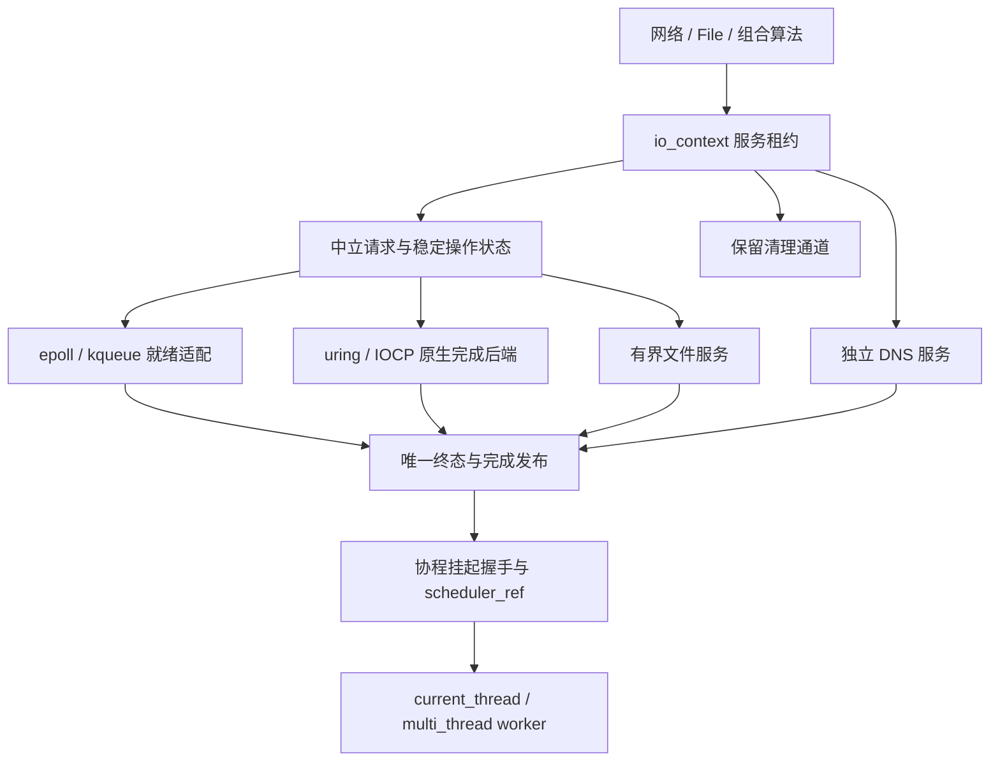

# 异步 IO

faio 使用 C++23 和 C++20 协程，提供纯头文件的 I/O 引擎、异步文件服务和可组合字节流。应用通过 `<faio/faio.hpp>` 使用完整 POSIX 实现，也可以独立包含所需模块。本文解析 I/O 层的架构：后端能力模型、引擎与运行时的边界、一次请求从提交到完成的完整管线、缓冲区借用契约、错误与取消语义，以及文件系统接口。

## 1. 平台与能力

| 平台 | 网络及可非阻塞描述符 | 普通文件及路径操作 | 当前构建选择 |
| --- | --- | --- | --- |
| Linux io_uring | 原生 SQE/CQE Proactor；readiness 用 POLL_ADD | 文件、属性、路径变更使用原生 opcode；无 opcode 操作使用有界 fallback | 新内核默认，显式 `IO_URING` |
| Linux epoll | 非阻塞 syscall 与就绪代际缓存 | 独立有界文件线程池 | 显式 `IO_EPOLL`、旧内核及无 uring 构建 |
| macOS | kqueue，非阻塞 syscall，就绪代际缓存 | 独立有界文件线程池 | kqueue |
| Windows | 原生 IOCP/OVERLAPPED Proactor 框架 | 原生 overlapped 文件 I/O 协议，具体操作未实现 | 本轮仅框架 |

Linux 默认构建 uring 与 epoll 双后端，依赖 liburing；`FAIO_ENABLE_IO_URING=OFF` 可构建无需 liburing 的 epoll 版本。运行 Linux 5.10 及更新内核默认 uring，更旧内核默认 epoll。显式选择不静默回退，uring 初始化失败会提示选择 `IO_EPOLL`。`io_capabilities` 描述实际能力：`network`、`readiness`、`vectored`、`filesystem`，以及按后端探测的 `native_filesystem`、`zero_copy` 和资源迁移能力 `migration`。后端名称通过 `backend` 查询。

网络接口见 [网络 IO](网络IO.md)。普通磁盘文件不注册到 epoll/kqueue。uring 通过缓存的实际 opcode 探测结果，在提交前选择原生请求或 fallback；原生请求直接准备 SQE、submit、等待 CQE、写入稳定操作结果，再恢复协程。已接受后失败的请求不会换路径重做副作用。epoll/kqueue 的普通文件操作使用独立有界文件服务。两条路径都通过唯一终态管线把协程投递回保存的调度器。

## 2. 引擎与运行时边界



| 类型 / 文件 | 职责 |
| --- | --- |
| `io::io_engine` / [engine.hpp](../include/faio/detail/io/engine.hpp) | 拥有 domain；提供 context、driver、submitter、能力；销毁前停机排空 |
| `io::io_context` / [context.hpp](../include/faio/detail/io/context.hpp) | 可复制的 domain 和服务租约；显式保存归属，不依赖恢复线程的 TLS |
| `io_driver_ref` | 借用驱动入口：`drive`、`wait_and_drive`、`wake`、`quiescent` |
| `io_submitter_ref` | 借用提交及取消入口；后台使用时另外保留 context 生命周期 |
| `io_request`、`operation_state` | 中立参数、稳定槽、终态、字节进度与完成目标 |
| `resource_state` | fd 所有权、不可变 domain 归属、读写执行权、就绪代际及关闭状态 |
| `IORegistrantAwaiter` / [io_registrant.hpp](../include/faio/detail/io/base/io_registrant.hpp) | 保存请求和调度器，实现提交与完成的挂起握手 |
| `execution::blocking_executor` | 固定数量线程、有界 FIFO 等待队列、关闭排空；原生后端的辅助服务按实际 fallback 需求启动 |
| `execution::execute` | 文件服务请求桥，拥有函数与结果，展开 `expected<T>` |

架构的关键是**单向依赖**：底层完成目标是函数表，I/O domain 不认识运行时 worker、公共网络类型或协程句柄。协程桥把完成转换为 `scheduler_ref` 投递；运行时负责队列、定时器、驱动预算和停机顺序。多线程运行时的 I/O 完成复用所属 worker 的私有快速槽，批次前项进入可窃取 FIFO；每连续 3 次快速恢复给已有 FIFO 任务一次执行机会。执行链的 64 次协作检查额度耗尽时，所属线程在下一次本地选择前将仍等待的快速任务通过原发布协议放到 FIFO 尾部，满队列时交给全局队列；成功发布后才清私有槽，入队失败保持原归属。已有 FIFO 任务按顺序执行，降级任务也能被同伴窃取；已有其他 FIFO 或全局工作时承担同伴通知责任。主动和条件让出通过库内自让出入口进入 FIFO 尾部；唯一的本地续体由当前 worker 领取，有可并行工作时通知同伴。公开 `scheduler_ref::schedule_yield()` 承担手工投递后的通知责任。I/O 完成批次结束后统一通知同伴。

`io_engine::binding` 临时安装默认 context，适合独立引擎集成；已有资源归属不会改变。driver/submitter 是借用引用，宿主 engine 必须覆盖其使用期间。

多线程运行时每个 worker 有一个 I/O domain；文件、DNS、清理服务在同一运行时内共享。新接受连接默认通过 `balanced_context()` 分布到活跃 domain，也支持 listener-local 和显式 context。归属只在首次注册时决定，协程迁移不迁移已有 fd。独立 engine 的 `balanced_context()` 返回自身；运行时全部 domain 停止后返回空 context。

## 3. 一次请求如何完成

### 3.1 请求管线

1. **构造 awaitable**：只保存参数。Recv/Send 使用初始化完整的紧凑拥有描述，保存资源强租约、flags、截止时间及方向/取消控制输入；readiness 即时 syscall 直接消费该描述。需要稳定提交时生成完整 io_request，冷字段采用完整默认值，资源租约移入同一稳定槽。路径、地址、iovec 数组及 msghdr 描述符由其他请求直接拥有；数据区遵循借用或拥有契约。

`faio::time::timeout` 与 `timeout_at` 为 IO 等待者保存截止时间：右值输入返回拥有型操作，左值输入返回原操作引用；支持完整请求、紧凑 Recv/Send 及兼容 `time::detail::Timeout<T>`。相对时间从配置调用时起算，等待时不重新开始。
2. **等待时确定归属**：检查停止、deadline、关闭及读写执行权，根据能力路由尝试非阻塞 syscall 或提交原生 SQE。
3. **稳定槽与代际**：readiness 适配下即时完成的非磁盘标量请求直接交付结果，不登记恢复目标；原生及需要等待的请求先保存协程句柄和调度引用，再进入稳定槽，token 包含槽位和代际。代际耗尽的槽退休，旧事件不能指向重新使用的请求。
4. **readiness 重试**：`EAGAIN` 时注册就绪兴趣。事件更新代际并重试 syscall；只有真实 syscall 的 `EAGAIN` 才清除对应缓存。错误和 EOF 保留到用户观察。
5. **唯一终态**：完成、取消、deadline 和关闭通过同一仲裁形成唯一终态。完成发布后回收槽。

### 3.2 挂起握手：arming/suspended/completed

协程桥 `IORegistrantAwaiter` 用一个三态原子 `gate_` 处理"提交过程中已经完成"的竞态：

| gate | 含义 |
| --- | --- |
| 0 (arming) | 提交进行中，完成方不得恢复或销毁帧 |
| 1 (suspended) | 协程已挂起，完成方负责调度恢复 |
| 2 (completed) | 结果已发布 |

```cpp
bool await_suspend(std::coroutine_handle<> handle) noexcept {
  // ... 确定 domain、归属资源、检查即时完成路径；即时结果直接返回 false ...
  // 只有真正进入稳定提交前才保存恢复目标，prepare_submit 可以同步发布结果。
  handle_ = handle;
  scheduler_ = ::faio::detail::current_scheduler();
  domain_ = domain->shared_from_this();
  // 默认完整请求策略；Recv/Send 先物化 full，容量失败则将 resource 归还 request_。
  const auto token =
      domain->prepare_submit(std::move(request_), {this, &publish}, error,
                             stop, cancellable_);
  if (!token.value) { _user_data.result = -error; return false; }
  token_ = token;
  // gate 尚为 arming，构造回调期间发生完成也不能提前恢复/销毁当前帧
  if (gate_.load(std::memory_order_acquire) != 2 && cancellable_ &&
      stop.stop_possible())
    stop_callback_.emplace(stop, cancel_callback{domain_, token});
  unsigned char arming = 0;
  return gate_.compare_exchange_strong(arming, 1, std::memory_order_acq_rel);
}
```

发布方在写回结果后交换 gate，只有观察到 suspended 才调度恢复：

```cpp
static void publish(void *consumer, std::int64_t result,
                    std::uint64_t transferred) noexcept {
  auto &awaiter = *static_cast<IORegistrantAwaiter *>(consumer);
  awaiter._user_data = {result, transferred};
  const auto previous =
      awaiter.gate_.exchange(2, std::memory_order_acq_rel);
  if (previous == 1) {
    auto scheduler = awaiter.scheduler_; // schedule 后 awaiter 可能立刻销毁
    const auto handle = awaiter.handle_;
    scheduler.schedule_io(handle);       // 之后发布者不再访问帧
  }
}
```

`await_suspend` 的 CAS 返回值直接决定是否挂起：完成先于挂起到达时，当前执行流直接继续。release/acquire 配对把结果写入与 `await_resume` 的读取串联起来，保证协程最多恢复一次。

### 3.3 槽位回收

普通稳定槽只有在文件 job 或原生请求解除借用、终态发布回调返回后才能进入空闲列表。回收时释放资源租约、拥有的 iovec 描述数组和路径存储，不保留这些容器的动态容量。下一代领取槽时完整覆盖请求及控制状态，再发布新的 allocated 标志和代际 token。空闲槽的非拥有字段不参与 I/O、取消、截止时间或关闭扫描。独立原生关闭控制记录按完整请求清理后销毁节点；零拷贝 MORE/ACK 不触发回收，必须等待最终 buffer-release。

### 3.4 uring 驱动的等待与唤醒

uring 等待使用原生 `io_uring_enter(GETEVENTS)`；支持 EXT_ARG 时传入等待时限，不支持时使用稳定 TIMEOUT SQE。跨线程唤醒通过一个原生 POLL_ADD 观察控制 eventfd；该控制请求只负责唤醒，不把业务网络和文件 I/O 转为 readiness 模式。驱动等待不使用外部 `poll(ring_fd)`，也不占用文件或清理线程。

控制通知使用独立原子标志合并：同一入口周期只有首次发布者写 eventfd，写入被 `EINTR` 中断时重试。`poll` 只在入口领取通知；领取后先推进提交和现成 CQE，随即返回宿主重查任务，不进入内核等待。消费控制 CQE 时只排空 eventfd，不清通知标志，所以排空期间新发布的通知仍由下一次入口领取。原生业务结果始终来自真实 CQE。

提交遇到 `EINTR`、`EAGAIN`、`ENOMEM` 或部分提交时，未交给内核的 SQE 和取消责任继续保留。驱动先消费已有真实 CQE，再有界返回给宿主重试；尚有本地提交责任时不进入无限 GETEVENTS。旧内核 TIMEOUT 的参数和唯一身份同样保持到真实 CQE——准备请求不等于内核已经接受请求。

### 3.5 低负载即时完成机会

本地低负载原生请求准备完成后，最多执行一次非阻塞 `poll(0)`，由后端直接提交 SQE 并读取至多 8 条真实 CQE；当前请求已完成时，协程桥在 arming gate 内继续执行，尚未完成则正常挂起。这个机会仅限域内资源和已分配操作均不超过 8、没有完成积压、控制请求或 SQ 背压的情况；高负载保持批量驱动。内部清理提交和已有驱动 session 不进入该路径。请求结果、取消 ACK、MORE 和 NOTIF 均由同一完成状态机处理，不执行同步业务系统调用。本次机会在处理真实 CQE 的同一域锁内独占领取当前 token，保存完成目标和标量结果；其他 token 的完成保留在完成链。机会函数退出自己的 driver session 和锁以后，锁外发布当前目标，再取得域锁回收稳定槽。消费者可以销毁 awaiter 或重新驱动引擎，槽、资源和内核引用覆盖到发布返回；尚未终结或未取得 driver 时沿常规领取路径处理。任何仍处于活动 driver session 内的同线程重入返回 `EBUSY`。

### 3.6 后端协议

所有后端位于 `io/backends` 下，使用同一 backend_box 和注册/提交/完成/取消/停机协议；epoll/kqueue 通过 readiness adapter 接入，uring 和 IOCP 按原生完成建模。就绪事件使用资源 token，原生完成使用稳定 operation 代际 token，均不保存 awaiter 裸地址。取消 ACK 不等于原操作完成；零拷贝数据 CQE 也不等于 buffer 释放，必须等 NOTIF 后交还借用内存。完成批量在锁外发布。事件处理预算和活跃请求容量独立，单次只收取少量事件不会限制整个引擎的在途请求数。

## 4. 缓冲区与借用

| 类型 | 所有权与有效期 |
| --- | --- |
| `std::span<char>` / `borrowed_buffer` | 借用可写内存；覆盖整个等待、取消及排空期间 |
| `std::span<const char>` / `borrowed_const_buffer` | 借用只读内存；等待期间不能修改或销毁 |
| `io_buffer` | 移动独占存储，区分 capacity 和已初始化 size |
| `shared_const_buffer` | 共享不可变存储，适合多个发送请求 |
| `io_transfer` | 返回拥有型 buffer 和实际传输字节数 |
| `read_buf` | 记录已填充区域和剩余可写区域的借用适配器 |

`io_buffer::writable_bytes()` 提供容量范围，`bytes()` 只暴露已初始化内容，读成功后更新 size。借用请求取消后，不会在后台仍访问内存时恢复调用者。拥有型请求错误会销毁其拥有的缓冲区，进度通过 `Error::progress()` 获取。

typed 网络/File 成员请求在创建时复制资源控制块，移动或销毁包装对象不影响该请求。`BufReader`、`BufWriter`、通用适配器和引用型组合算法借用底层对象：适配器和底层对象都必须覆盖异步操作，不能对临时适配器创建 task 后销毁适配器。

## 5. 错误、取消与关闭

异步 I/O 返回 `faio::expected<T>`；错误包含 `value()`、`domain()`、`progress()`。短读写属于成功，组合失败保留已传输字节数。目录递归错误的 progress 使用已完成条目数。

| 情况 | 语义 |
| --- | --- |
| 字节流空 buffer | 立即成功 0，不表示 EOF |
| 非空读返回 0 | 字节流 EOF |
| read_exact 遇 EOF | `Error::UnexpectedEOF`，保留部分进度 |
| write_all 遇零进度 | `Error::WriteZero`，避免无限循环 |
| 同方向网络执行冲突 | `EBUSY`；一个读和一个写可并行 |
| 普通服务等待队列满 | `EAGAIN`，请求未被接受 |
| 父 stop / runtime cancel_all | `ECANCELED`，等待已开始的文件 syscall 排空 |
| IO deadline | `ETIMEDOUT`，遵守借用排空 |
| 已关闭 File / ReadDir | `EBADF` |

raw/network awaitable 支持 `.set_timeout(duration)` 和 `.set_timeout_at(steady_clock::time_point)`，`execution::execute` 也提供这两个方法。文件高层 task 可使用结构化取消或 `time::timeout`。取消不保证即时停止已经开始的磁盘工作，必须等待实际终态与内核借用排空；先观察到的停止原因固定，随后到期的 deadline 不覆盖它。

文件服务排队请求在开始前停止会跳过 syscall，开始后等待 syscall、buffer 使用及游标更新完成才恢复协程。readiness 网络取消移除等待；原生取消等待原请求 CQE，零拷贝还须等待 buffer-release。排空之后才释放方向执行权，composite 的方向租约在整个组合结束后释放。

close 先停止 admission，再等活跃操作排空，最后关闭 fd。close 只调用一次，`EINTR` 不重试可能已复用的整数 fd。支持原生 CLOSE 时提交原生请求；原生析构关闭、半关闭及普通操作槽满时的关闭使用独立稳定控制请求，直到真实 CQE 返回才交付完成。非原生后端的可能阻塞关闭使用保留清理服务。清理不占普通文件等待容量，普通队列满也不能丢失关闭责任。拥有型写半边的自动半关闭等待单次写和完整组合写的方向租约全部排空。

驱动器的永久错误通过统一 `begin_failure` 协议停止接受新请求，并在后端能够安全排空时保留原请求至最终完成，错误结果仍带实际进度。原生请求的普通 CQE 错误返回 `Error`。若私有 ring 的提交通道永久损坏，无法证明内核已经解除借用，则触发 fail-fast；关闭 ring 不能替代内核引用排空证明。`EINTR`、`EAGAIN` 和暂时的资源不足保留重试责任。

## 6. 文件接口

`fs/provider.hpp` 在提交前按缓存能力选择一个 awaitable。原生分支直接使用 I/O 协程桥，没有额外转发协程或服务 job。File 的活跃租约保护 fd，路径和输出存储由请求拥有；底层完成后才释放租约。

| 操作 | uring 原生请求 |
| --- | --- |
| 打开、标量/聚集读写、同步、关闭 | OPENAT/OPENAT2、READ/WRITE、READV/WRITEV、FSYNC、CLOSE |
| 文件/路径属性、权限查询、seek(end) | STATX；fd 属性使用 AT_EMPTY_PATH，链接属性使用 AT_SYMLINK_NOFOLLOW |
| 设置文件长度 | FTRUNCATE |
| 目录创建、文件/目录删除 | MKDIRAT、UNLINKAT；删除目录设置 AT_REMOVEDIR |
| 重命名、硬链接、符号链接 | RENAMEAT、LINKAT、SYMLINKAT |
| 目录打开/关闭 | OPENAT、CLOSE |

当前 [Linux UAPI opcode 列表](https://github.com/torvalds/linux/blob/master/include/uapi/linux/io_uring.h) 和本轮验证的 [liburing 2.14 头文件](https://github.com/axboe/liburing/blob/liburing-2.14/src/include/liburing/io_uring.h) 均没有 GETDENTS、CHMOD、READLINK 对应 opcode，因此目录填充、权限修改和 canonicalize 等操作使用隔离的有界文件服务。目录枚举仅把 `getdents64` 缓存填充放到服务中，缓存解析、条目构造以及有 opcode 的目录变更保持在协程/原生路径。旧内核缺少某个 opcode 时，只有该操作在提交前选择 fallback。已经向内核提交的操作失败后不改走另一条路径重做副作用。

`fs::File` 是移动独占包装，保存稳定文件控制块。默认构造对象无 fd。`OpenOptions` 提供 read、write、append、truncate、create、create_new、creation_permissions；无访问权限、只读却要求创建/截断等无效组合返回 EINVAL。

```cpp
#include <faio/faio.hpp>
#include <array>

faio::task<faio::expected<void>> file_example(faio::fs::path path) {
    auto context = faio::io::io_context::current();
    auto file = co_await faio::fs::File::open(context, std::move(path),
        faio::fs::OpenOptions{}.read().write().create().truncate());
    if (!file) co_return std::unexpected{file.error()};
    constexpr std::string_view payload = "file data";
    auto written = co_await file->write_all(std::span<const char>{payload});
    if (!written) co_return std::unexpected{written.error()};
    std::array<char, 4> bytes{};
    auto read = co_await file->read_at(bytes, 0);
    if (!read) co_return std::unexpected{read.error()};
    auto synced = co_await file->sync_all();
    if (!synced) co_return std::unexpected{synced.error()};
    co_return co_await file->close();
}
```

| API | 行为 |
| --- | --- |
| open、create | 显式/当前 context 重载；create 以写入、创建、截断方式打开 |
| read、write | 短 I/O；span、borrowed buffer、拥有型 buffer |
| read_at、write_at | positional I/O，不改变逻辑游标，可与游标操作并行 |
| read_vectored、write_vectored | 拷贝 iovec 数组，payload 借用，推进逻辑游标 |
| read_vectored_at、write_vectored_at | positional 聚集 I/O，校验 IOV_MAX、总长度及偏移 |
| read_exact、write_all | 全程持共享游标及活跃租约，每个文件 job 至多 64KiB |
| seek | seek_from::start/current/end，逻辑游标不依赖 OS 隐式 offset |
| metadata、permissions | 原生 STATX 或不支持时的 fstat fallback，返回拥有型快照 |
| set_permissions、set_len | chmod fallback；长度使用原生 FTRUNCATE 或 ftruncate fallback |
| flush | 等待调用前已登记写操作，无隐式 fsync |
| sync_data、sync_all | 等已有写，再 fdatasync/fsync；macOS sync_data 使用 fsync |
| try_clone | dup fd，共享 faio 游标；关闭一个不关闭另一个 |
| close | 等操作及真正关闭，重复关闭观察同一完成状态 |
| native_handle、context | 借用 fd / 复制所属服务租约 |

普通 read/write/seek 与 clone 的游标操作使用异步锁串行，worker 不阻塞等锁。重新打开获得独立游标。append 使用 O_APPEND 和 write/writev，内核保证追加；append 文件 write_at 被拒绝，逻辑游标记录通过该包装传输的字节量。

Metadata 是拥有型 stat 快照，提供长度、类型、权限、访问/修改时间；same_file 根据设备和 inode 判断身份。快照不保证路径之后不变化。权限和文件名采用 POSIX 语义，保留路径原始字节，不强制 UTF-8 转换。

## 7. 路径与目录

路径操作按实际 opcode 能力使用原生请求或有界 fallback，均有显式及当前 context 重载：

| 分组 | API |
| --- | --- |
| 属性 | metadata、symlink_metadata、set_permissions、canonicalize |
| 读写 | read、read_to_string、write、copy |
| 文件变化 | rename、remove_file、hard_link、symlink |
| 目录 | create_dir、create_dir_all、remove_dir、remove_dir_all、read_dir |
| 构建器 | OpenOptions、DirBuilder |

fs::read/read_to_string 默认上限 256MiB，可指定上限；达到上限后探测额外一字节，过大返回 EFBIG，不把截断数据作为完整结果。copy 用 64KiB 有界块，拒绝同 inode 自复制（包括硬链接/链接别名）后才截断目标；成功时复制权限并等文件关闭。

create_dir_all 逐级提交 MKDIRAT；EEXIST 时查询属性确认该组件是目录。缺少 opcode 时使用短 fallback job，最多 256 级，已有目录权限不变。DirBuilder 的 recursive/permissions 配置在创建请求时复制，权限用于新目录，不对已有目录 chmod。

remove_dir_all 使用 fd 相对深度优先遍历，不跟随目录符号链接。uring 使用原生 STATX/OPENAT/UNLINKAT/CLOSE，仅无对应 opcode 的 getdents64 在服务中填充；epoll/kqueue 使用有界遍历批次。每个批次后回到协程侧让出协作预算。recursive_remove_options 的 max_depth 默认 256（含根）、max_state_bytes 默认 1MiB、batch_size 默认 64（最大 4096）。达到深度上限返回 ELOOP，状态内存上限返回 ENAMETOOLONG；失败/取消携带已删除条目数。删除不是原子事务，已删除内容不会回滚。

ReadDir::next_entry 返回 expected<optional<DirEntry>>，空 optional 表示 EOF。uring 游标拥有 4KiB getdents64 缓冲区，逐条校验记录长度和名称边界；一次领取至多缓存 64 条或 64KiB 名称。epoll/kqueue 的短服务批次遵守同一条目上限。路径和名字复制到拥有型条目，不暴露内核或 readdir 临时指针。取消放弃当前领取，已枚举缓存仍可继续领取；并发领取返回 EBUSY，外部目录变化不提供快照语义。

DirEntry::file_name/path 返回路径值，metadata 异步查询，file_type 在 d_type 已知时直接返回、未知时执行 lstat。ReadDir::close 等进行中批次后真正关闭游标；原生目录 fd 使用 CLOSE，fallback 游标使用 closedir。File/ReadDir 停机由最后一个活跃租约触发真正关闭，不在线程池中阻塞等待租约；清理等待票据保证驱动在这些租约和最终关闭完成前不能提前宣告排空。

## 8. 通用接口与组合算法

concept 检查实际等待结果：async_reader/async_writer 使用 io_buffer -> expected<io_transfer>，borrowed_async_reader/borrowed_async_writer 使用 span -> expected<size_t>，async_seeker 检查 expected<uint64_t>，async_buf_reader 检查 fill_buf/consume。

| 分组 | 类型 / 函数 |
| --- | --- |
| 完整传输 | read_exact、write_all、write_all_buf |
| 有界累计 | read_to_end、read_to_string、copy、copy_bidirectional |
| 缓冲 | BufReader、BufWriter、BufStream |
| 行/分隔符 | read_until、read_line、Lines、SplitByDelimiter |
| 适配 | take、chain、通用 split |
| 内存流 | MemoryStream、duplex、empty、repeat、sink |
| 字节序 | read/write_integer、u8/u16/u32/u64/i8/i16/i32/i64 及 _le 版本 |

BufReader 默认 8192 字节；fill_buf 的视图在 consume 或下一次读取后可能失效，不能绕过缓冲从底层读。BufWriter 默认 8192 字节，写成功可能仅表示进入用户缓冲，必须显式 flush/shutdown，析构不执行异步 I/O；flush 错误保留未提交尾部，可用 pending_bytes/take_pending 恢复。

read_until/read_line 默认单条最多 1MiB，超限返回 EMSGSIZE 并保留进度。Lines 处理 LF/CRLF；字符串是字节集合，不做编码验证。duplex 是有界双向环形通道，写满挂起，写半关闭后对端排空再得到 EOF。通用 split 串行访问同一底层对象；TCP/Unix 专用 split 支持独立读写方向。

copy_bidirectional 一个方向 EOF 后半关闭另一端写方向；一边失败会停止另一边，在两个孩子排空后返回。循环算法让出协作预算，但不强制抢占用户自己的同步计算。

## 9. AsyncFd 与原生扩展

io::unix::OwnedFd 是移动独占 fd 所有者；AsyncFd<Owner> 接受满足 get/release 和无抛出重建契约的自定义所有者。create 设置 NONBLOCK/CLOEXEC，拒绝普通文件、目录和块设备，这些对象使用 fs::File。

readable/writable/ready 返回 AsyncFdReadyGuard。guard::try_io 只运行短非阻塞同方向 syscall；clear_ready 只清除本次观察代际，旧 guard 不抹去更新事件。readiness 允许假阳性，仍需检查真实 EAGAIN。

`Ready::is_read_closed()` 和 `is_write_closed()` 分别查询读、写方向关闭；关闭提示与可读、可写位独立保存，EOF 不覆盖尚未读取的数据。等待依据所请求方向或真实错误完成，相反方向的半关闭不会让观察者立即成功。kqueue 的 `EV_EOF` 按 read/write filter 解释，Linux 的 RDHUP 只表示读方向终止，全 HUP 同时标记双方。kqueue 的 EOF 是过滤器特定条件，见 [Apple kevent 手册](https://developer.apple.com/library/archive/documentation/System/Conceptual/ManPages_iPhoneOS/man2/kevent.2.html)。

native_handle 是借用，用户不得关闭、修改 NONBLOCK 或绕过方向执行权。异步所有者 set_nonblocking(false) 返回错误。into_inner 仅在无活跃操作/组合租约/关闭等待时转移所有权并注销注册，之后可以自行调整原生 flags。

原始 io::read/write/readv/writev/recv/send/recvfrom/sendto/recvmsg/sendmsg/connect/accept/socket/open/openat/fsync/shutdown/close 提供中立 awaitable。路径及描述符数组在构造时复制，非法 null/iovec 数量和溢出偏移在等待时返回错误。Linux raw readv/writev 的 RWF flags 在原生路径写入 SQE，在文件服务路径交给 preadv2/pwritev2；macOS 非零 RWF flags 明确 ENOTSUP，不支持的后端专属参数不会静默忽略。Linux 的 open2/openat2 保留 open_how 路径解析约束，不以普通 open 冒充受约束打开。

隐式 raw fd 请求在准备前查找同一 runtime 已登记的资源，复用原 domain 与代际身份；协程恢复到其他 worker 后，取消仍能选中原请求。未知 fd 在当前 domain 首次借用注册。显式 `with_context(ctx)` 限定该 context 本域；跨独立引擎使用明确的 context 或资源对象。带资源对象的网络请求和 File 的原生借用请求直接使用保存的归属，跳过这一冷路径检索。

`io::send_zc/sendmsg_zc` 在原生能力可用时等待发送 CQE 与最终 NOTIF，不支持时返回明确错误；网络高层 `write_zc` 提供普通发送降级。`io::cmdsock` 的队列与 socket option 命令保持数字协议：INQ=0、OUTQ=1、GET=2、SET=3。GET 返回实际 optlen，SET 返回零，队列查询返回字节数；`io::getsockopt/setsockopt` 是相应便利入口。支持原生命令的 IP socket 使用 URING_CMD，Unix socket、旧内核及非原生后端在提交前选择等价短 syscall；不支持的查询明确返回错误。原始布尔 option 保留 OS 的非零表示，不强制转换为整数一。

`io::cancel(fd, flags)` 接受 0、ALL(1)、FD(2) 及组合(3)，请求本资源活跃方向与观察者取消。需要其他原生匹配身份的 ANY、FD_FIXED、USERDATA、OP 标志返回 ENOTSUP。取消控制请求成功不表示数据内存已经归还；原操作仍须等待最终结果和借用排空。外域取消即使控制请求立即完成，只要还有其他终态等待发布，也会通知所属 driver；本地取消由当前 owner 的驱动发布完成。

## 10. 服务配置与停机

| 配置构建器方法 | 默认值 / 含义 |
| --- | --- |
| set_mode、set_num_workers | multi_thread；worker 默认硬件并发数 |
| set_filesystem_threads、set_filesystem_queue_limit | 4 个线程，4096 个等待 job |
| set_resolver_threads、set_resolver_queue_limit | 2 个线程，1024 个等待 job |
| set_max_blocking_threads、set_blocking_queue_limit | 用户池 64 个线程，4096 个等待 job |
| set_num_events | reactor 事件批量，实际在 1–256 内 |
| set_io_interval、set_global_queue_interval | 持续有任务时 I/O / 全局队列轮询间隔，默认 61 |
| set_idle_spin_count | 启动前自动选择：Linux epoll/uring 为 0，kqueue 为 32；显式次数优先，0 在首次空队列驱动后直接准备休眠，UINT32_MAX 选择自动策略 |

epoll/kqueue 的文件、DNS 和清理服务在构造期预热固定线程。uring 的这些辅助服务只在首次真实 fallback 提交时启动；仅运行原生业务请求时，服务线程数为零。线程启动后复用固定线程，请求不反复创建或 join 线程。文件、DNS、用户任务拥有独立线程和等待容量，清理拥有保留通道。set_blocking_keep_alive 保留兼容配置，固定池在关闭时回收线程。

runtime::context::stop 默认 drain 等待已有任务，shutdown 默认 cancel_all 先停止再排空。同步停机从普通线程调用，依次拒绝新任务和 I/O、请求取消（若 cancel_all）、推进待完成操作、关闭资源、排空清理及阻塞服务、销毁驱动器。跨越 runtime 寿命的包装保留控制块，但失去可用句柄，后续请求返回停止/关闭错误。

## 11. 构建与验证入口

macOS 使用 Homebrew LLVM 23：

```sh
cmake --preset macos-clang23
cmake --build --preset macos-clang23 -j4
ctest --preset macos-clang23 --output-on-failure
```

Linux 使用支持 C++23 标准库的编译器。双后端同一个构建验证两次：

```sh
cmake --preset linux-dual
cmake --build --preset linux-dual -j4
ctest --preset linux-dual-epoll --output-on-failure
ctest --preset linux-dual-uring --output-on-failure
```

无需 liburing 的 epoll 构建：

```sh
cmake --preset linux-epoll
cmake --build --preset linux-epoll -j4
ctest --preset linux-epoll --output-on-failure
```

FAIO_SANITIZERS=address,undefined 启用 ASan/UBSan。scripts/check_installed_headers.py 验证安装包、平台适用头独立编译及双翻译单元消费。测试覆盖引擎协议、就绪、文件游标、分批目录、借用取消、代际复用、关闭和停机；tcp_counter_server --self-test 是会自行退出的多客户端 TCP 应用场景，常驻 TCP/UDP 服务与其他用法见 [示例指南](../examples/README.md)。
