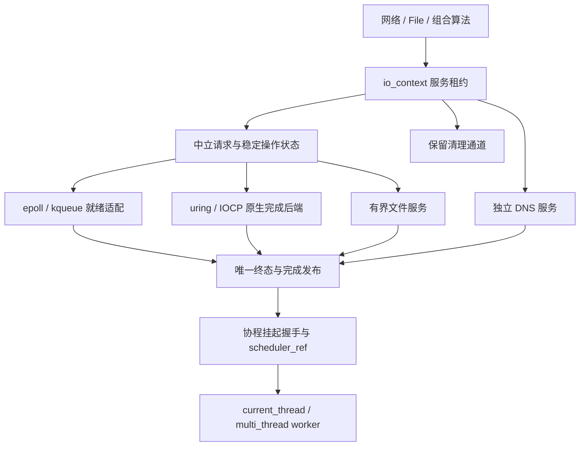
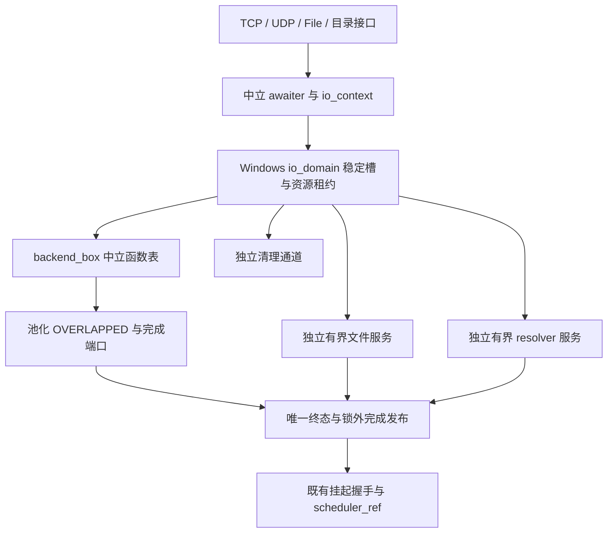

# 异步 IO

faio 使用 C++23 和 C++20 协程，提供纯头文件的 I/O 引擎、异步文件服务和可组合字节流。应用通过 `<faio/faio.hpp>` 使用相应平台实现，也可以独立包含所需模块。本文解析 I/O 层的架构：后端能力模型、引擎与运行时的边界、一次请求从提交到完成的完整管线、缓冲区借用契约、错误与取消语义、文件系统接口，以及 Windows IOCP 后端的完整实现。

## 1. 平台与能力

| 平台 | 网络及可非阻塞描述符 | 普通文件及路径操作 | 当前构建选择 |
| --- | --- | --- | --- |
| Linux io_uring | 原生 SQE/CQE Proactor；readiness 用 POLL_ADD | 文件、属性、路径变更使用原生 opcode；无 opcode 操作使用有界 fallback | 新内核默认，显式 `IO_URING` |
| Linux epoll | 非阻塞 syscall 与就绪代际缓存 | 独立有界文件线程池 | 显式 `IO_EPOLL`、旧内核及无 uring 构建 |
| macOS | kqueue，非阻塞 syscall，就绪代际缓存 | 独立有界文件线程池 | kqueue |
| Windows | IOCP 原生收发、AcceptEx、ConnectEx；ready 为非消费 WSAPoll | OVERLAPPED 文件数据 IO；路径、元数据、目录操作使用独立有界服务 | IOCP，MSVC / clang-cl / MinGW-w64 |

Linux 默认构建 uring 与 epoll 双后端，依赖 liburing；`FAIO_ENABLE_IO_URING=OFF` 可构建无需 liburing 的 epoll 版本。后端选择由 [backend_selection.hpp](../include/faio/detail/io/backend_selection.hpp) 的 `resolve_io_backend` 完成：运行 Linux 5.10 及更新内核默认 uring，更旧内核默认 epoll。显式选择不静默回退——未编译 uring 或内核过旧时直接抛出 `std::invalid_argument`，uring 初始化失败会提示选择 `IO_EPOLL`：

```cpp
// backend_selection.hpp（省略 uname 读取与版本解析）
const bool supported = version.major > 5 || (version.major == 5 && version.minor >= 10);
if (requested == runtime::io_backend::IO_URING && !supported)
  throw std::invalid_argument("io_uring 需要 Linux >= 5.10；请使用 set_io_backend(IO_EPOLL)");
return requested.value_or(supported ? runtime::io_backend::IO_URING
                                    : runtime::io_backend::IO_EPOLL);
```

`io_capabilities`（[capabilities.hpp](../include/faio/detail/io/capabilities.hpp)）描述实际能力：`network`、`readiness`、`vectored`、`filesystem`，以及按后端探测的 `native_filesystem`、`zero_copy`、`native_accept_nowait` 和资源迁移能力 `migration`。后端名称通过 `backend` 查询。能力不是按平台名猜测的常量，而是由 `io_domain::capabilities()` 向后端逐项查询 `supports(opcode)` 组装：

```cpp
// core/domain.hpp；iocp/domain.hpp 的同名方法只要求 read/write
io_capabilities capabilities() const noexcept {
  io_capabilities c;
  c.backend = backend_.name();
  c.native_filesystem = backend_.native() && supports_native(operation_kind::read)
                        && supports_native(operation_kind::write)
                        && supports_native(operation_kind::open)
                        && supports_native(operation_kind::fsync);
  c.zero_copy = supports_native(operation_kind::send_zc);
  c.native_accept_nowait = supports_native(operation_kind::accept_nowait);
  return c;
}
```

网络接口见 [网络 IO](网络IO.md)。普通磁盘文件不注册到 epoll/kqueue。uring 通过缓存的实际 opcode 探测结果，在提交前选择原生请求或 fallback；原生请求直接准备 SQE、submit、等待 CQE、写入稳定操作结果，再恢复协程。已接受后失败的请求不会换路径重做副作用。epoll/kqueue 的普通文件操作使用独立有界文件服务。两条路径都通过唯一终态管线把协程投递回保存的调度器。

Windows 后端的完整分层、请求生命周期、所有权边界与平台语义见第 8 章「Windows IOCP 后端」。

## 2. 引擎与运行时边界



| 类型 / 文件 | 职责 |
| --- | --- |
| `io::io_engine` / [engine.hpp](../include/faio/detail/io/engine.hpp) | 拥有 domain；提供 context、driver、submitter、能力；销毁前停机排空 |
| `io::io_context` / [context.hpp](../include/faio/detail/io/context.hpp) | 可复制的 domain 和服务租约；显式保存归属，不依赖恢复线程的 TLS |
| `io_driver_ref` / [driver_ref.hpp](../include/faio/detail/io/driver_ref.hpp) | 借用驱动入口：`drive`、`wait_and_drive`、`wake`、`quiescent` |
| `io_submitter_ref` / [submitter_ref.hpp](../include/faio/detail/io/submitter_ref.hpp) | 借用提交及取消入口；后台使用时另外保留 context 生命周期 |
| `io_request`、`operation_state` / [operation.hpp](../include/faio/detail/io/operation.hpp) | 中立参数、稳定槽、终态、字节进度与完成目标 |
| `resource_state` / [resource_state.hpp](../include/faio/detail/io/core/resource_state.hpp) | fd 所有权、不可变 domain 归属、读写执行权、就绪代际及关闭状态 |
| `IORegistrantAwaiter` / [io_registrant.hpp](../include/faio/detail/io/base/io_registrant.hpp) | 保存请求和调度器，实现提交与完成的挂起握手 |
| `execution::blocking_executor` | 固定数量线程、有界 FIFO 等待队列、关闭排空；原生后端的辅助服务按实际 fallback 需求启动 |
| `execution::execute` | 文件服务请求桥，拥有函数与结果，展开 `expected<T>` |

架构的关键是**单向依赖**：底层完成目标是函数表，I/O domain 不认识运行时 worker、公共网络类型或协程句柄。协程桥把完成转换为 `scheduler_ref` 投递；运行时负责队列、定时器、驱动预算和停机顺序。多线程运行时的 I/O 完成复用所属 worker 的私有快速槽，批次前项进入可窃取 FIFO；每连续 3 次快速恢复给已有 FIFO 任务一次执行机会。执行链的 64 次协作检查额度耗尽时，所属线程在下一次本地选择前将仍等待的快速任务通过原发布协议放到 FIFO 尾部，满队列时交给全局队列；成功发布后才清私有槽，入队失败保持原归属。已有 FIFO 任务按顺序执行，降级任务也能被同伴窃取；已有其他 FIFO 或全局工作时承担同伴通知责任。主动和条件让出通过库内自让出入口进入 FIFO 尾部；唯一的本地续体由当前 worker 领取，有可并行工作时通知同伴。公开 `scheduler_ref::schedule_yield()` 承担手工投递后的通知责任。I/O 完成批次结束后统一通知同伴。

### 2.1 io_engine：拥有型引擎

[engine.hpp](../include/faio/detail/io/engine.hpp) 的 `io_engine` 是一个薄 owning 包装：唯一成员是 `std::shared_ptr<detail::io_domain>`，全部接口都是向 domain 的转发：

```cpp
class io_engine {
 public:
  explicit io_engine(engine_config config = {})
      : domain_(std::make_shared<detail::io_domain>(std::move(config))) {}
  // Windows 另提供无异常工厂 io_engine::create，返回 expected<io_engine, error_code>。
  io_engine(io_engine&&) = default;
  ~io_engine() { shutdown(); }

  io_context context() const noexcept { return io_context{domain_}; }
  io_driver_ref driver() const noexcept {
    return domain_ ? io_driver_ref{*domain_} : io_driver_ref{};
  }
  io_submitter_ref submitter() const noexcept {
    return domain_ ? io_submitter_ref{*domain_} : io_submitter_ref{};
  }
  void shutdown() noexcept {
    if (domain_)
      domain_->shutdown();
  }

  class binding { /* 临时安装 IO TLS 默认 context，析构恢复原值 */ };
 private:
  std::shared_ptr<detail::io_domain> domain_;
};
```

设计要点：引擎不直接持有后端或线程，析构只调用 `domain_->shutdown()`——拒绝新请求、取消、排空、关闭服务的完整顺序由 domain 实现。domain 用 `shared_ptr` 持有是因为 `io_context`、资源控制块和取消回调都需要独立的租约，引擎对象本身销毁后，尚未完成的操作仍能把 domain 保活到最终完成。driver/submitter 是只保存裸指针的借用引用，宿主 engine 必须覆盖其使用期间。`binding` 临时安装默认 context，适合独立引擎集成；已有资源归属不会改变。

### 2.2 io_context：可复制的服务租约

[context.hpp](../include/faio/detail/io/context.hpp) 的 `io_context` 同样只保存一个 `shared_ptr<io_domain>`，但它是可复制、可跨协程传递的值类型：

```cpp
class io_context {
 public:
  static io_context current();                       // 读取当前 worker 的默认归属
  bool stopped() const noexcept;
  execution::blocking_executor_ref blocking() const noexcept;   // 文件服务
  execution::blocking_executor_ref resolver() const noexcept;   // DNS 服务
  execution::blocking_executor_ref cleanup() const noexcept;    // 保留清理通道
  io_context balanced_context() const noexcept;      // 为新连接选择 runtime 内目标 shard
  void defer_cleanup(::faio::move_only_function<void()> cleanup) const noexcept;
  const std::shared_ptr<detail::io_domain>& domain() const noexcept { return domain_; }
 private:
  std::shared_ptr<detail::io_domain> domain_;
};
```

File、socket 包装对象在创建时复制 context，此后所有提交、清理和停机清理注册都走保存的租约，不读取恢复线程的 TLS——协程迁移到其他 worker 后，请求仍进入原 domain。注释"存活不等于 runtime 仍接受新请求"提醒：持有 context 不保证 domain 未停止，提交路径会再检查 `stopped()`。

### 2.3 driver_ref 与 submitter_ref：借用控制面

两个引用类型把"驱动"和"提交"分离成最小接口（[driver_ref.hpp](../include/faio/detail/io/driver_ref.hpp)、[submitter_ref.hpp](../include/faio/detail/io/submitter_ref.hpp)）：

```cpp
class io_driver_ref {
 public:
  drive_result drive(drive_budget budget = {}) const noexcept {
    return domain_ ? domain_->drive(budget) : drive_result{0, false, false, ECANCELED};
  }
  drive_result wait_and_drive(std::optional<int> timeout = {},
                              drive_budget budget = {}) const noexcept;
  void wake() const noexcept;
  bool quiescent() const noexcept { return !domain_ || domain_->quiescent(); }
 private:
  detail::io_domain* domain_{};  // 宿主 owning engine 覆盖借用 session 生命周期。
};

class io_submitter_ref {
 public:
  void submit(operation_token token) const noexcept;
  void request_cancel(operation_token token,
                      cancel_reason reason = cancel_reason::user) const noexcept;
 private:
  detail::io_domain* domain_{};
};
```

运行时 worker 只通过 `io_driver_ref` 驱动完成队列，网络/timer 等子系统只通过 `io_submitter_ref` 提交或取消；两者互不暴露对方能力，也不暴露 epoll/uring/IOCP 的任何细节。空引用是可安全调用的 no-op（返回 `ECANCELED`），后台 callback 使用 submitter 时必须另外保存 context 租约保证 domain 存活。

### 2.4 多线程分片

多线程运行时每个 worker 有一个 I/O domain；文件、DNS、清理服务在同一运行时内共享。新接受连接默认通过 `balanced_context()` 分布到活跃 domain，也支持 listener-local 和显式 context。归属只在首次注册时决定，协程迁移不迁移已有 fd。独立 engine 的 `balanced_context()` 返回自身；运行时全部 domain 停止后返回空 context。

## 3. 一次请求如何完成

### 3.1 请求管线

1. **构造 awaitable**：只保存参数。Recv/Send 使用初始化完整的紧凑拥有描述 `scalar_io_request`（[operation.hpp](../include/faio/detail/io/operation.hpp)），保存资源强租约、flags、截止时间及方向/取消控制输入；readiness 即时 syscall 直接消费该描述。需要稳定提交时由 `into_request()` 生成完整 `io_request`，冷字段采用完整默认值，资源租约移入同一稳定槽。路径、地址、iovec 数组及 msghdr 描述符由请求直接拥有；数据区遵循借用或拥有契约。

`faio::time::timeout` 与 `timeout_at` 为 IO 等待者保存截止时间：右值输入返回拥有型操作，左值输入返回原操作引用；支持完整请求、紧凑 Recv/Send 及兼容 `time::detail::Timeout<T>`。相对时间从配置调用时起算，等待时不重新开始。

2. **等待时确定归属**：检查停止、deadline、关闭及读写执行权，根据能力路由尝试非阻塞 syscall 或提交原生 SQE。
3. **稳定槽与代际**：readiness 适配下即时完成的非磁盘标量请求直接交付结果，不登记恢复目标；原生及需要等待的请求先保存协程句柄和调度引用，再进入稳定槽，token 包含槽位和代际。代际耗尽的槽退休，旧事件不能指向重新使用的请求。
4. **readiness 重试**：`EAGAIN` 时注册就绪兴趣。事件更新代际并重试 syscall；只有真实 syscall 的 `EAGAIN` 才清除对应缓存。错误和 EOF 保留到用户观察。
5. **唯一终态**：完成、取消、deadline 和关闭通过同一仲裁形成唯一终态。完成发布后回收槽。

### 3.2 挂起握手：arming/suspended/completed

协程桥 `IORegistrantAwaiter`（[io_registrant.hpp](../include/faio/detail/io/base/io_registrant.hpp)）用一个三态原子 `gate_` 处理"提交过程中已经完成"的竞态：

| gate | 含义 |
| --- | --- |
| 0 (arming) | 提交进行中，完成方不得恢复或销毁帧 |
| 1 (suspended) | 协程已挂起，完成方负责调度恢复 |
| 2 (completed) | 结果已发布 |

**await_ready：永不即时完成。** 构造 awaiter 只保存参数，不做任何 I/O；所有副作用集中在 `await_suspend`，这样"构造后未 co_await 就销毁"的 awaiter 不会留下内核引用：

```cpp
bool await_ready() const noexcept { return false; }  // 准备阶段不偷偷发起 IO。
```

**await_suspend：确定归属、尝试即时路径、进入稳定槽。** 完整实现（省略 raw fd 冷路径查找与首次 bind 的异常处理）：

```cpp
bool await_suspend(std::coroutine_handle<> handle) noexcept {
  auto* domain = request_.resource ? request_.resource->owner.get() : nullptr;
  io_context context;  // 只有尚未归属的资源/raw fd 才需要取得默认 context 租约。
  if (!domain) {
    context = context_ ? context_ : io_context::current();
    if (!context) { _user_data.result = -ECANCELED; return false; }
    domain = context.domain().get();
  }
  // raw fd 不携带 shard 身份：在同一 runtime 内查找已登记资源，复用原 domain
  // 与代际身份（冷路径；带资源对象的请求跳过）。此处省略。
  const auto& stop = ::faio::detail::current_stop_token;  // arming 期间借用 TLS
  if (const auto immediate =
          domain->try_immediate(request_, cancellable_ && stop.stop_requested())) {
    _user_data = {immediate->result, immediate->transferred};
    gate_.store(2, std::memory_order_release);  // 没有留存异步引用，当前帧直接继续执行。
    return false;
  }
  // 只有真正进入稳定提交前才保存恢复目标，prepare_submit 可以同步发布结果。
  handle_ = handle;
  scheduler_ = ::faio::detail::current_scheduler();
  domain_ = domain->shared_from_this();  // 真正异步路径先建立拥有型租约，再移动请求到稳定槽。
  int error{};
  const auto token =
      domain->prepare_submit(std::move(request_), {this, &publish}, error, stop, cancellable_);
  // 紧凑 Recv/Send 策略先 into_request() 物化完整请求；未接受时把 resource 租约
  // 还原回原 awaiter。此处省略该分支。
  if (!token.value) { _user_data.result = -error; return false; }
  token_ = token;  // token 含 slot 与 generation，取消回调不会借用 operation 地址。
  // gate 尚为 arming，构造回调期间发生完成也不能提前恢复/销毁当前帧
  if (gate_.load(std::memory_order_acquire) != 2 && cancellable_ && stop.stop_possible())
    stop_callback_.emplace(stop, cancel_callback{domain_, token});
  // CAS 成功后另一线程可立即恢复/销毁帧；之后只返回局部值，不能再访问成员。
  unsigned char arming = 0;
  return gate_.compare_exchange_strong(arming, 1, std::memory_order_acq_rel);
}
```

逐段看这段代码的竞态处理：

- **归属确定先于一切副作用**：已绑定资源的请求直接使用 `resource->owner`，未归属的 raw fd 才读取显式 context 或 TLS 默认 context；没有可用 domain 时直接以 `ECANCELED` 完成，返回 `false` 不挂起。
- **try_immediate 是 readiness 后端的同步尝试**：在域短锁内执行一次非阻塞 syscall，成功或遇非 EAGAIN 错误时直接写 `_user_data` 并把 gate 置为 completed——此时没有保存句柄、没有稳定槽、没有任何异步引用，返回 `false` 让当前执行流继续。原生 Proactor 后端永远走稳定槽（见 3.9）。
- **保存恢复目标先于 prepare_submit**：`handle_`、`scheduler_`、`domain_` 必须在调用可能同步发布结果的 `prepare_submit` 之前初始化，否则同步完成到达 `publish` 时会读到未初始化的调度器。
- **prepare_submit 的同步完成由 gate 吸收**：域在锁内可能直接 `finish` 并发布结果（例如参数错误、deadline 已过），`publish` 把 gate 交换为 2。随后 `await_suspend` 的 CAS（expected=arming）失败，返回 `false`——完成先于挂起到达时当前执行流直接继续，不挂起、不二次恢复。
- **取消回调的最后防线**：注册 stop_callback 前先读一次 gate，若已完成就不再订阅任务停止；arming 期间完成方即使看到 gate != suspended 也只写结果，由 CAS 决定谁负责继续执行。

**publish：唯一完成边界。** 域在锁外调用保存的 `completion_target`，写回结果后交换 gate，只有观察到 suspended 才调度恢复：

```cpp
static void publish(void* consumer, std::int64_t result, std::uint64_t transferred) noexcept {
  auto& awaiter = *static_cast<IORegistrantAwaiter*>(consumer);
  awaiter._user_data = {result, transferred};  // release gate 之前完整写入结果。
  const auto previous = awaiter.gate_.exchange(2, std::memory_order_acq_rel);  // 唯一完成边界。
  if (previous == 1) {
    // 已挂起才调度；arming 状态由 await_suspend 自身继续执行。
    auto scheduler = awaiter.scheduler_;  // schedule 后 awaiter 可能立刻销毁，先复制引用。
    const auto handle = awaiter.handle_;  // 之后恢复线程可以独占协程帧，发布者不再访问帧。
    try {
      scheduler.schedule_io(handle);  // runtime 支持时进入本地快速槽/批次 FIFO。
    } catch (...) {
      std::terminate();
    }
    // schedule 接管后不再访问 awaiter，恢复线程可能已销毁它。
  }
}
```

内存序上，`publish` 先写 `_user_data` 再以 `acq_rel` 交换 gate，`await_suspend` 以 `acq_rel` CAS、`await_resume` 在 gate==2 后读取结果——release/acquire 配对把结果写入与读取串联起来，保证协程最多恢复一次。`schedule_io` 交出帧所有权前先复制 scheduler 和 handle 到局部变量，因为 schedule 返回后恢复线程可能已销毁 awaiter。

**await_resume：只读取已发布结果。** 基类不写这个函数，由具体 awaiter 按返回类型解码（[recv.hpp](../include/faio/detail/io/awaiter/recv.hpp)）：

```cpp
auto await_resume() const noexcept -> expected<std::size_t> {
  if (this->_user_data.result < 0)
#if defined(_WIN32)
    return std::unexpected{windows::make_io_error(static_cast<int>(-this->_user_data.result),
                                                  this->_user_data.transferred)};
#else
    return std::unexpected{
        Error{static_cast<int>(-this->_user_data.result), this->_user_data.transferred}};
#endif
  return static_cast<std::size_t>(this->_user_data.result);
}
```

负结果在公共边界解码为 `Error`：POSIX 直接是 errno 加进度；Windows 由 `make_io_error` 按内部标签还原 Win32/Winsock 来源（见 8.8）。此时内核借用已经排空，`await_resume` 不重试、不提交、不访问任何后端状态。

### 3.3 稳定槽与代际 token

domain 构造时预热全部操作槽，普通 read/write 热路径不向通用堆申请内存。`prepare_locked`（[core/domain.hpp](../include/faio/detail/io/core/domain.hpp)）是纯槽准备：不取得执行权、不提交 IO、不发布消费者：

```cpp
operation_token prepare_locked(io_request&& request, completion_target target, int& error) noexcept {
  operation_state* selected = nullptr;
  while (!free_.empty()) {
    const auto candidate_index = free_.back();
    free_.pop_back();
    auto& candidate = *operations_[candidate_index];
    if (candidate.generation == UINT32_MAX) {
      ++retired_slots_;  // 永久退休，禁止 generation 回绕与迟到 token 碰撞。
      continue;
    }
    selected = &candidate;
    break;
  }
  if (!selected) { /* 原生后端的 close/内部控制请求改用独立控制记录，略 */ }
  if (!selected) {
    error = EAGAIN;  // 所有未退休槽都在使用，调用方仍能在接受前安全回滚。
    return {};
  }
  auto& op = *selected;
  const auto index = op.slot;
  if (index != UINT32_MAX)
    ++op.generation;  // 控制记录已有不可复用 token，普通槽仍使用代际协议。
  op.request = std::move(request);  // 直接从调用者移入稳定槽。
  op.target = target;               // 消费者仅由用户态统一发布链调用。
  if (index != UINT32_MAX)
    op.token = {static_cast<std::uint64_t>(op.generation) << 32 | (index + 1)};
  op.allocated = true;   // 从此开始占用容量，直到结果发布完毕才允许回收。
  op.accepted = false;   // Prepared 尚未执行 syscall，也没有资源 active 计数。
  op.terminal = false;
  // ... 清除上一代全部状态（cancellation、链表指针、原生标志等），此处省略 ...
  return op.token;
}
```

token 是高 32 位代际 + 低 32 位（槽号+1）的 64 位整数，永不复用；代际耗尽的槽永久退休，旧 token 的迟到事件或取消不会命中复用后的请求。取消、查找一律按完整 token 校验，`lookup` 同时检查槽位与代际。

### 3.4 槽位回收

普通稳定槽只有在文件 job 或原生请求解除借用、终态发布回调返回后才能进入空闲列表。回收时释放资源租约、拥有的 iovec 描述数组和路径存储，不保留这些容器的动态容量。下一代领取槽时完整覆盖请求及控制状态（见上文 `prepare_locked` 的清零段），再发布新的 allocated 标志和代际 token。空闲槽的非拥有字段不参与 I/O、取消、截止时间或关闭扫描。独立原生关闭控制记录按完整请求清理后销毁节点；零拷贝 MORE/ACK 不触发回收，必须等待最终 buffer-release。

### 3.5 接受与提交：submit_locked 仲裁链

`submit_locked` 是唯一的接受状态转换，停止、sticky cancel、参数校验、deadline、方向执行权和路由在同一个域锁内按固定顺序仲裁（节选，省略各 `finish` 分支的校验细节）：

```cpp
bool submit_locked(operation_token token, bool& wake_needed,
                   bool& native_completion_opportunity) noexcept {
  auto* op = lookup(token);  // 必须同时检查 slot 与 generation，不能只凭地址找请求。
  if (!op || op->accepted)
    return false;
  op->accepted = true;  // 唯一接受边界；后续错误也必须向消费者交付一次结果。
  if (stopped() && op->request.kind != operation_kind::close && !op->request.uncancellable)
    finish(*op, -ECANCELED);
  else if (op->cancellation)
    finish(*op, -op->cancellation);  // Prepared 阶段的取消在 accepted 前 sticky 保存。
  else if (op->request.validation_error)
    finish(*op, -op->request.validation_error);  // 非法参数不取得执行权，也不触发 syscall。
  // ... 关闭/归属/deadline 校验，此处省略 ...
  else {
    // 方向执行权：同方向冲突 EBUSY；establish_reservation 在同一锁内建立组合租约。
    if (direction & 1) { r->reader = op; op->uses_reader = true; }
    if (direction & 2) { r->writer = op; op->uses_writer = true; }
    ++r->active;  // 覆盖排队、syscall 及严格取消排空；close 必须等待归零。
    if (!op->terminal) {
      if (req.deadline)
        update_deadline(*req.deadline);
      if (can_native_request(req))
        submit_native(*op);          // 原生后端：try_submit 进 SQE/OVERLAPPED。
      else if (is_file_request(req))
        submit_file(*op);            // 文件请求交给隔离执行器。
      else if (req.observed_would_block && r && r->registered
               && req.observed_readiness_generation == r->readiness_generation
               && !(r->readiness & (direction_of(req.kind) | error_bit))) {
        // 同一已注册 ET 资源、没有更新事件：真实 EAGAIN 已执行，直接等待就绪。
      } else
        attempt(*op);                // readiness：执行非阻塞 syscall，EAGAIN 则登记等待。
    }
  }
  // ... 外域提交的通知判定与低负载机会资格快照，此处省略 ...
  return true;
}
```

`accepted` 是唯一边界：此前的失败（容量、参数）尚未接受，调用方可以安全回滚请求；此后任何路径都必须经 `finish` 交付一次结果，不存在"静默丢弃"的分支。取消也按同一协议：`request_cancel` 只按代际 token 查槽，首次写入的取消原因 sticky 保留，deadline 到期映射为 `ETIMEDOUT`、其余为 `ECANCELED`，随后到期的 deadline 不覆盖先观察到的停止原因。

### 3.6 uring 驱动的等待与唤醒

uring 等待使用原生 `io_uring_enter(GETEVENTS)`；支持 EXT_ARG 时传入等待时限，不支持时使用稳定 TIMEOUT SQE。跨线程唤醒通过一个原生 POLL_ADD 观察控制 eventfd；该控制请求只负责唤醒，不把业务网络和文件 I/O 转为 readiness 模式。驱动等待不使用外部 `poll(ring_fd)`，也不占用文件或清理线程。

控制通知使用独立原子标志合并：同一入口周期只有首次发布者写 eventfd，写入被 `EINTR` 中断时重试。`poll` 只在入口领取通知；领取后先推进提交和现成 CQE，随即返回宿主重查任务，不进入内核等待。消费控制 CQE 时只排空 eventfd，不清通知标志，所以排空期间新发布的通知仍由下一次入口领取。原生业务结果始终来自真实 CQE。

提交遇到 `EINTR`、`EAGAIN`、`ENOMEM` 或部分提交时，未交给内核的 SQE 和取消责任继续保留。驱动先消费已有真实 CQE，再有界返回给宿主重试；尚有本地提交责任时不进入无限 GETEVENTS。旧内核 TIMEOUT 的参数和唯一身份同样保持到真实 CQE——准备请求不等于内核已经接受请求。

### 3.7 低负载即时完成机会

本地低负载原生请求准备完成后，最多执行一次非阻塞 `poll(0)`，由后端直接提交 SQE 并读取至多 8 条真实 CQE；当前请求已完成时，协程桥在 arming gate 内继续执行，尚未完成则正常挂起。这个机会仅限域内资源和已分配操作均不超过 8、没有完成积压、控制请求或 SQ 背压的情况；高负载保持批量驱动。内部清理提交和已有驱动 session 不进入该路径。请求结果、取消 ACK、MORE 和 NOTIF 均由同一完成状态机处理，不执行同步业务系统调用。本次机会在处理真实 CQE 的同一域锁内独占领取当前 token，保存完成目标和标量结果；其他 token 的完成保留在完成链。机会函数退出自己的 driver session 和锁以后，锁外发布当前目标，再取得域锁回收稳定槽。消费者可以销毁 awaiter 或重新驱动引擎，槽、资源和内核引用覆盖到发布返回；尚未终结或未取得 driver 时沿常规领取路径处理。任何仍处于活动 driver session 内的同线程重入返回 `EBUSY`。

### 3.8 后端协议：backend_box 中立函数表

所有后端位于 `io/backends` 下，通过 [backend_protocol.hpp](../include/faio/detail/io/backend_protocol.hpp) 的 `backend_box` 接入同一注册/提交/完成/取消/停机协议。协议的中立数据类型：

```cpp
// 原生注册值不截断 HANDLE/SOCKET；只有 POSIX adapter 转为 int。
enum class native_handle_kind : std::uint8_t { posix_descriptor, windows_handle, windows_socket };
struct native_registration {
  std::uintptr_t value{};             // 保存完整原生值；不把 HANDLE 或 Win64 SOCKET 缩窄为 int。
  native_handle_kind kind{native_handle_kind::posix_descriptor};
};

// 全部后端共用的接受协议；would_queue 尚未保存内核引用。
enum class backend_submit_status : std::uint8_t { accepted, would_queue, rejected };

// 原生完成、取消确认与 buffer release 是不同事件，不能混为一次恢复。
enum class backend_event_kind : std::uint8_t { readiness, result, cancel_ack, buffer_release };

struct backend_event {
  backend_event_kind kind;
  std::uint64_t key;    // readiness 为资源代际，其余为操作代际；零为控制通道。
  std::int64_t result;  // 结果为字节数/原生结果，失败为负错误码，ACK 不携带业务完成。
  std::uint32_t flags;  // 中立 readiness 位或原生完成通知标记。
};

// 请求描述符指向稳定槽中的拥有型请求，绝不指向 awaiter。
struct backend_operation {
  std::uint64_t token{};  // 完整 slot/generation，控制 CQE 不可借用 token 高位做 tag。
  void* request{};        // 指向域拥有的稳定 typed 请求；accepted 后最后事件前不得移动或销毁。
};
```

`backend_box` 用手写小函数表擦除具体后端类型——纯头文件没有虚基类，也没有 ODR 问题：

```cpp
class backend_box {
 public:
  template <class B>
  explicit backend_box(std::unique_ptr<B> object)
      : object_(object.release()), table_(&table_for<B>) {}  // 仅 owning box 接管一次原生后端。
  ~backend_box() {
    if (object_)
      table_->destroy(object_);
  }

  backend_submit_result try_submit(backend_operation op) noexcept {
    return table_->submit(object_, op);
  }
  int poll(std::span<backend_event> out, std::optional<int> timeout) noexcept {
    return table_->poll(object_, out, timeout);
  }
  void request_cancel(backend_operation operation) noexcept { table_->cancel(object_, operation); }
  bool begin_failure(int error) noexcept { return table_->failure(object_, error); }
  bool native() const noexcept { return table_->native; }
  bool supports(std::uint32_t kind) const noexcept { return table_->supports(object_, kind); }
  // attach/detach/flush/wake/begin_shutdown/quiescent/name/statistics 同理转发，略。
 private:
  struct operations {
    int (*attach)(void*, native_registration, std::uint64_t) noexcept;
    void (*detach)(void*, native_registration) noexcept;
    backend_submit_result (*submit)(void*, backend_operation) noexcept;
    backend_flush_result (*flush)(void*) noexcept;
    int (*poll)(void*, std::span<backend_event>, std::optional<int>) noexcept;
    void (*cancel)(void*, backend_operation) noexcept;
    void (*wake)(void*) noexcept;
    void (*shutdown)(void*) noexcept;
    bool (*failure)(void*, int) noexcept;
    bool (*quiescent)(void*) noexcept;
    bool (*supports)(void*, std::uint32_t) noexcept;
    void (*destroy)(void*) noexcept;
    bool native;
    bool poll_flushes_submissions;
    const char* (*name)(void*) noexcept;
    backend_statistics (*statistics)(void*) noexcept;
  };
  // 每种具体后端一张 inline 静态跳板表，用 if constexpr 适配 typed/native 协议差异，略。
  void* object_{};             // 唯一原生后端所有者，具体类型只能经过匹配函数表访问。
  const operations* table_{};
};
```

协议的关键约束：

- **类型擦除只发生在用户态调用边界**。内核/SQE/CQE/OVERLAPPED 绝不保存函数表或 consumer 地址；`table_for<B>` 的跳板只在每批驱动边界恢复类型，取消等可选接口用 `if constexpr (requires ...)` 在编译期适配，不为第三方后端分配包装或创建线程。
- **句柄全位宽传递**。Windows 后端的 `attach(native_registration, key)` 直接接收完整 HANDLE/SOCKET；没有 typed attach 的 POSIX 后端才检查缩窄范围，种类或位宽不匹配在接受前明确拒绝（返回 -22 即 EINVAL），不对错误句柄执行控制调用。
- **取消按完整代际**。原生后端利用稳定 request 里保存的 `native_completion_key` O(1) 找到原 SQE/OVERLAPPED；兼容后端只需要完整 token，绝不按可能复用的 fd 数值推断代际。
- **begin_failure 的返回值由具体后端证明**。永久驱动故障时，返回 true 表示后端仍保证排空原生引用并产出最终事件；readiness 后端没有原生引用，默认实现返回 `!B::native_proactor`。未知 native 故障（如 uring 私有 ring 的提交通道损坏）必须拒绝提前回收借用 buffer，宿主 fail-fast。

就绪事件使用资源 token，原生完成使用稳定 operation 代际 token，均不保存 awaiter 裸地址。取消 ACK 不等于原操作完成；零拷贝数据 CQE 也不等于 buffer 释放，必须等 NOTIF 后交还借用内存。完成批量在锁外发布。事件处理预算和活跃请求容量独立，单次只收取少量事件不会限制整个引擎的在途请求数。

### 3.9 uring 后端：提交与完成收割

[backends/uring/backend.hpp](../include/faio/detail/io/backends/uring/backend.hpp) 的 `uring_backend` 是 Linux 原生 Proactor。`try_submit` 只准备 SQE、建立完成键记录，不发生 syscall 副作用：

```cpp
backend_submit_result try_submit(backend_operation operation) noexcept {
  std::lock_guard lock(mutex_);  // SQ 写入、key 表及控制取消共用短锁，driver 等待不持此锁。
  auto& request = *static_cast<io_request*>(operation.request);  // 域槽拥有，地址已固定。
  if (!supports(static_cast<std::uint32_t>(request.kind)))
    return {backend_submit_status::rejected, EOPNOTSUPP};
  if (!pending_cancels_.empty())
    issue_cancels();  // 真实取消责任先于业务请求取得新 SQ 容量。
  auto* sqe = ::io_uring_get_sqe(&ring_);  // 仅保留 SQ 槽，此时未向内核提交 payload。
  if (!sqe)
    return {backend_submit_status::would_queue, 0};
  const auto key = ++next_key_;
  if (!key || key >= wake_key_)
    std::terminate();  // 完成键不循环复用，避免任何迟到 CQE 的 ABA。
  try {
    auto [it, inserted] = entries_.try_emplace(key);  // 节点地址稳定，open_how 不因 rehash 移动。
    auto& entry = it->second;
    entry.token = operation.token;   // 保留完整代际，核心 lookup 仍须检查该代际。
    entry.request = &request;        // 最后内核事件以前不允许域回收这个槽。
    // ... sigpipe 敏感判定，略 ...
    prepare(*sqe, request, entry);   // 只写 SQE，尚未发生 syscall 副作用。
    request.native_completion_key = key;  // 已稳定请求直接保存 key，不再建第二张 hash。
  } catch (...) {
    // get_sqe 已保留 SQ 槽；NOP 无 payload 引用，不能留下未初始化 opcode。
    ::io_uring_prep_nop(sqe);
    ::io_uring_sqe_set_data64(sqe, 0);
    entries_.erase(key);
    request.native_completion_key = 0;
    return {backend_submit_status::rejected, ENOMEM};
  }
  ::io_uring_sqe_set_data64(sqe, key);  // CQE 只携带整数，不携带 awaiter 地址。
  ++statistics_.native_submitted;
  return {backend_submit_status::accepted, 0};
}
```

所有权设计：`entries_` 是 `std::pmr::unordered_map` 配合私有池，节点地址稳定——`openat2` 的 `open_how`、旧内核 TIMEOUT 的 `__kernel_timespec` 都存放在节点内，内核借用期间 rehash 不会移动它们。完成键是单调递增、永不回绕的 64 位整数（`wake_key_ = UINT64_MAX` 保留给控制 POLL_ADD），从机制上杜绝 fd 复用或键回绕导致的 ABA。一旦返回 `accepted`，即使 SQE 尚未 `io_uring_submit` 进入内核，请求与缓冲区租约也不能释放，只有最终 CQE/NOTIF 才能解除。

完成收割由唯一 CQ 消费者在 SQ 锁内有界执行（`harvest`，省略控制 wake/TIMEOUT 处理与 recvmsg 元数据回填）：

```cpp
int harvest(std::span<backend_event> output) noexcept {
  std::size_t count = 0;
  std::array<io_uring_cqe*, 256> pending;  // 固定指针批次，仅访问 liburing 真正填入的区间。
  const auto available = ::io_uring_peek_batch_cqe(
      &ring_, pending.data(), static_cast<unsigned>(std::min(output.size(), pending.size())));
  for (unsigned index = 0; index < available; ++index) {
    auto* cqe = pending[index];  // 只借用真实 CQE 到整批 advance；未把地址交给业务消费者。
    const auto key = ::io_uring_cqe_get_data64(cqe);
    if (key == wake_key_) { /* 唯一控制 POLL_ADD 完成：排空 eventfd，不生成业务结果，略 */ }
    const auto found = entries_.find(key);
    if (found != entries_.end() && (found->second.control_timeout || ...)) {
      entries_.erase(found);  // 控制完成不冒充业务完成，也不恢复用户协程。
    } else if (found != entries_.end()) {
      auto& value = found->second;
      // ACK 只能证明取消命令完成，原请求返回才决定业务生命周期。
      auto kind = value.ack ? backend_event_kind::cancel_ack : backend_event_kind::result;
      if (cqe->flags & IORING_CQE_F_NOTIF) {
        kind = backend_event_kind::buffer_release;  // NOTIF 是零拷贝 buffer-release。
        ++statistics_.buffer_notifications;
      } else if (!value.ack)
        ++statistics_.native_completed;
      // MORE 意味原生引用可能继续存在，发送结果可保存但不能提前归还 payload。
      const bool more = !value.ack && (cqe->flags & IORING_CQE_F_MORE);
      // 中立事件保留完整代际、真实 res 与 MORE；域随后统一仲裁取消与恢复。
      output[count++] = {kind, value.token, cqe->res, more ? 1u : 0u};
      if (!more) {
        if (value.request)
          value.request->native_completion_key = 0;  // 未来取消不能命中已消费记录。
        entries_.erase(found);  // 最后 CQE 已解除原生 payload 引用；ACK 独立保留到自身 CQE。
      }
    }
  }
  ::io_uring_cq_advance(&ring_, available);  // 一批一次 head 更新，保留逐条租约协议。
  return static_cast<int>(count);
}
```

三类事件严格分流：业务 `result`、取消 `cancel_ack`、零拷贝 `buffer_release`（NOTIF）各自编码，ACK 的 CQE 不解除原请求租约，NOTIF 的字节数不冒充又一次发送结果。`io_uring_cq_advance` 在整批解码完成后才推进 CQ head，保证每条 CQE 的租约协议逐条成立。等待路径（`poll`）先在锁内 flush SQ、harvest 现成 CQE，只有没有任何进展且本地提交责任清空时才进入 `io_uring_enter(GETEVENTS)` 睡眠；睡眠不持 SQ 锁，远程 submit/cancel 随时可以 prep 并写 eventfd 打断。

取消协议同样保持"ACK 不等于完成"：`request_cancel` 校验完整代际后把原完成键排入 `pending_cancels_`，`issue_cancels` 在 SQ 有容量时准备 `ASYNC_CANCEL`——取消 SQE 携带独立的 ACK 键，可能先于或晚于原请求 CQE 到达；SQ 背压时取消责任保留在队列中，绝不因背压丢失。

### 3.10 epoll/kqueue：EAGAIN 重试与就绪代际缓存

epoll/kqueue 后端经 `readiness_adapter`（[readiness_adapter.hpp](../include/faio/detail/io/reactor/readiness_adapter.hpp)）接入同一协议。适配器只产生 readiness，不伪装成 Proactor：

```cpp
class readiness_adapter {
 public:
  static constexpr bool native_proactor = false;

  // 明确拒绝原生 typed 提交，reactor 的 syscall attempt 只在域内执行。
  backend_submit_result try_submit(backend_operation) noexcept {
    return {backend_submit_status::rejected, EOPNOTSUPP};
  }
  backend_flush_result flush() noexcept { return {}; }  // 没有 SQ 或原生提交责任。

  int poll(std::span<backend_event> out, std::optional<int> ms) noexcept {
    std::array<readiness_event, 256> events;
    const int n = reactor_.poll(std::span(events).first(std::min(out.size(), events.size())), ms);
    for (int i = 0; i < n; ++i)
      out[i] = {backend_event_kind::readiness, events[i].key, 0, events[i].flags};
      // 只传资源代际，不传播 fd 地址或协程指针。
    return n;  // 负错误保留给 domain，不能误当作零个正常事件。
  }

  void request_cancel(std::uint64_t) noexcept {}  // 无内核 payload 引用，core 取消后即可建立终态。
  bool quiescent() noexcept { return true; }      // 只检查 backend；domain 仍等待操作与服务。
  bool supports(std::uint32_t) noexcept { return false; }  // 不宣称支持任何 native opcode。
};
```

真正的 syscall 在域内执行。`try_immediate_impl`（[core/domain.hpp](../include/faio/detail/io/core/domain.hpp)）是标量请求的同步尝试：在域短锁内校验停止、deadline、关闭和方向执行权后执行一次非阻塞 syscall，`EAGAIN` 时清除本方向的就绪缓存并记录观察代际：

```cpp
template <class F>
auto with_resource(const resource_ptr& resource, Interest interest, F&& function,
                   void* reservation = nullptr) -> std::invoke_result_t<F> {
  // ... 域锁内校验停止/关闭/方向执行权，EBUSY 与 EBADF 先行返回，略 ...
  auto result = std::invoke(std::forward<F>(function));
  if (!result && (result.error().value() == EAGAIN || result.error().value() == EWOULDBLOCK))
    resource->readiness &= ~bits;  // 只有真实 syscall 的 EAGAIN 才清除对应缓存。
  return result;
}
```

就绪事件到达时，domain 的驱动循环更新代际并重试：

```cpp
// core/domain.hpp drive() 的就绪分发（节选）
auto it = resources_.find(event.key);  // key 是单调资源代际，fd 数值复用不会混淆。
if (it == resources_.end())
  continue;  // fd 重用或 detach 后的迟到事件。
auto resource = it->second.lock();
if (!resource || resource->closing)
  continue;
++resource->readiness_generation;   // readiness guard 只允许清除自己观察到的这一代。
resource->readiness |= event.flags; // 粘性提示仅用于唤醒，最终字节数/EOF 由 syscall 决定。
if (resource->reader && event.flags & (readable_bit | error_bit))
  attempt(*resource->reader);
if (resource->writer && event.flags & (writable_bit | error_bit))
  attempt(*resource->writer);
```

代际缓存消除重复 syscall：`observed_would_block` 的请求在资源代际未变、且无新就绪位时直接等待，不再次执行必然 EAGAIN 的 syscall（见 3.5 `submit_locked` 的对应分支）；新注册资源或代际更新后仍执行真实 attempt，保留 ET 模式不丢事件的协议。`clear_readiness` 只在代际匹配时清除对应位，旧 guard 不会抹去之后到达的新事件。macOS kqueue 与 epoll 共用这套机制，差异仅在 reactor 对 EOF/HUP/RDHUP 到位值的映射。

## 4. 缓冲区与借用

| 类型 | 所有权与有效期 |
| --- | --- |
| `std::span<char>` / `borrowed_buffer` | 借用可写内存；覆盖整个等待、取消及排空期间 |
| `std::span<const char>` / `borrowed_const_buffer` | 借用只读内存；等待期间不能修改或销毁 |
| `io_buffer` | 移动独占存储，区分 capacity 和已初始化 size |
| `shared_const_buffer` | 共享不可变存储，适合多个发送请求 |
| `io_transfer` | 返回拥有型 buffer 和实际传输字节数 |
| `read_buf` | 记录已填充区域和剩余可写区域的借用适配器 |

`io_buffer::writable_bytes()` 提供容量范围，`bytes()` 只暴露已初始化内容，读成功后更新 size。借用请求取消后，不会在后台仍访问内存时恢复调用者。拥有型请求错误会销毁其拥有的缓冲区，进度通过 `Error::progress()` 获取。

typed 网络/File 成员请求在创建时复制资源控制块，移动或销毁包装对象不影响该请求。`BufReader`、`BufWriter`、通用适配器和引用型组合算法借用底层对象：适配器和底层对象都必须覆盖异步操作，不能对临时适配器创建 task 后销毁适配器。

## 5. 错误、取消与关闭

异步 I/O 返回 `faio::expected<T>`；错误包含 `value()`、`domain()`、`progress()`。短读写属于成功，组合失败保留已传输字节数。目录递归错误的 progress 使用已完成条目数。

| 情况 | 语义 |
| --- | --- |
| 字节流空 buffer | 立即成功 0，不表示 EOF |
| 非空读返回 0 | 字节流 EOF |
| read_exact 遇 EOF | `Error::UnexpectedEOF`，保留部分进度 |
| write_all 遇零进度 | `Error::WriteZero`，避免无限循环 |
| 同方向网络执行冲突 | `EBUSY`；一个读和一个写可并行 |
| 普通服务等待队列满 | `EAGAIN`，请求未被接受 |
| 父 stop / runtime cancel_all | `ECANCELED`，等待已开始的文件 syscall 排空 |
| IO deadline | `ETIMEDOUT`，遵守借用排空 |
| 已关闭 File / ReadDir | `EBADF` |

raw/network awaitable 支持 `.set_timeout(duration)` 和 `.set_timeout_at(steady_clock::time_point)`，`execution::execute` 也提供这两个方法。文件高层 task 可使用结构化取消或 `time::timeout`。取消不保证即时停止已经开始的磁盘工作，必须等待实际终态与内核借用排空；先观察到的停止原因固定，随后到期的 deadline 不覆盖它。

文件服务排队请求在开始前停止会跳过 syscall，开始后等待 syscall、buffer 使用及游标更新完成才恢复协程。readiness 网络取消移除等待；原生取消等待原请求 CQE，零拷贝还须等待 buffer-release。排空之后才释放方向执行权，composite 的方向租约在整个组合结束后释放。

close 先停止 admission，再等活跃操作排空，最后关闭 fd。close 只调用一次，`EINTR` 不重试可能已复用的整数 fd。支持原生 CLOSE 时提交原生请求；原生析构关闭、半关闭及普通操作槽满时的关闭使用独立稳定控制请求，直到真实 CQE 返回才交付完成。非原生后端的可能阻塞关闭使用保留清理服务。清理不占普通文件等待容量，普通队列满也不能丢失关闭责任。拥有型写半边的自动半关闭等待单次写和完整组合写的方向租约全部排空。

驱动器的永久错误通过统一 `begin_failure` 协议停止接受新请求，并在后端能够安全排空时保留原请求至最终完成，错误结果仍带实际进度。原生请求的普通 CQE 错误返回 `Error`。若私有 ring 的提交通道永久损坏，无法证明内核已经解除借用，则触发 fail-fast；关闭 ring 不能替代内核引用排空证明。`EINTR`、`EAGAIN` 和暂时的资源不足保留重试责任。

## 6. 文件接口

`fs/provider.hpp` 在提交前按缓存能力选择一个 awaitable。原生分支直接使用 I/O 协程桥，没有额外转发协程或服务 job。File 的活跃租约保护 fd，路径和输出存储由请求拥有；底层完成后才释放租约。

| 操作 | uring 原生请求 |
| --- | --- |
| 打开、标量/聚集读写、同步、关闭 | OPENAT/OPENAT2、READ/WRITE、READV/WRITEV、FSYNC、CLOSE |
| 文件/路径属性、权限查询、seek(end) | STATX；fd 属性使用 AT_EMPTY_PATH，链接属性使用 AT_SYMLINK_NOFOLLOW |
| 设置文件长度 | FTRUNCATE |
| 目录创建、文件/目录删除 | MKDIRAT、UNLINKAT；删除目录设置 AT_REMOVEDIR |
| 重命名、硬链接、符号链接 | RENAMEAT、LINKAT、SYMLINKAT |
| 目录打开/关闭 | OPENAT、CLOSE |

当前 [Linux UAPI opcode 列表](https://github.com/torvalds/linux/blob/master/include/uapi/linux/io_uring.h) 和本轮验证的 [liburing 2.14 头文件](https://github.com/axboe/liburing/blob/liburing-2.14/src/include/liburing/io_uring.h) 均没有 GETDENTS、CHMOD、READLINK 对应 opcode，因此目录填充、权限修改和 canonicalize 等操作使用隔离的有界文件服务。目录枚举仅把 `getdents64` 缓存填充放到服务中，缓存解析、条目构造以及有 opcode 的目录变更保持在协程/原生路径。旧内核缺少某个 opcode 时，只有该操作在提交前选择 fallback。已经向内核提交的操作失败后不改走另一条路径重做副作用。

### 6.1 fs::provider：提交前的原生/fallback 选择

[provider.hpp](../include/faio/detail/fs/provider.hpp) 的 `file_request_awaiter` 用 variant 保存所选分支，选择只在构造时发生一次：

```cpp
template <class F>
class file_request_awaiter {
  using Service = execution::execute_awaiter<file_syscall<F>>;
 public:
  file_request_awaiter(io::io_context context, io::detail::io_request request,
                       F fallback, bool cancellable) {
    if (io::supports_native(context, request.kind)) {
      // 查实际内核能力，不按平台名字猜测。
      if (!cancellable && request.kind == io::detail::operation_kind::close)
        operation_.template emplace<2>(std::move(context),
                                       std::move(request));  // 关闭接管后不可被取消提前返回。
      else
        operation_.template emplace<1>(std::move(context), std::move(request),
                                       cancellable);  // 原始 IO 桥直接 prep/submit 及接收 CQE。
    } else if (!cancellable) {
      // 关闭的 fallback 使用保留通道，普通队列已满也不能遗失关闭责任。
      auto service = context.cleanup();
      operation_.template emplace<3>(
          std::move(context), file_syscall<F>{std::move(fallback)}, std::move(service), false);
    } else {
      auto service = context.blocking();  // readiness 文件 IO 或缺 opcode 操作才启动服务。
      operation_.template emplace<3>(
          std::move(context), file_syscall<F>{std::move(fallback)}, std::move(service), true);
    }
  }
  bool await_ready() const noexcept { return false; }  // 构造和能力选择不执行文件 IO。
  // await_suspend/await_resume 直接 std::visit 委托所选 awaiter，不创建转发协程帧。
 private:
  std::variant<std::monostate, io::native_file_awaiter, io::native_file_close_awaiter, Service>
      operation_;  // 只拥有所选分支的状态。
};
```

这个对象没有自己的协程帧：原生分支（`native_file_awaiter`，[native_file_op.hpp](../include/faio/detail/io/native_file_op.hpp)）就是 `IORegistrantAwaiter`，走同一套 arming/suspended/completed 握手和 SQE/CQE 管线；fallback 分支是 `execution::execute_awaiter`，把可能阻塞的 syscall 交给有界服务线程。`fallback` 闭包只在选中服务分支时才被构造和调用——原生路径上它从未执行，纯参数传递没有运行时成本。close 的两个特化值得注意：原生 close 用 `cancellable=false` 的桥（`uncancellable`），已接管的 fd 不允许先取消返回再被复用；fallback close 走**清理通道**而非普通文件队列，普通队列满也不能丢失关闭责任。

`native_file_awaiter` 还在构造时设置 `bypass_resource_registration = true`：File 外层的活跃租约已经固定 fd 生命周期，raw fd 桥不再为它建立第二个资源拥有者，路径和 iovec 描述仍随请求进入稳定槽。

### 6.2 fs::File：控制块与租约

`fs::File` 是移动独占包装，保存稳定文件控制块。默认构造对象无 fd。`OpenOptions` 提供 read、write、append、truncate、create、create_new、creation_permissions；无访问权限、只读却要求创建/截断等无效组合返回 EINVAL。

控制块 `file_state`（[file.hpp](../include/faio/detail/fs/file.hpp)；Windows 版本见 8.7）持有 fd、游标与关闭状态：

```cpp
struct file_state {
  std::uint64_t shutdown_registration{};  // 关闭后删除弱回调，重复 open 不累计控制面内存。
  io::io_context context;                 // 不依赖析构线程的 TLS，清理始终交给创建时的服务。
  std::atomic<int> descriptor{-1};        // 仅在所有操作租约排空后失效。
  bool append{};
  std::shared_ptr<cursor_state> cursor{std::make_shared<cursor_state>()};  // clone 共享逻辑游标
  std::mutex mutex;            // 保护 admission、close 与活跃操作登记。
  std::size_t active_count{};  // admission 与关闭使用同一锁序列化。
  bool closing{}, shutdown_pending{}, shutdown_close_started{};
  std::optional<Error> close_error;
  ::faio::detail::completion_event close_completion;
  std::vector<active_operation> active;    // 每项是 weak_ptr<completion_event> + write 标记。
};

class file_lease {
 public:
  static expected<file_lease> acquire(const std::shared_ptr<file_state>& state, bool write = false) {
    if (!state)
      return std::unexpected{make_error(EBADF)};
    auto event = std::make_shared<::faio::detail::completion_event>();
    std::lock_guard lock(state->mutex);
    if (state->closing || state->context.stopped() || state->descriptor < 0)
      return std::unexpected{make_error(EBADF)};
    std::erase_if(state->active, [](const auto& op) { return op.completion.expired(); });
    state->active.push_back({event, write});
    ++state->active_count;
    return file_lease{state, std::move(event)};
  }
  ~file_lease() {
    // ... 锁内 --active_count；最后一个租约触发停机关闭，再 notify 排空事件 ...
    completion_->notify();  // close/flush 的协程观察同一排空点。
  }
};
```

所有权与竞态设计：

- **admission 与 close 互斥**：取得租约和设置 `closing` 在同一把锁内，close 开始后新请求一律 `EBADF`；`flush`/`close` 通过登记在 `active` 里的 `completion_event` 等待已接受操作排空，worker 不阻塞等锁。
- **fd 失效的唯一时点**：`descriptor.exchange(-1)` 只发生在所有租约排空之后（显式 close、停机回调或最后一个 `file_lease` 析构触发），此后任何读到的 fd 都不会指向已关闭或复用的整数。
- **停机不阻塞 worker**：runtime 停机注册的弱回调只设置 `shutdown_pending` 并 `retain_cleanup_wait()` 计入 drain；真正的 CLOSE 由最后一个退出的租约触发——原生后端提交原生 CLOSE SQE（`defer_native_close`，完成回调释放清理等待票据），非原生后端把 `::close` 交给保留清理通道。File/ReadDir 停机由最后一个活跃租约触发真正关闭，不在线程池中阻塞等待租约。

游标语义：普通 read/write/seek 与 clone 的游标操作使用 `cursor_state::lane` 异步锁串行，worker 不阻塞等锁；`read_at`/`write_at` 不占用游标 lane，可与游标操作并行。append 使用 O_APPEND 和 write/writev，内核保证追加；append 文件 write_at 被拒绝，逻辑游标记录通过该包装传输的字节量。

```cpp
#include <faio/faio.hpp>
#include <array>

faio::task<faio::expected<void>> file_example(faio::fs::path path) {
    auto context = faio::io::io_context::current();
    auto file = co_await faio::fs::File::open(context, std::move(path),
        faio::fs::OpenOptions{}.read().write().create().truncate());
    if (!file) co_return std::unexpected{file.error()};
    constexpr std::string_view payload = "file data";
    auto written = co_await file->write_all(std::span<const char>{payload});
    if (!written) co_return std::unexpected{written.error()};
    std::array<char, 4> bytes{};
    auto read = co_await file->read_at(bytes, 0);
    if (!read) co_return std::unexpected{read.error()};
    auto synced = co_await file->sync_all();
    if (!synced) co_return std::unexpected{synced.error()};
    co_return co_await file->close();
}
```

| API | 行为 |
| --- | --- |
| open、create | 显式/当前 context 重载；create 以写入、创建、截断方式打开 |
| read、write | 短 I/O；span、borrowed buffer、拥有型 buffer |
| read_at、write_at | positional I/O，不改变逻辑游标，可与游标操作并行 |
| read_vectored、write_vectored | 拷贝 iovec 数组，payload 借用，推进逻辑游标 |
| read_vectored_at、write_vectored_at | positional 聚集 I/O，校验 IOV_MAX、总长度及偏移 |
| read_exact、write_all | 全程持共享游标及活跃租约，每个文件 job 至多 64KiB |
| seek | seek_from::start/current/end，逻辑游标不依赖 OS 隐式 offset |
| metadata、permissions | 原生 STATX 或不支持时的 fstat fallback，返回拥有型快照 |
| set_permissions、set_len | chmod fallback；长度使用原生 FTRUNCATE 或 ftruncate fallback |
| flush | 等待调用前已登记写操作，无隐式 fsync |
| sync_data、sync_all | 等已有写，再 fdatasync/fsync；macOS sync_data 使用 fsync |
| try_clone | dup fd，共享 faio 游标；关闭一个不关闭另一个 |
| close | 等操作及真正关闭，重复关闭观察同一完成状态 |
| native_handle、context | 借用 fd / 复制所属服务租约 |

Metadata 是拥有型 stat 快照，提供长度、类型、权限、访问/修改时间；same_file 根据设备和 inode 判断身份。快照不保证路径之后不变化。权限和文件名采用 POSIX 语义，保留路径原始字节，不强制 UTF-8 转换。

## 7. 路径与目录

路径操作按实际 opcode 能力使用原生请求或有界 fallback，均有显式及当前 context 重载：

| 分组 | API |
| --- | --- |
| 属性 | metadata、symlink_metadata、set_permissions、canonicalize |
| 读写 | read、read_to_string、write、copy |
| 文件变化 | rename、remove_file、hard_link、symlink |
| 目录 | create_dir、create_dir_all、remove_dir、remove_dir_all、read_dir |
| 构建器 | OpenOptions、DirBuilder |

fs::read/read_to_string 默认上限 256MiB，可指定上限；达到上限后探测额外一字节，过大返回 EFBIG，不把截断数据作为完整结果。copy 用 64KiB 有界块，拒绝同 inode 自复制（包括硬链接/链接别名）后才截断目标；成功时复制权限并等文件关闭。

create_dir_all 逐级提交 MKDIRAT；EEXIST 时查询属性确认该组件是目录。缺少 opcode 时使用短 fallback job，最多 256 级，已有目录权限不变。DirBuilder 的 recursive/permissions 配置在创建请求时复制，权限用于新目录，不对已有目录 chmod。

remove_dir_all 使用 fd 相对深度优先遍历，不跟随目录符号链接。uring 使用原生 STATX/OPENAT/UNLINKAT/CLOSE，仅无对应 opcode 的 getdents64 在服务中填充；epoll/kqueue 使用有界遍历批次。每个批次后回到协程侧让出协作预算。recursive_remove_options 的 max_depth 默认 256（含根）、max_state_bytes 默认 1MiB、batch_size 默认 64（最大 4096）。达到深度上限返回 ELOOP，状态内存上限返回 ENAMETOOLONG；失败/取消携带已删除条目数。删除不是原子事务，已删除内容不会回滚。

ReadDir::next_entry 返回 expected<optional<DirEntry>>，空 optional 表示 EOF。uring 游标拥有 4KiB getdents64 缓冲区，逐条校验记录长度和名称边界；一次领取至多缓存 64 条或 64KiB 名称。epoll/kqueue 的短服务批次遵守同一条目上限。路径和名字复制到拥有型条目，不暴露内核或 readdir 临时指针。取消放弃当前领取，已枚举缓存仍可继续领取；并发领取返回 EBUSY，外部目录变化不提供快照语义。

DirEntry::file_name/path 返回路径值，metadata 异步查询，file_type 在 d_type 已知时直接返回、未知时执行 lstat。ReadDir::close 等进行中批次后真正关闭游标；原生目录 fd 使用 CLOSE，fallback 游标使用 closedir。File/ReadDir 停机由最后一个活跃租约触发真正关闭，不在线程池中阻塞等待租约；清理等待票据保证驱动在这些租约和最终关闭完成前不能提前宣告排空。

## 8. Windows IOCP 后端

Windows 的主要入口是 [iocp/backend.hpp](../include/faio/detail/io/backends/iocp/backend.hpp)、[iocp/domain.hpp](../include/faio/detail/io/backends/iocp/domain.hpp)、[overlapped_state.hpp](../include/faio/detail/io/backends/iocp/overlapped_state.hpp)、[fs/windows/](../include/faio/detail/fs/windows/file.hpp) 和平台层 [io/platform/windows_*.hpp](../include/faio/detail/io/platform/windows_error.hpp)。Windows 域保留与其他平台完全相同的 prepare、accept、terminal、publish 与 recycle 协议，平台差异集中在后端实现与文件服务中。

### 8.1 分层与请求生命周期



公开对象保存拥有型资源和 `io_context`，不保存内核完成包或 worker 地址。对象移动、split、协程迁移不会改变已注册资源的 IO 域。`backend_box` 以中立函数表擦除具体后端类型，`native_registration` 传递完整位宽的句柄、操作 token 和稳定请求地址。

每个操作先取得预热的域槽，再按后端容量提交。`would_queue` 表示后端尚未接受，没有内核引用；域保存完整代际 token 并有界重试。接受以后，域请求、地址结构、消息描述符和借用的数据缓冲区必须保留到原完成包消费。业务结果先写入唯一终态链，再在域锁外交付保存的调度器；callback 返回后才回收槽。取消原因由域仲裁，`CancelIoEx` 只请求内核取消——即使它成功或返回 `ERROR_NOT_FOUND`，仍等待原操作完成，保留实际传输进度。旧代际 token 不能取消复用后的槽。截止时间、关闭和 runtime 停机都使用这一排空边界。完成端口由一个 driver session 消费，提交和取消可来自其他线程；内核等待期间不持后端提交锁。

### 8.2 原生数据与控制服务

| 操作 | Windows 实现 |
| --- | --- |
| TCP 标量与向量收发 | WSARecv / WSASend，原生 OVERLAPPED |
| UDP 地址与辅助数据收发 | WSARecvFrom / WSASendTo 或 WSARecvMsg / WSASendMsg |
| TCP connect / accept | ConnectEx / AcceptEx，完成后更新 socket 上下文 |
| UDP connect、socket 配置与地址查询 | 短 Winsock 控制调用 |
| 显式 ready / 自定义 async_io | 非消费 WSAPoll；只在存在观察者时把 IOCP 等待上限限制为 1ms |
| PEEK / DONTWAIT | 短非阻塞 Winsock 调用；PEEK 等待数据时保留同一个稳定节点，通过 WSAPoll 重试 |
| File 定位读写及文件向量 IO | ReadFile / WriteFile，真正的 IOCP 完成；向量逐段执行，保留进度 |
| raw HANDLE 默认游标读写 | 独立文件服务内串行维护 OS 文件指针；显式 offset 仍走 IOCP |
| 路径、元数据、截断、flush、目录枚举与递归操作 | 独立有界文件服务，使用 Win32 或父目录句柄相对 NT 调用 |
| 非数字主机名 DNS | 独立 resolver 服务，执行 getaddrinfo |
| 文件关闭、需要等待 linger 的 socket 关闭 | 操作租约排空后交给清理通道 |

文件、DNS 和清理服务复用既有 `blocking_executor`，其队列和线程数都受配置限制。服务接受任务以后负责真正执行和完成；队列满时返回 `EAGAIN`，不在协程 worker 等待容量。文件 job 持有域租约和完整 token，排队取消可以在系统调用前完成，已开始的调用必须结束后再解除借用。清理通道在业务停止后继续排空。独立引擎的默认服务按需启动；runtime 注入服务的启动策略保留原有配置。

### 8.3 iocp_backend：稳定池与提交

[backend.hpp](../include/faio/detail/io/backends/iocp/backend.hpp) 的 `iocp_backend` 构造时预热固定数量的池节点，再创建完成端口：

```cpp
explicit iocp_backend(std::size_t capacity = 4096) {
  if (auto network = initialize_winsock(); !network)
    throw std::system_error(network.error().value(), std::system_category(), "WSAStartup");
  entries_.reserve(capacity);  // 所有者容器的地址不被内核借用。
  for (std::size_t i = 0; i < capacity; ++i) {
    auto node = std::make_unique<entry>();
    node->native.owner = node.get();      // 内核前缀和真实节点身份固定到最终包。
    node->next = free_;
    free_ = node.get();                   // 只有未被内核借用的节点进入空闲链。
    entries_.push_back(std::move(node));  // unique_ptr 转移不移动节点本身。
  }
  port_ = ::CreateIoCompletionPort(INVALID_HANDLE_VALUE, nullptr, 0, 1);  // 每域一个完成消费者。
  if (!port_)
    throw std::system_error(::GetLastError(), std::system_category(), "CreateIoCompletionPort");
}
~iocp_backend() {
  if (active_)
    std::terminate();  // 宿主必须先排空，绝不能释放内核仍借用的状态。
  if (port_)
    ::CloseHandle(port_);
}
```

内核借用的 `OVERLAPPED` 来自 [overlapped_state.hpp](../include/faio/detail/io/backends/iocp/overlapped_state.hpp) 的标准布局前缀——`OVERLAPPED` 必须是首成员，完成消费者才能从内核返回的裸地址恢复池节点：

```cpp
struct overlapped_operation_state {
  OVERLAPPED overlapped{};  // 内核访问的原生状态，最终完成包消费后才能重用。
  void* owner{};            // 纯用户态池节点，不指向协程帧或可移动包装对象。
};
static_assert(std::is_standard_layout_v<overlapped_operation_state>);
static_assert(offsetof(overlapped_operation_state, overlapped) == 0);
```

池节点本身保存完整代际 token、借用的稳定请求地址、AcceptEx 临时句柄和 Winsock 要求保留到完成的参数（`bytes`、`flags`、地址存储）；标量 IO 使用节点内 `WSABUF`，向量只复制描述符不复制数据。提交路径：

```cpp
submit_result try_submit(detail::backend_operation operation) noexcept {
  std::lock_guard lock(mutex_);  // 节点取得、提交与取消共用短锁。
  auto& r = *static_cast<request_type*>(operation.request);  // 统一函数表只传稳定请求地址。
  if (!supports(...) && r.kind != kind::send_zc && r.kind != kind::sendmsg_zc)
    return {submit_status::rejected, EOPNOTSUPP};
  if (!free_)  // 有界背压在接受前返回；域仍拥有尚未提交的请求。
    return {submit_status::would_queue, 0};
  const native_registration handle{static_cast<std::uintptr_t>(r.fd), r.native_kind};
  if (int error = attach_locked(handle); error)
    return {submit_status::rejected, -error};
  auto* node = free_;             // 此节点直到原生结果消费后才允许再次进入空闲链。
  free_ = node->next;
  node->native.overlapped = {};   // 原生事件和偏移不会继承前一代状态。
  node->token = operation.token;  // 取消时必须同时匹配请求键和完整代际。
  node->request = &r;             // 参数、地址和借用缓冲区都由域的稳定槽保活。
  // ... 每代重置 active/synthetic/cancelled/short_io/polling 等状态，略 ...
  node->skip = registrations_.at(handle.value).skip;  // 每句柄保存实际跳包设置结果。
  r.native_completion_key = reinterpret_cast<std::uintptr_t>(node);  // 取消 O(1) 找到原 OVERLAPPED。
  if (int error = issue(*node); error) {
    recycle(*node);               // 同步失败没有内核借用；临时 accept 句柄一并清理。
    r.native_completion_key = 0;  // 被拒绝的请求不能留下可供取消的旧地址。
    return {submit_status::rejected, error};
  }
  ++active_;  // 已接受的原生/合成结果都承担一次最终完成责任。
  return {submit_status::accepted, 0};  // IOCP 在原 API 中提交，无额外 flush 队列。
}
```

`issue` 按 opcode 调用对应原生 API：`WSARecv`/`WSASend`/`WSARecvFrom`/`WSASendTo`/`WSARecvMsg`/`WSASendMsg`（扩展函数经 `SIO_GET_EXTENSION_FUNCTION_POINTER` 取得）、`ConnectEx`（未绑定时先隐式 bind 通配地址）、`AcceptEx`（预先创建 `WSA_FLAG_OVERLAPPED` 的接受 socket）、文件 `ReadFile`/`WriteFile`（偏移写入 `OVERLAPPED.Offset/OffsetHigh`）。`WSA_IO_PENDING`/`ERROR_IO_PENDING` 表示内核已接管；同步成功且句柄启用了跳包模式时走合成完成。`begin_failure` 对所有活动节点发起 `CancelIoEx` 并返回 true——完成端口仍存活，原完成责任继续排空。

**FILE_SKIP_COMPLETION_PORT_ON_SUCCESS 合成完成。** 关联句柄时尝试设置跳包模式，结果按句柄缓存：

```cpp
int attach_locked(native_registration handle) noexcept {
  if (handle.kind != handle_kind::windows_socket && handle.kind != handle_kind::windows_handle)
    return -EINVAL;
  // ... 已注册时直接复用；CreateIoCompletionPort 失败不接管句柄，略 ...
  if (!::CreateIoCompletionPort(native, port_, 0, 0)) {
    DWORD error = ::GetLastError();
    registrations_.erase(it);  // 关联失败不接管句柄，也不缓存未成功注册的数值。
    return -encode_windows_error(error);
  }
  // 失败保持默认模式：即使 API 同步成功也等待真实完成包。
  it->second.skip =
      ::SetFileCompletionNotificationModes(native, FILE_SKIP_COMPLETION_PORT_ON_SUCCESS) != FALSE;
  return 0;
}
```

同步成功且 `skip` 为真时，`issue` 调用 `complete_immediate` 把结果挂入后端内部的 done 链——这是"合成完成"：不投递、也不等待内核包，但仍计为一次已接受的完成责任。`poll` 入口先 `drain_immediate` 交付这些结果，与内核完成包走**同一个** finalize、统计与回收出口；设置失败的句柄保持默认模式，等待真实完成包。两条路径的结果对消费者完全不可区分。

### 8.4 完成消费循环与错误还原

`poll` 是唯一完成消费者，每批最多 256 个完成包；内核等待不持提交锁，远程 submit/cancel 不被阻塞：

```cpp
int poll(std::span<event> output, std::optional<int> timeout) noexcept {
  if (output.empty())
    return 0;
  std::size_t count{};
  bool has_ready{};
  {
    std::lock_guard lock(mutex_);
    scan_ready();                     // 非消费观察；不会抢走业务 recv 的数据。
    count = drain_immediate(output);  // 先交付不会产生内核包的同步成功。
    has_ready = ready_ != nullptr;    // 普通 IO 不承担 readiness 轮询的唤醒开销。
  }
  if (count)
    return static_cast<int>(count);  // skip 成功根本没有对应内核包。
  std::array<OVERLAPPED_ENTRY, 256> packets;  // 有界栈批次，只访问 removed 个有效包。
  ULONG removed{};
  DWORD wait = timeout ? static_cast<DWORD>(std::max(*timeout, 0)) : INFINITE;
  if (has_ready)  // WSAPoll 没有 IOCP 通知，观察者最长等待约 1ms 加调度时间。
    wait = std::min<DWORD>(wait, 1);
  if (!::GetQueuedCompletionStatusEx(port_, packets.data(),
                                     static_cast<ULONG>(std::min(output.size(), packets.size())),
                                     &removed, wait, FALSE)) {
    DWORD error = ::GetLastError();
    if (error != WAIT_TIMEOUT)
      return -encode_windows_error(error);
  }
  {
    std::lock_guard lock(mutex_);
    for (ULONG i = 0; i < removed; ++i) {
      auto& packet = packets[i];
      if (!packet.lpOverlapped) {
        wake_pending_.store(false, std::memory_order_release);  // 放开控制通知合并门。
        continue;
      }
      auto* node =
          static_cast<entry*>(reinterpret_cast<native_prefix*>(packet.lpOverlapped)->owner);
      if (!node->active || node->synthetic)  // 重复包意味着内核借用协议被破坏。
        std::terminate();
      output[count++] = {event_kind::result, node->token, decode(*node, packet), 0};
      --active_;                       // 原请求包已经消费，现在才解除内核完成责任。
      ++statistics_.native_completed;  // 与接受统计形成停机排空证据。
      recycle(*node);                  // 清理 accept 临时句柄后归还稳定池，不释放用户缓冲区。
    }
    scan_ready();                                     // 内核等待期间可能出现新的可读/可写状态。
    count += drain_immediate(output.subspan(count));  // 输出容量不足的结果留在拥有链中。
  }
  return static_cast<int>(count);
}
```

`GetQueuedCompletionStatusEx` 调用成功仅表示取到了包，**单个包的 `Internal` 仍可能表示失败**。`decode` 按句柄种类用对应 API 还原真实错误——socket 用 `WSAGetOverlappedResult`，文件用 `GetOverlappedResult`——绝不读取线程残留的 LastError：

```cpp
std::int64_t decode(entry& node, const OVERLAPPED_ENTRY& packet) noexcept {
  std::int64_t result = packet.dwNumberOfBytesTransferred;  // 成功包直接使用传输量。
  if (packet.Internal != 0) {
    DWORD bytes{}, flags{};
    auto& r = *node.request;
    if (r.native_kind == handle_kind::windows_socket) {
      if (!::WSAGetOverlappedResult(
              static_cast<SOCKET>(r.fd), &node.native.overlapped, &bytes, FALSE, &flags)) {
        int error = ::WSAGetLastError();
        if (error == WSAEMSGSIZE && (r.kind == kind::recv || r.kind == kind::recvfrom
                                     || r.kind == kind::recvmsg)) {
          // ... recvmsg 置 MSG_TRUNC，略 ...
          result = bytes;  // UDP 截断按便携 recv 合同交付已复制进度。
        } else
          result = -encode_winsock_error(error);
      } else
        result = bytes;
    } else if (!::GetOverlappedResult(
                   reinterpret_cast<HANDLE>(r.fd), &node.native.overlapped, &bytes, FALSE)) {
      DWORD error = ::GetLastError();
      result = error == ERROR_HANDLE_EOF && r.kind == kind::read ? 0
                                                                 : -encode_windows_error(error);
    } else
      result = bytes;
  }
  return finalize(node, result);  // accept/connect 上下文与输出地址只在原完成后更新。
}
```

`finalize` 在原完成后更新 socket 上下文（`SO_UPDATE_ACCEPT_CONTEXT`/`SO_UPDATE_CONNECT_CONTEXT`）、把 AcceptEx 的临时 socket 设为非阻塞并回写对端地址、复制 recvfrom 的源地址与 recvmsg 的 flags/namelen/controllen。跨线程唤醒由 `PostQueuedCompletionStatus(port_, 0, 0, nullptr)` 投递空 OVERLAPPED 包，原子 `wake_pending_` 门合并同一周期内的多次通知；消费到空包时才放开合并门。

### 8.5 取消仲裁

`request_cancel` 只做内核取消请求，不替代原完成：

```cpp
void request_cancel(detail::backend_operation operation) noexcept {
  std::lock_guard lock(mutex_);
  if (!operation.request)
    return;
  auto& r = *static_cast<request_type*>(operation.request);
  auto* node = reinterpret_cast<entry*>(static_cast<std::uintptr_t>(r.native_completion_key));
  if (!node || !node->active || node->token != operation.token || node->cancelled)
    return;
  node->cancelled = true;  // 重复取消不重复提交控制操作，也不改变首次取消原因。
  if ((r.kind == kind::ready || node->polling) && !node->synthetic) {
    remove_ready(*node);                    // readiness 没有内核 OVERLAPPED，先移除观察责任。
    complete_immediate(*node, -ECANCELED);  // 仍经相同最终完成出口回收。
  } else if (!node->synthetic)
    (void)::CancelIoEx(reinterpret_cast<HANDLE>(r.fd), &node->native.overlapped);
  wake();  // ERROR_NOT_FOUND 表示结果可能已排队，不能提前完成/回收。
}
```

取消身份用"请求保存的节点地址 + 完整代际 token"双重校验，旧代际 token 不会误伤复用后的槽。`CancelIoEx` 的返回值被有意忽略：无论取消是否被内核接受，都必须等原 OVERLAPPED 的完成包消费后才回收节点、解除缓冲区借用——这是"取消 ACK 不等于原操作完成"在 IOCP 下的具体形态。

### 8.6 Windows io_domain 与句柄注册

[iocp/domain.hpp](../include/faio/detail/io/backends/iocp/domain.hpp) 是与 POSIX `core/domain.hpp` 同构的 Windows 域实现：稳定槽、代际 token、唯一终态、锁外发布、driver session 纪律全部一致，差异在句柄模型——注册即关联完成端口：

```cpp
resource_ptr adopt(native_descriptor fd, bool owns = true, bool regular = false) {
  std::lock_guard lock(mutex_);
  // ... 停止/容量/重复拥有者校验，与 POSIX 版本一致，略 ...
  auto r = std::make_shared<resource_state>();
  r->owner = shared_from_this();
  r->id = ++next_resource_;  // key 永不复用；零 key 预留为唤醒通道。
  r->handle.store(fd, std::memory_order_release);
  r->regular_file = regular;
  r->native_kind =
      regular ? native_handle_kind::windows_handle : native_handle_kind::windows_socket;
  if (const int error = backend_.attach({static_cast<std::uintptr_t>(fd), r->native_kind}, r->id);
      error)
    throw std::system_error(-error, std::generic_category(), "IOCP attach");
  r->registered = true;
  r->socket_family = query_socket_family(fd);
  resources_.emplace(r->id, r);
  descriptors_[fd] = r;
  r->owns_handle = owns;  // 只有所有注册成功后才接管 fd。
  return r;
}
```

IOCP 的内核关联**不能解除或迁移**。域只维护用户态关联缓存：raw release 或真正关闭前调用 `forget_native_handle` 清除缓存，避免句柄数值复用命中旧注册（`close_file_handle` 在 8.7）。带拥有型 guard 的 socket 导出保留可信域租约，`detach(resource, preserve_association)` 支持同域重新导入保留关联；跨域导入返回 `EXDEV`，停止域返回 `ECANCELED`。外部 raw socket 如果已关联到其他完成端口，`CreateIoCompletionPort` 会报告真实错误。借用注册（`borrow`）先把外部 socket 设为 `FIONBIO` 非阻塞再 adopt。

### 8.7 文件与目录：fs/windows

**定位读写：真正的 IOCP 完成。** [fs/windows/file.hpp](../include/faio/detail/fs/windows/file.hpp) 的 `transfer_block` 为每个块构造显式偏移的原生请求；append 用全一偏移交给内核原子追加，逻辑游标与 OS 文件指针没有隐式共享状态：

```cpp
template <bool Writing>
inline task<expected<std::size_t>> transfer_block(std::shared_ptr<file_state> state,
      std::span<std::conditional_t<Writing, const char, char>> buffer,
      std::uint64_t offset, bool append = false) {
  // ... 偏移与空缓冲校验，略 ...
  const std::uint64_t position = append ? UINT64_MAX : offset;  // 内核原子追加。
  io::detail::io_request request;
  request.kind = Writing ? io::detail::operation_kind::write : io::detail::operation_kind::read;
  request.fd = reinterpret_cast<std::intptr_t>(state->descriptor.load());  // 不缩窄 HANDLE。
  request.native_kind = io::detail::native_handle_kind::windows_handle;
  request.buffer /* 或 const_buffer */ = buffer.data();
  request.length = length;
  request.offset = position;  // 逻辑游标与内核文件指针没有隐式共享状态。
  if (io::supports_native(state->context, request.kind)) {
    const auto result = co_await io::native_file_op(state->context, std::move(request));
    if (!result)
      co_return std::unexpected{result.error()};
    co_return static_cast<std::size_t>(*result);
  }
  co_return co_await execution::execute(state->context, [state, buffer, length, position] {
    return blocking_transfer(state->descriptor.load(),
                             const_cast<char*>(buffer.data()), length, position, Writing);
  });
}
```

原生分支经 `native_file_op` 进入 IOCP 管线（后端 `issue` 中 `ReadFile`/`WriteFile` 带 OVERLAPPED 偏移）；fallback 分支在独立文件服务线程执行 `blocking_transfer`——它同样使用 OVERLAPPED，但 `hEvent` 置低位 1 禁止向完成端口投递孤立包，再用阻塞 `GetOverlappedResult` 等待真实完成，已开始的操作即使收到取消也等待真实返回后才解除借用。

**raw HANDLE 默认游标读写。** [windows_file.hpp](../include/faio/detail/io/platform/windows_file.hpp) 的 `scalar_file`/`vectored_file` 在文件服务内用 64 条带锁（按卷序列号 + 文件索引散列）串行维护 OS 文件指针：查询位置、真实传输、更新位置在同一锁内不可分割；管道/设备等无 seek 游标的句柄忽略位置字段。显式 offset 的低层请求不走这条路径，直接 IOCP。

**路径与元数据：独立有界服务。** [fs/windows/operations.hpp](../include/faio/detail/fs/windows/operations.hpp) 的 metadata、set_permissions、canonicalize、rename、remove 等路径操作都是 `execution::execute` 服务任务。路径以 UTF-8 进入接口，再转 UTF-16 扩展路径（`\\?\` 前缀，支持长路径和 UNC；转换在服务线程内完成并对全部异常分类为错误码）。父目录句柄相对打开使用 `NtCreateFile` 的 `RootDirectory`，不拼接路径字符串——重命名父路径不会把相对操作重新指向另一棵树。`open_path_handle` 用 `FILE_FLAG_BACKUP_SEMANTICS` 统一文件/目录句柄，`follow=false` 时加 `FILE_FLAG_OPEN_REPARSE_POINT` 操作链接自身。

**目录游标。** [directory_cursor.hpp](../include/faio/detail/fs/windows/directory_cursor.hpp) 的 `native_directory_cursor` 持有持久目录 HANDLE 和 16KiB 批次缓存：`fill()` 在服务线程执行 `GetFileInformationByHandleEx(FileIdBothDirectoryInfo)` 填充，`take()` 只解析缓存、逐条校验变长记录的边界与对齐（固定字段用 `memcpy` 提取，不做别名违规访问），名称复制为拥有型 `std::wstring`。目录对象真实锚点是 HANDLE，重命名父路径不影响枚举。递归删除以父目录句柄相对打开子项，禁止跟随 reparse point/junction 到外部树；取消仍报告已删除的条目进度。目录查询和元数据转换保留 64 位大小、FILETIME 及 128 位文件标识。

**File 控制块与关闭。** Windows `file_state`/`file_lease` 与 6.2 同构，`descriptor` 是完整位宽的 `std::atomic<HANDLE>`，另存创建权限 `access` 供克隆使用：克隆用 `ReOpenFile` 建立可单独关联的新文件对象并共享逻辑游标（`DuplicateHandle` 共享内核文件对象，不能用于重新关联到另一个完成端口）。所有关闭路径先 `forget_native_handle` 移除域缓存，再 `CloseHandle`：

```cpp
inline expected<void> close_file_handle(const io::io_context& context, HANDLE handle) noexcept {
  if (!valid_handle(handle))
    return {};
  if (context.domain())
    context.domain()->forget_native_handle(reinterpret_cast<std::intptr_t>(handle),
                                           io::detail::native_handle_kind::windows_handle);
  if (!::CloseHandle(handle))
    return std::unexpected{io::windows::make_windows_error(::GetLastError())};
  return {};
}
```

### 8.8 错误 domain 解码

中立完成结果仍使用负整数错误协议。[windows_error.hpp](../include/faio/detail/io/platform/windows_error.hpp) 在内部给 Win32/Winsock 代码加来源标签，在公开返回处解码为 `Error` 的对应 domain 和原生 code：

```cpp
inline constexpr int win32_error_tag = 0x10000000;
inline constexpr int winsock_error_tag = 0x20000000;
inline constexpr int native_error_mask = 0x0fffffff;

inline int encode_windows_error(std::uint32_t value) noexcept {
  return win32_error_tag | static_cast<int>(value & native_error_mask);
}
inline int encode_winsock_error(int value) noexcept {
  return winsock_error_tag | (value & native_error_mask);
}

// 在 IO await_resume 边界解码；取消/超时仍保留普通 errno 契约。
inline Error make_io_error(int value, std::uint64_t progress = 0) noexcept {
  if ((value & 0xf0000000) == win32_error_tag)
    return make_windows_error(static_cast<std::uint32_t>(value & native_error_mask), progress);
  if ((value & 0xf0000000) == winsock_error_tag)
    return make_winsock_error(value & native_error_mask, progress);
  return Error{value, progress};
}
```

Win32 与 Winsock 数值空间相互重叠（例如 `WSAEWOULDBLOCK` 与 `ERROR_IO_PENDING` 附近的普通 Win32 值），标签位保证同一整数不丢失错误来源；取消、超时、背压和参数错误仍走普通 errno 合同。组合读写累加 progress 时保留原生 domain。由于 common 模块不加 Windows 分支，既有 `Error::message()` 没有 FormatMessage 实现；Windows IO 层提供 `format_windows_error`（FormatMessageW 取系统语言消息、转 UTF-8、裁剪尾部换行）用于日志诊断，错误处理应依据 `domain()`、`native_code()` 和 `progress()`。

### 8.9 句柄、文件与目录所有权

SOCKET/HANDLE 在请求和资源表中使用完整位宽的 `native_descriptor`，通过 `native_handle_kind` 区分关闭器（`closesocket` 或 `CloseHandle`）。每个 socket 至多有一个实际读操作和一个实际写操作；组合 IO 的方向 reservation 覆盖各次短传输之间的间隙。ready 观察者独立登记（后端 `ready_` 链，非消费 `WSAPoll`），不占读写执行权，也不消费数据。PEEK 等待数据时保留同一个稳定节点挂在观察链上，取消可以直接摘链并以 `ECANCELED` 合成完成。

File 的租约覆盖数据请求、游标提交、取消排空和最终关闭，与 6.2 同一协议：admission 与 close 同锁互斥，fd 失效只发生在租约排空之后，停机由最后一个租约触发真正关闭并释放清理等待票据。

### 8.10 能力与错误边界

Windows 提供 TCP/UDP 和通用文件/目录接口；Unix socket、FIFO、POSIX AsyncFd 属于 Unix 扩展。Windows 没有等价的 socket 输出队列查询，未支持的 Linux 扩展明确返回 `EOPNOTSUPP`。`supports()` 只声明 recv/send/recvfrom/sendto/recvmsg/sendmsg/accept/connect/read/write/ready，其余控制操作由域的服务 lane 执行。零拷贝接口使用等价的普通 OVERLAPPED 发送，`zero_copy` 能力为 false；借用缓冲区仍保留到发送真正完成。`io_engine::create` 是 Windows 保留的无异常工厂：WSAStartup 或 CreateIoCompletionPort 失败返回携带系统代码的 `std::unexpected`，不降级后端。

验证覆盖真实完成包、同步完成唯一交付、在途关闭、取消后槽复用、raw 文件接口、两个运行时模式的网络和文件合同、多翻译单元安装消费以及 AddressSanitizer。

## 9. 通用接口与组合算法

concept 检查实际等待结果：async_reader/async_writer 使用 io_buffer -> expected<io_transfer>，borrowed_async_reader/borrowed_async_writer 使用 span -> expected<size_t>，async_seeker 检查 expected<uint64_t>，async_buf_reader 检查 fill_buf/consume。

| 分组 | 类型 / 函数 |
| --- | --- |
| 完整传输 | read_exact、write_all、write_all_buf |
| 有界累计 | read_to_end、read_to_string、copy、copy_bidirectional |
| 缓冲 | BufReader、BufWriter、BufStream |
| 行/分隔符 | read_until、read_line、Lines、SplitByDelimiter |
| 适配 | take、chain、通用 split |
| 内存流 | MemoryStream、duplex、empty、repeat、sink |
| 字节序 | read/write_integer、u8/u16/u32/u64/i8/i16/i32/i64 及 _le 版本 |

BufReader 默认 8192 字节；fill_buf 的视图在 consume 或下一次读取后可能失效，不能绕过缓冲从底层读。BufWriter 默认 8192 字节，写成功可能仅表示进入用户缓冲，必须显式 flush/shutdown，析构不执行异步 I/O；flush 错误保留未提交尾部，可用 pending_bytes/take_pending 恢复。

read_until/read_line 默认单条最多 1MiB，超限返回 EMSGSIZE 并保留进度。Lines 处理 LF/CRLF；字符串是字节集合，不做编码验证。duplex 是有界双向环形通道，写满挂起，写半关闭后对端排空再得到 EOF。通用 split 串行访问同一底层对象；TCP/Unix 专用 split 支持独立读写方向。

copy_bidirectional 一个方向 EOF 后半关闭另一端写方向；一边失败会停止另一边，在两个孩子排空后返回。循环算法让出协作预算，但不强制抢占用户自己的同步计算。

## 10. AsyncFd 与原生扩展

io::unix::OwnedFd 是移动独占 fd 所有者；AsyncFd<Owner> 接受满足 get/release 和无抛出重建契约的自定义所有者。create 设置 NONBLOCK/CLOEXEC，拒绝普通文件、目录和块设备，这些对象使用 fs::File。

readable/writable/ready 返回 AsyncFdReadyGuard。guard::try_io 只运行短非阻塞同方向 syscall；clear_ready 只清除本次观察代际，旧 guard 不抹去更新事件。readiness 允许假阳性，仍需检查真实 EAGAIN。

`Ready::is_read_closed()` 和 `is_write_closed()` 分别查询读、写方向关闭；关闭提示与可读、可写位独立保存，EOF 不覆盖尚未读取的数据。等待依据所请求方向或真实错误完成，相反方向的半关闭不会让观察者立即成功。kqueue 的 `EV_EOF` 按 read/write filter 解释，Linux 的 RDHUP 只表示读方向终止，全 HUP 同时标记双方。kqueue 的 EOF 是过滤器特定条件，见 [Apple kevent 手册](https://developer.apple.com/library/archive/documentation/System/Conceptual/ManPages_iPhoneOS/man2/kevent.2.html)。

native_handle 是借用，用户不得关闭、修改 NONBLOCK 或绕过方向执行权。异步所有者 set_nonblocking(false) 返回错误。into_inner 仅在无活跃操作/组合租约/关闭等待时转移所有权并注销注册，之后可以自行调整原生 flags。

原始 io::read/write/readv/writev/recv/send/recvfrom/sendto/recvmsg/sendmsg/connect/accept/socket/open/openat/fsync/shutdown/close 提供中立 awaitable。路径及描述符数组在构造时复制，非法 null/iovec 数量和溢出偏移在等待时返回错误。Linux raw readv/writev 的 RWF flags 在原生路径写入 SQE，在文件服务路径交给 preadv2/pwritev2；macOS 非零 RWF flags 明确 ENOTSUP，不支持的后端专属参数不会静默忽略。Linux 的 open2/openat2 保留 open_how 路径解析约束，不以普通 open 冒充受约束打开。

隐式 raw fd 请求在准备前查找同一 runtime 已登记的资源，复用原 domain 与代际身份；协程恢复到其他 worker 后，取消仍能选中原请求。未知 fd 在当前 domain 首次借用注册。显式 `with_context(ctx)` 限定该 context 本域；跨独立引擎使用明确的 context 或资源对象。带资源对象的网络请求和 File 的原生借用请求直接使用保存的归属，跳过这一冷路径检索。

`io::send_zc/sendmsg_zc` 在原生能力可用时等待发送 CQE 与最终 NOTIF，不支持时返回明确错误；网络高层 `write_zc` 提供普通发送降级。`io::cmdsock` 的队列与 socket option 命令保持数字协议：INQ=0、OUTQ=1、GET=2、SET=3。GET 返回实际 optlen，SET 返回零，队列查询返回字节数；`io::getsockopt/setsockopt` 是相应便利入口。支持原生命令的 IP socket 使用 URING_CMD，Unix socket、旧内核及非原生后端在提交前选择等价短 syscall；不支持的查询明确返回错误。原始布尔 option 保留 OS 的非零表示，不强制转换为整数一。

`io::cancel(fd, flags)` 接受 0、ALL(1)、FD(2) 及组合(3)，请求本资源活跃方向与观察者取消。需要其他原生匹配身份的 ANY、FD_FIXED、USERDATA、OP 标志返回 ENOTSUP。取消控制请求成功不表示数据内存已经归还；原操作仍须等待最终结果和借用排空。外域取消即使控制请求立即完成，只要还有其他终态等待发布，也会通知所属 driver；本地取消由当前 owner 的驱动发布完成。

## 11. 服务配置与停机

| 配置构建器方法 | 默认值 / 含义 |
| --- | --- |
| set_mode、set_num_workers | multi_thread；worker 默认硬件并发数 |
| set_filesystem_threads、set_filesystem_queue_limit | 4 个线程，4096 个等待 job |
| set_resolver_threads、set_resolver_queue_limit | 2 个线程，1024 个等待 job |
| set_max_blocking_threads、set_blocking_queue_limit | 用户池 64 个线程，4096 个等待 job |
| set_num_events | reactor 事件批量，实际在 1–256 内 |
| set_io_interval、set_global_queue_interval | 持续有任务时 I/O / 全局队列轮询间隔，默认 61 |
| set_idle_spin_count | 启动前自动选择：Linux epoll/uring 为 0，kqueue 为 32；显式次数优先，0 在首次空队列驱动后直接准备休眠，UINT32_MAX 选择自动策略 |

epoll/kqueue 的文件、DNS 和清理服务在构造期预热固定线程。uring 的这些辅助服务只在首次真实 fallback 提交时启动；仅运行原生业务请求时，服务线程数为零。线程启动后复用固定线程，请求不反复创建或 join 线程。文件、DNS、用户任务拥有独立线程和等待容量，清理拥有保留通道。set_blocking_keep_alive 保留兼容配置，固定池在关闭时回收线程。

runtime::context::stop 默认 drain 等待已有任务，shutdown 默认 cancel_all 先停止再排空。同步停机从普通线程调用，依次拒绝新任务和 I/O、请求取消（若 cancel_all）、推进待完成操作、关闭资源、排空清理及阻塞服务、销毁驱动器。跨越 runtime 寿命的包装保留控制块，但失去可用句柄，后续请求返回停止/关闭错误。

## 12. 构建与验证入口

macOS 使用 Homebrew LLVM 23：

```sh
cmake --preset macos-clang23
cmake --build --preset macos-clang23 -j4
ctest --preset macos-clang23 --output-on-failure
```

Linux 使用 Clang 22 及支持 C++23 的标准库。双后端同一个构建验证两次：

```sh
cmake --preset linux-clang22-dual
cmake --build --preset linux-clang22-dual -j4
ctest --preset linux-clang22-dual-epoll --output-on-failure
ctest --preset linux-clang22-dual-uring --output-on-failure
```

无需 liburing 的 epoll 构建：

```sh
cmake --preset linux-clang22-epoll
cmake --build --preset linux-clang22-epoll -j4
ctest --preset linux-clang22-epoll --output-on-failure
```

Windows 使用 MSVC、clang-cl 或 MinGW-w64 构建同一套测试，验证真实完成包、同步完成唯一交付与双运行时模式合同。

FAIO_SANITIZERS=address,undefined 启用 ASan/UBSan。scripts/check_installed_headers.py 验证安装包、平台适用头独立编译及双翻译单元消费。测试覆盖引擎协议、就绪、文件游标、分批目录、借用取消、代际复用、关闭和停机；tcp_counter_server --self-test 是会自行退出的多客户端 TCP 应用场景，常驻 TCP/UDP 服务与其他用法见 [示例指南](../examples/README.md)。
