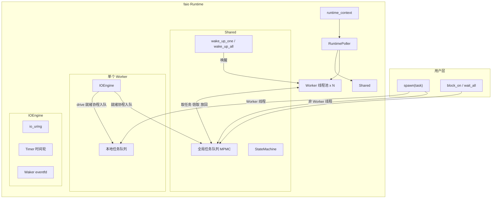
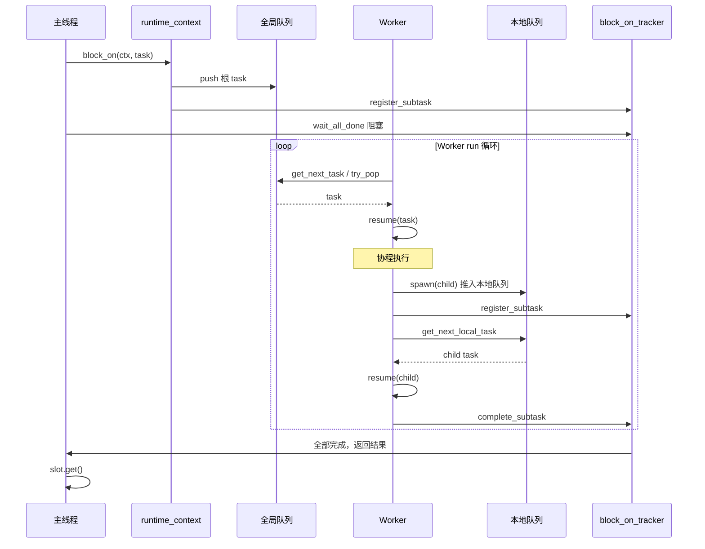

# 异步运行时

**Runtime 整体架构（拓扑与数据流）：**



**典型调用时序（block_on + spawn）：**



### Worker 运行逻辑

每个 Worker 线程在 `run()` 中执行**单线程循环**，一轮内按顺序执行以下步骤，直到关闭：

1. **tick**：更新本线程时间戳，用于后续周期判断。
2. **periodic**：若当前 tick 为 `_io_interval` 的倍数，则执行一次 **drive_io** 并更新关闭标志（检查全局队列是否已 close）。
3. **get_next_task**：获取下一个可执行任务（见下文负载均衡）。若得到任务则 **execute**（resume 协程）并进入下一轮循环。
4. **task_steal**：若上一步未拿到任务，则尝试从其他 Worker 或全局队列窃取（见下文任务窃取逻辑）。若窃取到任务则 execute 并进入下一轮。
5. **drive_io**：驱动本线程的 **IOEngine**，处理 io_uring 的 CQE、定时器到期等，将就绪的协程 handle 重新推入本地或全局队列。若有 IO 被处理则返回 true，本轮结束并进入下一轮。
6. **sleep**：若仍无任务且无 IO，则进入休眠：通过 StateMachine 标记本线程为 sleeping，并调用 **IOEngine::wait_and_drive** 阻塞等待（eventfd 或定时器唤醒）。被唤醒或检测到有新任务/关闭后取消 sleeping，继续循环。

因此，**有任务就执行、有 IO 就驱动、都没有就休眠**，避免空转。

---

### 任务窃取逻辑

当本 Worker **get_next_task 未拿到任务**时，会调用 **task_steal**：

1. **set_searching**：通过 Shared 的 **StateMachine** 将“正在窃取的 Worker 数量”加一；若已达上限（最后一个在搜的线程不再进入）则直接返回空，不参与窃取。
2. **选择被窃取者**：遍历所有 Worker（除自己），找出 **本地队列长度最大** 且 **当前未处于 searching 状态** 的 Worker，记为窃取目标。
3. **窃取**：调用目标 Worker 的 **本地队列的 be_stolen_by**，将对方队列中的一部分任务迁移到本 Worker 的本地队列，并返回其中一个任务供本线程立即执行。若窃取成功则取消 searching 并执行该任务。
4. **回退**：若没有任何 Worker 可窃取（队列都空），则从 **Shared 的全局队列 get_next_global_task** 取一个任务；若取到则执行，否则本轮回空，进入 drive_io / sleep。

窃取完成后通过 **cancel_searching** 将 StateMachine 上的“正在窃取”计数减一。这样在负载不均时，空闲 Worker 会从最忙的 Worker 拉取任务，实现**负载再分配**。

---

### 负载均衡逻辑

负载均衡体现在**任务从哪里入队**和**从哪里出队**两方面。

**入队（任务提交）：**

- **spawn** 在 **当前是 Worker 线程** 时：任务进入该 Worker 的**本地队列**（或先放入 task_cache，再在下次 push 时一并入队），并视情况 **wake_up_one** 唤醒一个休眠 Worker。
- **spawn** 在**非 Worker 线程**（如 main 或 block_on 所在线程）时：任务进入 **Shared 的全局队列**；**block_on / wait_all** 的根 task 也放入全局队列，由任意 Worker 取走执行。

**出队（get_next_task）：**

- **按周期看全局队列**：若当前 tick 是 **global_queue_interval** 的倍数，则**先尝试从全局队列取一个任务**；若没有再从本地队列取。这样周期性地把全局队列中的任务消化掉，避免“只吃本地、全局饿死”。
- **优先本地**：若未到全局周期，或全局取不到，则**先从本地队列**取（含 task_cache）；若本地有任务且本地队列还有空位，还会**从全局队列批量拉取**一批（数量不超过“本地剩余容量”与“本地容量一半”的较小值）填入本地队列，再执行其中一个任务。这样既减少全局队列争用，又让本 Worker 后续多从本地取，提高缓存命中。
- **本地空再窃取**：若上述都拿不到任务，才进入 **task_steal**（见 6.2），从最忙 Worker 窃取或从全局取一个。

整体效果：**Worker 优先消费本地任务并定期从全局拉取，本地空时通过窃取从其他 Worker 或全局补足**，实现多线程下的任务与 IO 负载均衡。

---

## 1. 类

| 类 / 结构                  | 所在文件          | 职责与含义                                                                                                                                                                                                            |
| -------------------------- | ----------------- | --------------------------------------------------------------------------------------------------------------------------------------------------------------------------------------------------------------------- |
| **runtime_context**        | context.hpp       | 用户入口：持有 Config 和 RuntimePoller；提供 spawn、block_on、wait_all。                                                                                                                                              |
| **RuntimePoller**          | poller.hpp        | 创建 N 个 Worker 线程（jthread），每线程构造一个 Worker 并 run()；用 std::latch 同步所有 Worker 注册完成；持有 Shared。                                                                                               |
| **Shared**                 | shared.hpp        | 全局共享：Config、StateMachine、GlobalQueue、Worker 指针数组、关闭 latch。提供 push 全局队列、get_next_global_task、wake_up_one/all/if_work_pending。                                                                 |
| **Worker**                 | worker.hpp        | 每线程一个：持 Shared*、worker_id、IOEngine、LocalQueue、_task_cache。run() 主循环：tick → periodic → get_next_task → task_steal → drive_io → sleep。负责执行协程、窃取任务、驱动 IO。                                |
| **GlobalQueue**            | queue.hpp         | 全局 MPMC 队列：mutex + deque\<handle\>，支持 push_back、try_pop、try_pop_batch、close。                                                                                                                              |
| **LocalQueue\<CAPACITY\>** | queue.hpp         | 每 Worker 一个：固定容量环形数组 +**双头指针**（高 32 位 steal、低 32 位 local_head）+ 单尾 tail。本线程从 local_head 取、从 tail 放；窃取方通过推进 steal 从「队头」批量拿走约一半任务，实现**任务窃取**与负载均衡。 |
| **StateMachine**           | state_machine.hpp | **负载均衡核心**：维护「工作中线程数」「搜索中线程数」和「休眠线程 ID 列表」。限制同时参与窃取的线程数（≤ 一半），避免过多争抢；在需要时选一个休眠线程唤醒（worker_to_notify）。                                      |
| **IOEngine**               | io_engine.hpp     | 每 Worker 一个：drive 取 CQE、写 result、push_back(handle)、poll 定时器、start_watch、submit；wait_and_drive 按定时器下次到期时间 wait 再 drive。                                                                     |

**任务窃取**：LocalQueue 用**双头指针**（steal + local_head）和 tail，窃取方通过 CAS 把 local_head 推进一半、拷贝任务到己队、再把 steal 追上 local_head；本线程用 local_head 消费，实现单生产者多消费者无锁窃取。**窃取策略**：Worker::task_steal 先 **set_searching()**（受 StateMachine 限制，最多一半线程在搜索），再选**本地队列最长且未在搜索**的 Worker 作为 victim，调用 be_stolen_by；拿不到则退化为从全局队列取一个。**负载均衡**：StateMachine 限制**同时参与窃取的线程数**；**选最忙的窃取**；**周期性从全局队列批量拉任务到本地**；唤醒时在「无人搜索且有休眠线程」时只唤醒一个，避免 thundering herd。

---

## 2. 本地队列的双头指针与「窃取」语义

### 2.1 为什么需要两个头？

- **本线程**：只从「队头」取任务执行，只从「队尾」放任务；本线程视角只需要一个 head 和一个 tail。
- **窃取方**：从「队头」批量拿走任务（一半），不能和本线程的「取一个」冲突；且窃取可能和本线程的 push 并发。

做法：把 **head 拆成两个逻辑部分**，打包在一个 64 位原子里：

- **高 32 位：steal**（窃取指针）：窃取方推进它，表示「从哪开始算已被窃取」；
- **低 32 位：local_head**（本线程消费头）：本线程取任务时推进它。
- **tail**：单生产者（本线程）推进，表示下一个要写入的位置。

正常无窃取时：steal == local_head，都表示「逻辑队头」。发生窃取时：窃取方先把 **local_head 往前推进一半**（steal 暂不动），把这段区间里的任务拷贝到自己的队列，再把 **steal 追上 local_head**。本线程取任务时用 local_head 与 tail 比较、并推进 local_head；若发现 steal != local_head，说明有窃取在进行，本线程从「剩余一半」里取或按约定协作。这样**本线程 pop 用 local_head，窃取用 steal + local_head 约定「可窃取区间」**，实现单生产者、多消费者（本线程 + 多个窃取方）的无锁协作。

### 2.2 be_stolen_by：被谁窃取、窃取多少

**调用方**：窃取方 Worker（dst）。调用的是**被窃取方**的 LocalQueue：`victim->_local_queue.be_stolen_by(self->_local_queue)`，即「我的队列被 dst 窃取」。**返回值**：一个 optional\<handle\>，表示窃取方「立刻执行」的那一个任务；其余窃取到的任务已经放进 dst 的 _tasks 和 tail 里。

### 2.3 be_stolen_by_impl 三步（源码逻辑）

**Step1：在源队列上「声明」要窃取一半**

```cpp
std::uint64_t cur_src_head = _head.load(std::memory_order::acquire);
std::uint32_t steal_num = 0;
while (true) {
  auto [cur_src_steal, cur_src_local_head] = unpack(cur_src_head);
  auto cur_src_tail = _tail.load(std::memory_order::acquire);
  auto cur_src_size = cur_src_tail - cur_src_local_head;

  if (cur_src_steal != cur_src_local_head) {
    return 0;   // 已有别人在窃取，退出
  }
  steal_num = cur_src_size / 2;
  if (steal_num == 0) return 0;

  auto next_src_local_head = cur_src_local_head + steal_num;
  next_src_head = pack(cur_src_steal, next_src_local_head);
  if (_head.compare_exchange_weak(cur_src_head, next_src_head, ...)) {
    break;
  }
}
```

- **unpack**：高 32 位是 steal，低 32 位是 local_head。
- 若 **steal != local_head**：说明已有其他窃取方改过 head，本次放弃。
- **steal_num = size/2**：窃取一半，留下另一半给本线程，负载均衡。
- **next_src_local_head = local_head + steal_num**：把「本线程逻辑头」往前推一半，表示这前半段已经被「预定」给窃取方；**steal 暂不变**，所以 head 变成 (steal, local_head+steal_num)，可窃取区间是 [local_head, local_head+steal_num)。CAS 成功则窃取方获得这 steal_num 个任务的「所有权」。

**Step2：把任务拷贝到目标队列**

```cpp
auto [next_src_steal, next_src_local_head] = unpack(next_src_head);
for (std::uint32_t i = 0; i < steal_num; i++) {
  auto src_idx = (next_src_steal + i) & _mask;
  auto dst_idx = (dst_tail + i) & _mask;
  dst._tasks[dst_idx] = std::move(_tasks[src_idx]);
}
```

从源队列的 [next_src_steal, next_src_steal + steal_num) 拷贝到 dst 的 [dst_tail, dst_tail + steal_num)。这里 next_src_steal 即**原来的 local_head**（next_src_head 里高 32 位仍是 cur_src_steal），所以拷贝区间是 [local_head, local_head+steal_num)，正确。

**Step3：把源的 steal 追上 local_head**

```cpp
cur_src_head = next_src_head;
while (true) {
  auto [cur_src_steal, cur_src_local_head] = unpack(cur_src_head);
  next_src_head = pack(cur_src_local_head, cur_src_local_head);
  if (_head.compare_exchange_weak(cur_src_head, next_src_head, ...)) {
    return steal_num;
  }
}
```

把 head 从 (steal, local_head+steal_num) 更新为 (local_head+steal_num, local_head+steal_num)，即 **steal 和 local_head 再次对齐**，都指向「窃取后的新队头」。本线程下次 pop 会用新的 local_head，不会重复取已窃走的任务。

### 2.4 be_stolen_by 的返回值与 dst tail 更新

```cpp
// be_stolen_by 主体
if (dst_tail - dst_steal > CAPACITY/2) return std::nullopt;  // 目标队列太满则不窃取
auto steal_num = be_stolen_by_impl(dst_queue, dst_tail);
if (steal_num == 0) return std::nullopt;

steal_num = steal_num - 1;
auto next_dst_tail = dst_tail + steal_num;
auto idx = next_dst_tail & _mask;
expected.emplace(std::move(dst_queue._tasks[idx]));  // 最后一个任务给调用方立刻执行
if (steal_num > 0) {
  dst_queue._tail.store(next_dst_tail, ...);  // 其余任务已在 dst 的 [dst_tail, next_dst_tail)
}
return expected;
```

窃取到 steal_num 个任务，impl 里已写入 dst 的 [dst_tail, dst_tail+steal_num)。调用方执行 `steal_num = steal_num - 1`，`next_dst_tail = dst_tail + steal_num`（此时 steal_num 为原值减 1）。返回的是 `dst_queue._tasks[next_dst_tail]`，即**最后一个被窃取的任务**，窃取方立刻 execute；若 `steal_num > 0`，则 `dst_queue._tail = next_dst_tail`，表示 [dst_tail, next_dst_tail) 共 steal_num 个任务留在 dst 队列里，加上手里 1 个共原 steal_num 个。

---

## 3. Worker::task_steal：选谁窃取、负载均衡

### 3.1 源码

```cpp
std::optional<std::coroutine_handle<>> task_steal() {
  if (!set_searching()) {
    return std::nullopt;   // 当前参与搜索的线程数已达上限，不参与窃取
  }
  std::size_t idx = 0, max_size = 0;
  for (auto &worker : _shared->_workers) {
    if (worker == this) continue;
    if (worker->_local_queue.size() > max_size && !worker->_is_searching) {
      idx = worker->_worker_id;
      max_size = worker->_local_queue.size();
    }
  }
  if (max_size > 0) {
    auto expected = _shared->_workers[idx]->_local_queue.be_stolen_by(_local_queue);
    return expected;
  }
  return _shared->get_next_global_task();
}
```

### 3.2 逻辑说明

- **set_searching()**：见下节 StateMachine。若返回 false，表示「当前正在搜索的线程数已经 ≥ 一半」，本线程不再参与窃取，直接返回 nullopt，避免过多线程同时抢队列（**负载均衡**：限制争抢者数量）。
- **选 victim**：遍历其他 Worker，找 **本地队列长度最大** 且 **当前不在搜索状态**（_is_searching 为 false）的那个。优先从「最忙」的线程分担任务。
- **be_stolen_by**：对选中的 Worker 的 LocalQueue 调用，把自己的 _local_queue 传进去当 dst，拿到一个任务立刻返回给上层 execute；其余窃取到的任务已在本地队列里。
- 若没有任何人可窃取（max_size==0），则退化为从**全局队列**取一个任务。

---

## 4. StateMachine：搜索数上限与唤醒谁

### 4.1 职责

- **ThreadCounters**：两个原子变量 _working（当前在工作/未休眠的线程数）、_searching（当前处于「搜索/窃取」状态的线程数）。
- **StateMachine**：在 Counters 基础上维护 **休眠线程 ID 列表 _sleepers**，以及「谁可以进入搜索」「谁可以被唤醒」。

### 4.2 set_searching：限制参与窃取的线程数

```cpp
bool set_searching() {
  if (2 * _counters.num_searching() >= _num_workers) {
    return false;
  }
  _counters.inc_num_searching();
  return true;
}
```

**条件**：搜索线程数 < 一半 worker 数时才允许再进一个。这样最多一半线程在「找任务」，另一半可以安心执行或休眠，减少对队列的争抢，同时仍能较快地平衡负载。这就是**负载均衡**的一环：不是「所有人都去窃取」，而是「有限人数去窃取，且专挑最忙的窃取」。

### 4.3 worker_to_notify：唤醒一个休眠线程

```cpp
std::optional<std::size_t> worker_to_notify() {
  if (!should_wakeup()) return std::nullopt;  // 无锁快路径
  std::lock_guard<std::mutex> lock(_mutex);
  if (!should_wakeup()) return std::nullopt;
  if (_sleepers.empty()) return std::nullopt;

  _counters.wake_up_one(1);   // working+1, searching+1
  auto worker_id = _sleepers.back();
  _sleepers.pop_back();
  return worker_id;
}

bool should_wakeup() const {
  return _counters.num_searching() == 0 && _counters.num_working() < _num_workers;
}
```

- **should_wakeup**：当「没有人在搜索」且「还有线程在休眠」（working < num_workers）时才需要唤醒。避免在「大家还在窃取」时盲目唤醒，等窃取告一段落再补一个干活的人。
- **wake_up_one(1)**：被唤醒的线程会从「休眠」变为「工作」，且通常会先进入搜索，所以 working+1、searching+1。
- 从 _sleepers 里取一个 worker_id 返回，调用方（Shared::wake_up_one）会对该 Worker 调 wake_up()（eventfd 写），该线程从 io_uring wait 返回，继续循环。

### 4.4 set_sleeping / cancel_sleeping

- **set_sleeping(worker_id, is_searching)**：当前线程要休眠，working 减 1，若之前在搜索则 searching 也减 1；把 worker_id 加入 _sleepers。返回「是否为最后一个搜索线程」；若是，调用方会 wake_up_if_work_pending，看是否有任务可让某人起来干。
- **cancel_sleeping(worker_id)**：线程被唤醒或自己发现本地/全局有任务时，从 _sleepers 里移除该 worker_id，表示不再休眠。

---

## 5. Worker 主循环与 get_next_task

### 5.1 run() 顺序

```cpp
while (!_is_shutdown) {
  tick();
  periodic();           // 每隔 _io_interval 做 drive_io + update_shutdown_flag
  if (auto task = get_next_task(); task) {
    excute(std::move(task.value()));
    continue;
  }
  if (auto task = task_steal(); task) {
    excute(std::move(task.value()));
    continue;
  }
  if (drive_io()) continue;
  sleep();
}
```

**get_next_task**：优先拿一个任务（本地或按间隔从全局拿/批量拉一批到本地再拿一个）；拿不到再 **task_steal**；再没有就 **drive_io** 看是否有 IO 完成可恢复；都没有就 **sleep**（wait_and_drive 等 eventfd 或定时器）。

### 5.2 get_next_task 的「全局队列间隔」

```cpp
if (_tick % _shared->_config._global_queue_interval == 0) {
  return _shared->get_next_global_task().or_else([this] { return get_next_local_task(); });
} else {
  if (auto task = get_next_local_task(); task) return task;
  if (_shared->_global_queue.empty()) return std::nullopt;
  auto num = std::min(_local_queue.remain_size(), _local_queue.capacity() / 2);
  // ... try_pop_batch(num)，最后一个自己执行，其余 push_back_batch 到本地
}
```

- **每隔 global_queue_interval 次 tick**：先试全局队列取一个，取不到再取本地。定期给全局队列被消费的机会，避免全局饥饿。
- **否则**：先取本地；本地没有且全局非空时，从全局**批量**拉一批到本地（最多 min(本地剩余空间, capacity/2)），然后自己执行其中最后一个，其余进本地队列，实现「全局 → 本地」的负载均衡。
