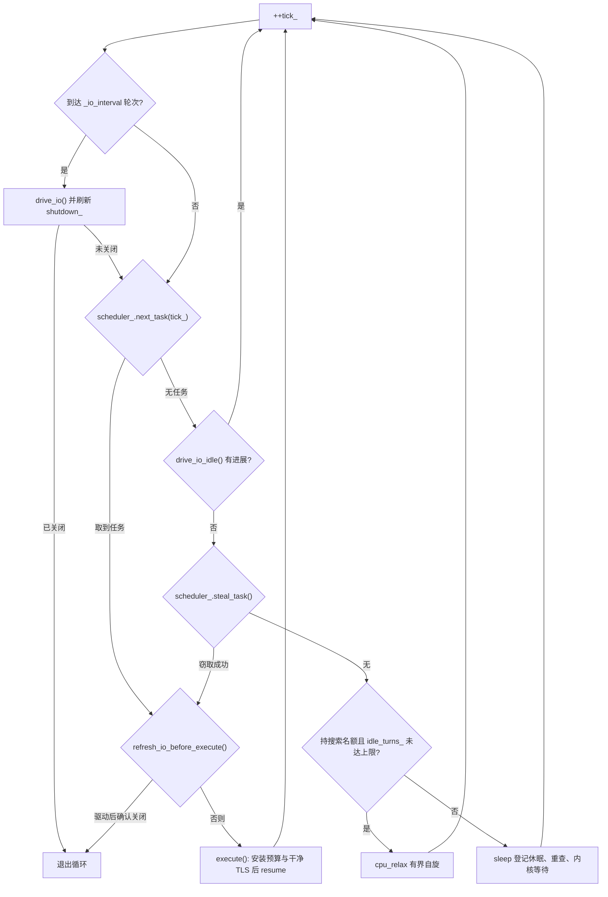
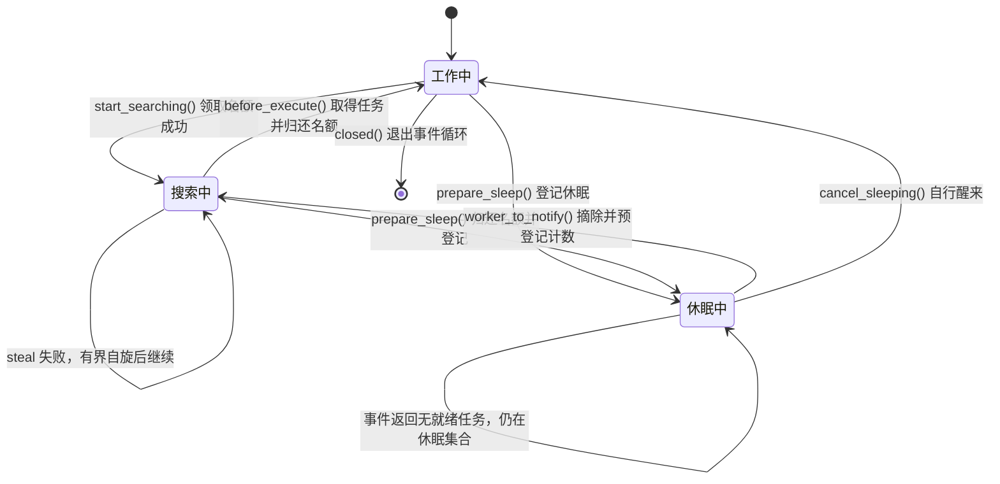
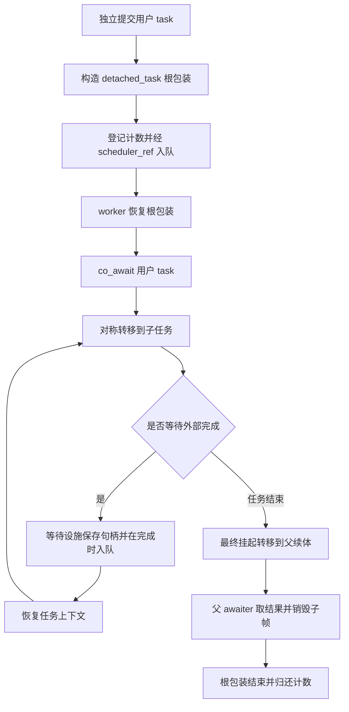

# 异步运行时

运行时在执行线程的事件循环中驱动就绪协程、原生 io_uring 完成或 epoll/kqueue 就绪事件、文件完成、定时器和线程唤醒。默认 `multi_thread` 模式使用后台 worker 池；`current_thread` 模式由调用方线程驱动一个持久的调度核心。本文的 worker、窃取和搜索状态机章节描述多线程后端；单线程实现的调度取舍见 [current_thread 单线程模式](#48-current_thread-单线程模式) 章节。

## 1. 架构总览

运行时按照"**协议—域—线程**"三层组织：

- **协议层**（`coroutine/`）：`coroutine_scheduler` 概念、`scheduler_ref` 借用引用、`execution_thread_binding` 线程绑定。协程层只面向协议编程，不感知队列与线程。
- **调度域层**（`domain_scheduler`）：一个运行时实例对应一个调度域，拥有全局就绪队列、本地队列注册表和搜索/休眠状态机，负责任务在 worker 之间的分配。
- **线程层**（`worker` / `current_thread_runtime`）：每个执行线程组合一个本地调度器与一个 I/O 引擎，运行事件循环；线程之间通过窃取和唤醒协调。

这一分层使 I/O 完成、定时器到期等事件源只需面向 `ready_sink` 接口交付句柄，不需要了解队列布局；也使 current_thread 与 multi_thread 能够共享同一套协程协议、定时器与阻塞任务设施。

源码位于 `include/faio/detail/runtime/`：

```text
runtime/
├── common/          两种运行时共享的配置、I/O 引擎适配、阻塞任务和生命周期计数
├── current_thread/  单线程调度与驱动
├── multi_thread/    多线程调度、工作线程与启动关闭流程
├── timer/           两种运行时共享的定时器与时间轮
├── context.hpp      运行时实例入口
└── default.hpp      默认运行时服务
```

## 2. 类与职责

| 类型 | 源码 | 职责 |
| --- | --- | --- |
| `default_runtime_service` | [default.hpp](../include/faio/detail/runtime/default.hpp) | 默认运行时的惰性创建、配置与外部入口同步 |
| `runtime_context` | [context.hpp](../include/faio/detail/runtime/context.hpp) | 拥有运行时实例，提供提交、阻塞执行和停止入口 |
| `runtime_config` | [config.hpp](../include/faio/detail/runtime/common/config.hpp) | 保存线程数、队列容量和事件循环间隔 |
| `current_thread_runtime` / `current_thread_scheduler` | [runtime.hpp](../include/faio/detail/runtime/current_thread/runtime.hpp)、[scheduler.hpp](../include/faio/detail/runtime/current_thread/scheduler.hpp) | 持久的单线程调度核心、FIFO、跨线程注入和休眠握手 |
| `blocking_pool` | [blocking_pool.hpp](../include/faio/detail/runtime/common/blocking_pool.hpp) | 两种模式共享的独立阻塞线程池 |
| `start_blocking` | [blocking_task.hpp](../include/faio/detail/runtime/common/blocking_task.hpp) | 将阻塞函数包装为任务，登记生命周期并发布可等待的结果 |
| `io_services` | [io_services.hpp](../include/faio/detail/runtime/common/io_services.hpp) | 建立文件 / DNS / 清理服务租约，关闭时统一回收 |
| `Timer` / `TimerWheel` | [timer.hpp](../include/faio/detail/runtime/timer/timer.hpp)、[wheel.hpp](../include/faio/detail/runtime/timer/wheel.hpp) | 管理到期任务和分层时间轮 |
| `runtime_poller` | [poller.hpp](../include/faio/detail/runtime/multi_thread/poller.hpp) | 拥有共享组件和线程池，协调启动、排空与 join |
| `shared` | [shared.hpp](../include/faio/detail/runtime/multi_thread/shared.hpp) | 拥有配置、调度域、根任务计数和退出屏障 |
| `worker` | [worker.hpp](../include/faio/detail/runtime/multi_thread/worker.hpp) | 组合本地调度器与 I/O 引擎，运行事件循环 |
| `worker_io_budget` | [worker_io_budget.hpp](../include/faio/detail/runtime/common/worker_io_budget.hpp) | worker 私有的 I/O 时间锚点，约束恢复边界的轮询延迟 |
| `domain_scheduler` | [domain_scheduler.hpp](../include/faio/detail/runtime/multi_thread/scheduler/domain_scheduler.hpp) | 管理全局队列、本地注册表、窃取和唤醒协调 |
| `local_scheduler` | [local_scheduler.hpp](../include/faio/detail/runtime/multi_thread/scheduler/local_scheduler.hpp) | 管理所属线程的任务选择、批量拉取、搜索与休眠转换 |
| `global_ready_queue` / `local_ready_queue` | [ready_queue.hpp](../include/faio/detail/runtime/multi_thread/scheduler/ready_queue.hpp) | 分别保存跨线程就绪任务和本地固定容量任务 |
| `scheduler_state_machine` / `worker_counters` | [state_machine.hpp](../include/faio/detail/runtime/multi_thread/scheduler/state_machine.hpp) | 维护工作、搜索、休眠线程的协调状态 |
| `local_execution_budget` | [local_execution_budget.hpp](../include/faio/detail/runtime/multi_thread/scheduler/local_execution_budget.hpp) | 连续私有快速恢复链的协作额度记账 |
| `worker_waker_ref` | [domain_scheduler.hpp](../include/faio/detail/runtime/multi_thread/scheduler/domain_scheduler.hpp) | 借用底层线程唤醒能力 |
| `coroutine_scheduler` / `ready_sink` / `scheduler_ref` | [scheduler.hpp](../include/faio/detail/coroutine/scheduler.hpp) | 调度协议概念与类型擦除的调度借用引用 |
| `execution_thread_binding` / `execution_thread_guard` | [execution_thread.hpp](../include/faio/detail/coroutine/execution_thread.hpp) | 保存执行线程能力，并成对安装、恢复线程绑定 |
| `io_engine` | [io_engine.hpp](../include/faio/detail/runtime/common/io_engine.hpp) | 组合中立 I/O 驱动与时间轮的运行时适配器 |
| `root_task_counter` | [root_task_counter.hpp](../include/faio/detail/runtime/common/root_task_counter.hpp) | 跟踪运行时活动根帧，供关闭流程等待排空 |

多线程组件所有权如下，箭头表示拥有关系：

```text
runtime_context
└── runtime_poller
    ├── shared
    │   ├── runtime_config
    │   ├── io_services（文件 / DNS / 清理服务）
    │   ├── domain_scheduler
    │   │   ├── global_ready_queue
    │   │   ├── scheduler_state_machine
    │   │   └── 本地队列与唤醒端注册表（借用）
    │   ├── blocking_pool
    │   ├── root_task_counter
    │   └── worker 退出屏障
    └── 工作线程
        └── worker（各线程栈上）
            ├── io_engine：中立 IO 引擎、唤醒端、定时器
            ├── local_scheduler：本地就绪队列与执行预算
            └── 执行线程绑定及其 guard
```

`shared` 先于 worker 构造，全部线程退出后才销毁。本地调度器借用调度域，调度域的注册表借用本地队列与唤醒端；统一的启动屏障和退出屏障保证这些借用地址在运行阶段稳定，窃取路径无需持有注册表锁。

## 3. 运行时入口与配置

无显式上下文的 `faio::spawn()`、`spawn_detached()` 和 `block_on()` 从普通线程进入时，使用进程默认运行时。worker 内的提交直接使用执行线程绑定。显式 `runtime_context` 允许调用方创建并拥有独立运行时。

`default_runtime_service::with_context()` 用共享锁覆盖外部入口调用；首次创建时改用独占锁，构造 `runtime_context` 后重新取得共享锁。`configure()` 和 `shutdown()` 使用独占锁，使配置、创建、外部提交和关闭之间具有明确顺序：

```cpp
// default.hpp：双重检查的惰性创建；shutdown 在锁外销毁 context。
template <class F>
decltype(auto) with_context(F&& action) {
  std::shared_lock lock(mutex_);
  if (!context_) {
    lock.unlock();
    std::unique_lock init_lock(mutex_);
    if (stopped_)
      throw std::logic_error("默认运行时已关闭");
    if (!context_)
      context_ = std::make_unique<runtime_context>(config_);
    init_lock.unlock();
    lock.lock();          // 重新取得共享锁，覆盖整个 action 调用
  }
  if (stopped_)
    throw std::logic_error("默认运行时已关闭");
  return std::invoke(std::forward<F>(action), *context_);
}
```

共享锁保证 `shutdown()` 移出并销毁 context 时，没有外部入口仍持有它的引用；worker 内部提交不经过这把锁，关闭流程与 worker 的协调由排空协议负责。

配置在首次启动前确定，context 构造时经 `validate_config()` 验证并保存副本。`runtime_config` 的真实字段与默认值（[config.hpp](../include/faio/detail/runtime/common/config.hpp)）：

| 字段 | 默认值 | 作用 |
| --- | --- | --- |
| `_mode` | `multi_thread` | 选择后端；配置时可省略 `set_mode()` |
| `_requested_io_backend`（仅 Linux） | 未指定（按编译能力与内核版本选择，≥5.10 默认 uring） | 请求的原生 I/O 后端 |
| `_num_workers` | 硬件并发数，至少 1 | 工作线程数量，同时决定注册表与屏障容量 |
| `_num_events` | 1024 | 驱动事件批量配置，实际批量截取到 1 至 256；原生 SQ 容量截取到 8 至 4096，最大在途操作数独立 |
| `_submit_interval` | 4 | 兼容保留配置；当前统一驱动每轮 flush，readiness 在 await 时即时尝试 syscall |
| `_io_interval` | 61 | 持续执行任务时轮询 I/O 的事件循环间隔 |
| `_max_io_delay` | Linux 100 微秒；其他平台 1 毫秒 | 在可恢复边界检查的 I/O 轮询时间预算，与轮次条件任一达到即驱动 |
| `_global_queue_interval` | 61 | 本地工作持续存在时优先检查全局队列的间隔 |
| `_idle_spin_count` | `AUTO_IDLE_SPIN_COUNT`（`UINT32_MAX`）：启动前解析为 Linux 0、其他平台 32 | 空队列后有界自旋轮询次数；显式次数优先，0 表示首次空队列驱动后直接准备休眠 |
| `_max_blocking_threads` | 64 | 阻塞线程池上限，不计入异步 worker 数量 |
| `_blocking_keep_alive` | 10 秒 | 保留兼容配置；固定预热池在关闭时回收线程 |
| `_blocking_queue_limit` | 4096 | 用户阻塞任务的等待容量，满载时提交报错 |
| `_filesystem_threads` / `_filesystem_queue_limit` | 4 / 4096 | 文件服务独立线程配额与等待容量 |
| `_resolver_threads` / `_resolver_queue_limit` | 2 / 1024 | DNS 服务线程配额与等待容量，不占用文件服务线程 |

`validate_config()` 要求：多线程的 worker 数、事件数、`_max_io_delay`、I/O 间隔、全局队列间隔、阻塞线程上限、阻塞保活时间以及阻塞/文件/DNS 的线程与队列配额全部大于零；空闲轮询次数允许为零（禁用空闲轮询）。单线程模式忽略 worker 数（仅多线程校验）和空闲自旋参数。间隔按循环轮次计量，不代表固定时间长度。`config_builder` 只构建配置值，已启动的运行时使用其保存的配置。

默认服务关闭后保持关闭状态，不再创建实例。配置和关闭入口拒绝在 worker 上调用；阻塞执行的线程限制见[协程并发](协程并发.md)。

## 4. 协程调度

协程调度决定挂起的协程如何重新进入执行线程。调度协议把句柄交给具体调度器，执行线程绑定提供当前线程的能力，就绪队列与窃取在多个 worker 之间分配工作，搜索状态机协调线程入睡与唤醒。任务自身的帧协议与上下文恢复见[协程封装](协程封装.md)。

### 4.1 调度协议与借用引用

`coroutine_scheduler` 要求具体调度器提供 `enqueue(std::coroutine_handle<>) -> void`。接口的执行约束是：成功接受句柄后安排恰好一次恢复，入队函数不直接调用 `resume()`；入队抛异常时，提交方仍承担句柄的清理责任。

`scheduler_ref` 保存具体调度器地址和静态操作表地址。操作表按调度器类型生成，将类型擦除的指针转换回构造时的真实类型；可选能力在编译期探测并逐级回退（[scheduler.hpp](../include/faio/detail/coroutine/scheduler.hpp)）：

```cpp
// 每种具体调度器共用一张操作表；表本身具有静态生命周期。
struct operations {
  void (*enqueue)(void*, std::coroutine_handle<>);
  void (*enqueue_io)(void*, std::coroutine_handle<>);               // 可选批量完成入口
  void (*enqueue_yield)(void*, std::coroutine_handle<>);            // 可选公平让出入口
  void (*enqueue_cooperative_yield)(void*, std::coroutine_handle<>); // 可选自让出能力
};

template <coroutine_scheduler S>
static inline constexpr operations operations_for{
    +[](void* state, std::coroutine_handle<> handle) { static_cast<S*>(state)->enqueue(handle); },
    +[](void* state, std::coroutine_handle<> handle) {
      if constexpr (requires(S& scheduler) { scheduler.enqueue_io(handle); })
        static_cast<S*>(state)->enqueue_io(handle);
      else
        static_cast<S*>(state)->enqueue(handle);   // 无批量入口时回退普通提交
    },
    // enqueue_yield / enqueue_cooperative_yield 同样按 if constexpr 逐级回退，
    // 自让出先回退公平让出，再回退普通 enqueue。……（省略两个适配 lambda）
};
```

调用侧始终只有两个指针，空引用在接管句柄前拒绝：

```cpp
void schedule(std::coroutine_handle<> handle) const {
  if (!*this)
    throw std::logic_error("没有可用的调度器");
  ops_->enqueue(state_, handle);
}
```

该引用不分配内存，也不持有调度器所有权。调度器需要存活到所有使用它的任务和等待节点结束。`schedule_io()`、`schedule_yield()` 与 `schedule()` 形状相同，只是经操作表进入各自的可选入口；库内两个自让出 awaiter 是 `scheduler_ref` 的 friend，通过私有的 `schedule_cooperative_yield()` 提供"发布自身句柄后立即归还执行权"的提示，公开入口不使用该合同。

`ready_sink` 约束 `enqueue_ready(handle)`，定时器经这个接口交付本地就绪任务。I/O 协程桥调用保存的 `scheduler_ref::schedule_io(handle)`：多线程调度域使用批量完成入口，单线程及自定义调度器使用各自支持的投递入口。底层 I/O 核心只发布中立完成结果，不持有运行时的队列或 worker。

### 4.2 执行线程绑定

worker 构造时依次创建 I/O 引擎、本地调度器，再创建 `execution_thread_binding` 并安装 guard。绑定保存：

- 当前调度域的 `scheduler_ref`；
- 运行时根任务计数的 `task_lifetime_ref`；
- 本地就绪队列地址及类型标识；
- 当前 worker 编号；
- 阻塞线程池入口。

通用协程代码通过 `current_scheduler()`、`current_task_lifetime()` 和 `current_worker_id()` 查询能力。调度域读取本地状态时，`local_state_for<T>()` 同时校验调度器实例和类型标识，只有匹配本调度域、本地队列类型的线程才能使用本地入队路径。新 I/O 请求可从线程绑定查询默认 context；长期存在的资源保存显式 domain 租约，移动及析构不依赖 TLS。定时器通过当前 timer 入口注册。

任务的 `scheduler` 表示调度域归属；worker 编号表示当前执行位置。任务经队列和窃取恢复后，调度域保持不变，worker 编号随实际执行线程变化。

worker 恢复一个就绪句柄前，暂时清空 `current_tracker` 和 `current_stop_token`：根包装负责安装入口上下文，已挂起的用户任务通过 awaiter 的恢复逻辑重新安装自己的上下文。一次 `resume()` 返回后，worker 恢复先前保存的线程局部值（完整实现见 [4.4 节](#44-worker-事件循环)的 `execute()` 解析）。

### 4.3 就绪任务怎样进入调度域

`domain_scheduler` 提供四个入队入口，分别对应普通提交、手工让出、库内自让出和 I/O 完成（[domain_scheduler.hpp](../include/faio/detail/runtime/multi_thread/scheduler/domain_scheduler.hpp)）。它们共享同一个分流逻辑：线程绑定同时匹配调度域身份和本地队列类型时走本地路径，否则走线程安全的全局队列。

**`enqueue()` 通用入口**：

```cpp
void enqueue(std::coroutine_handle<> task) {
  auto* binding = ::faio::detail::current_execution_thread;
  auto* local = binding
      ? binding->local_state_for<local_queue_type>(scheduler_ref{*this})
      : nullptr;
  if (local) {
    if (local->push_local(task, global_queue_))  // 产生可窃取工作时才需要通知
      wake_up_one();
  } else {
    global_queue_.push_back(task);
    wake_up_one();
  }
}
```

`push_local()` 优先占用线程私有的快速槽，返回 `true` 表示旧快速任务被挤入可窃取的 FIFO——只有出现了同伴可见的工作才唤醒，单个私有槽任务不制造跨线程通知。普通线程或另一个运行时的 worker 提交到该域时落入全局队列，全局提交无条件承担一次唤醒责任。

**`enqueue_yield()` 手工公平让出**：续体直接进 FIFO 尾部，不驱逐或替换仍待恢复的快速任务，为已有等待任务保留顺序：

```cpp
void enqueue_yield(std::coroutine_handle<> task) {
  auto* binding = ::faio::detail::current_execution_thread;
  auto* local = binding ? binding->local_state_for<local_queue_type>(scheduler_ref{*this})
                        : nullptr;
  if (local)
    local->push_back(task, global_queue_);   // 直接 FIFO，复用原溢出/回滚协议
  else
    global_queue_.push_back(task);
  wake_up_one();   // FIFO 可窃取；成功发布后无条件承担一次同伴通知
}
```

与 `enqueue()` 的差别在于通知责任：调用方投递的是"另一个帧"，本线程不一定马上回到事件循环，因此发布后必须无条件通知，不能假设自己随后会领取它。

**`enqueue_cooperative_yield()` 库内自让出**：调用方是正在归还执行权的 owner，发布的是自己的续体并立即结束 `await_suspend`，因此可以精确判断是否需要唤醒同伴：

```cpp
if (local) {
  const bool another_ready = !local->empty_local();  // 入队前观察 fast + FIFO
  local->push_back(task, global_queue_);
  // 唯一续体由正在归还执行权的 owner 领取；发布后的 global 检查同时覆盖满队列转交。
  if (another_ready || !global_queue_.empty())
    wake_up_one();
} else {
  global_queue_.push_back(task);   // 外部/跨域没有 owner 即将回到循环的保证
  wake_up_one();                   // 远程路径保留无条件通知
}
```

本地路径下，入队前没有其他本地任务且全局仍为空时，当前 worker 归还执行权后沿 `next_task()` 自然领回该续体，省去一次 eventfd 写入；已有 fast/FIFO 工作、FIFO 溢出转交全局或远程提交时，保持原有通知。续体本身仍按 FIFO 顺序排列、可被其他搜索线程窃取——省掉的只是冗余唤醒，不改变调度语义。

**`enqueue_io()` I/O 批量完成**：driver 在同一批次内逐条交付完成，复用快速槽减少固定 I/O 归属上的跨线程往返：

```cpp
void enqueue_io(std::coroutine_handle<> task) {
  auto* binding = ::faio::detail::current_execution_thread;
  auto* local = binding ? binding->local_state_for<local_queue_type>(scheduler_ref{*this})
                        : nullptr;
  if (local)
    local->push_local(task, global_queue_);  // 前一快速任务入 FIFO，最后一条留在所属 worker
  else
    enqueue(task);                           // 外部线程完成回退线程安全入口
}
```

批次最后一条保留在不可窃取的快速槽，前项依次被挤入 FIFO；同伴通知不在每条完成时判断，而由 `local_scheduler::flush_ready()` 在驱动批次末尾统一执行。外部线程（如文件服务）完成时没有匹配绑定，回退到 `enqueue()` 保持线程安全。

任务来源与入口的对应关系：

| 来源 | 就绪路径 |
| --- | --- |
| 普通线程提交根任务 | 调度域 → 全局队列 |
| 同域 worker 的 spawn 或等待节点通知 | 调度域 → 本地快速槽，旧快速任务进入 FIFO |
| 主动让出或协作预算耗尽 | 库内私有自让出入口 → 本地 FIFO 尾部；自定义调度器按公平让出能力或普通提交适配 |
| 手工投递让出句柄 | 公开 `scheduler_ref::schedule_yield()` → FIFO，成功发布后承担同伴通知责任 |
| 外部线程通知同步等待者 | 节点保存的调度器 → 目标域全局队列 |
| I/O 完成 | `scheduler_ref::schedule_io()` → 所属线程快速槽；前一快速任务进入 FIFO |
| 定时器完成 | `ready_sink::enqueue_ready()` → 所属线程本地 FIFO |
| 本地队列溢出 | 半队列批量转交全局队列，或将新任务直接交给全局队列 |
| 工作窃取 | 从其他 worker 的 FIFO 领取一批，留存其余任务并立即执行其中一个 |

就绪队列存放句柄并承担安排执行的责任，帧所有权由 task awaiter 和根包装协议管理。等待中的任务不在就绪队列中，但仍属于活动根任务。

### 4.4 worker 事件循环

`worker::run()` 是事件循环的完整实现（[worker.hpp](../include/faio/detail/runtime/multi_thread/worker.hpp)）。循环本身不再维护队列或窃取算法，只按固定顺序组合"周期驱动 I/O → 本地取任务 → 空闲驱动 → 窃取 → 有界自旋 → 休眠握手"六个分支：

```cpp
void run() {
  ::faio::detail::coroutine_frame_cache_scope
      frame_cache;  // 运行栈 owns 空闲块，退出先撤去 TLS 借用。
  while (!shutdown_) {
    ++tick_;
    // 持续有协程工作时仍定期轮询 I/O，避免完成事件长期得不到处理。
    if (tick_ % shared_.config()._io_interval == 0) {
      drive_io();
      shutdown_ = shared_.scheduler().closed();
      if (shutdown_)
        break;
    }
    if (auto task = scheduler_.next_task(tick_)) {
      // 持续就绪逐恢复检查 elapsed；空闲驱动保留较早锚点，只会提前触发预算。
      if (refresh_io_before_execute())
        break;
      idle_turns_ = 0;
      execute(*task);
      continue;
    }
    // 本地队列耗尽时先消费本域完成，避免不断窃取别域任务而推迟自己的 IO。
    if (drive_io_idle()) {
      idle_turns_ = 0;
      continue;
    }
    if (auto task = scheduler_.steal_task()) {
      if (refresh_io_before_execute())
        break;
      idle_turns_ = 0;
      execute(*task);
      continue;
    }
    // 有界轮询减少短突发反复进入内核等待；名额一直计入共享搜索状态。
    if (scheduler_.is_searching() && idle_turns_ < shared_.config()._idle_spin_count) {
      ++idle_turns_;
      util::cpu_relax();
      continue;
    }
    idle_turns_ = 0;
    sleep();
  }
}
```

逐段解析：

1. **tick 与周期驱动**：`tick_` 是循环轮次计数，同时供 `_io_interval`（I/O 轮询）和 `_global_queue_interval`（全局队列公平性，在 `next_task` 内使用）取模。到达 I/O 轮次时驱动一次完成事件并刷新 `shutdown_`——热路径不反复读取关闭原子，只在周期点和入睡时同步。
2. **取任务与恢复前预算**：选中任务后先执行 `refresh_io_before_execute()`（见下文），再 `execute()`。任何取到任务的分支都把 `idle_turns_` 归零，使自旋预算只在连续空闲时消耗。
3. **空闲驱动**：本地无任务时先 `drive_io_idle()` 消费本域完成，避免不断窃取别域任务而推迟自己的 I/O。有进展直接继续循环，不进入窃取。
4. **窃取**：本域没有进展才进入 `steal_task()`；窃取到的任务同样过恢复前预算检查。
5. **有界自旋**：只有已领取搜索名额（`is_searching()`）且 `idle_turns_` 未达 `_idle_spin_count` 时执行 `cpu_relax()` 再转一圈，吸收短突发任务，避免反复进出内核等待。
6. **休眠**：以上全部无进展才进入 `sleep()` 的登记—重查—等待握手（见 [4.6 节](#46-搜索状态与休眠唤醒)）。

`execute()` 负责恢复前的上下文安装与还原：

```cpp
void execute(std::coroutine_handle<> task) {
  scheduler_.before_execute();   // 归还搜索名额：搜索计数不含运行用户代码的线程
  auto poll_budget =
      scheduler_.begin_execution();  // FIFO/global/steal 补 64，连续私有 fast 共用余额
  auto* previous_tracker = ::faio::detail::current_tracker;
  auto previous_stop = ::faio::detail::current_stop_token;
  ::faio::detail::current_tracker = nullptr;
  ::faio::detail::current_stop_token = {};
  task.resume();
  ::faio::detail::current_tracker = previous_tracker;
  ::faio::detail::current_stop_token = std::move(previous_stop);
}
```

这里有三层成对协议：`before_execute()` 在实际 resume 前取消搜索标识；`begin_execution()` 返回的 `execution_scope` 按任务来源领取协作额度，析构时把剩余额度写回 `local_execution_budget` 并还原外层 TLS（见 [4.7 节](#47-协作调度与执行预算)）；`current_tracker` / `current_stop_token` 先清空再恢复——根包装和用户 awaiter 各自负责安装自己的上下文，worker 只保证 `resume()` 边界上 TLS 干净且可还原。事件循环是唯一调用 `resume()` 的位置，调度入队与完成通知只交接句柄。

I/O 驱动由 worker 私有的 `worker_io_budget` 统一计时（[worker_io_budget.hpp](../include/faio/detail/runtime/common/worker_io_budget.hpp)）。它只保存一个"最近一次带锚点驱动开始"的保守时间点，三类驱动入口分工明确：

```cpp
// 周期驱动：先读时钟建立锚点，再立即执行原驱动。
bool drive_io() {
  return io_budget_.drive_with_anchor([] { return std::chrono::steady_clock::now(); },
                                      [this] { return drive_io_impl(); });
}

// 空闲驱动：真正执行驱动，但不读时钟、不前移锚点。
bool drive_io_idle() {
  return io_budget_.drive_without_anchor([this] { return drive_io_impl(); });
}

// 恢复前检查：距上次带锚点驱动已超过 _max_io_delay 才真正驱动。
bool refresh_io_before_execute() {
  if (io_budget_.refresh_before_execute(
          shared_.config()._max_io_delay,
          [] { return std::chrono::steady_clock::now(); },
          [this] { (void)drive_io_impl(); })) {
    shutdown_ = shared_.scheduler().closed();  // 选中任务后驱动仍必须重查关闭
    return shutdown_;
  }
  return false;
}
```

锚点只能建立在真实驱动开始之前，不能用稍后的 execute 时刻冒充先前的 poll 时刻；空闲驱动不前移锚点，因此旧锚点只会**提前**触发预算、绝不延后，任务持续就绪时 I/O 完成延迟有确定上界。`refresh_before_execute()` 返回 `true` 表示发生了真实驱动，此时 worker 必须重查关闭状态再决定是否恢复已选中的任务。所有入口最终复用同一个 `drive_io_impl()`：先 `interrupt_execution_chain()` 结束连续 fast 链（已选中但未执行的任务不受影响），再调用 `io_engine_.drive(scheduler_)` 走原 SQE/CQE/readiness/定时器路径，有进展时 `flush_ready()` 按原批次协议通知同伴。

轮次间隔与时间预算是双重条件：周期性轮次检查使外部完成在任务持续就绪时仍能进入队列，时间预算则保证即使每个任务都极短、轮次间隔未到，I/O 完成的延迟也不超过 `_max_io_delay`。

事件循环的整体流向：


```mermaid
flowchart TD
    A["++tick_"] --> B{到达 _io_interval 轮次?}
    B -->|是| C["drive_io() 并刷新 shutdown_"]
    C -->|已关闭| Z["退出循环"]
    C -->|未关闭| D
    B -->|否| D{"scheduler_.next_task(tick_)"}
    D -->|取到任务| E{"refresh_io_before_execute()"}
    E -->|驱动后确认关闭| Z
    E -->|否则| F["execute(): 安装预算与干净 TLS 后 resume"]
    F --> A
    D -->|无任务| G{"drive_io_idle() 有进展?"}
    G -->|是| A
    G -->|否| H{"scheduler_.steal_task()"}
    H -->|窃取成功| E
    H -->|无| I{"持搜索名额且 idle_turns_ 未达上限?"}
    I -->|是| J["cpu_relax 有界自旋"]
    J --> A
    I -->|否| K["sleep 登记休眠、重查、内核等待"]
    K --> A
```

### 4.5 就绪队列与任务选择

#### 全局队列

`global_ready_queue` 用短互斥区保护 `std::deque` 和关闭时的提交检查，原子 `has_tasks_` 表示空/非空状态（[ready_queue.hpp](../include/faio/detail/runtime/multi_thread/scheduler/ready_queue.hpp)）：

```cpp
void push_back(std::coroutine_handle<> task) {
  std::lock_guard lock(mutex_);
  if (closed())
    throw std::logic_error("调度队列已关闭");
  const auto was_empty = queue_.empty();
  queue_.push_back(task);
  // 只在空/非空转换时写提示，避免每个任务都使所有消费者缓存行失效。
  if (was_empty)
    has_tasks_.store(true, std::memory_order_release);
}
```

提示只在空与非空转换时更新；`empty()` / `try_pop()` 先无锁读提示，提示非空才取锁，并在锁内重新确认容器状态——提示是保守的"值得取锁"判断，不替代真实容器检查。`try_pop_batch()` 向调用方提供的固定缓冲区填充任务，批量路径不创建临时 vector。

`push_back_batch()` 在锁内具备整体成功或失败的语义，供本地溢出回滚使用：

```cpp
void push_back_batch(std::span<const std::coroutine_handle<>> tasks) {
  std::lock_guard lock(mutex_);
  if (closed())
    throw std::logic_error("调度队列已关闭");
  const auto original_size = queue_.size();
  try {
    for (auto task : tasks)
      queue_.push_back(task);
  } catch (...) {
    // 临界区内无人消费这批任务，删除成功追加的前缀即可完整回滚。
    while (queue_.size() != original_size)
      queue_.pop_back();
    throw;
  }
  // ……（省略提示更新）
}
```

临界区持锁期间没有消费者能取走这批任务，因此分配失败时逐个弹出已追加前缀即可精确还原；提交方（本地队列溢出路径）据此恢复自己的 head 边界。

#### 本地快速槽与 FIFO

本地队列包含容量为 256 的环形存储（`LOCAL_QUEUE_CAPACITY`），以及一个线程私有的 `fast_task_` 快速槽。普通本地入队先放快速槽；槽已占用时，先安置旧句柄到 FIFO，再用新句柄替换槽：

```cpp
bool push_local(std::coroutine_handle<> task, global_ready_queue& global) {
  if (!fast_task_) {
    fast_task_ = task;
    return false;              // 无可窃取工作，无需通知同伴
  }
  // 先成功安置旧任务，再替换快速槽；异常时新任务仍归调用者所有。
  push_back(*fast_task_, global);
  fast_task_ = task;
  return true;
}
```

主动让出和协作预算耗尽经 `enqueue_yield()` / `enqueue_cooperative_yield()` 直接 `push_back()` 进入 FIFO 尾部，不占用或替换快速槽。远端线程只能窃取环形队列，不能访问快速槽。

快速槽的公平性由所属线程私有的 `fifo_hint_` 提示和连续计数 `fast_streak_` 共同约束。`try_pop_local()` 是本地任务选择的完整实现：

```cpp
std::optional<std::coroutine_handle<>> try_pop_local(bool allow_fast = true) noexcept {
  last_pop_from_fast_ = false;
  if (allow_fast && fast_task_) {
    // FIFO 已被所属线程确认为空时无需每 3 次再读共享 head/tail。
    if (!fifo_hint_) {
      last_pop_from_fast_ = true;
      return std::exchange(fast_task_, std::nullopt);
    }
    if (fast_streak_ < fast_streak_limit) {   // 上限 3 次
      ++fast_streak_;
      last_pop_from_fast_ = true;
      return std::exchange(fast_task_, std::nullopt);
    }
  }
  fast_streak_ = 0;
  if (auto task = try_pop())
    return task;   // 连续 fast 达到上限后先给 FIFO 一次机会
  last_pop_from_fast_ = fast_task_.has_value();
  return std::exchange(fast_task_, std::nullopt);   // 仅剩 fast 仍可领取
}
```

`fifo_hint_` 是所属线程私有的保守非空提示：远端只能移除任务，所有新增路径都在所属线程把提示置真，因此提示为 `false` 即证明本地 FIFO 为空，此时直接消费快速槽、不增加连续计数；提示为真时，连续从快速槽取任务达到 3 次后强制给 FIFO 一次机会。I/O 批量完成复用快速槽，批次最后一条保留为私有任务，前项进入 FIFO。`last_pop_from_fast_` 记录本次领取来源，供 `local_scheduler` 决定协作额度是新链还是沿用余额——不猜测句柄身份或 promise 布局。

执行链协作额度耗尽时，所属线程在下次本地选择前把等待的 `fast_task_` 降级到 FIFO 尾部（`demote_fast()`）：先复用 `push_back()` 的原容量/窃取/溢出/异常回滚协议安置句柄，成功后才清私有槽并重置连续计数；入队失败保持原 fast/FIFO 归属。降级后的任务按 FIFO 顺序领取且可以被远端窃取，后续自让出续体也会排到它之后，防止私有链永远排斥 FIFO 工作。

#### 环形队列的边界协议

本地队列以原子 `tail_` 发布已写入的槽位，以 64 位原子 `head_` 同时保存两个 32 位边界：

| 边界 | 含义 |
| --- | --- |
| `protected_head`（高 32 位） | 尚受读取保护的最早槽位，生产者计算复用空间时使用 |
| `local_head`（低 32 位） | 下一个未被领取的任务，本地消费从这里推进 |
| `tail_` | 下一个生产位置，之前的槽位已发布 |

没有远端复制时，两个 head 相等。生产者 `push_back()` 的完整协议：

```cpp
void push_back(std::coroutine_handle<> task, global_ready_queue& global) {
  for (;;) {
    auto head = head_.load(std::memory_order_acquire);
    const auto [protected_head, local_head] = unpack(head);
    const auto tail = tail_.load(std::memory_order_relaxed);
    if (static_cast<std::uint32_t>(tail - protected_head) < capacity_value) {
      tasks_[tail & mask] = task;
      tail_.store(tail + 1, std::memory_order_release);   // release 发布槽位
      fifo_hint_ = true;
      return;
    }
    if (protected_head != local_head) {
      // 远端正在读取槽位，不能覆盖；仅把新任务交给全局队列。
      global.push_back(task);
      return;
    }
    if (handle_overflow(task, head, global))
      return;
  }
}
```

三个分支对应三种状态：有空间时写入槽位并 release 更新 `tail_`；队列满但窃取者正在复制（`protected_head != local_head`）时只把新任务交给全局队列，保留槽位供窃取者读完；队列满且无窃取者时进入溢出转交。

本地消费者 `try_pop()` 先读取句柄，再 CAS 推进 head：

```cpp
const auto task = tasks_[local_head & mask];
const auto next_head =
    pack(protected_head == local_head ? local_head + 1 : protected_head, local_head + 1);
if (head_.compare_exchange_weak(head, next_head, std::memory_order_acq_rel,
                                std::memory_order_acquire))
  return task;
```

若当前没有窃取者（两个边界相等），推进时同时前移 `protected_head`；若窃取者持有保护范围，本地消费只推进 `local_head`，保护边界留给窃取者合并。槽位读取发生在 CAS 成功之前，而生产者在边界推进前不会复用该槽位，因此读取是独占的。

窃取者 `steal_into()` 通过一次 CAS 取得独占读取范围：

```cpp
count = static_cast<std::uint32_t>(std::min<std::size_t>((available + 1) / 2, free_slots));
start = local_head;
if (head_.compare_exchange_weak(head, pack(start, start + count),
                                std::memory_order_acq_rel,
                                std::memory_order_acquire))
  break;
// 所有被领取槽位仍由 protected_head 保护，复制完成前生产者无法复用。
for (std::uint32_t i = 0; i < count; ++i)
  destination.tasks_[(destination_tail + i) & mask] = tasks_[(start + i) & mask];
const auto immediate = destination.tasks_[(destination_tail + count - 1) & mask];
// 复制完成后合并保护边界；本地消费者期间可能已继续推进 local_head。
head = head_.load(std::memory_order_acquire);
for (;;) {
  const auto local_head = unpack(head).second;
  if (head_.compare_exchange_weak(head, pack(local_head, local_head),
                                  std::memory_order_acq_rel, std::memory_order_acquire))
    break;
}
destination.tail_.store(destination_tail + count - 1, std::memory_order_release);
return immediate;   // 最后一个任务直接执行，其余一次 release 发布
```

领取数量为源队列任务数的一半向上取整，并受目标剩余容量限制。CAS 把 `local_head` 向前推、`protected_head` 留在原地，形成"已领取但尚未复制完"的保护区间——这正是生产者 `push_back()` 中 `protected_head != local_head` 分支的来源。复制完成后合并两个边界时本地消费者可能已继续推进 `local_head`，因此合并循环每次重新读取最新值、以当前 `local_head` 为准。目标队列的写入由其所属线程（即窃取发起者）自己执行，远端不会写目标队列的 `tail_`。`head_` 与 `tail_` 分别对齐到独立缓存行（`alignas(128)`），远端窃取者的 CAS 不与所属线程的发布边界共享缓存行；快速槽也独立对齐，频繁恢复不使远端的 `tail_` 缓存副本失效。

#### 溢出转交

满队列且没有窃取者保护槽位时，`handle_overflow()` 领取半队列，将这批任务和新任务一起转交全局队列：

```cpp
bool handle_overflow(std::coroutine_handle<> task, std::uint64_t head,
                     global_ready_queue& global) {
  const auto start = unpack(head).second;
  constexpr auto count = static_cast<std::uint32_t>(capacity_value / 2);
  if (!head_.compare_exchange_strong(head, pack(start, start + count), ……))
    return false;                      // CAS 失败重试外层循环
  std::array<std::coroutine_handle<>, capacity_value / 2 + 1> batch;
  for (std::uint32_t i = 0; i < count; ++i)
    batch[i] = tasks_[(start + i) & mask];
  batch[count] = task;
  try {
    global.push_back_batch(batch);
  } catch (...) {
    // 所属线程没有并发消费，远端窃取被分离 head 排除，可完整恢复。
    head_.store(pack(start, start), std::memory_order_release);
    throw;
  }
  head_.store(pack(start + count, start + count), std::memory_order_release);
  return true;
}
```

转交期间两个 head 边界分离，等价于一次"本地发起的保护区间"：远端窃取者看到 `protected_head != local_head` 会直接放弃本队列，所属线程自身不在转交中消费，因此全局批量入队失败时把边界恢复到原值即可完整回滚，已复制的句柄仍由原槽位持有。

窃取的发起侧在 `domain_scheduler::steal_into()`：从线程私有伪随机状态给出的起点扫描注册表（`random_state_` 经 xorshift 推进，不使用共享随机数锁），遇到可领取任务即停止，无需先扫描所有队列找最大值。注册表从统一启动屏障到统一退出屏障之间保持稳定，扫描不获取注册表锁。

#### local_scheduler 的任务选择顺序

`local_scheduler::next_task()` 把上述队列原语组合成确定的选择顺序（[local_scheduler.hpp](../include/faio/detail/runtime/multi_thread/scheduler/local_scheduler.hpp)）：

```cpp
std::optional<std::coroutine_handle<>> next_task(std::uint32_t tick) {
  last_task_from_fast_ = false;
  if (tick % global_queue_interval_ == 0) {
    if (auto task = domain_.global_queue().try_pop())
      return task;              // 全局公平选择获得完整新额度
    return next_local_task();   // 全局无任务时仍精确区分本地 FIFO 与 fast
  }
  if (auto task = next_local_task())
    return task;
  // 使用固定数组作为输出缓冲区，不在每次批量拉取时分配 vector。
  std::array<std::coroutine_handle<>, LOCAL_QUEUE_CAPACITY / 2> batch;
  const auto capacity = std::min(queue_.remaining_capacity(), batch.size());
  const auto count = domain_.global_queue().try_pop_batch(std::span{batch}.first(capacity));
  if (count == 0) {
    interrupt_execution_chain();   // 真正无就绪结果不把旧余额跨空闲带到后续 fast
    return std::nullopt;
  }
  queue_.push_back_batch(std::span{batch}.first(count - 1));
  return batch[count - 1];         // 最后一个直接返回执行，其余进入本地 FIFO
}
```

选择顺序为：**周期点全局优先**（到 `_global_queue_interval_` 轮次先 `try_pop()` 全局队列，防止连续本地工作饿死外部提交）→ **本地任务**（`next_local_task()` 内部先处理预算降级，再经 `try_pop_local()` 按快速槽/FIFO 公平性选择）→ **全局批量拉取**（本地为空时一次性拉取至多半个本地队列容量，最后一条直接返回，其余经 `push_back_batch()` 一次 tail 发布进本地 FIFO）。批量拉取摊薄全局队列锁的获取次数；任何"未取得任务"的路径都调用 `interrupt_execution_chain()`，保证旧协作余额不会跨越空闲或 I/O 等待污染下一条 fast 链。

### 4.6 搜索状态与休眠唤醒

#### 状态机的计数含义

`worker_counters` 用两个独立原子变量跟踪工作线程数和搜索线程数（[state_machine.hpp](../include/faio/detail/runtime/multi_thread/scheduler/state_machine.hpp)）。工作数表示尚未登记休眠的线程，包含执行和搜索状态；搜索数表示正在尝试取得任务的线程。自主搜索名额通过 CAS 领取，上限为 worker 数的一半向上取整：

```cpp
// 用 CAS 原子地检查并领取搜索名额，避免并发检查后同时增加导致超限。
bool try_inc_searching(std::size_t limit) noexcept {
  auto searching = searching_.load(std::memory_order_seq_cst);
  while (searching < limit) {
    if (searching_.compare_exchange_weak(searching, searching + 1,
                                         std::memory_order_seq_cst))
      return true;
  }
  return false;
}
```

"检查再增加"合并进单个 CAS 循环，两个并发线程不会同时越过上限；限额约束空闲线程同时扫描队列造成的共享缓存争用。真正执行用户代码前经 `before_execute()` 归还搜索名额——搜索计数不包含正在运行用户代码的线程。

#### 唤醒方的线程选择

`worker_to_notify()` 采用双重检查：无锁预判、持锁确认、摘除休眠记录、预先登记计数：

```cpp
std::optional<std::size_t> worker_to_notify() {
  if (!should_wakeup())              // 第一次检查（无锁）
    return std::nullopt;
  std::lock_guard<std::mutex> lock(mutex_);
  if (!should_wakeup())              // 第二次检查（持锁）
    return std::nullopt;
  if (sleepers_.empty())
    return std::nullopt;
  counters_.wake_up_one(1);          // 工作数 +1，搜索数 +1
  auto worker_id = sleepers_.back();
  sleepers_.pop_back();
  return worker_id;
}
```

`should_wakeup()` 的条件是"没有搜索线程且工作线程数小于总数"：已有搜索者时新任务会被搜索者发现，无需额外写 eventfd。被选中的线程在返回前就被预先登记为"工作 + 搜索"状态——唤醒动作（`domain_scheduler::wake_up_one()` 持注册表锁调用 `waker.wake_up()`）与计数更新之间不存在窗口，被唤醒线程若在 eventfd 读取前自行醒来，会通过休眠集合发现自己已被摘除，从而接续这份预登记的搜索状态（见下文 `finish_sleep()`）。

#### 登记休眠与最后搜索者责任

```cpp
bool set_sleeping(std::size_t worker_id, bool is_searching) {
  std::lock_guard<std::mutex> lock(mutex_);
  bool is_last = counters_.dec_num_working(is_searching);  // 工作数 -1，搜索者同时 -1
  sleepers_.push_back(worker_id);
  return is_last;
}
```

登记休眠在持锁状态下原子地完成"减计数 + 加入休眠集合"，因此 `worker_to_notify()` 不可能看到一个计数已减但尚未入集合的线程。返回的 `is_last` 表示该线程是最后一个搜索者；`domain_scheduler::prepare_sleep()` 据此执行 `wake_up_if_work_pending()`——最后搜索者入睡前再查全局队列和各 worker 的可窃取 FIFO，存在待处理任务才通知休眠同伴，避免"最后搜索者睡着时恰好有任务发布"造成的工作滞留。私有快速槽由所属 worker 消费，不触发额外唤醒。

#### 登记、重查、等待

防止丢失唤醒的关键是**先登记休眠，再重查任务，最后进入内核等待**。worker 的休眠流程：

```cpp
void sleep() {
  scheduler_.interrupt_execution_chain();  // 等待边界结束连续 fast 链
  shutdown_ = shared_.scheduler().closed();
  if (shutdown_ || !scheduler_.prepare_sleep())
    return;
  while (!shared_.scheduler().closed()) {
    if (scheduler_.has_ready_task()) {
      (void)scheduler_.finish_sleep();
      return;
    }
    io_engine_.wait_and_drive(scheduler_);
    // finish_sleep 先撤销自身休眠记录再通知批次，避免从 sleepers 末尾唤醒自己。
    if (scheduler_.finish_sleep())
      return;
  }
  shutdown_ = true;
}
```

`prepare_sleep()` 先查本地任务，再经 `domain_.prepare_sleep()` 完成上述登记；登记之后、进入内核等待之前再次检查本地与全局工作，发现工作即经 `finish_sleep()` 撤销休眠记录直接返回。`finish_sleep()` 处理三种醒法：

```cpp
bool finish_sleep() {
  if (has_ready_task()) {
    searching_ = !domain_.cancel_sleep(worker_id);  // 先移除自身休眠记录
    // 已被远程通知摘除时 cancel_sleep 返回 false，searching_ 接续预登记状态；
    // flush 沿用现有搜索者责任，不重复通知。
    flush_ready();
    return true;
  }
  if (domain_.still_sleeping(worker_id))
    return false;          // 事件返回但没有就绪任务（如只处理了取消），继续等待
  searching_ = true;       // 唤醒方已摘除休眠记录并增加搜索计数
  return true;
}
```

自行醒来时 `cancel_sleeping()` 从休眠集合移除并归还工作计数；若记录已被 `worker_to_notify()` 摘除，则该线程不归还计数、直接接续唤醒方预登记的搜索状态。底层事件返回但没有就绪任务时（例如只处理了取消请求），线程检查自己是否仍在休眠集合中，决定继续等待还是返回事件循环。eventfd 保存唤醒计数，提交与真正进入内核等待交错时，已写入的通知仍可被读取。

线程状态与转换关系：


```mermaid
stateDiagram-v2
    [*] --> 工作中
    工作中 --> 搜索中: start_searching() 领取名额成功
    工作中 --> 休眠中: prepare_sleep() 登记休眠
    搜索中 --> 工作中: before_execute() 取得任务并归还名额
    搜索中 --> 休眠中: prepare_sleep() 归还名额并登记
    搜索中 --> 搜索中: steal 失败，有界自旋后继续
    休眠中 --> 搜索中: worker_to_notify() 摘除并预登记计数
    休眠中 --> 工作中: cancel_sleeping() 自行醒来
    休眠中 --> 休眠中: 事件返回无就绪任务，仍在休眠集合
    工作中 --> [*]: closed() 退出事件循环
```

### 4.7 协作调度与执行预算

`this_coro` 函数返回轻量标记，由 promise 的 `await_transform()` 解释。单独调用标记函数不执行查询或调度。

| 表达式 | 行为 |
| --- | --- |
| `co_await this_coro::stop_token()` | 立即取得任务保存的停止令牌 |
| `co_await this_coro::scheduler()` | 立即取得任务的调度借用引用 |
| `co_await this_coro::worker_id()` | 立即读取当前执行线程编号 |
| `co_await this_coro::priority()` | 立即读取任务优先级元数据 |
| `co_await this_coro::yield()` | 将当前协程放入 FIFO 尾部，恢复后安装任务上下文 |
| `co_await this_coro::yield_if_needed()` | 递减当前执行链共享额度，归零时进入 FIFO |

预算按 `yield_if_needed()` 的调用次数消耗，不是时间片。同一次 scheduler `resume()` 的父子 task 共享额度，直接对称转移不重置。multi_thread 通过 `local_execution_budget` 把连续私有 fast 恢复视为同一协作链：FIFO/global/steal 选择取得新的 64 额度，连续 fast 链沿用此前剩余值；driver、等待与无 ready 边界结束旧链。链耗尽时，等待的私有 fast 先按原 FIFO/全局协议降级（`next_local_task()` 在选择前调用 `demote_fast()`），随后按现有顺序选择任务；自让出续体再次消耗额度也会排到该降级任务之后。降级任务从 FIFO 或全局领取时取得新的 64 额度。current_thread 与自定义默认 poll scope 在每次真正 resume 时补充 64。线程本地作用域在退出时还原外层剩余值，避免外部嵌套驱动消耗或重新补充外层预算：

```cpp
// local_execution_budget::execution_scope
execution_scope(local_execution_budget &owner, bool from_fast) noexcept
    : owner_(owner),
      poll_(from_fast && owner.active_ && owner.remaining_ != 0
                ? owner.remaining_                      // 连续 fast 链沿用余额
                : cooperative_budget_limit) {}          // 新链获得完整 64 额度

~execution_scope() {
  owner_.remaining_ = ::faio::detail::current_cooperative_budget;  // 先记录本次真实消耗
  owner_.active_ = true;  // 随后 poll_ 析构还原外层 TLS，不能把外层值当成本链结果
}
```

析构顺序是设计要点：内层 `poll_`（`cooperative_poll_scope`）析构时会把 TLS 还原为外层值，因此必须先把当前 TLS 中的剩余额度读出来记入 `owner_`，再让 `poll_` 还原。`interrupt()` 在 I/O 驱动、等待或无就绪边界把 `active_` 清零、余额复位，保证跨真正异步等待之后 fast 任务也从完整额度开始。

CPU 密集循环通过主动让出给其他就绪任务执行机会；停止请求由令牌检查和支持取消的等待操作协作处理，`yield()` 本身不抛取消异常。

一次任务从提交到完成的整体执行关系：


```mermaid
flowchart TD
    A[独立提交用户 task] --> B[构造 detached_task 根包装]
    B --> C[登记计数并经 scheduler_ref 入队]
    C --> D[worker 恢复根包装]
    D --> E[co_await 用户 task]
    E --> F[对称转移到子任务]
    F --> G{是否等待外部完成}
    G -->|是| H[等待设施保存句柄并在完成时入队]
    H --> I[恢复任务上下文]
    I --> F
    G -->|任务结束| J[最终挂起转移到父续体]
    J --> K[父 awaiter 取结果并销毁子帧]
    K --> L[根包装结束并归还计数]
```

### 4.8 current_thread 单线程模式

`current_thread` 模式不创建工作线程：调用方线程在 `block_on()` 期间驱动一个持久的调度核心，就绪队列、定时器和在途 I/O 在相邻两次驱动之间保持有效。它与 multi_thread 共享协程协议、定时器、阻塞池和 `io_engine` 适配器，差异集中在调度队列与休眠握手。

#### 单线程调度器

`current_thread_scheduler`（[scheduler.hpp](../include/faio/detail/runtime/current_thread/scheduler.hpp)）用三个结构区分生产者：`local_` 是只由驱动线程访问的可增长环形 FIFO；`remote_` 由跨线程生产者在互斥锁下写入；`incoming_` 是驱动线程换出后的消费缓冲：

```cpp
void enqueue(std::coroutine_handle<> task) {
  if (on_driver()) {             // 线程绑定匹配本调度器：驱动线程本地入队
    enqueue_ready(task);
    return;
  }
  std::lock_guard lock(mutex_);
  if (closed_)
    throw std::logic_error("单线程调度器已关闭");
  remote_.push_back(task);
  remote_pending_.store(true, std::memory_order_release);
  notify_locked();               // 驱动线程正在内核等待时唤醒它
}
```

跨线程提交经 `remote_pending_` 原子提示 + 锁内 `remote_` 队列投递；驱动线程通过 `pop_remote()` 把 `remote_` 整体交换到 `incoming_` 后逐个消费——批量接收避免每次恢复任务都获取互斥锁。`next(check_remote)` 的选择顺序是：周期点先查远端，再取本地 FIFO，本地为空时再查一次远端；与多线程的"周期点全局优先"同构，但成本只是一次原子读加偶发的队列交换。

休眠握手同样遵循"先登记、再重查、后等待"：

```cpp
bool prepare_sleep() {
  std::lock_guard lock(mutex_);
  if (has_ready())
    return false;
  // 原子读改写与完成发布者同步：即使发布者此前看到驱动器尚未休眠，
  // 此处获取完成状态后再次检查，也能避免丢失唤醒。
  sleeping_.exchange(true, std::memory_order_acq_rel);
  return true;
}

void notify_completion() noexcept {
  if (on_driver() || !sleeping_.exchange(false, std::memory_order_acq_rel))
    return;
  std::lock_guard lock(mutex_);
  if (waker_)
    waker_->wake_up();
}
```

登记在生产者使用的同一把互斥锁下完成，随后重新检查任务组是否完成；`notify_completion()` 处理"未被等待的阻塞任务只更新完成计数、不向就绪队列加协程"的情形——没有它，驱动线程会在内核等待中错过纯计数型的完成。`sleeping_` 的原子读改写与发布侧同步，合并下一次休眠前的重复唤醒。

#### 单线程驱动循环

`current_thread_runtime::drive()`（[runtime.hpp](../include/faio/detail/runtime/current_thread/runtime.hpp)）是与 `worker::run()` 对应的事件循环，由 `drive_mutex_` 保证多个调用者不会同时驱动：

```cpp
template <std::predicate Done>
void drive(Done done) {
  std::unique_lock drive_lock(drive_mutex_);
  if (done())
    return;
  io_engine::binding io_binding{*engine_};                  // 安装本线程 IO/定时器 TLS
  ::faio::detail::execution_thread_binding binding{
      scheduler_ref{scheduler_}, lifetime(), scheduler_, 0, &blocking_};
  ::faio::detail::execution_thread_guard thread_guard{binding};
  ::faio::detail::coroutine_frame_cache_scope frame_cache;

  drive_io();   // 连续执行短小的 block_on 时，也要推进 I/O 和定时器事件
  while (!done()) {
    if (--io_remaining_ == 0
        || std::chrono::steady_clock::now() - last_io_drive_ >= config_._max_io_delay) {
      drive_io();
      io_remaining_ = config_._io_interval;
    }
    const bool check_remote = --remote_remaining_ == 0;
    if (check_remote)
      remote_remaining_ = config_._global_queue_interval;
    if (auto task = scheduler_.next(check_remote)) {
      ::faio::detail::cooperative_poll_scope poll_budget;  // 每次真正 resume 补 64
      // ……（清空并保存 current_tracker / current_stop_token，与 worker::execute 相同）
      task->resume();
      // ……（还原保存的线程局部值）
      continue;
    }
    if (drive_io() || scheduler_.has_ready())
      continue;
    if (!scheduler_.prepare_sleep())
      continue;
    if (!done())
      engine_->wait_and_drive(scheduler_, engine_->next_deadline());
    scheduler_.finish_sleep();
  }
  drive_io();   // 目标任务组完成后，仍提交后台根任务发起的 I/O 操作
}
```

与 multi_thread 的对照：

| 方面 | multi_thread | current_thread |
| --- | --- | --- |
| 执行线程 | 固定 worker 池，启动屏障后并发运行 | 调用方线程，`drive_mutex_` 串行化驱动 |
| 本地队列 | 固定 256 环形队列 + 私有快速槽，支持远端窃取 | 可增长 FIFO + 锁保护的远端注入队列，无窃取 |
| 全局公平性 | `_global_queue_interval` 轮次查全局队列 | 同一配置控制远端队列检查周期 |
| 协作预算 | `local_execution_budget` 连续 fast 链共用余额 | 每次真正 resume 补充 64 |
| 休眠协调 | 搜索名额、休眠集合、最后搜索者责任 | `sleeping_` 原子标志 + 完成发布者唤醒 |
| I/O 驱动 | `worker_io_budget` 锚点 + 周期轮次 | 计数器 + `last_io_drive_` 时间预算，进入/退出驱动各补一次 |
| 生命周期 | `root_task_counter` 独立计数 | 计数与 `lifetime_state` 组合，完成时 `notify_completion()` |

单线程模式的根任务完成必须通知调度器（`lifetime_state::finish_task()` 先归还计数再 `notify_completion()`），因为 `drive_until()` 等待的 `task_tracker` 可能只差一个只更新计数的后台根任务；多线程模式没有这个问题——worker 的休眠只由就绪任务和关闭信号解除，根计数由关闭流程在外部线程等待。

## 5. I/O、定时器与取消完成

`runtime::detail::io_engine` 是运行时侧的组合适配器（[io_engine.hpp](../include/faio/detail/runtime/common/io_engine.hpp)）：它拥有中立 `io::io_engine` 与所属线程的 `Timer`，向事件循环暴露统一的 `drive` / `wait_and_drive` / `next_deadline` / `wake_up` 接口，使 IO 核心与 timer/scheduler 保持单向依赖。适配器本身很薄，完整实现：

```cpp
template <ready_sink S>
bool drive(S& sink) {
  auto result = engine_.driver().drive(budget_);
  return timer_.poll(sink) > 0 || result.progressed || result.more_work;
}

template <ready_sink S>
void wait_and_drive(S& sink, std::optional<time_t> deadline) {
  (void)engine_.driver().wait_and_drive(
      deadline ? std::optional<int>{static_cast<int>(std::min<time_t>(*deadline, INT_MAX))}
               : std::nullopt,
      budget_);
  (void)timer_.poll(sink);
}

std::optional<time_t> next_deadline() noexcept {
  const auto timer_deadline = timer_.next_deadline_ms();
  auto deadline = engine_.context().domain()->next_deadline();
  if (timer_deadline != std::numeric_limits<std::size_t>::max()
      && (!deadline || timer_deadline < static_cast<std::size_t>(*deadline)))
    deadline = static_cast<int>(std::min<std::size_t>(timer_deadline, INT_MAX));
  return deadline ? std::optional<time_t>{*deadline} : std::nullopt;
}

void wake_up() noexcept { engine_.driver().wake(); }
```

逐接口解析：

- **`drive(sink)`**：非阻塞驱动一轮。中立驱动器按 `budget_`（事件批量截取到 1 至 256）收取完成，随后轮询时间轮并经同一 sink 投递到期任务；返回值合并"定时器到期数、I/O 进展、驱动器报告仍有工作"三类进展，事件循环据此决定继续循环还是进入窃取/休眠。
- **`wait_and_drive(sink)`**：先经 `next_deadline()` 计算底层等待时限，再进入可阻塞的驱动；返回后轮询时间轮。等待时限被截取到 `INT_MAX` 毫秒以内，与底层接口的 `int` 参数匹配。
- **`next_deadline()`**：合并时间轮最近到期点与 I/O domain 的最近 deadline，取较早者；两侧都没有到期点时返回空，底层进入无限等待，由 `wake_up()` 或事件到达解除。
- **`wake_up()`**：直接转发到底层驱动器的唤醒端（eventfd 等）。它就是 `worker_waker_ref` 借用的目标——调度域选择线程，具体 I/O 后端负责解除底层等待。

一次 `drive()` 在中立驱动器内部完成的实际工作（详见[异步IO](异步IO.md)）：

1. 用有界数组收取 epoll/kqueue 就绪事件，通过稳定资源 token 更新代际。
2. 重试非阻塞 syscall；文件服务完成和取消在同一仲裁中形成唯一终态。
3. 批量在锁外发布完成，协程桥通过挂起握手及保存的调度器恢复任务。
4. 轮询时间轮，经同一 sink 投递到期任务。
5. 一轮结束时由调用方刷新就绪队列通知（`flush_ready`），避免逐请求唤醒同伴。

构造时 `bind_thread` 为真的实例把自身安装到 `current_io_engine` TLS 并登记默认 domain，析构时先 `engine_.shutdown()` 再还原外层值；`binding` 嵌套类为临时驱动栈（如 current_thread 的 `drive()`）提供同样的成对安装/还原。停止回调保存首个取消原因并唤醒所属 domain，旧代际 token 不会影响复用的操作槽。已开始的文件 syscall 排空后才恢复借用 buffer 的调用者。网络就绪观察允许假阳性，只有真实 `EAGAIN` 才清除对应缓存。I/O 机制见[异步IO](异步IO.md)，时间轮见[定时器](定时器.md)。

## 6. 启动、排空与资源销毁

### 6.1 启动屏障

`runtime_poller` 先构造 `shared`，再创建固定数量的 `std::jthread`（[poller.hpp](../include/faio/detail/runtime/multi_thread/poller.hpp)）：

```cpp
void start_workers() {
  threads_.reserve(shared_.config()._num_workers);
  for (std::size_t i = 0; i < shared_.config()._num_workers; ++i) {
    threads_.emplace_back([this, i] {
      worker current_worker{shared_, i};            // 栈上构造：IO 引擎 → 本地调度器 → 绑定
      workers_started_.arrive_and_wait();           // 本地队列与唤醒端注册完成后等待
      current_worker.run();
    });
  }
  workers_started_.arrive_and_wait();               // 创建线程也参与屏障
}
```

每个线程在栈上构造 worker，构造函数中 `local_scheduler` 把自己的队列与 `worker_waker_ref` 注册进调度域；`workers_started_` 闩锁计数为 worker 数加一，创建线程同样参与。全部注册完成后 context 才返回可用实例，各 worker 才开始事件循环。启动屏障保证窃取注册表在运行阶段不变，窃取路径无需加锁。

### 6.2 根任务计数

根任务在提交前通过 `task_lifetime_ref` 登记，根 promise 析构时归还。`root_task_counter` 的完整实现（[root_task_counter.hpp](../include/faio/detail/runtime/common/root_task_counter.hpp)）：

```cpp
void register_task() noexcept { active_tasks_.fetch_add(1, std::memory_order_relaxed); }

void finish_task() noexcept {
  const auto previous = active_tasks_.fetch_sub(1, std::memory_order_acq_rel);
  assert(previous != 0);
  if (previous == 1)
    active_tasks_.notify_all();   // 最后一个根任务唤醒等待排空的外部线程
}

void wait() const noexcept {
  for (auto count = active_tasks_.load(std::memory_order_acquire); count != 0;
       count = active_tasks_.load(std::memory_order_acquire))
    active_tasks_.wait(count, std::memory_order_acquire);
}
```

计数登记先于投递，确保在其他线程立即完成的任务也被计入生命周期；等待循环使用原子等待/通知，每次醒来重新加载计数，只在归零时退出。同步原语、I/O 和定时器中的挂起任务仍占有根计数——就绪队列为空只能说明此刻没有可执行句柄，运行时关闭的依据是全部根帧结束。

### 6.3 关闭顺序

默认服务的 `shutdown()` 先标记服务关闭并移出 context，停止后续外部入口，再在锁外销毁 context。`runtime_poller::shutdown()` 的完整顺序：

```cpp
if (policy == io::shutdown_policy::cancel_all)
  shared_.begin_io_shutdown(policy); // 先通知全部 shard，取消在途 I/O
shared_.wait_for_tasks();            // 等待全部根帧析构
shared_.blocking().close();          // 排空阻塞任务结果发布者
shared_.begin_io_shutdown(policy);
shared_.drain_io();                  // 唤醒并等待各 domain quiescent
close();                             // 关闭调度域，唤醒全部 worker
wait_for_all();                      // join 全部线程
```

`cancel_all` 策略先发出取消再排空，避免永远 pending 的读操作阻塞关闭；`drain` 策略直接等待已有任务完成。根任务排空后仍须等待阻塞任务结果发布者和资源关闭 publisher 退出，才能关闭调度域——最后一个根任务退出不代表 close/清理发布已完成。`drain_io()` 逐个唤醒各 domain 并等待 `wait_quiescent()`，随后经 `close_io_services()` 回收文件/DNS/清理服务；此时 worker 仍在驱动，quiescent 是稳定判断，不需要第二个 poller 抢 session。`close()` 关闭全局队列提交入口并 `wake_up_all()`，空闲 worker 才能从内核等待中退出事件循环。

worker 的析构函数只有一行：

```cpp
// 先确保所有事件循环都停止，再按成员逆序撤销绑定、注销队列并销毁 I/O。
~worker() { shared_.synchronize_worker_exit(); }
```

`workers_exited_` 闩锁保证所有 worker 在销毁本地队列之前等待彼此的事件循环退出——此后本地队列注销和 I/O 销毁时，已没有任何窃取者访问注册表中的借用地址。显式 context 由调用方协调其外部提交与停止的使用期限。

关闭流程等待任务完成，不向全部任务隐式请求停止（除 `cancel_all` 策略对 I/O 的取消外）。应用通过句柄、作用域或任务持有的停止机制让长期运行任务退出后，根计数才能归零。

## 7. 诊断日志

[log.hpp](../include/faio/log.hpp) 创建独立的 `faio` spdlog logger，保存在线程安全的函数局部静态对象中。默认 sink 为 `stderr_color_sink_mt`，级别为 `info`，`warn` 及以上立即 flush，输出格式为：

```text
[年-月-日 时:分:秒.毫秒] [级别] [faio] [thread 线程ID] 消息
```

worker 启停和定时器生命周期使用 `debug`；时间轮处理等高频细节使用 `trace`；服务正常信息使用 `info`；可恢复异常与操作失败分别使用 `warn` 和 `error`。具体日志点由所属模块调用 `faio::log::logger()` 的对应方法。

应用可以在启动运行时前设置日志级别和格式：

```cpp
auto logger = faio::log::logger();
logger->set_level(spdlog::level::debug);
logger->set_pattern("[%H:%M:%S.%e] [%l] [%n] [thread %t] %v");
```

logger 的运行时级别控制输出，直接方法调用不受 `SPDLOG_ACTIVE_LEVEL` 的宏过滤影响。添加或替换 sink 时需要处于没有并发日志调用的阶段。库 logger 不注册为应用默认 logger，配置直接作用于这一独立实例。

`default_service()` 在构造默认运行时服务前先取得 logger，使进程静态析构时默认服务的排空和 worker 退出日志具有有效的 logger 生命周期。
