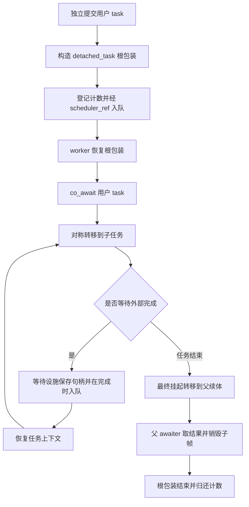

# 异步运行时

运行时把就绪协程调度到工作线程，并在同一事件循环中驱动 io_uring、定时器和线程唤醒。调度器决定句柄进入哪条队列，worker 负责实际恢复，I/O 引擎负责把外部完成转换为就绪任务。本文按组件所有权、任务流动和线程生命周期解析实现。

## 1. 类与职责

源码位于 `include/faio/detail/runtime/`，通用协程协议位于 `include/faio/detail/coroutine/`。

| 类型 | 源码 | 职责 |
| --- | --- | --- |
| `default_runtime_service` | [default.hpp](../include/faio/detail/runtime/default.hpp) | 默认运行时的惰性创建、配置与外部入口同步 |
| `runtime_context` | [context.hpp](../include/faio/detail/runtime/context.hpp) | 拥有运行时实例，提供提交、阻塞执行和停止入口 |
| `runtime_config` | [config.hpp](../include/faio/detail/runtime/core/config.hpp) | 保存线程数、队列容量和事件循环间隔 |
| `runtime_poller` | [poller.hpp](../include/faio/detail/runtime/core/poller.hpp) | 拥有共享组件和线程池，协调启动、排空与 join |
| `shared` | [shared.hpp](../include/faio/detail/runtime/core/shared.hpp) | 拥有配置、调度域、根任务计数和退出屏障 |
| `worker` | [worker.hpp](../include/faio/detail/runtime/core/worker.hpp) | 组合本地调度器与 I/O 引擎，运行事件循环 |
| `domain_scheduler` | [domain_scheduler.hpp](../include/faio/detail/runtime/core/scheduler/domain_scheduler.hpp) | 管理全局队列、本地注册表、窃取和唤醒协调 |
| `local_scheduler` | [local_scheduler.hpp](../include/faio/detail/runtime/core/scheduler/local_scheduler.hpp) | 管理所属线程的任务选择、批量拉取、搜索与休眠转换 |
| `global_ready_queue` / `local_ready_queue` | [ready_queue.hpp](../include/faio/detail/runtime/core/scheduler/ready_queue.hpp) | 分别保存跨线程就绪任务和本地固定容量任务 |
| `scheduler_state_machine` / `worker_counters` | [state_machine.hpp](../include/faio/detail/runtime/core/scheduler/state_machine.hpp) | 维护工作、搜索、休眠线程的协调状态 |
| `worker_waker_ref` | [domain_scheduler.hpp](../include/faio/detail/runtime/core/scheduler/domain_scheduler.hpp) | 借用底层线程唤醒能力 |
| `coroutine_scheduler` / `ready_sink` / `scheduler_ref` | [scheduler.hpp](../include/faio/detail/coroutine/scheduler.hpp) | 调度协议概念与类型擦除的调度借用引用 |
| `execution_thread_binding` / `execution_thread_guard` | [execution_thread.hpp](../include/faio/detail/coroutine/execution_thread.hpp) | 保存执行线程能力，并成对安装、恢复线程绑定 |
| `io_engine` | [io_engine.hpp](../include/faio/detail/runtime/core/io_engine.hpp) | 驱动 CQE、取消请求、定时器和 eventfd 监视 |
| `root_task_counter` | [root_task_counter.hpp](../include/faio/detail/runtime/core/root_task_counter.hpp) | 跟踪运行时活动根帧，供关闭流程等待排空 |

组件所有权如下，箭头表示拥有关系：

```text
runtime_context
└── runtime_poller
    ├── shared
    │   ├── runtime_config
    │   ├── domain_scheduler
    │   │   ├── global_ready_queue
    │   │   ├── scheduler_state_machine
    │   │   └── 本地队列与唤醒端注册表（借用）
    │   ├── root_task_counter
    │   └── worker 退出屏障
    └── 工作线程
        └── worker（各线程栈上）
            ├── io_engine：io_uring、eventfd、定时器
            ├── local_scheduler：本地就绪队列
            └── 执行线程绑定及其 guard
```

`shared` 先于 worker 构造，全部线程退出后才销毁。本地调度器借用调度域，调度域的注册表借用本地队列与唤醒端；统一的启动和退出屏障保证这些地址在运行阶段稳定。

## 2. 运行时入口与配置

无显式上下文的 `faio::spawn()`、`spawn_detached()` 和 `block_on()` 从普通线程进入时，使用进程默认运行时。worker 内的提交直接使用执行线程绑定。显式 `runtime_context` 允许调用方创建并拥有独立运行时。

`default_runtime_service::with_context()` 用共享锁覆盖外部入口调用；首次创建时改用独占锁，构造 `runtime_context` 后重新取得共享锁。`configure()` 和 `shutdown()` 使用独占锁，使配置、创建、外部提交和关闭之间具有明确顺序。

配置在首次启动前确定，context 构造时验证并保存副本：

| 字段 | 默认值 | 作用 |
| --- | --- | --- |
| `_num_workers` | 硬件并发数，至少 1 | 工作线程数量，同时决定注册表与屏障容量 |
| `_num_events` | 1024 | io_uring 队列容量 |
| `_submit_interval` | 4 | I/O 操作的自动批量提交间隔 |
| `_io_interval` | 61 | 持续执行任务时轮询 I/O 的事件循环间隔 |
| `_global_queue_interval` | 61 | 本地工作持续存在时优先检查全局队列的间隔 |
| `_idle_spin_count` | 32 | 搜索者进入底层等待前的有限空闲轮询次数 |

线程数、事件数、I/O 间隔和全局队列间隔必须大于零；空闲轮询次数允许为零。间隔按循环轮次计量，不代表固定时间长度。`config_builder` 只构建配置值，已经启动的运行时使用其保存的配置。

默认服务关闭后保持关闭状态，不再创建实例。配置和关闭入口拒绝在 worker 上调用；阻塞执行的线程限制见[协程并发](协程并发.md)。

## 3. 协程调度

协程调度决定挂起的协程如何重新进入执行线程。调度协议把句柄交给具体调度器，执行线程绑定提供当前线程的能力，就绪队列与窃取在多个 worker 之间分配工作，搜索状态机协调线程入睡与唤醒。任务自身的帧协议与上下文恢复见[协程封装](协程封装.md)。

### 3.1 调度协议与借用引用

`coroutine_scheduler` 要求具体调度器提供 `enqueue(std::coroutine_handle<>) -> void`。接口的执行约束是：成功接受句柄后安排一次恢复，入队函数不直接调用 `resume()`；入队抛异常时，提交方仍承担句柄的清理责任。

`scheduler_ref` 保存具体调度器地址和静态操作表地址。操作表按调度器类型生成，将类型擦除的指针转换回构造时的真实类型：

```cpp
void schedule(std::coroutine_handle<> handle) const {
  if (!*this) throw std::logic_error("没有可用的调度器");
  ops_->enqueue(state_, handle);
}
```

该引用不分配内存，也不持有调度器所有权。调度器需要存活到所有使用它的任务和等待节点结束。

`ready_sink` 约束 `enqueue_ready(handle)`。I/O 和定时器在所属线程报告完成时，经这个接口把句柄交给本地调度器；具体队列布局由接收端决定。

### 3.2 执行线程绑定

worker 构造时依次创建 I/O 引擎、本地调度器，再创建 `execution_thread_binding` 并安装 guard。绑定保存：

- 当前调度域的 `scheduler_ref`。
- 运行时根任务计数的 `task_lifetime_ref`。
- 本地就绪队列地址及类型标识。
- 当前 worker 编号。

通用协程代码通过 `current_scheduler()`、`current_task_lifetime()` 和 `current_worker_id()` 查询能力。调度域读取本地状态时，`local_state_for<T>()` 同时校验调度器实例和类型标识，只有匹配本调度域、本地队列类型的线程才能使用本地入队路径。I/O 资源另由 `current_io_engine`、`current_uring`、`current_timer` 定位。

`execution_thread_guard` 构造时安装线程局部的绑定指针，析构时恢复原指针。任务的 `scheduler` 表示调度域归属；worker 编号表示当前执行位置。任务经队列和窃取恢复后，调度域可以保持相同，worker 编号则随实际执行线程变化。

worker 恢复一个就绪句柄前，暂时清空 `current_tracker` 和 `current_stop_token`。根包装负责安装入口上下文；已经挂起的用户任务通过 awaiter 的恢复逻辑重新安装自己的上下文。一次 `resume()` 返回后，worker 恢复先前保存的线程局部值。

### 3.3 就绪任务怎样进入调度域

`domain_scheduler::enqueue()` 是通用入队入口，核心流程如下：

```cpp
auto* binding = ::faio::detail::current_execution_thread;
auto* local = binding
    ? binding->local_state_for<local_queue_type>(scheduler_ref{*this})
    : nullptr;
if (local) {
  if (local->push_local(task, global_queue_)) wake_up_one();
} else {
  global_queue_.push_back(task);
  wake_up_one();
}
```

线程绑定同时匹配调度域身份和本地队列类型时，使用本地路径。普通线程或另一个运行时的 worker 提交到该域时，使用全局队列。

任务来源与入口的对应关系如下：

| 来源 | 就绪路径 |
| --- | --- |
| 普通线程提交根任务 | 调度域 → 全局队列 |
| 同域 worker 的 spawn、yield 或等待节点通知 | 调度域 → 本地快速槽，旧快速任务进入 FIFO |
| 外部线程通知同步等待者 | 节点保存的调度器 → 目标域全局队列 |
| io_uring / 定时器完成 | `ready_sink::enqueue_ready()` → 所属线程本地 FIFO |
| 本地队列溢出 | 将任务批量转交全局队列，或将新任务直接交给全局队列 |
| 工作窃取 | 从其他 worker 的 FIFO 领取一批，留存其余任务并立即执行其中一个 |

就绪队列存放句柄并承担安排执行的责任，帧所有权由 task awaiter 和根包装协议管理。等待中的任务不在就绪队列中，但仍属于活动根任务。

### 3.4 worker 事件循环

`worker::run()` 的一次循环按以下顺序推进：

1. 增加 `tick`，到 I/O 检查间隔时驱动完成事件，并检查调度域是否关闭。
2. 从本地调度器取得任务；取得后结束搜索状态并恢复句柄。
3. 没有任务时尝试搜索与窃取，再检查全局队列。
4. 没有可执行任务时驱动一次 I/O；发生进展则继续循环。
5. 已领取搜索名额且仍有空闲轮询预算时，执行 `cpu_relax()` 后继续搜索。
6. 进入休眠登记与底层等待流程。

任务获取部分的源码为：

```cpp
if (auto task = scheduler_.next_task(tick_)) {
  idle_turns_ = 0;
  execute(*task);
  continue;
}
if (auto task = scheduler_.steal_task()) {
  idle_turns_ = 0;
  execute(*task);
  continue;
}
if (drive_io()) {
  idle_turns_ = 0;
  continue;
}
```

任务持续就绪时，周期性 I/O 检查使外部完成仍能进入队列。事件循环实际调用 `resume()`，调度入队与完成通知只交接句柄。

### 3.5 就绪队列与任务选择

#### 全局队列

`global_ready_queue` 用短互斥区保护 `std::deque` 和关闭时的提交检查，原子 `has_tasks_` 表示空/非空状态。提示只在空与非空转换时更新；取任务时仍在锁内确认实际容器状态。

本地缺少任务时，`local_scheduler::next_task()` 用固定数组从全局批量拉取，最多取 128 个并受本地剩余容量限制。最后一个直接返回执行，其余进入本地 FIFO。到 `_global_queue_interval` 对应轮次时，先尝试取一个全局任务，再检查本地队列。

全局批量入队在锁内具备整体成功或失败的语义。容器分配失败时删除此次已追加前缀，提交方据此恢复本地队列状态。

#### 本地快速槽与 FIFO

本地队列包含容量为 256 的环形存储，以及一个线程私有的 `fast_task_`。普通本地入队先放快速槽；槽已占用时，先安置旧句柄到 FIFO，再用新句柄替换槽。

远端线程只能窃取环形队列，不能访问快速槽。FIFO 存在工作时，连续从快速槽取任务达到 8 次后，给 FIFO 一次取任务机会；所属线程确认 FIFO 为空时，可以直接消费快速槽。I/O 批量完成直接进入 FIFO，批次结束后统一判断是否唤醒同伴。

#### 环形队列的边界协议

本地队列以原子 `tail_` 发布已写入的槽位，以 64 位原子 `head_` 同时保存两个 32 位边界：

| 边界 | 含义 |
| --- | --- |
| `protected_head` | 尚受读取保护的最早槽位，生产者计算复用空间时使用 |
| `local_head` | 下一个未被领取的任务，本地消费从这里推进 |
| `tail` | 下一个生产位置，之前的槽位已发布 |

没有远端复制时，两个 head 相等。窃取者通过 CAS 将 `local_head` 向前推进，暂时保留 `protected_head`，取得一段独占读取范围。复制完成后合并保护边界，生产者才可以复用这些槽位。

本地消费者先读取句柄，再 CAS 推进 head；领取后不再写回该槽位。生产者写入槽位后 release 更新 tail，读取方 acquire 观察发布边界。

#### 溢出与窃取

满队列且没有窃取者保护槽位时，本地生产者领取半队列，将这批任务和新任务一起转交全局队列。转交失败则恢复原 head。若远端正在复制受保护范围，只把新任务交给全局队列，保留槽位供窃取者读取。

窃取从线程私有伪随机状态给出的起点扫描其他注册队列，遇到可领取任务即停止。领取数量为源队列任务数的一半向上取整，并受目标剩余容量限制；其中一个直接执行，其余通过一次 tail 发布进入目标 FIFO。

### 3.6 搜索状态与休眠唤醒

#### 状态机的计数含义

`worker_counters` 维护工作线程数和搜索线程数。工作数表示尚未登记休眠的线程，包含执行和搜索状态；搜索数表示正在尝试取得任务的线程。

自主搜索名额通过 CAS 领取，上限为 worker 数的一半向上取整。真正执行用户代码前归还搜索名额。没有搜索者且存在休眠线程时，状态机从休眠集合摘出一个线程，预先增加其工作和搜索计数，再返回 worker 编号给底层唤醒端。

最后一个搜索者退出搜索或登记休眠时，调度域帮助检查、唤醒潜在的工作接收者。搜索计数、工作计数和休眠集合一起协调入睡与通知。

#### 登记、重查、等待

防止丢失唤醒的关键是先登记休眠，再重查任务，最后进入内核等待。worker 的核心等待流程如下：

```cpp
if (shutdown_ || !scheduler_.prepare_sleep()) return;
while (!shared_.scheduler().closed()) {
  if (scheduler_.has_ready_task()) {
    (void)scheduler_.finish_sleep();
    return;
  }
  io_engine_.wait_and_drive(scheduler_);
  scheduler_.flush_ready();
  if (scheduler_.finish_sleep()) return;
}
```

登记后发现本地或全局工作时，worker 撤销自己的休眠记录。如果唤醒方已经摘除记录，则 worker 接续唤醒方预先登记的搜索状态。

底层事件返回但没有就绪任务时，例如只处理了取消请求，`finish_sleep()` 检查该线程是否仍在休眠集合中，决定继续等待或返回事件循环。eventfd 保存唤醒计数，提交与真正进入内核等待交错时，已写入的通知仍可被读取。

### 3.7 协作调度与 this_coro

`this_coro` 函数返回轻量标记，由 promise 的 `await_transform()` 解释。单独调用标记函数不执行查询或调度。

| 表达式 | 行为 |
| --- | --- |
| `co_await this_coro::stop_token()` | 立即取得任务保存的停止令牌 |
| `co_await this_coro::scheduler()` | 立即取得任务的调度借用引用 |
| `co_await this_coro::worker_id()` | 立即读取当前执行线程编号 |
| `co_await this_coro::priority()` | 立即读取任务优先级元数据 |
| `co_await this_coro::yield()` | 将当前协程重新入队，恢复后安装任务上下文 |
| `co_await this_coro::yield_if_needed()` | 递减帧内预算，归零时重新入队，恢复后将预算重置为 64 |

预算按 `yield_if_needed()` 的调用次数消耗，不是时间片。CPU 循环通过主动让出给其他就绪任务执行机会；停止请求由令牌检查和支持取消的等待操作协作处理，`yield()` 本身不抛取消异常。

一次任务从提交到完成的整体执行关系如下：


```mermaid
flowchart TD
    A[独立提交用户 task] --> B[构造 detached_task 根包装]
    B --> C[登记计数并经 scheduler_ref 入队]
    C --> D[worker 恢复根包装]
    D --> E[co_await 用户 task]
    E --> F[对称转移到子任务]
    F --> G{是否等待外部完成}
    G -->|是| H[等待设施保存句柄并在完成时入队]
    H --> I[恢复任务上下文]
    I --> F
    G -->|任务结束| J[最终挂起转移到父续体]
    J --> K[父 awaiter 取结果并销毁子帧]
    K --> L[根包装结束并归还计数]
```

## 4. I/O、定时器与取消完成

`io_engine::drive(sink)` 用固定数组读取一批 CQE，按以下顺序处理：

1. `user_data == nullptr` 的事件作为内部唤醒或取消完成处理，不恢复用户协程。
2. 用户事件移除关联定时任务，写入 `expected` 结果，并发布取消状态中的 `done` 标志。
3. 通过 `sink.enqueue_ready(handle)` 报告用户操作就绪，再消费 CQE。
4. 取出跨线程取消请求，在所属线程准备取消 SQE。
5. 轮询定时器，经同一 sink 发布到期任务。
6. 重建 eventfd 监视，并刷新待提交 SQE。

worker 的 `drive_io()` 在批次有进展时调用 `flush_ready()`，让本地调度器统一执行同伴唤醒判断。

跨线程停止回调调用 `request_cancel()` 时，只在互斥区内保存共享取消状态，设置原子提示并唤醒引擎。liburing 的提交队列由所属 worker 操作。原操作已经完成时，消费方跳过取消；取消 SQE 的 `user_data` 为空，用户协程由原操作的 CQE 恢复一次。

`wait_and_drive()` 根据定时器的下一截止时间执行底层等待，再处理完成事件。定时器取消请求也交由所属线程清理时间轮。I/O 等待者与时间轮的内部机制分别见[异步IO](异步IO.md)和[定时器](定时器.md)。

## 5. 启动、排空与资源销毁

### 5.1 启动屏障

`runtime_poller` 先构造 `shared`，再创建固定数量的 `std::jthread`。每个线程在栈上构造 worker，完成本地队列与唤醒端注册后，参与 `workers_started_` 屏障。创建线程也参与该屏障，全部注册完成后，context 才返回可用实例，各 worker 开始事件循环。

### 5.2 根任务计数

根任务在提交前通过 `task_lifetime_ref` 登记，根 promise 析构时归还。`root_task_counter` 的等待循环如下：

```cpp
for (auto count = active_tasks_.load(std::memory_order_acquire); count != 0;
     count = active_tasks_.load(std::memory_order_acquire))
  active_tasks_.wait(count, std::memory_order_acquire);
```

同步原语、I/O 和定时器中的挂起任务仍占有根计数。就绪队列为空只能说明此刻没有可执行句柄，运行时关闭的依据是全部根帧结束。

### 5.3 关闭顺序

默认服务的 `shutdown()` 先标记服务关闭并移出 context，停止后续外部入口，再在锁外销毁 context。`runtime_context::stop()` 释放 poller，poller 的析构顺序为：

```cpp
shared_.wait_for_tasks();
close();
wait_for_all();
```

完整资源顺序是：根任务排空 → 关闭调度域 → 唤醒全部 worker → 事件循环退出 → worker 退出屏障 → 恢复线程绑定、注销本地队列与唤醒端 → 销毁 I/O 引擎 → join 全部线程 → 销毁 shared。

worker 的析构函数先参与统一退出屏障，成员随后按逆序析构。这个屏障保证本地队列注销和销毁时，其他 worker 已结束窃取。显式 context 由调用方协调其外部提交与停止的使用期限。

关闭流程等待任务完成，不向全部任务隐式请求停止。应用通过句柄、作用域或任务持有的停止机制让长期运行任务退出后，根计数才能归零。

## 6. 诊断日志

[log.hpp](../include/faio/log.hpp) 创建独立的 `faio` spdlog logger，保存在线程安全的函数局部静态对象中。默认 sink 为 `stderr_color_sink_mt`，级别为 `info`，`warn` 及以上立即 flush，输出格式为：

```text
[年-月-日 时:分:秒.毫秒] [级别] [faio] [thread 线程ID] 消息
```

worker 启停和定时器生命周期使用 `debug`；时间轮处理等高频细节使用 `trace`；服务正常信息使用 `info`；可恢复异常与操作失败分别使用 `warn` 和 `error`。具体日志点由所属模块调用 `faio::log::logger()` 的对应方法。

应用可以在启动运行时前设置日志级别和格式：

```cpp
auto logger = faio::log::logger();
logger->set_level(spdlog::level::debug);
logger->set_pattern("[%H:%M:%S.%e] [%l] [%n] [thread %t] %v");
```

logger 的运行时级别控制输出，直接方法调用不受 `SPDLOG_ACTIVE_LEVEL` 的宏过滤影响。添加或替换 sink 时需要处于没有并发日志调用的阶段。库 logger 不注册为应用默认 logger，配置直接作用于这一独立实例。

`default_service()` 在构造默认运行时服务前先取得 logger，使进程静态析构时默认服务的排空和 worker 退出日志具有有效的 logger 生命周期。
