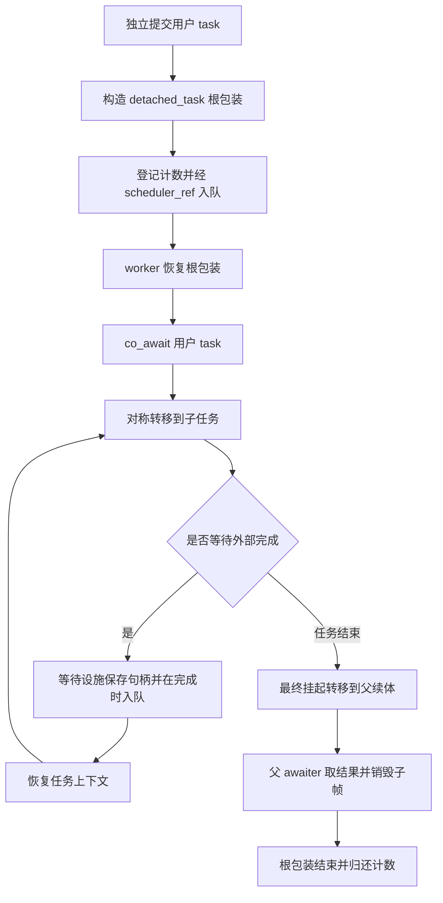

# 异步运行时

运行时在执行线程的事件循环中驱动就绪协程、原生 io_uring 完成或 epoll/kqueue 就绪事件、文件完成、定时器和线程唤醒。默认 `multi_thread` 模式使用后台 worker 池；`current_thread` 模式由调用方线程驱动一个持久的调度核心。本文的 worker、窃取和搜索状态机章节描述多线程后端；单线程实现的性能分析见 [单线程运行时性能](单线程运行时性能.md)。

## 1. 架构总览

运行时按照"**协议—域—线程**"三层组织：

- **协议层**（`coroutine/`）：`coroutine_scheduler` 概念、`scheduler_ref` 借用引用、`execution_thread_binding` 线程绑定。协程层只面向协议编程，不感知队列与线程。
- **调度域层**（`domain_scheduler`）：一个运行时实例对应一个调度域，拥有全局就绪队列、本地队列注册表和搜索/休眠状态机，负责任务在 worker 之间的分配。
- **线程层**（`worker` / `current_thread_runtime`）：每个执行线程组合一个本地调度器与一个 I/O 引擎，运行事件循环；线程之间通过窃取和唤醒协调。

这一分层使 I/O 完成、定时器到期等事件源只需面向 `ready_sink` 接口交付句柄，不需要了解队列布局；也使 current_thread 与 multi_thread 能够共享同一套协程协议、定时器与阻塞任务设施。

源码位于 `include/faio/detail/runtime/`：

```text
runtime/
├── common/          两种运行时共享的配置、I/O 引擎适配、阻塞任务和生命周期计数
├── current_thread/  单线程调度与驱动
├── multi_thread/    多线程调度、工作线程与启动关闭流程
├── timer/           两种运行时共享的定时器与时间轮
├── context.hpp      运行时实例入口
└── default.hpp      默认运行时服务
```

## 2. 类与职责

| 类型 | 源码 | 职责 |
| --- | --- | --- |
| `default_runtime_service` | [default.hpp](../include/faio/detail/runtime/default.hpp) | 默认运行时的惰性创建、配置与外部入口同步 |
| `runtime_context` | [context.hpp](../include/faio/detail/runtime/context.hpp) | 拥有运行时实例，提供提交、阻塞执行和停止入口 |
| `runtime_config` | [config.hpp](../include/faio/detail/runtime/common/config.hpp) | 保存线程数、队列容量和事件循环间隔 |
| `current_thread_runtime` / `current_thread_scheduler` | [runtime.hpp](../include/faio/detail/runtime/current_thread/runtime.hpp)、[scheduler.hpp](../include/faio/detail/runtime/current_thread/scheduler.hpp) | 持久的单线程调度核心、FIFO、跨线程注入和休眠握手 |
| `blocking_pool` | [blocking_pool.hpp](../include/faio/detail/runtime/common/blocking_pool.hpp) | 两种模式共享的独立阻塞线程池 |
| `start_blocking` | [blocking_task.hpp](../include/faio/detail/runtime/common/blocking_task.hpp) | 将阻塞函数包装为任务，登记生命周期并发布可等待的结果 |
| `Timer` / `TimerWheel` | [timer.hpp](../include/faio/detail/runtime/timer/timer.hpp)、[wheel.hpp](../include/faio/detail/runtime/timer/wheel.hpp) | 管理到期任务和分层时间轮 |
| `runtime_poller` | [poller.hpp](../include/faio/detail/runtime/multi_thread/poller.hpp) | 拥有共享组件和线程池，协调启动、排空与 join |
| `shared` | [shared.hpp](../include/faio/detail/runtime/multi_thread/shared.hpp) | 拥有配置、调度域、根任务计数和退出屏障 |
| `worker` | [worker.hpp](../include/faio/detail/runtime/multi_thread/worker.hpp) | 组合本地调度器与 I/O 引擎，运行事件循环 |
| `domain_scheduler` | [domain_scheduler.hpp](../include/faio/detail/runtime/multi_thread/scheduler/domain_scheduler.hpp) | 管理全局队列、本地注册表、窃取和唤醒协调 |
| `local_scheduler` | [local_scheduler.hpp](../include/faio/detail/runtime/multi_thread/scheduler/local_scheduler.hpp) | 管理所属线程的任务选择、批量拉取、搜索与休眠转换 |
| `global_ready_queue` / `local_ready_queue` | [ready_queue.hpp](../include/faio/detail/runtime/multi_thread/scheduler/ready_queue.hpp) | 分别保存跨线程就绪任务和本地固定容量任务 |
| `scheduler_state_machine` / `worker_counters` | [state_machine.hpp](../include/faio/detail/runtime/multi_thread/scheduler/state_machine.hpp) | 维护工作、搜索、休眠线程的协调状态 |
| `local_execution_budget` | [local_execution_budget.hpp](../include/faio/detail/runtime/multi_thread/scheduler/local_execution_budget.hpp) | 连续私有快速恢复链的协作额度记账 |
| `worker_waker_ref` | [domain_scheduler.hpp](../include/faio/detail/runtime/multi_thread/scheduler/domain_scheduler.hpp) | 借用底层线程唤醒能力 |
| `coroutine_scheduler` / `ready_sink` / `scheduler_ref` | [scheduler.hpp](../include/faio/detail/coroutine/scheduler.hpp) | 调度协议概念与类型擦除的调度借用引用 |
| `execution_thread_binding` / `execution_thread_guard` | [execution_thread.hpp](../include/faio/detail/coroutine/execution_thread.hpp) | 保存执行线程能力，并成对安装、恢复线程绑定 |
| `io_engine` | [io_engine.hpp](../include/faio/detail/runtime/common/io_engine.hpp) | 组合中立 I/O 驱动与时间轮的运行时适配器 |
| `root_task_counter` | [root_task_counter.hpp](../include/faio/detail/runtime/common/root_task_counter.hpp) | 跟踪运行时活动根帧，供关闭流程等待排空 |

多线程组件所有权如下，箭头表示拥有关系：

```text
runtime_context
└── runtime_poller
    ├── shared
    │   ├── runtime_config
    │   ├── io_services（文件 / DNS / 清理服务）
    │   ├── domain_scheduler
    │   │   ├── global_ready_queue
    │   │   ├── scheduler_state_machine
    │   │   └── 本地队列与唤醒端注册表（借用）
    │   ├── blocking_pool
    │   ├── root_task_counter
    │   └── worker 退出屏障
    └── 工作线程
        └── worker（各线程栈上）
            ├── io_engine：中立 IO 引擎、唤醒端、定时器
            ├── local_scheduler：本地就绪队列与执行预算
            └── 执行线程绑定及其 guard
```

`shared` 先于 worker 构造，全部线程退出后才销毁。本地调度器借用调度域，调度域的注册表借用本地队列与唤醒端；统一的启动屏障和退出屏障保证这些借用地址在运行阶段稳定，窃取路径无需持有注册表锁。

## 3. 运行时入口与配置

无显式上下文的 `faio::spawn()`、`spawn_detached()` 和 `block_on()` 从普通线程进入时，使用进程默认运行时。worker 内的提交直接使用执行线程绑定。显式 `runtime_context` 允许调用方创建并拥有独立运行时。

`default_runtime_service::with_context()` 用共享锁覆盖外部入口调用；首次创建时改用独占锁，构造 `runtime_context` 后重新取得共享锁。`configure()` 和 `shutdown()` 使用独占锁，使配置、创建、外部提交和关闭之间具有明确顺序。

配置在首次启动前确定，context 构造时验证并保存副本：

| 字段 | 默认值 | 作用 |
| --- | --- | --- |
| `_mode` | `multi_thread` | 选择后端；配置时可省略 `set_mode()` |
| `_num_workers` | 硬件并发数，至少 1 | 工作线程数量，同时决定注册表与屏障容量 |
| `_num_events` | 1024 | reactor 事件批量配置，实际批量截取到 1 至 256 |
| `_submit_interval` | 4 | 兼容保留配置；当前统一驱动每轮 flush，readiness 在 await 时即时尝试 syscall |
| `_io_interval` | 61 | 持续执行任务时轮询 I/O 的事件循环间隔 |
| `_max_io_delay` | Linux 100 微秒；其他平台 1 毫秒 | 在可恢复边界检查的 I/O 轮询时间预算，与轮次条件任一达到即驱动 |
| `_global_queue_interval` | 61 | 本地工作持续存在时优先检查全局队列的间隔 |
| `_idle_spin_count` | 自动：Linux epoll/uring 0；kqueue 32 | 启动线程前解析；显式次数优先，UINT32_MAX 表示自动 |
| `_max_blocking_threads` | 64 | 阻塞线程池上限，不计入异步 worker 数量 |
| `_blocking_keep_alive` | 10 秒 | 保留兼容配置；固定预热池在关闭时回收线程 |

多线程的 worker 数、事件数、I/O 间隔、全局队列间隔、文件/DNS/阻塞服务配额和阻塞线程保活时间必须大于零；空闲轮询次数允许为零（禁用空闲轮询）。单线程忽略 worker 数和多线程搜索自旋参数。间隔按循环轮次计量，不代表固定时间长度。`config_builder` 只构建配置值，已启动的运行时使用其保存的配置。

默认服务关闭后保持关闭状态，不再创建实例。配置和关闭入口拒绝在 worker 上调用；阻塞执行的线程限制见[协程并发](协程并发.md)。

## 4. 协程调度

协程调度决定挂起的协程如何重新进入执行线程。调度协议把句柄交给具体调度器，执行线程绑定提供当前线程的能力，就绪队列与窃取在多个 worker 之间分配工作，搜索状态机协调线程入睡与唤醒。任务自身的帧协议与上下文恢复见[协程封装](协程封装.md)。

### 4.1 调度协议与借用引用

`coroutine_scheduler` 要求具体调度器提供 `enqueue(std::coroutine_handle<>) -> void`。接口的执行约束是：成功接受句柄后安排恰好一次恢复，入队函数不直接调用 `resume()`；入队抛异常时，提交方仍承担句柄的清理责任。

`scheduler_ref` 保存具体调度器地址和静态操作表地址。操作表按调度器类型生成，将类型擦除的指针转换回构造时的真实类型，并提供普通提交、I/O 完成和手工公平让出入口。库内两个自让出 awaiter 还通过私有入口提供立即归还执行权的提示；具体调度器未实现该能力时，先回退公平让出能力，再回退普通提交。所有可选能力由静态适配选择，引用实例始终只有两个指针：

```cpp
void schedule(std::coroutine_handle<> handle) const {
  if (!*this)
    throw std::logic_error("没有可用的调度器");
  ops_->enqueue(state_, handle);
}
```

该引用不分配内存，也不持有调度器所有权。调度器需要存活到所有使用它的任务和等待节点结束。

`ready_sink` 约束 `enqueue_ready(handle)`，定时器经这个接口交付本地就绪任务。I/O 协程桥调用保存的 `scheduler_ref::schedule_io(handle)`：多线程调度域使用批量完成入口，单线程及自定义调度器使用各自支持的投递入口。底层 I/O 核心只发布中立完成结果，不持有运行时的队列或 worker。

### 4.2 执行线程绑定

worker 构造时依次创建 I/O 引擎、本地调度器，再创建 `execution_thread_binding` 并安装 guard。绑定保存：

- 当前调度域的 `scheduler_ref`；
- 运行时根任务计数的 `task_lifetime_ref`；
- 本地就绪队列地址及类型标识；
- 当前 worker 编号；
- 阻塞线程池入口。

通用协程代码通过 `current_scheduler()`、`current_task_lifetime()` 和 `current_worker_id()` 查询能力。调度域读取本地状态时，`local_state_for<T>()` 同时校验调度器实例和类型标识，只有匹配本调度域、本地队列类型的线程才能使用本地入队路径。新 I/O 请求可从线程绑定查询默认 context；长期存在的资源保存显式 domain 租约，移动及析构不依赖 TLS。定时器通过当前 timer 入口注册。

任务的 `scheduler` 表示调度域归属；worker 编号表示当前执行位置。任务经队列和窃取恢复后，调度域保持不变，worker 编号随实际执行线程变化。

worker 恢复一个就绪句柄前，暂时清空 `current_tracker` 和 `current_stop_token`：根包装负责安装入口上下文，已挂起的用户任务通过 awaiter 的恢复逻辑重新安装自己的上下文。一次 `resume()` 返回后，worker 恢复先前保存的线程局部值。

### 4.3 就绪任务怎样进入调度域

`domain_scheduler::enqueue()` 是通用入队入口：

```cpp
void enqueue(std::coroutine_handle<> task) {
  auto *binding = ::faio::detail::current_execution_thread;
  auto *local = binding
      ? binding->local_state_for<local_queue_type>(scheduler_ref{*this})
      : nullptr;
  if (local) {
    if (local->push_local(task, global_queue_))
      wake_up_one();
  } else {
    global_queue_.push_back(task);
    wake_up_one();
  }
}
```

线程绑定同时匹配调度域身份和本地队列类型时，使用本地路径；普通线程或另一个运行时的 worker 提交到该域时，使用全局队列。除普通提交外，调度域还实现专用入口：`enqueue_yield()` 把手工让出投递直接放入 FIFO，成功发布后承担通知责任；`enqueue_cooperative_yield()` 接受库内自让出提示，同样进入 FIFO，唯一的本地续体可由正在归还执行权的 worker 领取；`enqueue_io()` 把 I/O 完成放入所属线程快速槽，同一驱动批次的前项进入 FIFO，批次末尾统一通知同伴。

任务来源与入口的对应关系：

| 来源 | 就绪路径 |
| --- | --- |
| 普通线程提交根任务 | 调度域 → 全局队列 |
| 同域 worker 的 spawn 或等待节点通知 | 调度域 → 本地快速槽，旧快速任务进入 FIFO |
| 主动让出或协作预算耗尽 | 库内私有自让出入口 → 本地 FIFO 尾部；自定义调度器按公平让出能力或普通提交适配 |
| 手工投递让出句柄 | 公开 `scheduler_ref::schedule_yield()` → FIFO，成功发布后承担同伴通知责任 |
| 外部线程通知同步等待者 | 节点保存的调度器 → 目标域全局队列 |
| I/O 完成 | `scheduler_ref::schedule_io()` → 所属线程快速槽；前一快速任务进入 FIFO |
| 定时器完成 | `ready_sink::enqueue_ready()` → 所属线程本地 FIFO |
| 本地队列溢出 | 半队列批量转交全局队列，或将新任务直接交给全局队列 |
| 工作窃取 | 从其他 worker 的 FIFO 领取一批，留存其余任务并立即执行其中一个 |

就绪队列存放句柄并承担安排执行的责任，帧所有权由 task awaiter 和根包装协议管理。等待中的任务不在就绪队列中，但仍属于活动根任务。

### 4.4 worker 事件循环

`worker::run()` 的一次循环按以下顺序推进：

1. 增加 `tick`；到 `_io_interval` 对应轮次时驱动完成事件，并检查调度域是否关闭。
2. 从本地调度器取得任务；取得后在执行前检查 `_max_io_delay` 时间预算，超时先驱动一次 I/O，随后恢复句柄。
3. 本地没有任务时先驱动一次本域 I/O；发生进展则继续循环，消费本域完成。
4. 本域没有进展时尝试搜索与窃取，再检查全局队列。
5. 已领取搜索名额且仍有空闲轮询预算时，执行 `cpu_relax()` 后继续搜索。
6. 进入休眠登记与底层等待流程。

任务获取部分的核心源码：

```cpp
if (auto task = scheduler_.next_task(tick_)) {
  if (std::chrono::steady_clock::now() - last_io_drive_ >=
      shared_.config()._max_io_delay) {
    drive_io(); // 任务持续就绪时，I/O 完成至多延后一个时间预算
  }
  idle_turns_ = 0;
  execute(*task);
  continue;
}
if (drive_io()) { idle_turns_ = 0; continue; }
if (auto task = scheduler_.steal_task()) {
  idle_turns_ = 0;
  execute(*task);
  continue;
}
```

轮次间隔与时间预算是双重条件：任务持续就绪时，周期性轮次检查使外部完成仍能进入队列，时间预算则保证即使每个任务都极短、轮次间隔未到，I/O 完成的延迟也有确定上界。事件循环是唯一调用 `resume()` 的位置，调度入队与完成通知只交接句柄。

### 4.5 就绪队列与任务选择

#### 全局队列

`global_ready_queue` 用短互斥区保护 `std::deque` 和关闭时的提交检查，原子 `has_tasks_` 表示空/非空状态。提示只在空与非空转换时更新，避免每个任务都使所有消费者的缓存行失效；取任务时仍在锁内确认实际容器状态。

本地缺少任务时，`local_scheduler::next_task()` 用固定数组从全局批量拉取（容量为本地队列的一半，受本地剩余容量限制）：最后一个直接返回执行，其余进入本地 FIFO。到 `_global_queue_interval` 对应轮次时，先尝试取一个全局任务，再检查本地队列，防止连续本地工作饿死外部提交。

全局批量入队在锁内具备整体成功或失败的语义：容器分配失败时删除已追加前缀，提交方据此恢复本地队列状态。

#### 本地快速槽与 FIFO

本地队列包含容量为 256 的环形存储，以及一个线程私有的 `fast_task_` 快速槽。普通本地入队先放快速槽；槽已占用时，先安置旧句柄到 FIFO，再用新句柄替换槽。主动让出和协作预算耗尽通过库内自让出能力直接进入 FIFO 尾部，不占用或替换快速槽。入队前没有其他本地任务且入队后全局为空时，当前 worker 在归还执行权后领取续体；已有 fast/FIFO/global 工作、远程提交或 FIFO 溢出时保持同伴通知。公开 `schedule_yield()` 支持手工投递另一帧，成功发布后承担同伴通知责任。续体均保留原 FIFO 顺序和窃取能力。

远端线程只能窃取环形队列，不能访问快速槽。快速槽的公平性由所属线程的 `fifo_hint_` 提示和连续计数共同约束：FIFO 存在工作时，连续从快速槽取任务达到 3 次后给 FIFO 一次机会；所属线程确认 FIFO 为空时，可以直接消费快速槽而不增加计数。I/O 批量完成复用快速槽，只有批次最后一条保留为私有任务，前项仍进入 FIFO；批次结束后 FIFO 有可窃取任务或全局存在待处理项时，统一判断是否唤醒同伴。

执行链协作额度耗尽时，所属线程在下次本地选择前将等待的 `fast_task_` 通过 `push_back()` 放到已有 FIFO 尾部；队列满时按原协议转交全局。发布成功后清私有槽并结束其连续优先计数，入队异常保持原 fast/FIFO 归属。降级后的任务按 FIFO 顺序领取且可以被远端窃取。降级前已有其他 FIFO 工作或发布后存在全局工作时通知同伴，只有一个待执行任务时由所属线程推进。

#### 环形队列的边界协议

本地队列以原子 `tail_` 发布已写入的槽位，以 64 位原子 `head_` 同时保存两个 32 位边界：

| 边界 | 含义 |
| --- | --- |
| `protected_head`（高 32 位） | 尚受读取保护的最早槽位，生产者计算复用空间时使用 |
| `local_head`（低 32 位） | 下一个未被领取的任务，本地消费从这里推进 |
| `tail` | 下一个生产位置，之前的槽位已发布 |

没有远端复制时，两个 head 相等。窃取者通过 CAS 将 `local_head` 向前推进、暂时保留 `protected_head`，取得一段独占读取范围：

```cpp
if (head_.compare_exchange_weak(head, pack(start, start + count),
                                std::memory_order_acq_rel,
                                std::memory_order_acquire))
  break;
// 复制完成后合并保护边界，生产者才可以复用这些槽位
```

复制完成后合并保护边界。本地消费者先读取句柄，再 CAS 推进 head；生产者写入槽位后 release 更新 tail，读取方 acquire 观察发布边界。`head_` 与 `tail_` 分别对齐到独立缓存行，远端窃取者的 CAS 不与所属线程的发布边界共享缓存行。

#### 溢出与窃取

满队列且没有窃取者保护槽位时，本地生产者领取半队列，将这批任务和新任务一起转交全局队列；转交失败则恢复原 head。若远端正在复制受保护范围，只把新任务交给全局队列，保留槽位供窃取者读取。

窃取从线程私有伪随机状态给出的起点扫描其他注册队列，遇到可领取任务即停止。领取数量为源队列任务数的一半向上取整，并受目标剩余容量限制；其中一个直接执行，其余通过一次 tail 发布进入目标 FIFO。

### 4.6 搜索状态与休眠唤醒

#### 状态机的计数含义

`worker_counters` 维护工作线程数和搜索线程数。工作数表示尚未登记休眠的线程，包含执行和搜索状态；搜索数表示正在尝试取得任务的线程。

自主搜索名额通过 CAS 领取，上限为 worker 数的一半向上取整，限制空闲线程同时扫描队列造成的共享缓存争用。真正执行用户代码前归还搜索名额——搜索计数不包含正在运行用户代码的线程。没有搜索者且存在休眠线程时，状态机从休眠集合摘出一个线程，预先增加其工作和搜索计数，再返回 worker 编号给底层唤醒端。

最后一个搜索者退出搜索或登记休眠时，调度域检查全局队列和各 worker 的可窃取 FIFO，存在待处理任务才通知休眠同伴；私有快速槽由所属 worker 消费，不触发额外唤醒。搜索计数、工作计数和休眠集合一起协调入睡与通知。

#### 登记、重查、等待

防止丢失唤醒的关键是**先登记休眠，再重查任务，最后进入内核等待**。worker 的休眠流程：

```cpp
void sleep() {
  shutdown_ = shared_.scheduler().closed();
  if (shutdown_ || !scheduler_.prepare_sleep()) return;
  while (!shared_.scheduler().closed()) {
    if (scheduler_.has_ready_task()) {
      (void)scheduler_.finish_sleep();
      return;
    }
    io_engine_.wait_and_drive(scheduler_);
    scheduler_.flush_ready();
    if (scheduler_.finish_sleep()) return;
  }
  shutdown_ = true;
}
```

登记后发现本地或全局工作时，worker 撤销自己的休眠记录。如果唤醒方已经摘除记录，则 worker 接续唤醒方预先登记的搜索状态。

底层事件返回但没有就绪任务时（例如只处理了取消请求），`finish_sleep()` 检查该线程是否仍在休眠集合中，决定继续等待或返回事件循环。eventfd 保存唤醒计数，提交与真正进入内核等待交错时，已写入的通知仍可被读取。

### 4.7 协作调度与执行预算

`this_coro` 函数返回轻量标记，由 promise 的 `await_transform()` 解释。单独调用标记函数不执行查询或调度。

| 表达式 | 行为 |
| --- | --- |
| `co_await this_coro::stop_token()` | 立即取得任务保存的停止令牌 |
| `co_await this_coro::scheduler()` | 立即取得任务的调度借用引用 |
| `co_await this_coro::worker_id()` | 立即读取当前执行线程编号 |
| `co_await this_coro::priority()` | 立即读取任务优先级元数据 |
| `co_await this_coro::yield()` | 将当前协程放入 FIFO 尾部，恢复后安装任务上下文 |
| `co_await this_coro::yield_if_needed()` | 递减当前执行链共享额度，归零时进入 FIFO |

预算按 `yield_if_needed()` 的调用次数消耗，不是时间片。同一次 scheduler `resume()` 的父子 task 共享额度，直接对称转移不重置。multi_thread 通过 `local_execution_budget` 把连续私有 fast 恢复视为同一协作链：FIFO/global/steal 选择取得新的 64 额度，连续 fast 链沿用此前剩余值；driver、等待与无 ready 边界结束旧链。链耗尽时，等待的私有 fast 先按原 FIFO/全局协议降级，随后按现有顺序选择任务；自让出续体再次消耗额度也会排到该降级任务之后。降级任务从 FIFO 或全局领取时取得新的 64 额度。current_thread 与自定义默认 poll scope 在每次真正 resume 时补充 64。线程本地作用域在退出时还原外层剩余值，避免外部嵌套驱动消耗或重新补充外层预算：

```cpp
// local_execution_budget::execution_scope
execution_scope(local_execution_budget &owner, bool from_fast) noexcept
    : owner_(owner),
      poll_(from_fast && owner.active_ && owner.remaining_ != 0
                ? owner.remaining_                      // 连续 fast 链沿用余额
                : cooperative_budget_limit) {}          // 新链获得完整 64 额度
```

CPU 密集循环通过主动让出给其他就绪任务执行机会；停止请求由令牌检查和支持取消的等待操作协作处理，`yield()` 本身不抛取消异常。

一次任务从提交到完成的整体执行关系：


```mermaid
flowchart TD
    A[独立提交用户 task] --> B[构造 detached_task 根包装]
    B --> C[登记计数并经 scheduler_ref 入队]
    C --> D[worker 恢复根包装]
    D --> E[co_await 用户 task]
    E --> F[对称转移到子任务]
    F --> G{是否等待外部完成}
    G -->|是| H[等待设施保存句柄并在完成时入队]
    H --> I[恢复任务上下文]
    I --> F
    G -->|任务结束| J[最终挂起转移到父续体]
    J --> K[父 awaiter 取结果并销毁子帧]
    K --> L[根包装结束并归还计数]
```

## 5. I/O、定时器与取消完成

`runtime::detail::io_engine` 是运行时侧的组合适配器：它拥有中立 `io::io_engine` 与所属线程的 `Timer`，向事件循环暴露统一的 `drive` / `wait_and_drive` / `next_deadline` / `wake_up` 接口。`io_engine::drive(sink)` 驱动中立 I/O domain 及时间轮：

1. 用有界数组收取 epoll/kqueue 就绪事件，通过稳定资源 token 更新代际。
2. 重试非阻塞 syscall；文件服务完成和取消在同一仲裁中形成唯一终态。
3. 批量在锁外发布完成，协程桥通过挂起握手及保存的调度器恢复任务。
4. 轮询时间轮，经同一 sink 投递到期任务。
5. 一轮结束时刷新就绪队列通知（`flush_ready`），避免逐请求唤醒同伴。

停止回调保存首个取消原因并唤醒所属 domain，旧代际 token 不会影响复用的操作槽。已开始的文件 syscall 排空后才恢复借用 buffer 的调用者。网络就绪观察允许假阳性，只有真实 `EAGAIN` 才清除对应缓存。

`wait_and_drive()` 根据时间轮及 I/O deadline 计算底层等待时限；`next_deadline()` 合并两侧最近到期点。I/O 机制见[异步IO](异步IO.md)，时间轮见[定时器](定时器.md)。

## 6. 启动、排空与资源销毁

### 6.1 启动屏障

`runtime_poller` 先构造 `shared`，再创建固定数量的 `std::jthread`。每个线程在栈上构造 worker，完成本地队列与唤醒端注册后，参与 `workers_started_` 屏障。创建线程也参与该屏障；全部注册完成后，context 才返回可用实例，各 worker 开始事件循环。启动屏障保证窃取注册表在运行阶段不变，窃取路径无需加锁。

### 6.2 根任务计数

根任务在提交前通过 `task_lifetime_ref` 登记，根 promise 析构时归还。`root_task_counter` 的等待循环：

```cpp
for (auto count = active_tasks_.load(std::memory_order_acquire); count != 0;
     count = active_tasks_.load(std::memory_order_acquire))
  active_tasks_.wait(count, std::memory_order_acquire);
```

同步原语、I/O 和定时器中的挂起任务仍占有根计数。就绪队列为空只能说明此刻没有可执行句柄，运行时关闭的依据是全部根帧结束。

### 6.3 关闭顺序

默认服务的 `shutdown()` 先标记服务关闭并移出 context，停止后续外部入口，再在锁外销毁 context。`runtime_poller::shutdown()` 的完整顺序：

```cpp
if (policy == io::shutdown_policy::cancel_all)
  shared_.begin_io_shutdown(policy); // 先通知全部 shard，取消在途 I/O
shared_.wait_for_tasks();            // 等待全部根帧析构
shared_.blocking().close();          // 排空阻塞任务结果发布者
shared_.begin_io_shutdown(policy);
shared_.drain_io();                  // 唤醒并等待各 domain quiescent
close();                             // 关闭调度域，唤醒全部 worker
wait_for_all();                      // join 全部线程
```

`cancel_all` 策略先发出取消再排空，避免永远 pending 的读操作阻塞关闭；`drain` 策略直接等待已有任务完成。根任务排空后仍须等待阻塞任务结果发布者和资源关闭 publisher 退出，才能关闭调度域——最后一个根任务退出不代表 close/清理发布已完成。

worker 的析构函数先参与统一退出屏障，成员随后按逆序析构。这个屏障保证本地队列注销和销毁时，其他 worker 已结束窃取。显式 context 由调用方协调其外部提交与停止的使用期限。

关闭流程等待任务完成，不向全部任务隐式请求停止（除 `cancel_all` 策略对 I/O 的取消外）。应用通过句柄、作用域或任务持有的停止机制让长期运行任务退出后，根计数才能归零。

## 7. 诊断日志

[log.hpp](../include/faio/log.hpp) 创建独立的 `faio` spdlog logger，保存在线程安全的函数局部静态对象中。默认 sink 为 `stderr_color_sink_mt`，级别为 `info`，`warn` 及以上立即 flush，输出格式为：

```text
[年-月-日 时:分:秒.毫秒] [级别] [faio] [thread 线程ID] 消息
```

worker 启停和定时器生命周期使用 `debug`；时间轮处理等高频细节使用 `trace`；服务正常信息使用 `info`；可恢复异常与操作失败分别使用 `warn` 和 `error`。具体日志点由所属模块调用 `faio::log::logger()` 的对应方法。

应用可以在启动运行时前设置日志级别和格式：

```cpp
auto logger = faio::log::logger();
logger->set_level(spdlog::level::debug);
logger->set_pattern("[%H:%M:%S.%e] [%l] [%n] [thread %t] %v");
```

logger 的运行时级别控制输出，直接方法调用不受 `SPDLOG_ACTIVE_LEVEL` 的宏过滤影响。添加或替换 sink 时需要处于没有并发日志调用的阶段。库 logger 不注册为应用默认 logger，配置直接作用于这一独立实例。

`default_service()` 在构造默认运行时服务前先取得 logger，使进程静态析构时默认服务的排空和 worker 退出日志具有有效的 logger 生命周期。
