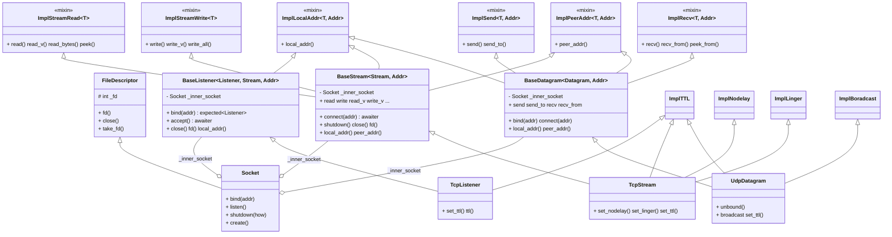

# 网络 IO

## 1. 采用的设计

1. **基于模板继承的混入（Mixin）**把「读」「写」「本机/对端地址」「数据报收发」「套接字选项」拆成独立的 **ImplXxx\<T\>** 模板，通过多重继承「混入」到 BaseStream、BaseDatagram、TcpListener 等。每个 mixin 只依赖 **T** 能提供 **fd()**（或 **Addr**），不关心最终是 TcpStream 还是 UdpDatagram，从而复用同一套 read/write/local_addr/peer_addr 实现。
2. **CRTP（奇异递归模板模式）**基类 **BaseListener\<Listener, Stream, Addr\>**、**BaseStream\<Stream, Addr\>**、**BaseDatagram\<Datagram, Addr\>** 把「具体类型」作为模板参数。这样基类里的 **bind**、**accept**、**connect** 可以返回 **expected\<Listener\>**、**pair\<Stream, Addr\>**、**expected\<Stream\>** 等，静态类型就是 TcpListener、TcpStream、UdpDatagram，调用方无需再向下转型。
3. **组合（has-a）**
   BaseListener、BaseStream、BaseDatagram **不继承** Socket，而是内部持有一个 **Socket _inner_socket**。fd 的创建、bind、listen、close 由 Socket（及其基类 FileDescriptor）统一负责，基类只负责「监听/流/数据报」的业务语义（如多地址 bind、accept、connect）。

---

## 3. 类图

下面用 Mermaid 表示继承与组合关系（省略 io 层 Read/Send 等）。



说明：**\<|--** 表示继承，**--o** 表示组合（持有一份）；模板参数用 **~L,S,A~** 简写。Mixin 与 Base 之间是继承关系，Base 把自己作为 **T** 传给 ImplXxx。

---

## 4. 类与接口表格

| 类                                                                    | 所在文件                                    | 职责                              | 主要接口                                                                                                                 |
| --------------------------------------------------------------------- | ------------------------------------------- | --------------------------------- | ------------------------------------------------------------------------------------------------------------------------ |
| **Ipv4Addr** / **Ipv6Addr**                                           | common/address.hpp                          | 纯 IP 表示与解析                  | parse(s), to_string(), addr()                                                                                            |
| **SocketAddr**                                                        | common/address.hpp                          | IP+端口，供 bind/connect/accept   | parse(host, port), sockaddr(), length(), port(), ip(), to_string()                                                       |
| **FileDescriptor**                                                    | io/io.hpp                                   | 持有 fd，关闭与非阻塞             | fd(), close(), take_fd(), set_nonblocking()                                                                              |
| **Socket**                                                            | common/socket.hpp                           | 套接字语义（继承 FD）             | bind(addr), listen(), shutdown(how), create(...)                                                                         |
| **BaseListener\<L,S,A\>**                                             | tcp/base_listener.hpp                       | TCP 监听：持 Socket，bind/accept  | bind(addr), bind(span), accept(), close(), fd(), local_addr()                                                            |
| **BaseStream\<S,A\>**                                                 | tcp/base_stream.hpp                         | TCP 流：持 Socket，connect 与读写 | connect(addr), shutdown(), close(), fd(), read/write/read_v/write_v/read_bytes/write_all/peek, local_addr(), peer_addr() |
| **TcpListener**                                                       | tcp/tcp_listener.hpp                        | TCP 监听具体类型                  | 同 BaseListener + set_ttl()/ttl()                                                                                        |
| **TcpStream**                                                         | tcp/tcp_stream.hpp                          | TCP 流具体类型                    | 同 BaseStream + set_nodelay()/set_linger()/set_ttl()                                                                     |
| **BaseDatagram\<D,A\>**                                               | udp/base_datagram.hpp                       | UDP：持 Socket，bind/connect/收发 | bind(addr), connect(addr), close(), fd(), send/send_to, recv/recv_from/peek/peek_from, local_addr(), peer_addr()         |
| **UdpDatagram**                                                       | udp/datagram.hpp                            | UDP 具体类型                      | 同 BaseDatagram + unbound(is_ipv6), set_ttl(), broadcast                                                                 |
| **ImplStreamRead\<T\>**                                               | common/stream_read.hpp                      | 流式读（mixin）                   | read(buf), read_v(buffers...), read_bytes(buf), peek(buf)                                                                |
| **ImplStreamWrite\<T\>**                                              | common/stream_write.hpp                     | 流式写（mixin）                   | write(buf), write_v(bufs...), write_all(buf), write_zc(buf)                                                              |
| **ImplLocalAddr\<T,A\>** / **ImplPeerAddr\<T,A\>**                    | common/addr_util.hpp                        | 本机/对端地址（mixin）            | local_addr(), peer_addr()                                                                                                |
| **ImplSend\<T,A\>** / **ImplRecv\<T,A\>**                             | common/datagram_send.hpp, datagram_recv.hpp | 数据报收发（mixin）               | send(buf), send_to(buf, addr), recv(buf), recv_from(buf), peek(), peek_from()                                            |
| **ImplNodelay** / **ImplLinger** / **ImplTTL** / **ImplBoradcast** 等 | common/sockopt.hpp                          | 套接字选项（mixin）               | set_xxx(), xxx()                                                                                                         |

说明：读/写/收发返回可 `co_await` 的 awaiter，恢复后为 **expected\<T\>**；**bind** / **connect** 返回 **expected\<具体类型\>**；**accept()** 恢复后为 **expected\<pair\<Stream, Addr\>\>**。

---

## 5. 设计模式的具体分析

### 5.1 组合

```
  BaseListener / BaseStream / BaseDatagram
           |
           | 持有一份
           v
       Socket _inner_socket
           |
           | 继承
           v
    FileDescriptor ( _fd )
```

- Base 不继承 Socket，只持有；fd 的创建/关闭由 Socket、FileDescriptor 负责。
- 关键代码：

```cpp
// base_listener.hpp / base_stream.hpp / base_datagram.hpp
private:
  Socket _inner_socket;

// Base 里 fd() 供 mixin 用
int fd() const noexcept { return _inner_socket.fd(); }
```

### 5.2 CRTP

| 基类                  | 模板参数                     | 关键返回                                                   |
| --------------------- | ---------------------------- | ---------------------------------------------------------- |
| BaseListener\<L,S,A\> | L=Listener, S=Stream, A=Addr | bind → expected\<L\>；accept 的 await_resume → pair\<S,A\> |
| BaseStream\<S,A\>     | S=Stream, A=Addr             | connect 的 await_resume → expected\<S\>                    |
| BaseDatagram\<D,A\>   | D=Datagram, A=Addr           | bind → expected\<D\>                                       |

- 具体类型把「自己」填进 L/S/D，调用方拿到的就是 TcpListener、TcpStream、UdpDatagram。
- 关键代码：

```cpp
// base_listener.hpp
return Listener{std::move(inner)};   // bind 成功
return std::make_pair(Stream{Socket{this->_user_data.result}}, addr_);  // accept await_resume

// base_stream.hpp
return Stream{Socket{fd_}};         // connect await_resume

// tcp_listener.hpp
class TcpListener : public BaseListener<TcpListener, TcpStream, SocketAddr>, public ImplTTL<TcpListener>;
```

### 5.3 Mixin

- BaseStream 把「自己」作为 T 传给各 Impl；mixin 里用 **static_cast\<const T*\>(this)->fd()** 拿 fd，不依赖最终派生类名。

```
  BaseStream<Stream,Addr>
    ├── ImplStreamRead<BaseStream<Stream,Addr>>
    ├── ImplStreamWrite<BaseStream<Stream,Addr>>
    ├── ImplLocalAddr<BaseStream<Stream,Addr>, Addr>
    └── ImplPeerAddr<BaseStream<Stream,Addr>, Addr>
```

```cpp
// stream_read.hpp
return io::detail::Read{static_cast<const T*>(this)->fd(), buf.data(), buf.size(), 0};
```

### 5.4 与 io 层

| 操作                       | 网络层返回                     | 说明                                                                                          |
| -------------------------- | ------------------------------ | --------------------------------------------------------------------------------------------- |
| read / write / send / recv | io::detail::Read / Send / Recv | 直接复用 io 层 awaiter                                                                        |
| accept / connect           | 局部类型 Accept / Connect      | 继承 IORegistrantAwaiter，内部 prep_accept / prep_connect，带 Addr 或「先 socket 再 connect」 |

---

## 6. 重要源码

### 6.1 accept()

**流程**：构造 Accept(get_sqe, prep_accept(fd, &addr_, &length_)) → await_suspend(存 handle, submit) → 协程挂起 → drive 写 result → await_resume 用 result(新 fd) 与 addr_ 造 pair\<Stream, Addr\>。

```cpp
// base_listener.hpp
class Accept : public io::detail::IORegistrantAwaiter<Accept> {
  using Base = io::detail::IORegistrantAwaiter<Accept>;
public:
  Accept(int fd)
      : Base{io_uring_prep_accept, fd,
             reinterpret_cast<sockaddr*>(&addr_), &length_, SOCK_NONBLOCK} {}

  auto await_resume() const noexcept -> expected<std::pair<Stream, Addr>> {
    if (this->_user_data.result >= 0)
      return std::make_pair(Stream{Socket{this->_user_data.result}}, addr_);
    return std::unexpected{make_error(-this->_user_data.result)};
  }
private:
  Addr addr_{};
  socklen_t length_{sizeof(Addr)};
};
```

- addr_/length_ 是给内核写的缓冲区；CQE result = 新连接 fd。
- bind(addr)：create → bind → listen → return Listener{std::move(inner)}。bind(span)：多地址依次尝试。

---

### 6.2 connect()

**流程**：构造时 prep_connect(-1, nullptr) 占位 → await_suspend 里 ::socket()；失败则 prep_nop、set_data(nullptr)、return false（不挂起）；成功则填 sqe->fd/addr、Base::await_suspend → drive 写 result → await_resume 里 Stream{Socket{fd_}} 或错误。

```cpp
// base_stream.hpp
Connect(const Addr &addr)
    : Base{io_uring_prep_connect, -1, nullptr, sizeof(Addr)}, addr_{addr} {}

auto await_suspend(std::coroutine_handle<> handle) -> bool {
  fd_ = ::socket(addr_.family(), SOCK_STREAM | SOCK_NONBLOCK, 0);
  if (fd_ < 0) {
    this->_user_data.result = errno;
    io_uring_prep_nop(this->_sqe);
    io_uring_sqe_set_data(this->_sqe, nullptr);
    return false;
  }
  this->_sqe->fd = fd_;
  this->_sqe->addr = (unsigned long)addr_.sockaddr();
  Base::await_suspend(handle);
  return true;
}
auto await_resume() noexcept -> expected<Stream> {
  if (this->_user_data.result >= 0) return Stream{Socket{fd_}};
  if (fd_ >= 0) ::close(fd_);
  return std::unexpected{make_error(-this->_user_data.result)};
}
```

- 只有确定挂起时才创建 fd；创建失败时不挂起，直接进 await_resume 返回错误。

---

### 6.3 read_bytes / write_all

**流程**：循环「co_await read(buf)/write(buf) → 错误则 return；0 则 UnexpectedEOF/WriteZero；否则 buf=subspan(已读/已写, 剩余)」直到 buf.empty()。

```cpp
// stream_read.hpp
task<expected<void>> read_bytes(std::span<char> buf) const noexcept {
  while (!buf.empty()) {
    auto res = co_await this->read(buf);
    if (!res) co_return std::unexpected{std::move(res.error())};
    if (res.value() == 0) co_return std::unexpected{Error{Error::UnexpectedEOF}};
    buf = buf.subspan(res.value(), buf.size_bytes() - res.value());
  }
  co_return expected<void>{};
}
// write_all 同理，write 返回 0 则 WriteZero
```

---

### 6.4 read_v / write_v

**read_v**：变参 N 个 buffer → 成员 `std::array<iovec, N> _iovecs`；prep_readv(fd, nullptr, N, -1) 占位，构造体里把 _iovecs.data() 交给 uring（当前实现为覆盖 _sqe）。**write_v**：`_iovecs` + `msghdr _msg`（msg_iov=_iovecs.data(), msg_iovlen=N, msg_name=nullptr）；prep_sendmsg(fd, &_msg)。

```cpp
// read_v 局部类（stream_read.hpp）
_iovecs( iovec{.iov_base = std::span<char>(buffers).data(),
               .iov_len = std::span<char>(buffers).size_bytes()}... );
this->_sqe = reinterpret_cast<unsigned long long>(_iovecs.data());

// write_v 局部类（stream_write.hpp）
_msg{.msg_name = nullptr, .msg_namelen = 0,
     .msg_iov = _iovecs.data(), .msg_iovlen = N, ...};
Base{io_uring_prep_sendmsg, fd, &_msg, MSG_NOSIGNAL};
```

- read_v 用 readv(iovec 数组)；write_v 用 sendmsg(msghdr)，一次系统调用多块 buffer。
- 约束：参数需满足 constructible_to_char_slice（能转成 span\<char\> / span\<const char\>）。

---

### 6.5 recv_from

**结构**：RecvFrom 持 `iovec _iovecs`(用户 buf)、`Addr _addr`、`msghdr _msg`；msg_name=&_addr（内核填发送方地址），msg_iov=&_iovecs。prep_recvmsg(fd, &_msg)；CQE result=字节数。

```cpp
// datagram_recv.hpp
RecvFrom(int fd, std::span<char> buf, unsigned flags)
    : Base{io_uring_prep_recvmsg, fd, &_msg, flags},
      _iovecs{.iov_base = buf.data(), .iov_len = buf.size_bytes()},
      _msg{.msg_name = &_addr, .msg_namelen = sizeof(_addr),
           .msg_iov = &_iovecs, .msg_iovlen = 1, ...} {}

auto await_resume() const noexcept -> expected<std::pair<std::size_t, Addr>> {
  if (this->_user_data.result >= 0)
    return std::make_pair(static_cast<std::size_t>(this->_user_data.result), _addr);
  return std::unexpected{make_error(-this->_user_data.result)};
}
```

- UDP bind：create + ::bind。unbound：只 create 不 bind。connect：io::Connect，逻辑连接后用 send/recv。

---
