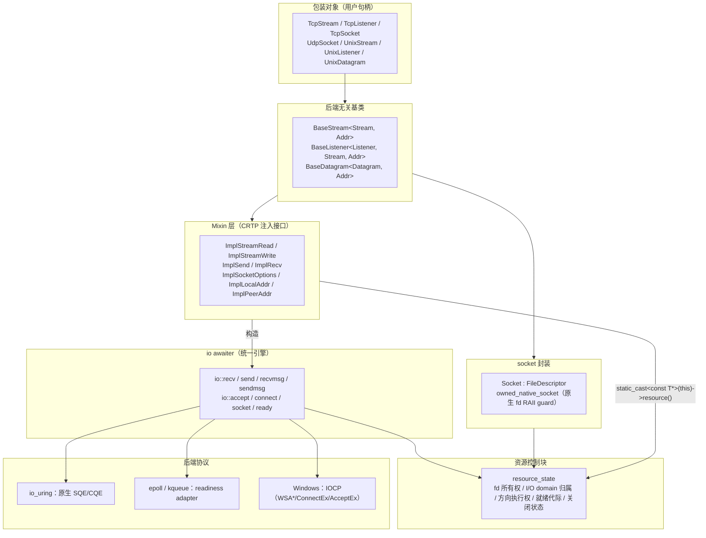
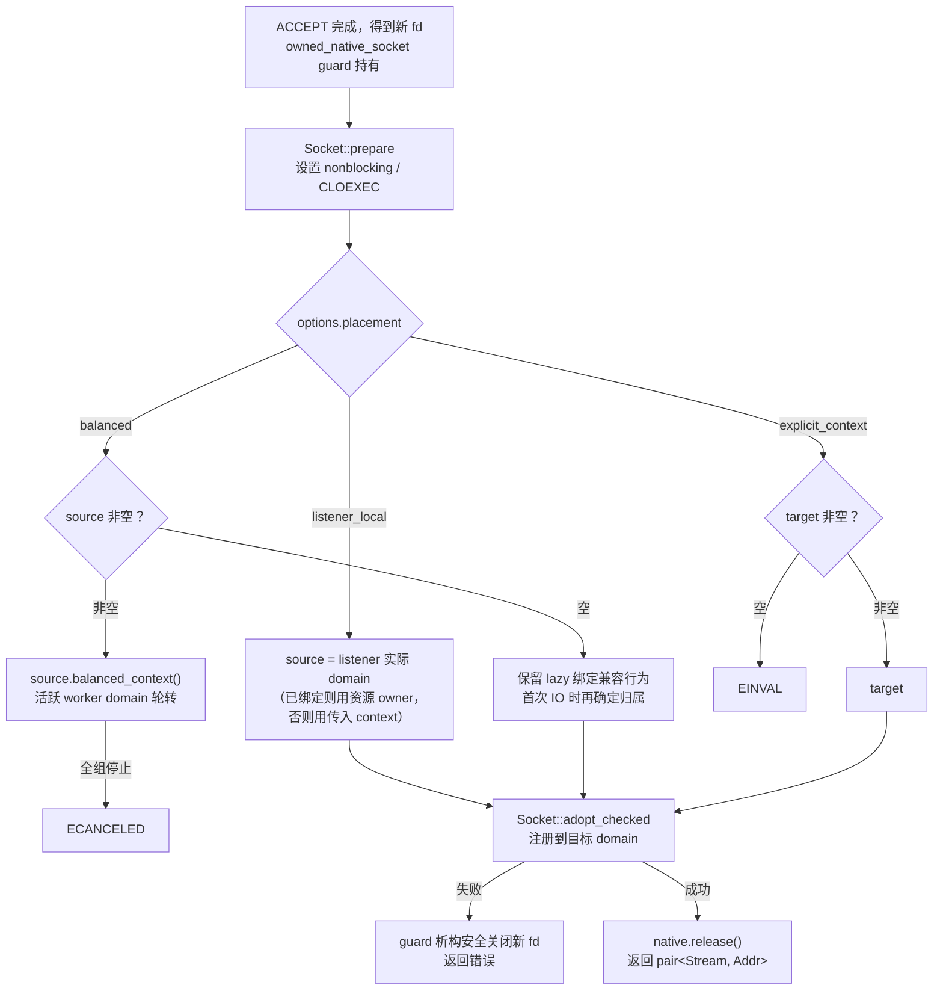

# 网络 IO

faio 是 C++23 纯头文件库，用户统一包含 `<faio/faio.hpp>`。网络对象持有后端中立的资源控制块与 `io_context` 租约；Linux 的 io_uring、epoll 和 macOS 的 kqueue 使用相同的 TCP、UDP、Unix socket 与 pipe 接口。Windows 通过 IOCP 提供 TCP/UDP、IPv4/IPv6、DNS、向量 IO、拆分半边、取消和超时；Unix socket、FIFO 和 POSIX AsyncFd 为 Unix 平台扩展。

## 1. 架构总览

网络层位于通用 I/O 引擎之上，按"**包装对象 — Mixin/CRTP — 资源控制块 — io awaiter — 后端协议**"五层组织：


```mermaid
flowchart TD
    subgraph wrapper["包装对象（用户句柄）"]
        W["TcpStream / TcpListener / TcpSocket<br/>UdpSocket / UnixStream / UnixListener / UnixDatagram"]
    end
    subgraph mixin["Mixin 层（CRTP 注入接口）"]
        M["ImplStreamRead / ImplStreamWrite<br/>ImplSend / ImplRecv<br/>ImplSocketOptions / ImplLocalAddr / ImplPeerAddr"]
    end
    subgraph base["后端无关基类"]
        B["BaseStream&lt;Stream, Addr&gt;<br/>BaseListener&lt;Listener, Stream, Addr&gt;<br/>BaseDatagram&lt;Datagram, Addr&gt;"]
    end
    subgraph sock["socket 封装"]
        S["Socket : FileDescriptor<br/>owned_native_socket（原生 fd RAII guard）"]
    end
    subgraph rcb["资源控制块"]
        R["resource_state<br/>fd 所有权 / I/O domain 归属 / 方向执行权 / 就绪代际 / 关闭状态"]
    end
    subgraph aw["io awaiter（统一引擎）"]
        A["io::recv / send / recvmsg / sendmsg<br/>io::accept / connect / socket / ready"]
    end
    subgraph backend["后端协议"]
        P1["io_uring：原生 SQE/CQE"]
        P2["epoll / kqueue：readiness adapter"]
        P3["Windows：IOCP（WSA*/ConnectEx/AcceptEx）"]
    end
    W --> base --> mixin
    base --> sock --> R
    mixin -- "static_cast&lt;const T*&gt;(this)-&gt;resource()" --> R
    mixin -- "构造" --> A
    A --> R
    A --> P1
    A --> P2
    A --> P3
```

- **包装对象**（`TcpStream`、`UdpSocket` 等）：面向用户的移动独占句柄，只保存资源控制块的 `shared_ptr` 与 `io_context` 租约，不持有 SQE、CQE、epoll_event 或 kevent 等任何后端结构。
- **资源控制块**（`resource_state`）：fd 所有权、不可变 I/O domain 归属、读写方向执行权、就绪代际与关闭状态。所有异步操作通过它路由到所属 domain。
- **后端协议**：io_uring 以原生 proactor 方式提交请求；epoll/kqueue 通过 readiness adapter 先尝试非阻塞 syscall，遇 `EAGAIN` 登记就绪兴趣后重试。两条路径产生相同的完成结果。

方向执行权（direction gate）是网络层的关键并发约束：同一条 stream 允许一个读和一个写同时进行，同方向冲突返回 `EBUSY`。`ready` 就绪观察与实际读写分开，可以有多个观察者。

### 1.1 Mixin/CRTP 继承体系

网络层不为每种 socket 重复实现读写接口，而是把读、写、数据报收发、socket options 做成一组 **CRTP Mixin**，由后端无关基类继承，再经具体包装类型闭合模板参数。以 TCP stream 为例，继承链完全由三行声明构成。

最底层是 Mixin 本身，例如 [stream_read.hpp](../include/faio/detail/net/common/stream_read.hpp) 中的读接口：

```cpp
/** @brief TCP/Unix stream 读方向接口，空 buffer 成功但不表示 EOF。 */
template <class T>
struct ImplStreamRead {
  auto read(std::span<char> buffer) const noexcept {
    auto operation =
        io::recv(static_cast<const T*>(this)->resource(), buffer.data(), buffer.size(), 0);
    operation.empty_success();  // 左值配置不移动大型 io_request，return 保持 NRVO。
    return operation;
  }
  // peek / read_vectored / try_read / read_exact / read_owned / read_buf ...
};
```

`ImplStreamRead<T>` 不知道也不关心 `T` 是什么类型，只要求 `T` 提供 `resource()`（以及 try 路径需要的 `fd()`）。`static_cast<const T*>(this)` 是经典 CRTP 下转：编译期解析、零开销、无虚表。`read()` 的函数体只有两步——调用统一引擎的 `io::recv` 生成 io awaiter，`empty_success()` 配置空 buffer 语义后按值返回。这印证了网络层的核心原则：**Mixin 方法只做参数转发，不保存状态、不产生后端副作用，真正的提交发生在 awaiter 挂起阶段**。

中间层 [base_stream.hpp](../include/faio/detail/net/tcp/base_stream.hpp) 把 Mixin 组装成字节流基类：

```cpp
template <class Stream, class Addr>
class BaseStream : public ImplStreamRead<BaseStream<Stream, Addr>>,
                   public ImplStreamWrite<BaseStream<Stream, Addr>>,
                   public ImplLocalAddr<BaseStream<Stream, Addr>, Addr>,
                   public ImplPeerAddr<BaseStream<Stream, Addr>, Addr> {
  // ...
  [[nodiscard]] auto resource() const noexcept { return socket_.resource(); }
  // ...
 private:
  Socket socket_;
};
```

注意 CRTP 在这里传递了两跳：Mixin 的模板参数是 `BaseStream<Stream, Addr>` 而不是最终的 `Stream`，因此 `static_cast<const T*>(this)->resource()` 解析到 `BaseStream::resource()`。`BaseStream` 同时持有唯一的 `Socket socket_` 成员——**资源控制块的持有集中在基类，Mixin 永远无状态**。`address_type = Addr` 别名保留地址协议，供后端中立的能力选择（见 4.3 的 `write_zc`）。

最顶层 [tcp_stream.hpp](../include/faio/detail/net/tcp/tcp_stream.hpp) 与 [unix/socket.hpp](../include/faio/detail/net/unix/socket.hpp) 各自用一行闭合继承：

```cpp
// tcp_stream.hpp
class TcpStream : public BaseStream<TcpStream, SocketAddr>, public ImplSocketOptions<TcpStream> {
  // ...
};

// unix/socket.hpp
class UnixStream : public ::faio::net::detail::BaseStream<UnixStream, UnixAddr>,
                   public ::faio::net::detail::ImplSocketOptions<UnixStream> { /* ... */ };
```

`BaseStream` 的 `Stream` 参数仅用于 `from_native`/`connect` 等静态工厂构造正确的返回类型（`return Stream{std::move(*socket)};`），不参与 Mixin 下转。同一套 `BaseStream` 在两种地址协议下复用：`SocketAddr` 得到 TCP，`UnixAddr` 得到 Unix stream，读、写、就绪、try、关闭协议完全共享，差异只剩地址类型和原生能力限制。监听器（`BaseListener<Listener, Stream, Addr>`）与数据报（`BaseDatagram<Datagram, Addr>`，组装 `ImplSend`/`ImplRecv`）遵循完全相同的模式。

### 1.2 方向执行权在 Mixin 中的实现

方向执行权不是包装对象的互斥锁，而是资源控制块上的读写两个 gate。Mixin 中每个基础操作（`io::recv`/`io::send` 生成的 awaiter）在挂起时向 gate 登记自己；同方向已有 waiter 时返回 `EBUSY`。组合操作需要在多次基础 I/O 之间"霸住"方向，其实现可以直接在 [stream_read.hpp](../include/faio/detail/net/common/stream_read.hpp) 的 `read_exact_impl` 中看到：

```cpp
static task<expected<void>> read_exact_impl(std::shared_ptr<io::detail::resource_state> resource,
                                            std::span<char> buffer) {
  if (buffer.empty())
    co_return expected<void>{};
  char owner_identity{};  // 地址位于稳定组合协程帧，仅作为方向 reservation 身份。
  auto reservation =
      io::detail::reserve_direction(resource, io::Interest::readable, &owner_identity);
  if (!reservation)
    co_return std::unexpected{reservation.error()};
  std::size_t transferred{};
  while (!buffer.empty()) {
    {
      auto operation = io::recv(resource, buffer.data(), buffer.size(), 0);
      operation.reservation(&owner_identity);  // 单次 recv 承接组合租约，不再抢方向
      operation.empty_success();
      auto result = co_await operation;
      if (!result)
        co_return std::unexpected{Error{result.error().value(),
                                        transferred + result.error().progress(),
                                        result.error().domain()}};
      if (*result == 0)
        co_return std::unexpected{Error{Error::UnexpectedEOF, transferred, error_domain::faio}};
      transferred += *result;
      buffer = buffer.subspan(*result);
    }
    co_await this_coro::yield_if_needed();  // 协作让出期间组合方向租约仍继续持有
  }
  co_return expected<void>{};
}
```

三个设计要点：

1. **身份即栈地址**：`owner_identity` 是组合协程帧上的一个 `char`，它的地址唯一且稳定，纯粹作为 reservation token，不承载数据。其他任务无法用猜到的 token 冒充持有者。
2. **租约承接而非重取**：循环内每个 `io::recv` 用 `operation.reservation(&owner_identity)` 声明"我属于这个组合"，跳过 gate 的竞争检查；协作让出（`yield_if_needed`）和短读之间，其他读者依然无法插入，因此 `read_exact` 的字节流边界不会被并发读打散。
3. **错误保留进度**：失败时把本次错误值与已传输字节数合并进 `Error::progress` 返回；中途 EOF 转换为 `UnexpectedEOF`。取消不回滚已传输数据——数据已经真实地进了用户 buffer。

写方向的 `write_all_impl`（[stream_write.hpp](../include/faio/detail/net/common/stream_write.hpp)）结构相同，但有一处优化：它用 RAII 的 `borrowed_direction_lease` 先建立释放责任，而把"取得"动作合并进第一次 send 的既有域锁：

```cpp
io::detail::borrowed_direction_lease reservation{
    *resource, io::Interest::writable, &owner_identity};
std::size_t transferred{};
bool first_operation = true;
while (!buffer.empty()) {
  {
    auto operation = io::send(resource, buffer.data(), buffer.size(), no_signal_flags);
    if (first_operation) {
      operation.establish_reservation(&owner_identity);  // 首发送在原有域锁内取得组合方向。
      first_operation = false;
    } else {
      operation.reservation(&owner_identity);  // 短写承接同一租约，禁止重新取得或释放方向。
    }
    operation.empty_success();
    auto result = co_await operation;
    // ...零进度返回 WriteZero，错误合并 progress...
  }
  co_await this_coro::yield_if_needed();
}
```

`establish_reservation` 与 `reservation` 的区别在于：首个操作还没有租约，需要在提交路径的域锁内原子地完成"取得+登记"；后续操作只是承接。这样省掉一次独立的 reserve 锁，且所有失败出口都由 RAII guard 安全 unreserve。

### 1.3 平台适配层

Linux、macOS、Windows 的原生网络 API 在句柄类型、错误域与长度语义上各不相同。网络层把三平台差异收拢在 [platform.hpp](../include/faio/detail/net/common/platform.hpp) 的一组内联函数和 `Socket` 的创建/配置分支中，Mixin 与基类不直接写 `#ifdef`。

`socket_would_block`（platform.hpp:33）是 would-block 的统一判定，也是所有 try 接口和 `accept_many`/`recv_many` 批次循环的出口条件：

```cpp
inline auto socket_would_block(const Error& error) noexcept -> bool {
#if defined(_WIN32)
  if (error.domain() == error_domain::winsock)
    return error.value() == WSAEWOULDBLOCK;
#endif
  return error.value() == EAGAIN || error.value() == EWOULDBLOCK;
}
```

Winsock 与 errno 是两个独立错误域，相同数值在不同域中含义不同，因此 Windows 分支先判定 `error.domain()` 再比较 `WSAEWOULDBLOCK`；非 winsock 域（例如 `try_io` 中显式用户 syscall 带回的 errno 错误）仍走 EAGAIN/EWOULDBLOCK 判定。组合逻辑只用这一个函数判断"现在没货"，平台差异不向上泄漏。

`socket_address_family`（platform.hpp:71）回答"这个 socket 属于哪个地址族"：POSIX 用 `getsockname` 读 `ss_family`；Windows 的未绑定 socket 没有本地地址可报，改用 `getsockopt(SO_PROTOCOL_INFOW)` 读 `WSAPROTOCOL_INFOW::iAddressFamily`，绑定前也能回答，import 校验与 `set_ttl` 的家族选择合同因此保持完整。`Socket::validate_family` 用它阻止把 Unix handle 当 IP handle 导入。

显式同步收发 `socket_recv`/`socket_send`/`socket_sendto`（platform.hpp:93/:107/:125）处理 Windows 的 `int` 长度语义：stream 收发把长度裁到 `INT_MAX` 前缀、允许短 IO；数据报不能拆分，`sendto` 超限时直接返回 `WSAEMSGSIZE` 而非截断；"空指针+零长度"用栈上空字节兜底，绕过 Winsock 对 `nullptr` buffer 的拒绝；flags 中的 `MSG_DONTWAIT` 位被剥离——Windows 没有此标志，非阻塞由句柄属性表达。

`Socket::create`（common/socket.hpp:251）把三平台创建 flags 的差异收在一处：

```cpp
#if defined(_WIN32)
    // WSA_FLAG_OVERLAPPED 是 IOCP 的必要创建条件；禁止截断 SOCKET 为 int。
    const auto descriptor = static_cast<native_socket_type>(
        ::WSASocketW(domain, type & ~(SOCK_NONBLOCK | SOCK_CLOEXEC), protocol,
                     nullptr, 0, WSA_FLAG_OVERLAPPED | WSA_FLAG_NO_HANDLE_INHERIT));
#elif defined(__linux__)
    const int descriptor = ::socket(domain, type | SOCK_NONBLOCK | SOCK_CLOEXEC, protocol);
#else
    const int descriptor = ::socket(domain, type, protocol);
#endif
```

Windows 必须用 `WSASocketW` 创建：`WSA_FLAG_OVERLAPPED` 是该 socket 随后能注册进 IOCP 的前提；`WSA_FLAG_NO_HANDLE_INHERIT` 承担 POSIX `SOCK_CLOEXEC` 的角色；`type` 中的 POSIX 专用位被剥掉，非阻塞属性推迟到 `Socket::prepare` 阶段用 `ioctlsocket(FIONBIO)` 设置。Linux 在创建时一次给齐 `SOCK_NONBLOCK|SOCK_CLOEXEC` 两个标志；macOS/BSD 没有这两个创建标志，全部留到 `prepare` 的 `fcntl`。三平台在此之后汇合到同一条 guard → prepare → adopt 的所有权接力（见 4.1）。

配置选项同样按平台能力收敛：`set_linger` 的上限在 Windows 改为 `USHRT_MAX`（Winsock 的 `linger` 两字段是 `u_short`，超限拒绝而非静默截断，sockopt.hpp:135）；`set_recv_packet_info_v4/v6` 在 `IP_PKTINFO`（Linux）/`IP_RECVDSTADDR`（BSD）/`IPV6_PKTINFO`（Windows 的 IPv6）之间按可用性选择，都不可用时返回 `ENOTSUP`（sockopt.hpp:338/:349）。

## 2. 执行与所有权

网络基础操作构造时只保存参数，在 `co_await` 挂起阶段提交。统一引擎管理资源、操作代际、取消、缓冲区租约和完成交付。

io_uring 是原生 proactor：网络收发、连接和接受请求直接提交给内核，驱动器消费完成事件。epoll/kqueue 使用 readiness adapter：先执行非阻塞 syscall，成功即发布结果；遇到 `EAGAIN`/`EWOULDBLOCK` 登记对应方向，收到 readiness 后继续尝试并产生相同的完成结果。readiness 路径的非阻塞 connect 完成还需要检查 `SO_ERROR` 和已建立的对端状态。`ready` 是独立的就绪观察，io_uring 的观察使用 poll 请求，不消费 socket 数据。

Recv/Send 等待者在调用时捕获资源强租约和紧凑 scalar 参数；右值等待者仍按值拥有，命名左值等待者保持借用。readiness 即时完成无需构造消息头、地址、路径或 iovec 容器；只有遇 EAGAIN 需要登记、或转向原生提交时，才生成完整、全字段初始化的稳定请求。截止时间、取消、关闭、方向租约与 would-block 代际均进入同一状态机。

原生数据路径为：raw awaiter 保存请求 → `io_uring_prep_*` 填写 SQE → 提交请求 → 等待原始 CQE → 回写结果并恢复或直接继续协程。SQE 可以按批次刷新；请求若在 awaiter 的挂起阶段已经取得 CQE，则直接继续，不额外进入调度队列。通用层只持有稳定请求、原生借用内存、取消与截止时间状态，不执行预先的 read/write syscall，不把原生网络操作交给应用线程池，也不先等待 epoll/kqueue readiness。批量提交和 SQ 容量不足的有界排队仍属于同一原生提交管线。

| 入口 | io_uring 的执行方式 |
| --- | --- |
| `read`/`write`/`peek`、聚集读写、UDP 收发 | 原生 RECV/SEND/RECVMSG/SENDMSG SQE 与 CQE |
| 静态 `TcpStream::connect`、`UnixStream::connect` | 支持 SOCKET opcode 时原生创建句柄，再提交 CONNECT；没有 SOCKET opcode 时仅创建句柄使用短同步 syscall |
| `std::move(TcpSocket).connect`、`UdpSocket::connect` | 对已经创建的 socket 提交原生 CONNECT，不重新创建句柄 |
| `accept`、显式 `shutdown`、异步 `close` | 原生 ACCEPT/SHUTDOWN/CLOSE；关闭等待已接受请求解除内核引用 |
| FIFO `Sender::open`/`Receiver::open` | 原生 OPENAT；管道读写使用 READ/WRITE |
| 显式 `ready` 观察 | 原生 POLL_ADD；它不是内建收发的前置步骤 |
| 同步数字地址 `bind`、`listen`、`new_v4`/`new_v6`、UDP `unbound`、Unix `pair`、options、地址查询和 `try_*` | 非阻塞或短同步控制 syscall；返回 `expected` 的同步合同不伪称为 CQE |
| `async_io(Interest, F)` | 用户提供的非阻塞 syscall 与独立就绪观察组合；未知 callable 不自动转换为原生 opcode |
| `lookup_host` 的非数字主机名 | 没有对应内核 DNS opcode，使用独立 resolver 服务执行 `getaddrinfo` |

Windows 的 TCP/UDP 数据路径直接提交 WSARecv/WSASend 及其消息、地址变体，连接与接受使用 ConnectEx/AcceptEx。后两个扩展 API 的语义与 POSIX 不同，网络层的接入点体现在 IOCP 后端完成路径的收尾上：AcceptEx 把新连接落在一个**事先创建**的 accepted socket 上而非 listener 的新 fd，完成后必须为它补两步初始化——`SO_UPDATE_ACCEPT_CONTEXT` 让 accepted socket 继承 listener 的 socket 上下文，再 `ioctlsocket(FIONBIO)` 恢复非阻塞属性，之后才能用 `getpeername` 取出对端地址交付给 accept awaiter（iocp/backend.hpp:693-709）。ConnectEx 同理，stream socket 完成后需 `SO_UPDATE_CONNECT_CONTEXT` 才能获得完整的连接态语义，后端只对 `SOCK_STREAM` 补这一步（iocp/backend.hpp:711-718）。网络层的 accept/connect awaiter 因此与 Unix 形态一致：返回的 stream 已经完成准备并注册进目标 domain；这些 Winsock 特有的收尾与稳定池、完成包排空、取消仲裁一起属于 IOCP 后端职责，见[异步IO](异步IO.md)第 8 章。IOCP 批量完成进入相同的稳定槽和挂起握手；CancelIoEx 成功仍必须排空原完成包。ready 使用非消费 WSAPoll，存在观察者时完成端口等待上限为 1ms。零拷贝发送接口保留等价的 OVERLAPPED 发送语义，`zero_copy` 能力为 false。

带有效 context 的资源创建时确定 I/O domain。runtime 外使用空 context 创建的兼容对象，在首次异步操作时一次发布最终归属；并发首次操作跟随同一个绑定赢家。协程转到其他 worker、socket 被 move 或拆分，都保持已有的 I/O 归属，不重复注册 fd。accept 的结果按照 `accept_options` 选择首次归属，默认在同一 runtime 的活跃 domain 中均衡分配。注册事件使用资源身份，操作使用带代际的 token；关闭后的迟到事件不会作用于复用后的同号 fd。

同一 TCP/Unix stream 允许一个读和一个写同时进行。同方向的冲突返回 `EBUSY`，不会覆盖已有 waiter。`read_exact`、`write_all`、`accept_many` 和 UDP 的收发批次在整个组合期间保持方向 reservation，防止短 I/O、协作让步或分批操作之间插入其他任务。`ready` 观察者与实际读写分开，可以有多个观察者；观察结果允许假就绪。

epoll/kqueue 的标量非阻塞收发可以直接交付即时结果；需要等待时，协程桥先保存恢复目标，再登记稳定操作和消费者。io_uring 的收发始终提交原生 SQE，结果从 CQE 经同一挂起握手交付。

`close()` 是异步关闭：拒绝新操作、请求已有操作取消、排空内存访问并关闭原生 handle。原生 proactor 的取消请求不等于内核已经停止访问内存，只有原始请求完成并排空之后才恢复用户。析构不挂起、不抛异常、不在 worker 等待关闭；最后一个包装拥有者向所属 domain 请求清理。runtime 停止后保留下来的对象可以安全析构，继续 I/O 会返回错误。

数字地址绑定、socket 配置、地址查询属于短控制 syscall，返回 `expected`。配置和查询与关闭共用资源控制临界区，避免查询或配置已被复用的 fd。

## 3. 地址与解析

`faio::net::SocketAddr` 保存 IPv4/IPv6 地址、端口和 IPv6 scope id；`address` 是其别名。`Ipv4Addr`/`v4addr`、`Ipv6Addr`/`v6addr` 提供纯数字解析、字符串转换和地址分类。

```cpp
auto v4 = faio::net::address::parse("127.0.0.1", 8080);
auto v6 = faio::net::address::parse("[::1]:8080");
auto scoped = faio::net::address::numeric_parse("fe80::1%en0", 8080);
```

`parse` 不执行 DNS。`lookup_host(context, host, service)` 异步返回全部可用的 IP 端点；service 可以是十进制端口或系统服务名。数字 host 与数字 port 走同步纯解析快路径，域名解析使用独立 resolver executor 配额，worker 不执行阻塞 `getaddrinfo`。输入按值拥有并拒绝内嵌 NUL；解析器错误通过 `Error::domain()==error_domain::resolver` 保留。

```cpp
auto ctx = faio::io::io_context::current();
auto endpoints = co_await faio::net::lookup_host(ctx, "localhost", "8080");
auto stream = co_await faio::net::TcpStream::connect(
    ctx, faio::net::HostPort{"localhost", 8080});
```

`HostPort` 拥有 host/service 字符串。TCP 多地址连接和 hostname 连接按解析顺序尝试；失败连接的资源进入关闭协议。数字地址及地址 span 可直接使用，span 的存储必须覆盖组合操作生命周期。

### 3.1 lookup_host 源码解析：数字快路径与 resolver 服务路径

[resolver.hpp](../include/faio/detail/net/common/resolver.hpp) 的 `lookup_host` 是一条协程，内部分两个截然不同的执行路径：

```cpp
inline auto lookup_host(io::io_context context,
                        std::string host,
                        std::string service,
                        int socket_type = SOCK_STREAM) -> task<expected<std::vector<SocketAddr>>> {
  if (host.find('\0') != std::string::npos || service.find('\0') != std::string::npos)
    co_return std::unexpected{make_error(EINVAL)};
  unsigned port{};
  const auto [end, error] = std::from_chars(service.data(), service.data() + service.size(), port);
  if (!service.empty() && error == std::errc{} && end == service.data() + service.size()
      && port <= 65535) {
    if (auto numeric = SocketAddr::numeric_parse(host, static_cast<std::uint16_t>(port)))
      co_return std::vector<SocketAddr>{*numeric};
  }
  // 参数按值移入 job；取消仍保持 job 所有权，已开始的解析安全排空后再恢复。
  auto resolver = context.resolver();
  co_return co_await execution::execute_blocking(
      context,
      [host = std::move(host), service = std::move(service), socket_type]()
          -> expected<std::vector<SocketAddr>> {
        addrinfo hints{};  // 仅要求 IP，不把当前机器没有公网接口解释成地址不可用。
        hints.ai_family = AF_UNSPEC;
        hints.ai_socktype = socket_type;
        addrinfo* result{};
        const int failure = ::getaddrinfo(host.c_str(), service.c_str(), &hints, &result);
        if (failure != 0) {
#if !defined(_WIN32)
          if (failure == EAI_SYSTEM)
            return std::unexpected{socket_error()};
#endif
          return std::unexpected{Error{failure, 0, error_domain::resolver}};
        }
        // 即使 vector 分配失败，RAII 仍归还整个链表。
        std::unique_ptr<addrinfo, decltype(&::freeaddrinfo)> owner{result, &::freeaddrinfo};
        std::vector<SocketAddr> addresses;
        for (const auto* entry = result; entry; entry = entry->ai_next) {
          if (entry->ai_family != AF_INET && entry->ai_family != AF_INET6)
            continue;
          SocketAddr address{entry->ai_addr, entry->ai_addrlen};
          if (std::find(addresses.begin(), addresses.end(), address) == addresses.end())
            addresses.push_back(address);
        }
        if (addresses.empty())
          return std::unexpected{make_error(EADDRNOTAVAIL)};
        return addresses;
      },
      resolver);
}
```

逐段说明：

1. **输入净化（协程内同步执行）**：host/service 按值传入，首先拒绝内嵌 NUL——`getaddrinfo` 是 C 接口，内嵌 NUL 会静默截断查询串，把用户引向错误的主机。
2. **数字快路径**：`std::from_chars` 严格解析 service 为 0–65535 的端口（必须完整消费字符串，"80http" 不算数字），再尝试 `SocketAddr::numeric_parse` 纯数字解析 host。两个条件都满足时直接 `co_return`，**不碰线程池、不发起任何 syscall**，这是连接本机数字端点的常见路径，成本与一次字符串解析相当。注意快路径是"尽力而为"：port 是数字但 host 是域名时，正常落入服务路径，由 `getaddrinfo` 同时解释两者。
3. **resolver 服务路径**：阻塞型 `getaddrinfo` 通过 `execution::execute_blocking` 投递到 `context.resolver()` 指定的独立 executor 配额上执行，协程 worker 只挂起等待结果。lambda 按值捕获 host/service——job 拥有参数所有权，调用方协程即使被取消，已开始的解析也安全排空后才恢复，不存在悬空引用。
4. **错误域保真**：`EAI_SYSTEM` 表示底层系统调用失败，保留真实 errno；其余 `getaddrinfo` 错误码（如 `EAI_NONAME`）封装进 `error_domain::resolver` 域，调用方可以区分"DNS 说没有这个名字"和"系统调用失败"。
5. **结果整理**：RAII `unique_ptr` 保证任何出口（包括 vector 分配抛异常）都归还 `addrinfo` 链表；只保留 AF_INET/AF_INET6 项并去重，避免同一端点被重复尝试；全被过滤时返回 `EADDRNOTAVAIL`。`socket_type` 透传给 hints，防止为 TCP 连接返回只适合数据报的端点。

## 4. TCP

### 4.1 TcpSocket

`TcpSocket` 是连接或监听以前的配置对象，move-only。

| 操作 | 返回值与行为 |
| --- | --- |
| `new_v4(ctx)`、`new_v6(ctx)` | `expected<TcpSocket>`，创建 nonblocking/CLOEXEC socket |
| `bind(address)` | 绑定本地地址，端口 0 由内核分配 |
| `std::move(socket).connect(address)` | 立即消费 socket 到组合协程帧，返回 `task<expected<TcpStream>>`；等待后得到连接结果 |
| `std::move(socket).listen(backlog)` | 返回 `expected<TcpListener>`，失败保留 socket |
| `local_addr`、`peer_addr`、`take_error` | 查询端点或读取并清除 `SO_ERROR` |
| `from_native`、`into_native`、`as_native_handle` | 原生拥有者互操作与非拥有型观察 |

`new_v4`/`new_v6` 是同步创建接口；随后配置、绑定与 `listen` 也保持同步 `expected` 合同。配置对象的异步 `connect` 只连接这个已经拥有的 socket，io_uring 提交 CONNECT。静态 `TcpStream::connect` 则在连接组合中先通过统一 SOCKET awaiter 创建句柄，再执行 CONNECT。

#### 同步创建与 expected 合同

`TcpSocket::new_v4` 委托 [common/socket.hpp](../include/faio/detail/net/common/socket.hpp) 的 `Socket::create`：

```cpp
template <class T = Socket>
[[nodiscard]] static auto create(int domain, int type, int protocol,
                                 io::io_context context = io::io_context::current())
    -> expected<T> {
#if defined(__linux__)
  const int descriptor = ::socket(domain, type | SOCK_NONBLOCK | SOCK_CLOEXEC, protocol);
  // ...
#endif
  if (descriptor < 0)
    return std::unexpected{socket_error()};
  owned_native_socket guard{descriptor};
  if (auto result = prepare(descriptor); !result)
    return std::unexpected{result.error()};
  // 构造控制块可能分配内存；guard 在异常时仍负责关闭 fd。
  auto socket = adopt_checked(descriptor, std::move(context));
  if (!socket)
    return std::unexpected{socket.error()};
  (void)guard.release();
  if constexpr (std::same_as<T, Socket>)
    return socket;
  else
    return T{std::move(*socket)};
}
```

这段代码是"同步合同 + RAII 所有权接力"的样板：`owned_native_socket` guard 从 syscall 成功的一刻起持有关闭责任；`prepare` 统一设置 nonblocking/CLOEXEC（macOS 还设置 `SO_NOSIGPIPE`，因为 BSD 内核没有 `SOCK_NONBLOCK` 创建标志和 `MSG_NOSIGNAL`）；`adopt_checked` 构造资源控制块并把内存分配失败、domain 停止、注册失败等异常翻译成 `expected` 错误值；**只有全部成功才 `guard.release()` 转交责任**。任何中间步骤失败，guard 析构关闭新 fd，绝不泄漏。整个过程没有协程、没有 SQE——这就是表格中"同步 `expected` 合同不伪称为 CQE"的落点。

`bind`/`listen` 同样走 `io::detail::with_resource` 把短 syscall 包进资源控制临界区：

```cpp
[[nodiscard]] auto listen(int backlog = SOMAXCONN) -> expected<void> {
  if (backlog < 0)
    return std::unexpected{make_error(EINVAL)};
  return io::detail::with_resource(resource(), io::Interest::none, [&]() -> expected<void> {
    if (::listen(fd(), backlog) < 0)
      return std::unexpected{socket_error()};
    return {};
  });
}
```

`with_resource` 在资源所属 domain 的临界区内执行 callable，与 `close` 串行——这保证"配置/查询的 fd"不会临界区外被关闭并被内核复用成另一个连接，消除 fd 复用竞态。`Interest::none` 表示它不占用读写方向执行权。

#### 配置接口（ImplSocketOptions）

所有 socket 配置集中在 [sockopt.hpp](../include/faio/detail/net/common/sockopt.hpp) 的 `ImplSocketOptions<T>` Mixin，经 CRTP 由 `TcpSocket`/`TcpStream`/`TcpListener`/`UdpSocket` 等继承。每个选项都是 `with_resource` 包裹的短 `setsockopt`/`getsockopt`：

```cpp
template <class T>
struct ImplSocketOptions {
 private:
  auto set_option(int level, int option, const void* value, socklen_t length) const noexcept
      -> expected<void> {
    return io::detail::with_resource(
        static_cast<const T*>(this)->resource(), io::Interest::none, [&] {
          return set_sock_opt(descriptor(), level, option, value, length);
        });
  }
 public:
  auto set_nodelay(bool on) noexcept -> expected<void> {
    return set_integer(IPPROTO_TCP, TCP_NODELAY, on);
  }
  auto set_linger(std::optional<std::chrono::seconds> duration) noexcept -> expected<void> {
    struct ::linger value{};
    if (duration) {
      if (duration->count() < 0 || duration->count() > INT_MAX)  // Windows 上为 USHRT_MAX
        return std::unexpected{make_error(EINVAL)};
      value.l_onoff = 1;
      value.l_linger = static_cast<decltype(value.l_linger)>(duration->count());
    }
    return set_option(SOL_SOCKET, SO_LINGER, &value, sizeof(value));
  }
  // reuseaddr / reuseport / keepalive / buffer size / ttl / multicast ...
};
```

值得注意的契约细节：参数校验（如 `linger` 的范围——POSIX 为 `INT_MAX`、Windows 因 `u_short` 字段收紧到 `USHRT_MAX`、buffer size 必须为正、TTL 1–255）在进入 syscall 前完成，非法值返回 `EINVAL` 而不是依赖内核截断；平台缺失的能力（如无 `SO_REUSEPORT` 的系统）返回 `ENOTSUP` 而非静默成功；组播成员/接口/loop/TTL 选项同样按家族拆分为 v4/v6 两组接口，packet-info 辅助数据在 `IP_PKTINFO`/`IP_RECVDSTADDR`/`IPV6_PKTINFO` 间按平台可用性选择（见 1.3）；`set_ttl` 先查询 socket 地址族再选择 `IP_TTL`/`IPV6_UNICAST_HOPS`；`take_error` 读取并清除挂起的 `SO_ERROR`，无错误时返回 `nullopt`。

配置包括 `reuseaddr`、`reuseport`、`nodelay`、`keepalive`、`linger`、收发 buffer size、IPv6 only、IP TTL/hop limit 及对应 setter。OS 可能调整实际 buffer size，查询返回内核值。`linger(nullopt)` 关闭 linger，零秒为 abortive close，正秒保持 OS 关闭等待语义。io_uring 关闭提交原生 CLOSE 请求并等待 CQE；epoll/kqueue 可能阻塞的关闭使用 cleanup lane，不占用协程 worker。

`std::move(socket).connect(address)` 的实现（[tcp/socket.hpp](../include/faio/detail/net/tcp/socket.hpp)）则体现了所有权转移语义：socket 被立即移动进组合协程帧的 `connect_owned`，协程内只对**这个已存在的 fd** 提交 `io::connect`，不重新创建句柄；父对象随后销毁不影响在途连接。

### 4.2 TcpListener

`bind(address, ctx, backlog)`/`bind(ctx, address, backlog)` 同步创建、绑定并监听 socket；`bind(ctx, HostPort, backlog)` 返回组合 task，先异步解析，再依次调用同一同步绑定接口。地址 span 绑定按顺序尝试。

同步 `bind` 的实现（[base_listener.hpp](../include/faio/detail/net/tcp/base_listener.hpp)）就是三步短 syscall 的串联，每步失败即返回 `expected` 错误：

```cpp
[[nodiscard]] static auto bind(const Addr& address,
                               io::io_context context = io::io_context::current(),
                               int backlog = SOMAXCONN) -> expected<Listener> {
  auto socket = Socket::create(address.family(), SOCK_STREAM, 0, std::move(context));
  if (!socket)
    return std::unexpected{socket.error()};
  if (auto result = socket->bind(address); !result)
    return std::unexpected{result.error()};
  if (auto result = socket->listen(backlog); !result)
    return std::unexpected{result.error()};
  return Listener{std::move(*socket)};
}
```

`TcpListener` 的 `bind(ctx, HostPort, backlog)` 组合 task 先 `lookup_host` 异步解析，再对解析结果按顺序调用上面这个同步 `bind`，首个成功即返回——hostname 绑定与数字端点绑定最终收敛到同一条同步路径，行为完全一致。

#### accept awaiter：无 task 帧的直接等待

`accept()` 返回的不是 task，而是 `BaseListener::Accept` awaiter 对象——**一次 accept 不创建组合协程帧**，地址存储、长度、选项、归属决策全部内联在 awaiter 自身：

```cpp
class Accept : public AwaiterOptions<Accept> {
 public:
  Accept(std::shared_ptr<io::detail::resource_state> resource,
         io::io_context context, accept_options options = {}, bool native_no_wait = false)
      : resource_{std::move(resource)}, context_{std::move(context)},
        options_{std::move(options)}, native_no_wait_{native_no_wait},
        operation_{io::accept(resource_, address_.sockaddr(), &length_, 0)} {
    if (native_no_wait_)
      operation_.no_wait();  // 只准备原生即时 ACCEPT；EAGAIN 由 CQE 返回。
  }

  Accept(Accept&& other) noexcept
      : /* ... */
        operation_{io::accept(resource_, address_.sockaddr(), &length_, 0)}, /* ... */ {
    if (native_no_wait_)
      operation_.no_wait();  // 移动时连同即时语义重建指向新地址存储的请求。
  }

  auto await_suspend(std::coroutine_handle<> continuation) {
    this->configure(operation_);
    operation_.reservation(owner_);
    return operation_.await_suspend(continuation);
  }

  auto await_resume() -> expected<std::pair<Stream, Addr>> {
    // 接受完成生成唯一原生拥有者；重复取结果绝不能为同一个 fd 创建第二个关闭责任。
    if (std::exchange(consumed_, true))
      return std::unexpected{make_error(EINVAL)};
    auto result = operation_.await_resume();
    if (!result)
      return std::unexpected{result.error()};
    if constexpr (requires { address_.set_length(length_); })
      address_.set_length(length_);
    // 新 fd 尚未绑定任何 IO domain，直接注册到目标；禁止先绑定 listener 再迁移。
    return adopt_accepted(owned_native_socket{*result}, address_, resource_, context_, options_);
  }
  // ...
};
```

源码中三个关键设计：

1. **指针稳定性**：`io::accept` 请求借用 awaiter 成员 `address_` 和 `length_` 的地址。移动构造函数**不拷贝**旧 `operation_`，而是用新对象的成员地址重新构造一份请求（`Accept(Accept&&)` 中重建 `operation_`），保证 task 的 `await_transform` 在提交前移动 awaiter 时原生指针始终指向最终帧，不让后端借用已销毁的临时对象。
2. **单次消费**：`await_resume` 用 `std::exchange(consumed_, true)` 保证结果只能取一次，重复取返回 `EINVAL`。一个被接受的 fd 只对应一份关闭责任，绝不能因为重复 resume 产生两个 `TcpStream` 拥有同一个 fd。
3. **归属后置**：fd 从 CQE 取出时尚未绑定任何 domain，`await_resume` 直接把它交给 `adopt_accepted` 注册到目标 domain，而不是先绑到 listener 所在 domain 再迁移——归属是一次性决定的。

#### 归属决策与失败清理

归属策略由 [accept_options.hpp](../include/faio/detail/net/common/accept_options.hpp) 定义：`accept_options{placement, target}`，`placement` 为 `listener_local` / `balanced`（默认）/ `explicit_context`。决策流程如下：


```mermaid
flowchart TD
    A["ACCEPT 完成，得到新 fd<br/>owned_native_socket guard 持有"] --> B["Socket::prepare<br/>设置 nonblocking / CLOEXEC"]
    B --> C{"options.placement"}
    C -->|listener_local| D["source = listener 实际 domain<br/>（已绑定则用资源 owner，否则用传入 context）"]
    C -->|balanced| E{"source 非空？"}
    E -->|空| F["保留 lazy 绑定兼容行为<br/>首次 IO 时再确定归属"]
    E -->|非空| G["source.balanced_context()<br/>活跃 worker domain 轮转"]
    G -->|全组停止| H["ECANCELED"]
    C -->|explicit_context| I{"target 非空？"}
    I -->|空| J["EINVAL"]
    I -->|非空| K["target"]
    D --> L["Socket::adopt_checked<br/>注册到目标 domain"]
    F --> L
    K --> L
    L -->|失败| M["guard 析构安全关闭新 fd<br/>返回错误"]
    L -->|成功| N["native.release()<br/>返回 pair&lt;Stream, Addr&gt;"]
```

对应 [base_listener.hpp](../include/faio/detail/net/tcp/base_listener.hpp) 的两个私有静态函数。`select_context` 选择目标：

```cpp
static auto select_context(const std::shared_ptr<io::detail::resource_state>& resource,
                           const io::io_context& context,
                           const accept_options& options) -> expected<io::io_context> {
  // runtime 外创建的 listener 可能第一次 await 才绑定，不能使用旧空快照。
  const auto source = resource && resource->owner ? io::io_context{resource->owner} : context;
  switch (options.placement) {
    case accept_placement::listener_local:
      return source;
    case accept_placement::balanced: {
      // 同步、尚未绑定的原生 listener 保留第一次 IO 再绑定的兼容行为。
      if (!source)
        return source;
      auto target = source.balanced_context();
      if (!target)
        return std::unexpected{make_error(ECANCELED)};
      return target;
    }
    case accept_placement::explicit_context:
      if (!options.target)
        return std::unexpected{make_error(EINVAL)};
      return options.target;
  }
  return std::unexpected{make_error(EINVAL)};
}
```

`source` 的取值是这里最易出错的点：runtime 外以空 context 创建的 listener，其资源在首次异步操作时才发布真实归属，因此**必须读取资源的 `owner` 而不是 listener 构造时保存的空 context 快照**，否则 balanced 会把连接分配到已经废弃的域。`adopt_accepted` 则负责把"新 fd 的关闭责任"和"domain 注册"做成原子效果：

```cpp
static auto adopt_accepted(owned_native_socket native, Addr address, /* resource, context, options */)
    -> expected<std::pair<Stream, Addr>> {
  if (auto prepared = Socket::prepare(native.get()); !prepared)
    return std::unexpected{prepared.error()};
  auto target = select_context(resource, context, options);
  if (!target)
    return std::unexpected{target.error()};
  auto socket = Socket::adopt_checked(native.get(), std::move(*target));
  if (!socket)
    return std::unexpected{socket.error()};
  (void)native.release();  // 唯一 guard 保留关闭责任，只有 target 注册成功才 release 到 stream。
  return std::pair{Stream{std::move(*socket)}, std::move(address)};
}
```

`owned_native_socket` guard 在参数位置接住 fd；prepare、归属选择、注册任何一步失败都直接返回，guard 析构关闭新 fd——**停止的目标或全组停止时，已接受的连接被安全丢弃，不会留下无拥有者的 fd**。只有 `adopt_checked` 成功才 `release` 转交责任。

`accept()` 返回 `expected<pair<TcpStream, SocketAddr>>`。接受的 socket 会设置 nonblocking/CLOEXEC 及平台的 SIGPIPE 保护，并在返回 stream 前确定唯一、稳定的 I/O domain。默认 `accept_options{}` 使用 `accept_placement::balanced`，在同一 runtime 的活跃 worker domain 中轮转分配；独立引擎使用自身。`listener_local` 明确继承 listener 的实际 domain，`explicit_context` 使用配置的 `target`；`accept(target_context)` 是显式策略的便利重载。空的显式 target 返回 `EINVAL`，停止的目标或全组停止返回 `ECANCELED`，新 fd 由原生 guard 安全清理。

这些选项仅用于新接受 fd 的首次注册，已发布 stream 始终保持该归属，协程迁移不会迁移 fd。一个 accept awaiter 的结果只允许消费一次，重复取结果返回 `EINVAL`——不能为同一个 fd 创建两个关闭责任。`try_accept(options)` 是显式的即时同步尝试。`accept_many(maximum, options)` 等待第一条连接，再领取当前已排队的连接，返回有界批次，每个新连接独立应用相同归属策略。这两个接口也提供显式 context 重载。TCP 和 Unix listener 共用此配置。

#### accept_many：有界批次的实现

`accept_many_impl` 在协程帧上持有读方向租约，首条等待、后续即时：

```cpp
static auto accept_many_impl(std::shared_ptr<io::detail::resource_state> resource,
                             io::io_context context, std::size_t maximum, accept_options options)
    -> task<expected<std::vector<std::pair<Stream, Addr>>>> {
  if (!maximum)
    co_return std::unexpected{make_error(EINVAL)};
  char owner_identity{};
  auto reservation =
      io::detail::reserve_direction(resource, io::Interest::readable, &owner_identity);
  if (!reservation)
    co_return std::unexpected{reservation.error()};
  std::vector<std::pair<Stream, Addr>> accepted;
  accepted.reserve(maximum);
  auto first = co_await Accept{resource, context, options}.reservation(&owner_identity);
  if (!first)
    co_return std::unexpected{first.error()};
  accepted.push_back(std::move(*first));
  const bool native = resource->owner->supports_native(io::detail::operation_kind::accept);
  const bool native_no_wait = resource->owner->capabilities().native_accept_nowait;
  while (accepted.size() < maximum) {
    // 旧内核没有即时 ACCEPT 标志时合法返回已完成的首项；不偷偷同步 accept，
    // 也不为填满 maximum 等待下一条连接而破坏有界批次的即时返回合同。
    if (native && !native_no_wait)
      break;
    auto next =
        native ? co_await Accept{resource, context, options, true}.reservation(&owner_identity)
               : try_accept_impl(resource, context, options, &owner_identity);
    if (!next) {
      if (socket_would_block(next.error()))
        break;
      co_return std::unexpected{next.error()};
    }
    accepted.push_back(std::move(*next));
  }
  co_return accepted;
}
```

批次的方向 reservation 覆盖"首条挂起 + 后续即时领取"全程，其他 accept 任务无法在两条连接之间插队取走积压连接。后续项的实现按后端分叉：io_uring 且内核支持 `IORING_ACCEPT_DONTWAIT` 时提交带 `no_wait` 的原生 ACCEPT SQE，等真实 CQE 返回 `EAGAIN` 结束本批；原生但内核缺少该标志（Linux 6.10 以前）时只返回已完成的首条——**不改用同步 accept 冒充批次，也不为填满 maximum 阻塞等待**；epoll/kqueue 走 `try_accept_impl` 的非阻塞 accept 排空已有连接。每条新连接独立走 `adopt_accepted` 应用相同归属策略。

`try_accept_impl`（base_listener.hpp:277）的非阻塞 accept 也有一处平台分叉：Linux 用 `accept4` 直接带 `SOCK_NONBLOCK|SOCK_CLOEXEC`；macOS 用普通 `accept` 后在 `prepare` 中补 flag；Windows 的 listener 保持 `FIONBIO` 非阻塞属性，`accept` 无积压时返回 `WSAEWOULDBLOCK`（base_listener.hpp:288），经 `socket_would_block`（见 1.3）统一识别为批次出口。另外注意它把"在 source gate 临界区内做短 syscall"与"注册 target domain"分成两段——释放 source 锁后才 `adopt_accepted`，避免跨域锁的 ABBA 序。

`IORING_ACCEPT_DONTWAIT` 自 Linux 6.10 提供，`capabilities().native_accept_nowait` 报告实际后端的能力。

监听器提供 `local_addr`、`ready`/`readable`、socket options、`close` 和原生导入导出。`from_native` 会用 `SO_ACCEPTCONN` 校验导入的确实是监听 socket，非监听 fd 返回 `InvalidSocketType`。

### 4.3 TcpStream 与缓冲区

| 功能 | 接口 |
| --- | --- |
| 读写 | `read`、`write`、`peek`、`read_vectored`、`write_vectored` |
| 即时尝试 | `try_read`、`try_write`、`try_peek`、`try_read_vectored`、`try_write_vectored` |
| 组合 | `read_exact`、`write_all`、`write_all_buf`、`read_owned`、`write_owned` |
| 初始化范围 | `read_buf(vector<char>&, count)`、`read_buf(io::read_buf&)` 及 try 版本 |
| 就绪 | `ready(Interest)`、`readable`、`writable` |
| 自定义操作 | `try_io(Interest, F)`、`async_io(Interest, F)` |
| 生命周期 | `shutdown(direction)`、`flush`、`close`、native import/export |

基础操作允许短读、短写。非空 buffer 的读返回零表示 EOF；空 TCP buffer 在资源与方向验证后成功返回零，不等待对端数据，也不表示 EOF。全空的聚集范围遵循相同规则；UDP 不使用这项流语义。`read_exact` 遇到中途 EOF 返回 `UnexpectedEOF`；`write_all` 遇到零进度返回 `WriteZero`。错误的 `progress()` 保留组合此前已生效的字节数，取消不回滚已传输数据。

#### connect 组合协程：SOCKET 创建 + CONNECT 提交 + 失败清理

静态 `TcpStream::connect(address, ctx)` 继承自 `BaseStream::connect`（[base_stream.hpp](../include/faio/detail/net/tcp/base_stream.hpp)），完整实现只有三拍：

```cpp
/** @brief 建立数字端点连接；地址按值保存在组合协程帧，避免悬空借用。 */
static auto connect(Addr address, io::io_context context = io::io_context::current())
    -> task<expected<Stream>> {
  // 异步连接组合的句柄创建同样使用统一原生 SOCKET 请求，不预先 ::socket。
  auto socket =
      co_await Socket::create_async(address.family(), SOCK_STREAM, 0, std::move(context));
  if (!socket)
    co_return std::unexpected{socket.error()};
  auto result = co_await io::connect(socket->resource(), address.sockaddr(), address.length());
  if (!result)
    co_return std::unexpected{result.error()};
  co_return Stream{std::move(*socket)};
}
```

第一拍通过统一 SOCKET awaiter 异步创建句柄，第二拍对该资源提交 CONNECT，第三拍把 socket 包成 `Stream` 返回。失败清理是隐式的：`create_async` 失败时尚未存在 fd；`io::connect` 失败时局部变量 `socket`（持有资源控制块）随协程帧销毁，进入正常关闭协议，不需要显式清理代码。多地址重载在同一帧内循环调用单地址版本，每个失败 socket 在下一次尝试前随迭代作用域释放。

`create_async` 返回的 `CreateSocketAwaiter`（[common/socket.hpp](../include/faio/detail/net/common/socket.hpp)）本身不分配 task 帧，只做"原生创建结果的拥有权转换"：

```cpp
class CreateSocketAwaiter {
 public:
  CreateSocketAwaiter(int domain, int type, int protocol, io::io_context context)
      : context_{context ? std::move(context) : io::io_context::current()},
        operation_{io::socket(domain, type, protocol).with_context(context_)} {}
  // await_ready / await_suspend 直接委托 operation_
  auto await_resume() -> expected<Socket> {
    // 同一个创建结果只允许接管一次，避免重复建立 fd 关闭责任。
    if (std::exchange(consumed_, true))
      return std::unexpected{make_error(EINVAL)};
    auto descriptor = operation_.await_resume();
    if (!descriptor)
      return std::unexpected{descriptor.error()};
    // 只有成功完成才建立唯一 fd 所有者；取消获胜的成功 fd 由引擎处理。
    owned_native_socket guard{*descriptor};
    // 平台导入约束与 macOS SIGPIPE 配置保持一致，不执行额外网络 IO。
    if (auto result = Socket::prepare(guard.get()); !result)
      return std::unexpected{result.error()};
    auto socket = Socket::adopt_checked(guard.get(), std::move(context_));
    if (!socket)
      return std::unexpected{socket.error()};
    (void)guard.release();  // 注册成功才将关闭责任转给稳定资源控制块。
    return socket;
  }
  // ...
};
```

io_uring 有 SOCKET opcode 时（Linux 5.19+），fd 在内核中创建并随 CQE 返回；没有该 opcode 时统一引擎回退到短同步 `::socket`。无论哪条路径，`await_resume` 的所有权接力与同步 `Socket::create` 完全一致：guard 接住 fd → `prepare` 设置 nonblocking/CLOEXEC → `adopt_checked` 注册到**构造时固定的** `context_` → 成功才 `release`。`consumed_` 标志沿用 accept 的单次消费规则。取消与成功竞速时，若取消获胜但内核已返回 fd，由引擎负责回收，不会泄漏给用户层。

`TcpStream` 自身在 [tcp_stream.hpp](../include/faio/detail/net/tcp/tcp_stream.hpp) 中只补充 hostname 入口：

```cpp
static auto connect(io::io_context context, HostPort endpoint) -> task<expected<TcpStream>> {
  auto addresses =
      co_await lookup_host(context, std::move(endpoint.host), std::move(endpoint.service));
  if (!addresses)
    co_return std::unexpected{addresses.error()};
  co_return co_await BaseStream::connect(*addresses, std::move(context));
}
```

解析失败直接透传 resolver 域错误；成功后走多地址 span 版本按序尝试。

#### 缓冲区契约与拥有型操作

`span<char>`、`span<const char>` 是零拷贝借用，调用者必须保证内存有效直到操作排空，且没有并发读写冲突。`borrowed_buffer` 和 `borrowed_const_buffer` 显式表达该约束。

`read(io_buffer)`、`write(io_buffer)` 移入独占拥有缓冲区，完成后返回 `io_transfer{buffer, bytes}`；读操作只发布已初始化范围。`write(shared_const_buffer)` 允许共享不可变 payload。拥有型操作在调用方法时抓取稳定资源引用，socket wrapper 随后被移动不会留下悬空 `this`——Mixin 中所有组合实现都是**静态成员函数**，`resource` 按值进入协程帧，例如 `read_buffer_owned`：

```cpp
static task<expected<io::io_transfer>> read_buffer_owned(
    std::shared_ptr<io::detail::resource_state> resource, io::io_buffer buffer) {
  auto operation = io::recv(std::move(resource), buffer.data(), buffer.capacity(), 0);
  operation.empty_success();
  auto result = co_await operation;
  if (!result)
    co_return std::unexpected{result.error()};
  buffer.set_size(*result);  // 只发布实际初始化范围
  co_return io::io_transfer{std::move(buffer), *result};
}
```

buffer 与 resource 都在协程帧内独占拥有，延迟启动（task 是惰性的）和包装对象移动都不会影响它们。

聚集接口可以接收 iovec span 或多个连续字符范围；消息头和内置 iovec 位于最终 awaiter 中，提交前移动会重建指针，不复制 payload：

```cpp
// VectoredRead 的移动构造：重建 operation 使原生消息指针指向新 awaiter
VectoredRead(VectoredRead &&other) noexcept
    : resource_{std::move(other.resource_)}, vectors_{other.vectors_},
      message_{/* msg_iov 指向本对象的 vectors_ */},
      operation_{io::recvmsg(resource_, &message_, 0)} {}
```

调用者提供的外部 payload、iovec 数组和 control buffer 必须满足借用生命周期。

`write_zc` 由 [stream_write.hpp](../include/faio/detail/net/common/stream_write.hpp) 的 `ZeroCopyWrite` awaiter 实现，它在 `await_suspend`（而非构造）时才按实际 domain 能力选择路径：

```cpp
bool await_suspend(std::coroutine_handle<> continuation) noexcept {
  auto* domain = resource_ ? resource_->owner.get() : nullptr;  // 已绑定资源保持固定归属。
  auto current =
      domain ? io::io_context{} : io::io_context::current();  // lazy 对象使用首次提交的默认域。
  if (!domain && current)
    domain = current.domain().get();  // 当前域只用于能力判定，实际绑定由统一桥完成。
  if (ip_stream_ && domain && domain->capabilities().zero_copy) {
    auto& operation =
        operation_.emplace<2>(resource_, buffer_.data(), buffer_.size(), no_signal_flags, 0);
    operation.empty_success();
    this->configure(operation);
    return operation.await_suspend(continuation);  // NOTIF 排空由 native operation 状态机完成。
  }
  auto& operation =
      operation_.emplace<1>(resource_, buffer_.data(), buffer_.size(), no_signal_flags);
  // ...fallback 普通 SEND，同一取消与 deadline 语义。
}
```

`ip_stream_` 在编译期由 `T::address_type` 是否为 `SocketAddr` 决定——Unix socket 即使跑在支持 SEND_ZC 的内核上也不会被当作 TCP 使用零拷贝 opcode。原生请求即使已经报告发送字节数，也要等待内核的 buffer-release 通知之后才返回，调用者此前不能修改或复用借用 buffer；取消同样等待排空。它允许短写，并支持与基础操作相同的 deadline 配置。`io::send_zc`/`io::sendmsg_zc` 是显式原生扩展，不支持的后端返回 `EOPNOTSUPP`。

`flush` 没有额外用户态 TCP 缓存，不承诺对端已经收到、读取或确认数据。

### 4.4 就绪与自定义 syscall

```cpp
for (;;) {
    auto result = stream.try_read(buffer);
    if (result) break;
    if (result.error().value() != EAGAIN &&
        result.error().value() != EWOULDBLOCK) {
        // 处理真实错误。
        break;
    }
    auto observed = co_await stream.readable();
    if (!observed) break;
}
```

等待 `ready` 后得到 `expected<io::Ready>` 就绪快照，不消费数据。`is_readable()`、`is_writable()` 与 `is_error()` 查询相应提示；`is_read_closed()` 和 `is_write_closed()` 分别记录已经观察到的读、写方向关闭，不能据此假定另一个方向也关闭。读 EOF 提示仍可能伴有尚未消费的数据，最终 EOF 由非空 buffer 的真实 read 返回零确认。

kqueue 按 read/write filter 分别解释 `EV_EOF`，本地写半关闭产生的写 EOF 不使 `readable()` 完成；Linux 的 RDHUP 只提示读方向关闭，全 HUP 同时提示两个方向。观察依据所请求方向或错误完成，关闭信息单独保留。try 操作遇到 would_block 会清除该方向的旧就绪位，保留已观察到的关闭信息；重试循环需要等待后续对应方向事件。

`try_io`/`async_io` 的函数返回 `expected<T>`，可以接收 fd 参数或无参数，必须是短的非阻塞 syscall，且不能递归调用同一对象的包装方法。`async_io` 是显式的自定义 syscall 兼容接口，在 would_block 后等待并重试：

```cpp
static auto async_io_impl(std::shared_ptr<io::detail::resource_state> resource,
                          io::Interest interest, F function) -> task<Result> {
  while (true) {
    auto result = io::detail::with_resource(resource, interest, [&] { ... });
    if (result || (result.error().value() != EAGAIN &&
                   result.error().value() != EWOULDBLOCK))
      co_return result;
    auto readiness = co_await io::ready(resource, interest);
    if (!readiness)
      co_return std::unexpected{readiness.error()};
  }
}
```

内建 read/write/accept/UDP 收发不经过它。延迟执行的组合接口在调用时按值保存资源与 callable，不借用包装对象的 `this`；移动包装对象不会影响 task。最后一个包装拥有者析构仍然会请求关闭，尚未启动的 task 随后安全返回关闭或取消错误。

基础读写、accept、UDP 收发及聚集 awaiter 支持 `set_timeout(duration)` 和 `set_timeout_at(steady_clock::time_point)`。这些配置来自 [awaiter_options.hpp](../include/faio/detail/net/common/awaiter_options.hpp) 的 `AwaiterOptions<Derived>` CRTP 基类：deadline 以可选的绝对时间点保存在 awaiter 内，`await_suspend` 时经 `configure(operation_)` 一次性转交给底层 operation；move 只发生在提交前，绝对 deadline 随 awaiter 移动而不重新计时。到期返回 `ETIMEDOUT`；停止令牌返回 `ECANCELED`。返回以前后端已停止访问借用缓冲区。

### 4.5 split 与半关闭

`split() &` 返回 `ReadHalf`、`WriteHalf`。半边保留控制块，父对象 move 不会造成裸指针悬空；父 stream 与半边仍不能并发使用同一方向。

`std::move(stream).into_split()` 返回 `OwnedReadHalf`、`OwnedWriteHalf`，可以分别交给不同任务。两种拆分的实现都在 [tcp_stream.hpp](../include/faio/detail/net/tcp/tcp_stream.hpp)：

```cpp
/** @brief 创建安全借用半边，父 stream 与半边同时保持同一资源。 */
[[nodiscard]] auto split() & -> std::pair<ReadHalf, WriteHalf> {
  auto identity = std::make_shared<char>();
  return {std::piecewise_construct,
          std::forward_as_tuple(share_socket(), identity),
          std::forward_as_tuple(share_socket(), identity)};
}

/** @brief 消费 stream，两个半边可分别转移给不同协程。 */
[[nodiscard]] auto into_split() && -> std::pair<OwnedReadHalf, OwnedWriteHalf> {
  auto identity = std::make_shared<char>();
  Socket socket = take_socket();
  Socket second = socket.share();
  return {std::piecewise_construct,
          std::forward_as_tuple(std::move(socket), identity),
          std::forward_as_tuple(std::move(second), identity)};
}
```

每次拆分生成一个 `shared_ptr<char>` 作为 **split identity**：它只是一块堆内存的地址，唯一标识"这一次拆分"。`Socket::share()` 克隆指向同一资源控制块的拥有者（不 dup 原生 fd），因此借用半边、owned 半边、父 stream 共享同一份 fd 与方向 gate，方向互斥规则在拆分后依然由资源控制块仲裁。

`reunite`（[halves.hpp](../include/faio/detail/net/tcp/halves.hpp)）比较资源身份与 split 身份，两者都匹配才允许合并：

```cpp
[[nodiscard]] auto reunite(BasicWriteHalf<Stream, Addr, Owned>&& writer) && -> expected<Stream>
  requires Owned
{
  if (!socket_ || !writer.socket_ || identity_ != writer.identity_
      || resource() != writer.resource())
    return std::unexpected{make_error(Error::ReuniteFailed)};
  Socket socket = socket_->share();
  writer.automatic_shutdown_ = false;  // 取消写半边的析构半关闭
  writer.socket_.reset();
  writer.identity_.reset();
  socket_.reset();
  identity_.reset();
  return Stream{std::move(socket)};
}
```

校验有两层：`resource() != writer.resource()` 排除不同连接的两半边；`identity_ != writer.identity_` 排除"同一连接、不同次拆分"的两半边——不检查 identity 的话，先 split 出一对、reunite 失败后再 split 的半边可能被错误合并，造成一侧意外丢失自动半关闭语义。合并失败时 `ReuniteFailed` 返回且两半边保留原有拥有权（参数是右值但函数提前返回，对象随调用方作用域继续存活或正常析构）。合并成功时显式关闭写半边的 `automatic_shutdown_`，避免析构时对新重组的 stream 请求写半关闭。

owned 写半边析构在此前写入排空后请求写半关闭（`request_shutdown()` 调用资源控制块的 `request_shutdown_write()`）。`forget()` 取消这项自动请求。读半边析构不会强制关闭整个连接；最后一个包装拥有者触发资源关闭。`shutdown(Write)` 只关闭写方向，读方向仍可以接收；`close` 关闭整个资源。

## 5. UDP

`UdpSocket` 是 move-only 消息型对象，`UdpDatagram` 是兼容别名。数字地址 `bind(address, ctx)`、`bind(ctx, address)` 与 `unbound` 均同步返回 `expected<UdpSocket>`；`unbound` 可以在配置后关联目标。`bind(ctx, HostPort)` 先异步解析，再调用同一同步创建与绑定接口。

异步 `connect(peer)` 设置默认目标和接收来源过滤，保持 UDP 消息边界；io_uring 对已有 socket 提交原生 CONNECT，不执行 TCP 握手。`send`/`recv` 用默认目标，`send_to`/`recv_from` 使用显式地址；`recv_from` 返回 `pair<copied_bytes, peer>`。

UDP 零长度包是合法消息。网络层向零容量接收 buffer 收包仍会消费一条数据报：等待者在自身稳定存储中提供一个丢弃字节，保留消息边界，返回的 copied_bytes 仍限制在用户容量内；peek 保留原报文。低层 `io::recv` 直接保留原生系统调用语义，macOS 的零容量 recv 不消费报文，验证零长度报文是否被消费时应提供非零接收容量。基本接收 API 可能截断，应用需要完整判断时使用 `recv_message`。

| 功能组 | 接口 |
| --- | --- |
| 即时/窥视 | `try_send`、`try_send_to`、`try_recv`、`try_recv_from`、`peek`、`peek_from` 与 try 版本 |
| buffer | span、borrowed、io_buffer、shared_const_buffer；`recv_buf`、`recv_buf_from` 与 try 版本 |
| 就绪/扩展 | `ready`、`readable`、`writable`、`try_io`、`async_io` |
| 消息 | `send_message(iovecs, optional<address>, control, flags)`、`recv_message(buffer, control, flags)` 与 try 版本 |
| 批量 | `send_many(span<const DatagramSend>)`、`recv_many(span<span<char>>)` |
| 共享 | `share()` 创建使用同一受控资源的拥有者 |
| 配置 | broadcast、IPv4/IPv6 multicast membership/loop/TTL/hops/interface、TTL、IPv6 only、buffer size |
| 辅助数据 | `set_recv_packet_info_v4/v6` 配置原生目标地址/接口 control message |

### 5.1 收发 awaiter 与零长度数据报

UDP 收发的核心 awaiter 是 [datagram_recv.hpp](../include/faio/detail/net/common/datagram_recv.hpp) 的 `ReceiveDatagram<Addr, Detailed>`：`Detailed` 编译期选择结果形态（`0`=字节数+对端地址，`1`=完整 `DatagramMessage`，`2`=仅字节数），三个公共接口 `recv_from`/`recv_message`/`recv` 只是它的三个薄包装。构造时在自身成员中保存 peer 地址、iovec 和 msghdr：

```cpp
ReceiveDatagram(std::shared_ptr<io::detail::resource_state> resource,
                std::span<char> buffer, int flags = 0, std::span<std::byte> control = {})
    : resource_{std::move(resource)}, flags_{flags}, control_{control},
      capacity_{buffer.size()},
      vector_{buffer.empty() ? &discard_byte_ : buffer.data(),
              buffer.empty() ? 1 : buffer.size()},
      message_{/* msg_name 指向本对象的 address_，msg_iov 指向本对象的 vector_ */},
      operation_{io::recvmsg(resource_, &message_, flags)} { /* ... */ }
```

零容量 buffer 的处理就在这里：`buffer.empty()` 时 iovec 指向 awaiter 帧内的 `char discard_byte_{}` 并声明长度 1。Darwin 对零长度 iovec 的 `recvmsg` 直接返回而不消费消息，提供一字节丢弃存储可以**强制内核领取这条数据报**；而 `await_resume` 返回前用 `capacity_`（用户原始容量，即 0）裁剪 `copied`：

```cpp
auto await_resume() -> expected<...> {
  auto result = operation_.await_resume();
  if (!result)
    return std::unexpected{result.error()};
  if constexpr (requires { address_.set_length(message_.msg_namelen); })
    address_.set_length(message_.msg_namelen);
  // Linux MSG_TRUNC 可返回完整包长度；复制范围始终不超过提交 buffer。
  const auto copied = std::min(*result, capacity_);
  if constexpr (Detailed == 2)
    return copied;
  else if constexpr (Detailed == 1)
    return DatagramMessage<Addr>{copied,
                                 address_,
                                 (message_.msg_flags & MSG_TRUNC) != 0 || *result > capacity_,
                                 (message_.msg_flags & MSG_CTRUNC) != 0,
                                 message_.msg_controllen,
                                 message_.msg_flags};
  else
    return std::pair{copied, address_};
}
```

两个裁剪语义独立：Linux 的 `MSG_TRUNC` 会让 syscall 返回**完整包长度**而非复制长度，`std::min(*result, capacity_)` 保证 `copied_bytes` 永不越过用户 buffer；`truncated` 标志则综合 `MSG_TRUNC` 位和"包长大于容量"判定，让应用在数据报被截断时得到明确信号。try 路径（`try_recv_message_impl`）在 `with_resource` 临界区内用栈上的 `discard_byte` 实现同样的零容量领取。

`DatagramMessage` 包含 `copied_bytes`、`peer`、`truncated`、`control_truncated`、`control_bytes` 和原生 `flags`。control buffer 保存本平台原生 `cmsghdr`，其对齐与 payload 解析由调用者负责。

### 5.2 send_to/recv_many/send_many

`send_to` 的 awaiter `SendDatagram`（[datagram_send.hpp](../include/faio/detail/net/common/datagram_send.hpp)）把目标地址**按值**保存在 awaiter 内，因此临时构造的 `SocketAddr` 可以直接用于 `co_await` 而不必担心悬空：

```cpp
auto send_to(std::span<const char> buffer, Addr address) const noexcept {
  return SendDatagram<Addr>{static_cast<const T*>(this)->resource(), buffer, std::move(address)};
}
```

`recv_many` 只等待第一包，后续做即时尝试，因此允许部分批次。其实现（`recv_many_impl`）与 `accept_many` 同构：帧内 `owner_identity` 取得读方向租约，首包走完整挂起，后续包按后端分叉——原生后端提交带 `MSG_DONTWAIT` 的 RECVMSG SQE 等真实 CQE，readiness 后端复用显式同步 try 路径，`EAGAIN` 结束本批；任何错误把已消费的包数量保留在 `Error::progress`。调用者继续提交剩余 buffer 即可。

`send_many_impl` 逐消息发送、全程持有写方向租约，保持消息边界与调用顺序：

```cpp
static auto send_many_impl(std::shared_ptr<io::detail::resource_state> resource,
                           std::span<const DatagramSend<Addr>> messages)
    -> task<expected<std::size_t>> {
  if (messages.empty())
    co_return std::size_t{0};
  char owner_identity{};
  auto reservation =
      io::detail::reserve_direction(resource, io::Interest::writable, &owner_identity);
  if (!reservation)
    co_return std::unexpected{reservation.error()};
  std::size_t completed{};
  for (const auto& message : messages) {
    auto result =
        message.peer
            ? co_await SendDatagram<Addr>{resource, message.bytes, *message.peer}.reservation(
                  &owner_identity)
            : co_await io::send(resource, message.bytes.data(), message.bytes.size(),
                                no_signal_flags).reservation(&owner_identity);
    if (!result)
      co_return std::unexpected{
          Error{result.error().value(), completed, result.error().domain()}};
    ++completed;
    co_await this_coro::yield_if_needed();
  }
  co_return completed;
}
```

`DatagramSend` 项的 `peer` 为 `optional`：connected socket 可以省略地址走普通 SEND，未连接则逐项给出目标。失败时 `progress()` 表示已发出的消息数量。

`recv_from(io_buffer)` 返回 `OwnedDatagram{buffer, message}`；缓冲区在任务帧中独占拥有。多个发送任务使用 `share()` 可以共享资源（克隆指向同一控制块的拥有者，不 dup fd），但同方向重叠操作依然返回 `EBUSY`。多个消费者需要单接收循环与有界 channel 分派；库不替调用者承诺不同接收任务的消费顺序。

## 6. Unix sockets 与 pipe

`faio::net::unix::address`/`UnixAddr` 支持 pathname 和 unnamed。`abstract(name)` 为 Linux 显式扩展，macOS 返回 `ENOTSUP`。pathname 拒绝内嵌 NUL 和超长路径。socket 析构不删除文件系统路径，由创建者明确管理路径清理。

### 6.1 Unix socket：pair、身份与导入校验

`UnixStream`/`UnixListener` 复用字节流、就绪、try、split、native 与关闭协议——它们与 TCP 类型共享同一套 `BaseStream`/`BaseListener` 实现，只是模板参数换成 `UnixAddr`（见 1.1）。`UnixDatagram` 提供 `bind`、`unbound`、`pair`、connected/unconnected 收发、peek、消息辅助数据、shutdown、native 和有界 batch。`UnixSocket::stream/datagram` 允许创建后配置/绑定，再转换为 listener、stream 或 datagram。

`UnixStream::pair(ctx)`（unix/socket.hpp:49）是 socketpair 创建的样板，与 `Socket::create` 同源的所有权接力在**两个 fd**上各走一遍：

```cpp
int descriptors[2];
if (::socketpair(AF_UNIX, SOCK_STREAM, 0, descriptors) < 0)
  return std::unexpected{make_error(errno)};
owned_native_socket first{descriptors[0]}, second{descriptors[1]};
if (auto prepared = Socket::prepare(first.get()); !prepared)
  return std::unexpected{prepared.error()};
if (auto prepared = Socket::prepare(second.get()); !prepared)
  return std::unexpected{prepared.error()};
auto a = Socket::adopt_checked(first.get(), context);
if (!a)
  return std::unexpected{a.error()};
(void)first.release();
auto b = Socket::adopt_checked(second.get(), context);
// ...
```

`socketpair(2)` 不带 nonblocking/CLOEXEC 创建标志，两个 fd 先各自由 `owned_native_socket` guard 接住，prepare、adopt 任何一步失败都随 guard 析构成对归还，不会出现"一端已注册、另一端泄漏"。`UnixDatagram::pair`（unix/socket.hpp:108）结构相同，仅 `SOCK_DGRAM` 不同。

`peer_credentials()`（unix/socket.hpp:71）在 `with_resource` 临界区内查询对端内核身份：

```cpp
#if defined(__linux__)
  struct ucred credentials{};
  socklen_t size = sizeof(credentials);
  if (::getsockopt(fd(), SOL_SOCKET, SO_PEERCRED, &credentials, &size) < 0)
    return std::unexpected{make_error(errno)};
  return PeerCredentials{credentials.uid, credentials.gid, credentials.pid};
#else
  uid_t uid{};
  gid_t gid{};
  if (::getpeereid(fd(), &uid, &gid) < 0)
    return std::unexpected{make_error(errno)};
  return PeerCredentials{uid, gid, std::nullopt};
#endif
```

Linux 的 `SO_PEERCRED` 返回 `ucred{pid, uid, gid}` 三元组；BSD/macOS 的 `getpeereid` 只提供 uid/gid，因此 `PeerCredentials::pid` 是 `optional`，macOS 上恒为 `nullopt`——跨平台代码必须处理"PID 不可得"而不是拿到一个无意义的零值。查询在资源控制临界区内执行，与关闭串行，不会读到已被复用的 fd 的对端身份。

`UnixSocket::from_native`（unix/socket.hpp:197）对导入的 fd 做两道校验：`SO_TYPE` 必须是 `SOCK_STREAM` 或 `SOCK_DGRAM`，`getsockname` 的 `ss_family` 必须是 `AF_UNIX`，任一不符返回 `InvalidSocketType`——拒绝把 IP socket 或普通文件伪装成 Unix socket 注入网络层，校验通过后才进入 prepare → adopt 的常规接力。

### 6.2 pipe：FIFO 的异步 open

`faio::net::unix::pipe::pair(ctx)` 返回 `pair<Sender, Receiver>`。发送端提供 `write`/`write_all`/`writable`，接收端提供 `read`/`read_exact`/`readable`，均有 borrowed/owned buffer 及 native import/export。

FIFO 的 `open` 本身就是进程间同步点：阻塞模式下 `O_RDONLY` 打开要等到写端出现，`O_WRONLY` 打开要等到读端出现——任何阻塞语义都不能进 reactor 线程。pipe 的 `open(ctx, path)` 因此分两层解决：`O_NONBLOCK` 消除等待语义（代价是写端无读端时立即返回内核 `ENXIO`），统一 OPEN awaiter 消除打开动作本身在协程线程上的执行。`Sender::open`（pipe.hpp:120）：

```cpp
static auto open(io::io_context context, std::string path) -> task<expected<Sender>> {
  if (path.find('\0') != std::string::npos)
    co_return std::unexpected{make_error(EINVAL)};
  // raw awaiter 拥有路径副本，直接提交统一请求；已有 native opcode 不经过线程池。
  auto descriptor =
      co_await io::open(path.c_str(), O_WRONLY | O_NONBLOCK | O_CLOEXEC).with_context(context);
  if (!descriptor)
    co_return std::unexpected{descriptor.error()};
  // CQE 成功后立即接管 fd；导入校验或注册失败时只关闭一次。
  owned_native_fd native{*descriptor};
  co_return from_native(std::move(context), std::move(native));
}
```

三个设计要点：

1. **路径所有权**：`path` 按值进入协程帧，raw awaiter 再持有路径副本——OPENAT SQE 挂起期间不借用调用方的字符串地址，这与 `lookup_host` 的参数按值移入 job 是同一原则。
2. **后端分叉对网络层透明**：io_uring 有原生 OPENAT opcode，提交 SQE 等 CQE；epoll/kqueue 没有 open 语义，统一引擎把请求交给文件服务执行，网络层不额外创建辅助线程任务。两条路径返回相同的 `expected<int>`。
3. **取消竞态的 fd 回收**：取消与成功 CQE 竞争时，由通用引擎先回收内核已创建的 fd 再发布取消；只有成功结果到达协程才建立 `owned_native_fd` guard，随后 `from_native` 的校验或注册失败由 guard 关闭一次，绝不双关。

打开后 `from_native` 的两步检查是 FIFO 协议的关键守门（pipe.hpp:24/:39）：`validate` 用 `fstat` 要求 `S_ISFIFO` 并核对访问方向（写端拒绝 `O_RDONLY`，读端拒绝 `O_WRONLY`），**拒绝一切可能阻塞 reactor 的普通文件**；`prepare` 补 `O_NONBLOCK`、`FD_CLOEXEC`，macOS 再补 `F_SETNOSIGPIPE`——BSD 的 pipe 信号可能发给进程，使用 fd 原生选项抑制而非修改进程全局信号 handler。

pipe 的读写走 `io::read`/`io::write` 而非 socket 的 `io::recv`/`io::send`：FIFO 不是 socket，offset 参数固定为 `UINT64_MAX` 表示"流式语义、不使用文件偏移"：

```cpp
auto write(std::span<const char> buffer) const noexcept {
  return io::write(
             resource(), buffer.data(), buffer.size(), std::numeric_limits<std::uint64_t>::max())
      .empty_success();
}
```

io_uring 下这对操作提交原生 READ/WRITE SQE，与 socket 的 RECV/SEND 走同一完成管线；`write_all`/`read_exact` 复用与 stream 完全相同的方向租约承接模式（见 1.2），中途 EOF 报 `UnexpectedEOF`、零进度写报 `WriteZero`。

`pipe::pair`（pipe.hpp:302）创建内核匿名管道：Linux 用 `pipe2(O_NONBLOCK|O_CLOEXEC)` 一次给齐标志，其他平台用 `pipe` 后由 `from_native` 的 prepare 补齐；两端分别经 `Receiver::from_native`/`Sender::from_native` 注册进同一 domain，"不创建额外线程"。

写端全部关闭后，接收端排空已有内容再读到 EOF；读取端已关闭时写返回 `EPIPE`。macOS 使用 fd 的 `F_SETNOSIGPIPE`，Linux 使用系统调用线程的局部信号保护；库不修改进程全局 SIGPIPE handler。大于 `PIPE_BUF` 的多写者数据不承诺原子性。

泛型可非阻塞 fd 的注册与 readiness guard 见 `io::unix::AsyncFd` 和[异步IO](异步IO.md)。普通磁盘文件通过 filesystem provider 选择执行方式：io_uring 对具备原生 opcode 的操作直接提交文件 SQE/CQE，epoll/kqueue 使用独立文件服务；普通文件不通过 readiness reactor 伪装异步。

## 7. 运行示例与测试

`examples/tcp_echo_server.cpp`、`examples/udp_echo_server.cpp` 展示基础持续 echo server；`examples/tcp_echo_server_single_thread.cpp` 在单个 cpp 内独立实现完整 TCP echo 逻辑，改由调用 block_on 的当前线程调度。

`examples/tcp_counter_server.cpp` 是多个客户端共享的内存计数器服务，支持 SET、GET、INCR、DEL 和 QUIT。它展示基于换行的分帧、BufReader 处理拆分和流水线请求、协程 mutex 保护原子递增、请求长度限制、完整请求与发送期限，以及客户端错误和断开的处理。默认监听 `127.0.0.1:8081`，可用 nc 交互；`--self-test` 绑定临时端口，运行两个并发计数客户端和一个协议校验客户端后自动退出。

Linux 示例接受 `--io-backend=uring`、`--io-backend=epoll`，如 `tcp_counter_server --self-test --io-backend=epoll`。不传参数保留库的默认选择规则；也可通过 `FAIO_TEST_IO_BACKEND=uring|epoll` 选择，显式参数优先。macOS 固定使用 kqueue。tcp_echo_server/tcp_counter_server 使用四个 worker，udp_echo_server 使用两个 worker，tcp_echo_server_single_thread 不创建后台协程 worker。

详细中文注释与交互步骤见 [示例指南](../examples/README.md)。高级接口的验证按独立契约测试组织，见 `tests/test_network_contract.cpp`。

网络契约测试覆盖 current_thread/multi_thread 两种模式；Unix 契约测试覆盖 pair、pathname、半关闭、重合身份、拥有型操作延迟启动、credentials、FIFO、EPIPE 与 EOF；结构化取消测试覆盖 scope 失败后的 body 取消与条件变量取消后的安全重获 mutex。
